# Проект "Сравнение выручки от тарифов оператора мобильной связи"

Оператор сотовой связи «Мегалайн» предлагает клиентам два тарифных плана: «Смарт» и «Ультра». Для корректировки рекламного бюджета коммерческий департамент оператора хочет понять, какой тариф приносит больше денег.
В нашем распоряжении данные 500 пользователей «Мегалайна»: кто они, откуда, каким тарифом пользуются, сколько звонков и сообщений каждый отправил за 2018 год.

Что известно о тарифах?

**Тариф "Смарт"**
1. Ежемесячная плата: 550 рублей
2. Включено 500 минут разговора, 50 сообщений и 15 Гб интернет-трафика
3. Стоимость услуг сверх тарифного пакета:
    - минута разговора: 3 рубля
    - сообщение: 3 рубля
    - 1 Гб интернет-трафика: 200 рублей

**Тариф "Ультра"**
1. Ежемесячная плата: 1950 рублей
2. Включено 3000 минут разговора, 1000 сообщений и 30 Гб интернет-трафика
3. Стоимость услуг сверх тарифного пакета:
    - минута разговора: 1 рубль
    - сообщение: 1 рубль
    - 1 Гб интернет-трафика: 150 рублей

**Цель проекта** проекта сформулируем так: определить среди тарифов "Смарт" и "Ультра" компании "Мегалайн" приносящий наибольшую выручку.

Определим план работ:
1. Провести предварительный анализ данных.
2. Провести предобработку данных:
    - обнаружить осутствующие значения;
    - предположить возможные причины пропуска данных;
    - заполнить пропуски там, где это необходимо;
    - вычислить ряд параметров, описывающих поведение абонентов мобильной связи.
3. Провести анализ данных, в том числе графическими методами.
4. Проверить статистические гипотезы, связанные с целью проекта:
    - проверить гипотезу о наличии разницы в средней выручке от тарифов "Смарт" и "Ультра";
    - проверить гипотезу о наличии разницы в средней выручке от абонентов из Москвы с одной стороны, и абонентов из других регионов - с другой.
5. Сформулировать выводы относительно исследовательских вопросов.

Сразу договоримся: в этом проекте термины *пользователь* и *абонент* будут использоваться как синонимы.

Предварительное описание данных:

Таблица `'users'` (информация о пользователях):
- `'user_id'` — уникальный идентификатор пользователя
- `'age'` — возраст пользователя (годы)
- `'first_name'` — имя пользователя
- `'last_name'` — фамилия пользователя
- `'churn_date'` — дата прекращения пользования тарифом (если значение пропущено, то тариф ещё действовал на момент выгрузки данных)
- `'city'` — город проживания пользователя
- `'reg_date'` — дата подключения тарифа (день, месяц, год)
- `'tariff'` — название тарифного плана

Таблица `'calls'` (информация о звонках):
- `'id'` — уникальный номер звонка
- `'call_date'` — дата звонка
- `'duration'` — длительность звонка в минутах
- `'user_id'` — идентификатор пользователя, сделавшего звонок

Таблица `'messages'` (информация о сообщениях):
- `'id'` — уникальный номер сообщения
- `'message_date'` — дата сообщения
- `'user_id'` — идентификатор пользователя, отправившего сообщение

Таблица `'internet'` (информация об интернет-сессиях):
- `'id'` — уникальный номер сессии
- `'mb_used'` — объём потраченного за сессию интернет-трафика (в мегабайтах)
- `'session_date'` — дата интернет-сессии
- `'user_id'` — идентификатор пользователя

Таблица `'tariffs'` (информация о тарифах):
- `'tariff_name'` — название тарифа
- `'rub_monthly_fee'` — ежемесячная абонентская плата в рублях
- `'minutes_included'` — количество минут разговора в месяц, включённых в абонентскую плату
- `'mb_per_month_included'` — объём интернет-трафика, включённого в абонентскую плату (в мегабайтах)
- `'rub_per_minute'` — стоимость минуты разговора сверх тарифного пакета (например, если в тарифе 100 минут разговора в месяц, то со 101 минуты будет взиматься плата)
- `'rub_per_message'` — стоимость отправки сообщения сверх тарифного пакета
- `'rub_per_gb'` — стоимость дополнительного гигабайта интернет-трафика сверх тарифного пакета (1 гигабайт = 1024 мегабайта)

## Данные: первый взгляд

### Загрузка данных

Импортируем библиотеки:


```python
import pandas as pd
import numpy as np
import matplotlib.pyplot as plt
from scipy import stats as st
```

Для упрощения сохраним все пути для загрузки и сохранения файлов, которыми м ыпользуемся в зависимости от устройства для выполнения проекта:


```python
path1 = '/datasets/'
path2 = '/Users/idrv/Yandex.Disk.localized/2022-Ya.Practicum/datasets/'
path3 = '/content/drive/MyDrive/Colab Notebooks/datasets/'
```

Загрузим датасеты:


```python
try:
    users = pd.read_csv(path1 + 'users.csv')
    calls = pd.read_csv(path1 + 'calls.csv')
    internet = pd.read_csv(path1 + 'internet.csv')
    messages = pd.read_csv(path1 + 'messages.csv')
    tariffs = pd.read_csv(path1 + 'tariffs.csv')
except FileNotFoundError:
    try:
        users = pd.read_csv(path2 + 'users.csv')
        calls = pd.read_csv(path2 + 'calls.csv')
        internet = pd.read_csv(path2 + 'internet.csv')
        messages = pd.read_csv(path2 + 'messages.csv')
        tariffs = pd.read_csv(path2 + 'tariffs.csv')
    except FileNotFoundError:
        try:
            from google.colab import drive # optional, so imported here
            drive.mount('/content/drive')
            users = pd.read_csv(path3 + 'users.csv')
            calls = pd.read_csv(path3 + 'calls.csv')
            internet = pd.read_csv(path3 + 'internet.csv')
            messages = pd.read_csv(path3 + 'messages.csv')
            tariffs = pd.read_csv(path3 + 'tariffs.csv')
        except FileNotFoundError:
            print('File not found. Please, check the path!')
```

### Структура данных

Изучим структуру каждого датафрейма:


```python
dataframes = (users, calls, messages, internet, tariffs)

for frame in dataframes:
    frame.info()
    display(frame.head())
    print()
```

    <class 'pandas.core.frame.DataFrame'>
    RangeIndex: 500 entries, 0 to 499
    Data columns (total 8 columns):
     #   Column      Non-Null Count  Dtype 
    ---  ------      --------------  ----- 
     0   user_id     500 non-null    int64 
     1   age         500 non-null    int64 
     2   churn_date  38 non-null     object
     3   city        500 non-null    object
     4   first_name  500 non-null    object
     5   last_name   500 non-null    object
     6   reg_date    500 non-null    object
     7   tariff      500 non-null    object
    dtypes: int64(2), object(6)
    memory usage: 31.4+ KB


<div>
<table border="1" class="dataframe">
  <thead>
    <tr style="text-align: right;">
      <th></th>
      <th>user_id</th>
      <th>age</th>
      <th>churn_date</th>
      <th>city</th>
      <th>first_name</th>
      <th>last_name</th>
      <th>reg_date</th>
      <th>tariff</th>
    </tr>
  </thead>
  <tbody>
    <tr>
      <th>0</th>
      <td>1000</td>
      <td>52</td>
      <td>NaN</td>
      <td>Краснодар</td>
      <td>Рафаил</td>
      <td>Верещагин</td>
      <td>2018-05-25</td>
      <td>ultra</td>
    </tr>
    <tr>
      <th>1</th>
      <td>1001</td>
      <td>41</td>
      <td>NaN</td>
      <td>Москва</td>
      <td>Иван</td>
      <td>Ежов</td>
      <td>2018-11-01</td>
      <td>smart</td>
    </tr>
    <tr>
      <th>2</th>
      <td>1002</td>
      <td>59</td>
      <td>NaN</td>
      <td>Стерлитамак</td>
      <td>Евгений</td>
      <td>Абрамович</td>
      <td>2018-06-17</td>
      <td>smart</td>
    </tr>
    <tr>
      <th>3</th>
      <td>1003</td>
      <td>23</td>
      <td>NaN</td>
      <td>Москва</td>
      <td>Белла</td>
      <td>Белякова</td>
      <td>2018-08-17</td>
      <td>ultra</td>
    </tr>
    <tr>
      <th>4</th>
      <td>1004</td>
      <td>68</td>
      <td>NaN</td>
      <td>Новокузнецк</td>
      <td>Татьяна</td>
      <td>Авдеенко</td>
      <td>2018-05-14</td>
      <td>ultra</td>
    </tr>
  </tbody>
</table>
</div>


    
    <class 'pandas.core.frame.DataFrame'>
    RangeIndex: 202607 entries, 0 to 202606
    Data columns (total 4 columns):
     #   Column     Non-Null Count   Dtype  
    ---  ------     --------------   -----  
     0   id         202607 non-null  object 
     1   call_date  202607 non-null  object 
     2   duration   202607 non-null  float64
     3   user_id    202607 non-null  int64  
    dtypes: float64(1), int64(1), object(2)
    memory usage: 6.2+ MB


<div>
<table border="1" class="dataframe">
  <thead>
    <tr style="text-align: right;">
      <th></th>
      <th>id</th>
      <th>call_date</th>
      <th>duration</th>
      <th>user_id</th>
    </tr>
  </thead>
  <tbody>
    <tr>
      <th>0</th>
      <td>1000_0</td>
      <td>2018-07-25</td>
      <td>0.00</td>
      <td>1000</td>
    </tr>
    <tr>
      <th>1</th>
      <td>1000_1</td>
      <td>2018-08-17</td>
      <td>0.00</td>
      <td>1000</td>
    </tr>
    <tr>
      <th>2</th>
      <td>1000_2</td>
      <td>2018-06-11</td>
      <td>2.85</td>
      <td>1000</td>
    </tr>
    <tr>
      <th>3</th>
      <td>1000_3</td>
      <td>2018-09-21</td>
      <td>13.80</td>
      <td>1000</td>
    </tr>
    <tr>
      <th>4</th>
      <td>1000_4</td>
      <td>2018-12-15</td>
      <td>5.18</td>
      <td>1000</td>
    </tr>
  </tbody>
</table>
</div>


    
    <class 'pandas.core.frame.DataFrame'>
    RangeIndex: 123036 entries, 0 to 123035
    Data columns (total 3 columns):
     #   Column        Non-Null Count   Dtype 
    ---  ------        --------------   ----- 
     0   id            123036 non-null  object
     1   message_date  123036 non-null  object
     2   user_id       123036 non-null  int64 
    dtypes: int64(1), object(2)
    memory usage: 2.8+ MB


<div>
<table border="1" class="dataframe">
  <thead>
    <tr style="text-align: right;">
      <th></th>
      <th>id</th>
      <th>message_date</th>
      <th>user_id</th>
    </tr>
  </thead>
  <tbody>
    <tr>
      <th>0</th>
      <td>1000_0</td>
      <td>2018-06-27</td>
      <td>1000</td>
    </tr>
    <tr>
      <th>1</th>
      <td>1000_1</td>
      <td>2018-10-08</td>
      <td>1000</td>
    </tr>
    <tr>
      <th>2</th>
      <td>1000_2</td>
      <td>2018-08-04</td>
      <td>1000</td>
    </tr>
    <tr>
      <th>3</th>
      <td>1000_3</td>
      <td>2018-06-16</td>
      <td>1000</td>
    </tr>
    <tr>
      <th>4</th>
      <td>1000_4</td>
      <td>2018-12-05</td>
      <td>1000</td>
    </tr>
  </tbody>
</table>
</div>


    
    <class 'pandas.core.frame.DataFrame'>
    RangeIndex: 149396 entries, 0 to 149395
    Data columns (total 5 columns):
     #   Column        Non-Null Count   Dtype  
    ---  ------        --------------   -----  
     0   Unnamed: 0    149396 non-null  int64  
     1   id            149396 non-null  object 
     2   mb_used       149396 non-null  float64
     3   session_date  149396 non-null  object 
     4   user_id       149396 non-null  int64  
    dtypes: float64(1), int64(2), object(2)
    memory usage: 5.7+ MB


<div>
<table border="1" class="dataframe">
  <thead>
    <tr style="text-align: right;">
      <th></th>
      <th>Unnamed: 0</th>
      <th>id</th>
      <th>mb_used</th>
      <th>session_date</th>
      <th>user_id</th>
    </tr>
  </thead>
  <tbody>
    <tr>
      <th>0</th>
      <td>0</td>
      <td>1000_0</td>
      <td>112.95</td>
      <td>2018-11-25</td>
      <td>1000</td>
    </tr>
    <tr>
      <th>1</th>
      <td>1</td>
      <td>1000_1</td>
      <td>1052.81</td>
      <td>2018-09-07</td>
      <td>1000</td>
    </tr>
    <tr>
      <th>2</th>
      <td>2</td>
      <td>1000_2</td>
      <td>1197.26</td>
      <td>2018-06-25</td>
      <td>1000</td>
    </tr>
    <tr>
      <th>3</th>
      <td>3</td>
      <td>1000_3</td>
      <td>550.27</td>
      <td>2018-08-22</td>
      <td>1000</td>
    </tr>
    <tr>
      <th>4</th>
      <td>4</td>
      <td>1000_4</td>
      <td>302.56</td>
      <td>2018-09-24</td>
      <td>1000</td>
    </tr>
  </tbody>
</table>
</div>


    
    <class 'pandas.core.frame.DataFrame'>
    RangeIndex: 2 entries, 0 to 1
    Data columns (total 8 columns):
     #   Column                 Non-Null Count  Dtype 
    ---  ------                 --------------  ----- 
     0   messages_included      2 non-null      int64 
     1   mb_per_month_included  2 non-null      int64 
     2   minutes_included       2 non-null      int64 
     3   rub_monthly_fee        2 non-null      int64 
     4   rub_per_gb             2 non-null      int64 
     5   rub_per_message        2 non-null      int64 
     6   rub_per_minute         2 non-null      int64 
     7   tariff_name            2 non-null      object
    dtypes: int64(7), object(1)
    memory usage: 256.0+ bytes


<div>
<table border="1" class="dataframe">
  <thead>
    <tr style="text-align: right;">
      <th></th>
      <th>messages_included</th>
      <th>mb_per_month_included</th>
      <th>minutes_included</th>
      <th>rub_monthly_fee</th>
      <th>rub_per_gb</th>
      <th>rub_per_message</th>
      <th>rub_per_minute</th>
      <th>tariff_name</th>
    </tr>
  </thead>
  <tbody>
    <tr>
      <th>0</th>
      <td>50</td>
      <td>15360</td>
      <td>500</td>
      <td>550</td>
      <td>200</td>
      <td>3</td>
      <td>3</td>
      <td>smart</td>
    </tr>
    <tr>
      <th>1</th>
      <td>1000</td>
      <td>30720</td>
      <td>3000</td>
      <td>1950</td>
      <td>150</td>
      <td>1</td>
      <td>1</td>
      <td>ultra</td>
    </tr>
  </tbody>
</table>
</div>


    


### Предварительный вывод о данных

Работать доведется с пятью датафреймами объемом от двух записей (датафрейм `'tariffs'`) до 202 тысяч записей (датафрейм `'calls'`).

Имена всех столбцов во всех датасетах соответствуют PEP8, за одним исключением: в датасете `'internet'` присутствует столбец `'Unnamed: 0'`, для которого в описании данных отсутствует пояснение. Все столбцы не содержат пропусков, кроме столбца 'churn_date' — даты прекращения пользования тарифом. Если значение пропущено, то тариф ещё действовал на момент выгрузки данных.

Для некоторых столбцов может быть уместно изменение типа данных.


```python
del path1, path2, path3, frame, dataframes
```

## Предобработка и элементы исследовательского анализа данных

### Определение аналитических функций

Для предобработки и EDA определим аналитическую функцию:


```python
def quant_dist(dataframe, column, plot_size=(18,6)):
    '''
    The function provides text and graphic means of distribution analysis
    for a dataframe column containing quantitative values.
    It takes three arguments:
    1. dataframe: dataframe name.
    2. column: column's name as a string (e.g. 'column').
    3. plot_size: plot size for both plots in inches (figsize from matplotlib).
       Default is 18 by 3 (width by heigt).
        
    The function prints pd.DataFrame.describe() method results and draws
    two plots: a boxplot and a distribution histogram.
    '''
    
    print('Feature:', column)
    print(dataframe[column].describe())
    fig = plt.figure(figsize=plot_size)
    ax1 = fig.add_subplot(2,1,1)
    ax2 = fig.add_subplot(2,1,2)
    ax1.set_title(f'Boxplot and distribution plot of {column} feature')
    dataframe.boxplot(column=column, vert=False, rot=90, ax=ax1, showmeans=True)
    dataframe.hist(column=column, bins='fd', yrot=90, ax=ax2)
    plt.show()
    print()
```

### Таблица `'users'` (информация о пользователях)

#### Столбец `'user_id'` — уникальный идентификатор пользователя

С учетом первого взгляда на данные это должен быть столбец с натуральными числами в диапазоне [1000, 1499]:


```python
quant_dist(users, 'user_id')
```

    Feature: user_id
    count     500.000000
    mean     1249.500000
    std       144.481833
    min      1000.000000
    25%      1124.750000
    50%      1249.500000
    75%      1374.250000
    max      1499.000000
    Name: user_id, dtype: float64


    
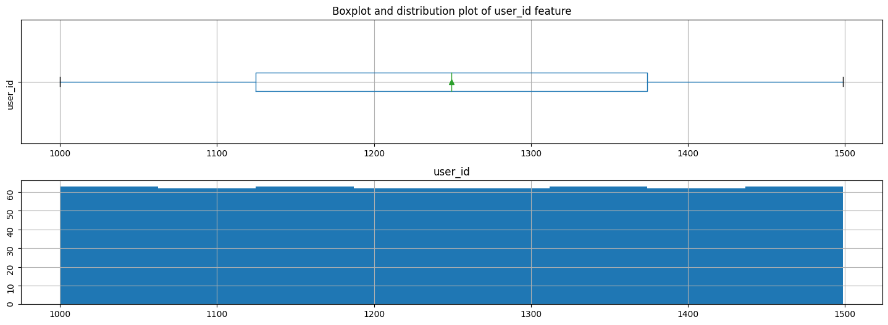
    


    


Так и есть. Абсолютно равномерное распределение, как и должно быть.

#### Столбец `'age'` — возраст пользователя (годы)


```python
quant_dist(users, 'age')
```

    Feature: age
    count    500.00000
    mean      46.58800
    std       16.66763
    min       18.00000
    25%       32.00000
    50%       46.00000
    75%       62.00000
    max       75.00000
    Name: age, dtype: float64


    
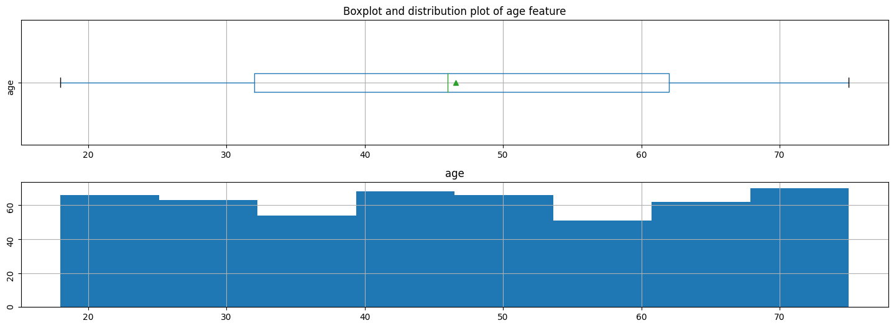
    


    


По возрасту также наблюдается довольно равномерное распределение. Отдельные пики вызывают любопытство, но не более того.

#### Столбец `'first_name'` — имя пользователя

Этот столбец содержит строковые значения имен пользователей. Конечно, в нем будут дубликаты. Проверим, нет ли в списке некорректных значений:


```python
users['first_name'].sort_values().unique()
```


    array(['Авксентий', 'Агата', 'Агафья', 'Агнесса', 'Адам', 'Аким', 'Аксён',
           'Алан', 'Алевтина', 'Александр', 'Александра', 'Алексей', 'Алина',
           'Алиса', 'Алла', 'Альберта', 'Альбин', 'Альфред', 'Алёна',
           'Анатолий', 'Анвар', 'Ангелина', 'Андрей', 'Анжелика', 'Анита',
           'Антонина', 'Анфиса', 'Арина', 'Арнольд', 'Арсен', 'Арсений',
           'Артемий', 'Артём', 'Аурелия', 'Афанасий', 'Ахмет', 'Аюна',
           'Белла', 'Берта', 'Борис', 'Вадим', 'Валентина', 'Валерий',
           'Валерия', 'Варвара', 'Варлам', 'Василиса', 'Вениамин', 'Вера',
           'Вероника', 'Веселина', 'Виктор', 'Виктория', 'Виолетта',
           'Виталий', 'Владимир', 'Владислав', 'Владислава', 'Всеволод',
           'Габриель', 'Габриэль', 'Гайдар', 'Галина', 'Гарри', 'Гектор',
           'Гелена', 'Геннадий', 'Геодар', 'Георгий', 'Георгина', 'Геральд',
           'Герасим', 'Глеб', 'Гордей', 'Григорий', 'Дайна', 'Дана', 'Даниил',
           'Даниэла', 'Дебора', 'Демьян', 'Денис', 'Джемма', 'Джозефина',
           'Джулия', 'Динара', 'Доминика', 'Ева', 'Евгений', 'Евгения',
           'Евдокия', 'Евфросинья', 'Егор', 'Екатерина', 'Елена', 'Еремей',
           'Ермолай', 'Ефим', 'Зинаида', 'Иван', 'Игнатий', 'Игорь',
           'Изольда', 'Илзе', 'Илья', 'Инара', 'Инга', 'Инесса', 'Инна',
           'Иннокентий', 'Ириней', 'Исаак', 'Исак', 'Иулиан', 'Камилла',
           'Карина', 'Каролина', 'Касьян', 'Ким', 'Клавдия', 'Клара',
           'Клариса', 'Константин', 'Кристина', 'Ксения', 'Кузьма',
           'Лаврентий', 'Лариса', 'Лаура', 'Лев', 'Лейла', 'Леон', 'Леонид',
           'Леонтий', 'Леся', 'Лидия', 'Лилия', 'Лия', 'Лола', 'Лолита',
           'Луиза', 'Лукий', 'Людмила', 'Мадина', 'Майя', 'Максим',
           'Мальвина', 'Мануэла', 'Маргарита', 'Марианна', 'Мариетта',
           'Марина', 'Марица', 'Мария', 'Марта', 'Марьяна', 'Матвей',
           'Милана', 'Милена', 'Милица', 'Мирослава', 'Михаил', 'Мстислав',
           'Надежда', 'Наида', 'Наталья', 'Нателла', 'Нелли', 'Николай',
           'Нина', 'Оксана', 'Олег', 'Олеся', 'Онисим', 'Павел', 'Пётр',
           'Радим', 'Радислав', 'Радомир', 'Раиса', 'Рауль', 'Рафаил',
           'Рафаэль', 'Рашид', 'Рем', 'Ренальд', 'Ренат', 'Рената', 'Ринат',
           'Роберт', 'Роза', 'Розалия', 'Роксана', 'Ростислав', 'Рубен',
           'Рудольф', 'Рузана', 'Руслан', 'Руслана', 'Рустам', 'Рустем',
           'Рустэм', 'Рэм', 'Сабина', 'Саида', 'Сара', 'Светлана',
           'Святослав', 'Семён', 'Серафима', 'Симона', 'Снежана', 'Софья',
           'Станислав', 'Степан', 'Таира', 'Таисия', 'Тала', 'Тамара',
           'Татьяна', 'Тимофей', 'Тихон', 'Трифон', 'Трофим', 'Фаддей',
           'Фёдор', 'Харитон', 'Эдита', 'Эдуард', 'Элеонора', 'Элина', 'Элла',
           'Эллада', 'Эльвира', 'Эльга', 'Эльза', 'Эльмира', 'Эмилия',
           'Эсмеральда', 'Юзефа', 'Юлий', 'Юлия', 'Юна', 'Юрий', 'Яков',
           'Яна'], dtype=object)


Хотя некоротые имена вызывают желание привести их к единому написанию (Гаибриель и Габриэль, Рем и Рэм, Ренат и Ринат), не будем этого делать. В конце концов, кто мы такие, чтобы спорить с паспортным написанием? Тем более, что ни для одного исследовательского вопроса этот нюанс значения не имеет. Иных ошибок в столбце нет.

#### Столбец `'last_name'` — фамилия пользователя

Применим тот же подход, что и к предыдущему столбцу.


```python
users['last_name'].sort_values().unique()
```


    array(['Ёлчина', 'Ёркин', 'Ёркина', 'Ёрохов', 'Ёрохова', 'Абаимов',
           'Абакумов', 'Абакшина', 'Абалакова', 'Абалдуева', 'Абалкин',
           'Абашкин', 'Абашкина', 'Абдулина', 'Абоимов', 'Абрамович',
           'Абрамцев', 'Абрамычева', 'Абрашина', 'Абрикосова', 'Авдеев',
           'Авдеенко', 'Авдонюшкин', 'Авдушева', 'Авдышев', 'Авдюков',
           'Авраамова', 'Авраменко', 'Авринский', 'Аврорин', 'Авроров',
           'Авросимова', 'Авросинова', 'Авсейкина', 'Авчинникова', 'Агаев',
           'Агаева', 'Агапеева', 'Агеева', 'Адаменко', 'Адамов', 'Азаров',
           'Азерников', 'Азимова', 'Акимов', 'Акимчин', 'Акимычева',
           'Акиндинов', 'Акинин', 'Акинфьев', 'Аксёнов', 'Акуленко',
           'Александрова', 'Александрович', 'Александрюк', 'Алексеева',
           'Алексеенко', 'Алексеичев', 'Аленникова', 'Алесин', 'Алехина',
           'Алешин', 'Алешина', 'Алешкова', 'Алиев', 'Алфеева', 'Алфимов',
           'Алфимова', 'Алымова', 'Алютин', 'Алюшина', 'Алёшко', 'Алёшкова',
           'Амелин', 'Амелишко', 'Амельченко', 'Ананьева', 'Андреенко',
           'Андрейкин', 'Андрейчук', 'Андрианов', 'Андропов', 'Андропова',
           'Андрющенко', 'Аникина', 'Аничкина', 'Анищенко', 'Антипов',
           'Антоненко', 'Антонова', 'Антропов', 'Антропова', 'Аракина',
           'Аракчеев', 'Аркадьев', 'Арсенкова', 'Артемчук', 'Артемьев',
           'Артёменко', 'Артёмов', 'Артёшин', 'Архипова', 'Асафьева',
           'Астапенко', 'Астапов', 'Астафьева', 'Афанасенко', 'Афанасова',
           'Афинин', 'Афонасьева', 'Афонин', 'Афонина', 'Ахмадулин',
           'Ахматов', 'Ахматулин', 'Ахматулина', 'Ахмедов', 'Бабушкина',
           'Барсуков', 'Басова', 'Безруков', 'Беликова', 'Белова',
           'Белозёров', 'Белоусова', 'Беляев', 'Беляева', 'Белякова',
           'Березина', 'Блинова', 'Блохин', 'Блохина', 'Боброва', 'Бобылёв',
           'Богданов', 'Богданова', 'Болдырев', 'Болдырева', 'Бондарев',
           'Борисова', 'Бородин', 'Бородина', 'Булгаков', 'Бычкова',
           'Васильева', 'Верещагин', 'Верещагина', 'Веселов', 'Вешнякова',
           'Вишневский', 'Вишняков', 'Воронин', 'Воронина', 'Гаврилова',
           'Галкин', 'Глушков', 'Голованова', 'Гончаров', 'Горбачева',
           'Горбунов', 'Горлов', 'Григорьев', 'Григорьева', 'Гришина',
           'Громова', 'Давыдов', 'Демидов', 'Демьянов', 'Демьянова',
           'Денисова', 'Добрынин', 'Добрынина', 'Дорофеева', 'Дроздов',
           'Дубинина', 'Дьячкова', 'Евсеев', 'Ежов', 'Елизаров', 'Емельянова',
           'Еремин', 'Ермилов', 'Ермолаев', 'Ерофеев', 'Ерофеева', 'Ефремов',
           'Жарова', 'Жданов', 'Жукова', 'Завьялова', 'Зайцев', 'Зеленина',
           'Зимина', 'Золотов', 'Золотова', 'Зубков', 'Зубкова', 'Зуев',
           'Зыков', 'Иванов', 'Иванова', 'Игнатова', 'Игнатьев', 'Игнатьева',
           'Измайлова', 'Ильин', 'Ильина', 'Кабанова', 'Казакова', 'Казанцев',
           'Калинина', 'Капустин', 'Карасев', 'Карасева', 'Карташова',
           'Касьянова', 'Киреева', 'Кириллов', 'Киселёв', 'Климова',
           'Ковалева', 'Козлов', 'Козлова', 'Козырева', 'Колесова', 'Колобов',
           'Кольцова', 'Кондратов', 'Коновалова', 'Кононов', 'Константинова',
           'Корнеева', 'Корнилов', 'Корнилова', 'Корольков', 'Королькова',
           'Короткова', 'Коршунов', 'Костин', 'Костина', 'Кочергина',
           'Кочетков', 'Кочетов', 'Кошелева', 'Кравцов', 'Красильников',
           'Круглов', 'Крылова', 'Крюков', 'Крюкова', 'Крючков', 'Кузнецов',
           'Кукушкин', 'Кулагина', 'Кулешова', 'Куприянов', 'Курочкин',
           'Лазарева', 'Лапина', 'Лаптева', 'Ларин', 'Ларина', 'Ларионова',
           'Латышева', 'Лебедев', 'Левин', 'Леонтьев', 'Литвинов', 'Лобанова',
           'Логинов', 'Лосева', 'Лукин', 'Любимов', 'Макаров', 'Макарова',
           'Макеев', 'Малахов', 'Малинин', 'Малинина', 'Малышев', 'Мальцев',
           'Мамонтова', 'Марков', 'Масленникова', 'Матвеев', 'Медведев',
           'Мельникова', 'Меркулова', 'Минаев', 'Минаева', 'Мишин',
           'Молчанова', 'Моргунов', 'Морозов', 'Муравьева', 'Муравьёв',
           'Мясникова', 'Наумов', 'Некрасов', 'Нестеров', 'Нестерова',
           'Нечаева', 'Никонов', 'Никулин', 'Новикова', 'Носкова',
           'Овчинников', 'Одинцов', 'Одинцова', 'Озерова', 'Орлов',
           'Павловский', 'Панов', 'Пантелеева', 'Панфилов', 'Панфилова',
           'Парфенов', 'Петухова', 'Пирогова', 'Платонова', 'Покровский',
           'Поликарпова', 'Поляков', 'Пономарев', 'Пономарева', 'Пономарёв',
           'Попов', 'Прокофьева', 'Пугачева', 'Ракова', 'Родина', 'Родионов',
           'Родионова', 'Розанова', 'Рудаков', 'Румянцева', 'Русанова',
           'Рыбакова', 'Рябов', 'Савельева', 'Сазонов', 'Сазонова',
           'Сальников', 'Сафонова', 'Сахарова', 'Свиридов', 'Севастьянова',
           'Седова', 'Селезнев', 'Селезнева', 'Селиванова', 'Семенова',
           'Семин', 'Семина', 'Семёнов', 'Сергеева', 'Серебрякова', 'Серов',
           'Силин', 'Симонова', 'Синицын', 'Ситникова', 'Соколов', 'Соловьев',
           'Соловьёв', 'Сомова', 'Сорокин', 'Софронов', 'Спиридонова',
           'Субботина', 'Суслов', 'Суслова', 'Сухарев', 'Сухарева', 'Сухова',
           'Сысоев', 'Тарасов', 'Тарасова', 'Терехова', 'Тетерина',
           'Тимофеев', 'Тимофеева', 'Тихомирова', 'Тихонов', 'Толкачев',
           'Третьякова', 'Троицкий', 'Трофимов', 'Трофимова', 'Трошин',
           'Уваров', 'Устинов', 'Устинова', 'Фадеева', 'Федосеев', 'Фетисова',
           'Филатов', 'Фокин', 'Фокина', 'Фомин', 'Фролов', 'Фёдоров',
           'Худяков', 'Чернов', 'Черный', 'Чернышев', 'Черняев', 'Чеснокова',
           'Чижова', 'Чистякова', 'Чумаков', 'Шарапов', 'Шарапова', 'Шарова',
           'Швецов', 'Шевцов', 'Шевцова', 'Щербакова', 'Яшина'], dtype=object)


Вывод будет тем же. Очевидных ошибок нет, а исправлять чужие фамилии - дело неблагодарное. Оставим всё как есть.

#### Столбец `'churn_date'` — дата прекращения пользования тарифом

В этом столбце значений мало, всего 38. Это означает, что лишь 38 пользователей из выборки прекратили пользование тарифом на момент формирования датасета.
Поскольку речь идет о дате, нам потребуется изменение формата данных на временной:


```python
users.loc[:, 'churn_date'] = pd.to_datetime(
    users.loc[:, 'churn_date'], format='%Y-%m-%d')
users['churn_date'].dtype
```
    dtype('<M8[ns]')


Посмотрим на распределение имеющихся значений:


```python
plt.figure(figsize=(18,4))
users['churn_date'].value_counts().plot(kind='line')
plt.title('Churn date distribution')
plt.show()
```


    
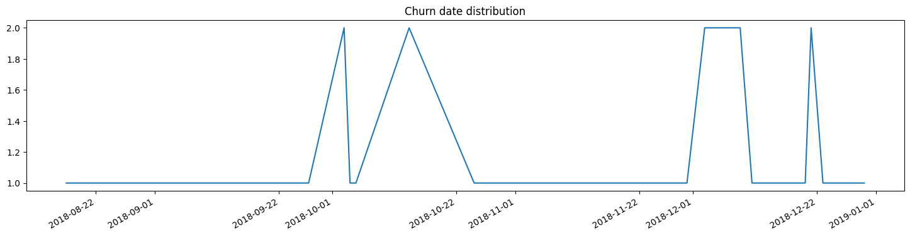
    


Любопытно, что все отказы от тарифа происходили во временном диапазоне с июля 2018 по декабрь 2019 г. Чуть позже сравним эти данные с данными столбца `'reg_date'` - даты подключения тарифа.

#### Столбец `'city'` — город проживания пользователя

По уже известной схеме оценим строковые значения этого столбца:


```python
users['city'].sort_values().unique()
```


    array(['Архангельск', 'Астрахань', 'Балашиха', 'Барнаул', 'Белгород',
           'Брянск', 'Владивосток', 'Владикавказ', 'Владимир', 'Волгоград',
           'Волжский', 'Вологда', 'Воронеж', 'Грозный', 'Екатеринбург',
           'Иваново', 'Ижевск', 'Иркутск', 'Казань', 'Калининград', 'Калуга',
           'Кемерово', 'Киров', 'Кострома', 'Краснодар', 'Красноярск',
           'Курган', 'Курск', 'Липецк', 'Магнитогорск', 'Махачкала', 'Москва',
           'Мурманск', 'Набережные Челны', 'Нижневартовск', 'Нижний Новгород',
           'Нижний Тагил', 'Новокузнецк', 'Новороссийск', 'Новосибирск',
           'Омск', 'Оренбург', 'Орёл', 'Пенза', 'Пермь', 'Петрозаводск',
           'Подольск', 'Ростов-на-Дону', 'Рязань', 'Самара',
           'Санкт-Петербург', 'Саранск', 'Саратов', 'Севастополь', 'Смоленск',
           'Сочи', 'Ставрополь', 'Стерлитамак', 'Сургут', 'Тамбов', 'Тверь',
           'Тольятти', 'Томск', 'Тула', 'Тюмень', 'Улан-Удэ', 'Ульяновск',
           'Уфа', 'Хабаровск', 'Химки', 'Чебоксары', 'Челябинск', 'Череповец',
           'Чита', 'Якутск', 'Ярославль'], dtype=object)


Дубликатов нет. Со спокойной душой продолжим предварительный анализ и предобработку

#### Столбец `'reg_date'` — дата подключения тарифа (день, месяц, год)

Вновь столбец, от которого необходимо ожидать временного формата данных. Пропущенных значений в нем нет. Преобразуем тип данных:


```python
users.loc[:, 'reg_date'] = pd.to_datetime(users.loc[:, 'reg_date'], format='%Y-%m-%d')
users['reg_date'].dtype
```
    dtype('<M8[ns]')


Посмотрим на распределение дат регистрации:


```python
plt.figure(figsize=(18,8))
users['reg_date'].value_counts().plot(kind='line')
plt.title('Registration date distribution')
plt.show()
```


    
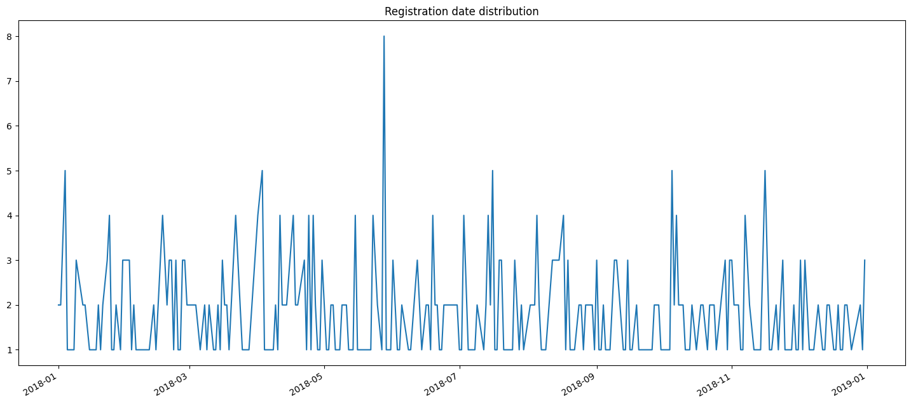
    


Даты регистрации охватывают промежуток в полный 2018-й календарый год.

Полюбопытствуем, каковы меры центральной тенденции и размаха для срока пользования тарифом (если есть сведения о прекращении его использования: 


```python
(users[users['churn_date'].isna() != True]['churn_date'] - users[
    users['churn_date'].isna() != True]['reg_date']).describe()
```


    count                             38
    mean     124 days 01:53:41.052631578
    std       79 days 22:41:20.878357110
    min                  5 days 00:00:00
    25%                 58 days 12:00:00
    50%                105 days 12:00:00
    75%                192 days 06:00:00
    max                284 days 00:00:00
    dtype: object


Сроки пользования тарифом до отказа от него довольно разнятся, однако средний и медианный срок составляет 3,5 - 4 месяца (а нижняя граница второго квартиля - почти 2 месяца), что выглядит вполне реалистично (насколько возможно всерьез обсуждать 38 наблюдений). Такого периода времени (от двух месяцев и более) вполне достаточно, чтобы оценить, подходит ли тариф, и при необходимости отказаться от него.

Кстати, полюбопытствуем, от каких тарифов пользователи отказались:


```python
cancelled_tariffs = users[users['churn_date'].isna() != True]['tariff'].value_counts()
cancelled_tariffs
```


    smart    23
    ultra    15
    Name: tariff, dtype: int64


На выборке в 38 участников такое распределение не должно вызывать подозрений. Если, конечно, нет большого разрыва между общим количеством пользователей этих тарифов. Вернемся к этому вопросу на следующем шаге, при обработке данных столбца `'tariffs'`.

#### Столбец 'tariff' — название тарифного плана

Проверим распределение названий тарифного плана в столбце (заодно проверив, нет ли ошибок):


```python
overall_tariffs = users['tariff'].value_counts()
overall_tariffs
```


    smart    351
    ultra    149
    Name: tariff, dtype: int64


Проверим, насколько отличаются друг от друга доли "отказников" по каждому тарифу:


```python
cancelled_tariffs / overall_tariffs
```


    smart    0.065527
    ultra    0.100671
    Name: tariff, dtype: float64


Безусловно, 6,5% и 10% - это отличающиеся друг от друга доли. Однако сам тип шкалы данных по тарифам (номинативная / категорийная) не позволяет использовать статистических методов проверки значимости различий в подвыборках. Поэтому примем к сведению полученное наблюдение и продолжим предобработку данных.


```python
del cancelled_tariffs
```

### Таблица `'calls'` (информация о звонках)

#### Столбец `'id'` — уникальный номер звонка

С учетом первого взгляда на данные это должен быть столбец со строковыми значениями в диапазоне от `1000_0` до `1499_x`. Видимо, первая часть id (до нижнего подчеркивания) совпадает с уникальным идентификатором абонента. При этом в столбце могут быть представлены не все абоненты: некоторые абоненты могут не совершать звонков, а, например, пользоваться только услугами мобильного интернета.
Соответственно, алгоритм проверки правильности данных этого столбца может быть таков:
1. Взять строковое значение столбца `'id'`.
2. Извлечь из строки символы, совпадение которых с id абонента нужно проверить.
3. Перевести получившуюся строку в тип int.
4. Сравнить результат с соответствующим значением столбца `'user_id'` этого датасета.

Определим специальную функцию, реализующую этот алгоритм:


```python
def check_ids(dataframe):
    '''
    The function check values in columns 'id' and 'user_id' of a dataset.
    It takes only one argument:
    1. dataframe: dataframe name

    The function extracts specific symbols from a row in the 'id' column
    and matches it to unique user ids from the 'user_id' column.
    If a non-match is found, the function returns a tuple with a message and a list
    containing row indexes, where non-matches were found. If all rows contain
    mathches, just a "Only matches are found!" message is shown.
    '''
    error_list = []
    for i in range(len(dataframe)):
        value = int(dataframe.loc[i, 'id'].split('_')[0])
        if value != dataframe.loc[i, 'user_id']:
            error_list.append(i)
    if error_list == []:
        return 'Only matches are found!'
    else:
        return 'Rows with non-matches:', error_list
```


```python
check_ids(calls)
```


    'Only matches are found!'


#### Столбец `'call_date'` — дата звонка

Изменим тип данных и проверим распределение звонков. Выдвинем гипотезу: распределение должно быть равномерным для "обычных" периодов с возможными пиками по праздникам.


```python
calls.loc[:, 'call_date'] = pd.to_datetime(calls.loc[:, 'call_date'], format='%Y-%m-%d')
```


```python
plt.figure(figsize=(18,8))
calls['call_date'].value_counts().plot(style='-', grid=True)
plt.title('Call dates distribution')
plt.show()
```


    
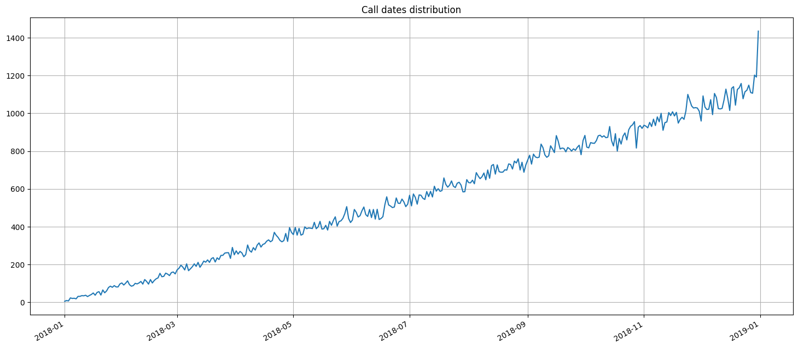
    


Выдвинутая гипотеза частично подтверждена. "Частично" - потому что гипотеза не учитывает какой-то параметр, например - рост абонентской базы для каждого тарифа. Пики на графике такого масштаба не очень заметны, что мешает связать их с календарными праздниками или выходными днями. "Подтверждена" - потому что воображаемая линия тренда здесь демонстрировала бы очевидно равномерное изменение этого неучтенного параметра (например, роста этой самой базы) и равномерное же распределение количества звонков с учетом изменения этого параметра. 

#### Столбец `'duration'` — длительность звонка в минутах


```python
quant_dist(calls, 'duration')
```

    Feature: duration
    count    202607.000000
    mean          6.755887
    std           5.843365
    min           0.000000
    25%           1.300000
    50%           6.000000
    75%          10.700000
    max          38.000000
    Name: duration, dtype: float64


    
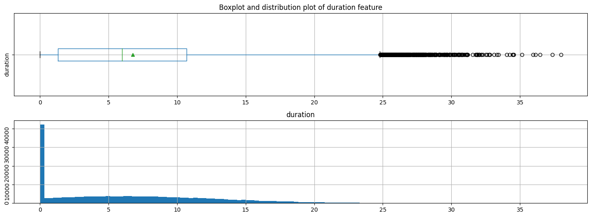
    


    


```python
calls['duration'].describe()
```


    count    202607.000000
    mean          6.755887
    std           5.843365
    min           0.000000
    25%           1.300000
    50%           6.000000
    75%          10.700000
    max          38.000000
    Name: duration, dtype: float64


Хотя почти четверть звонков в датасете имела нулевую длительность, что само по себе любопытно. Остальное распределение имеет черты нормального. С учетом округления длительности звоков менее минуты до ровно 1 минуты - это довольно ожидаемая картина.

Среднее и медианное количество звонков в диапазоне от 6 до 6,8 минут тоже не являют никаких особых сюрпризов.

#### Столбец `'user_id'` — идентификатор пользователя, сделавшего звонок

На основе данных этого столбца можно делать выводы и об абонентах, наиболее и наименее активно совершающих звонки, и о количестве этих звонков.


```python
calls['user_id'].value_counts().describe()
```


    count     492.000000
    mean      411.802846
    std       291.803375
    min        14.000000
    25%       180.000000
    50%       344.500000
    75%       589.500000
    max      1760.000000
    Name: user_id, dtype: float64


Итак, абсолютно неактивных абонентов в выборке нет. В зависимости от метрики, медианное среднее количество звонков одного абонента изменяется от 344,5 до 412 (при довольно большом разбросе, о чем свидетельствует значение стандартного отклонения).

Отдельно проверим, как много звонков остается без ответа:


```python
calls[calls['duration'] == 0]['user_id'].value_counts()
```


    1377    336
    1168    308
    1453    295
    1375    290
    1196    262
           ... 
    1206      6
    1424      5
    1084      5
    1406      5
    1442      5
    Name: user_id, Length: 492, dtype: int64


Вряд ли необходимо удалять звонки с нулевой длительностью. Это не вина абонента, что адресат звонка не взял трубку. Если бы адресат взял трубку - разговор бы состоялся, а сотовый оператор тарифицировал бы звонок и получил прибыль. Для интересов аналитики важна частота и динамика любых звонков, потому что они отражают потребительское поведение абонента и дают основания для прогноза выручки и прибыли.

### Таблица `'messages'` (информация о сообщениях)

#### Столбец `'id'` — уникальный номер сообщения

Проверим столбец определенной ранее функцией: 


```python
check_ids(messages)
```


    'Only matches are found!'


#### Столбец `'message_date'` — дата сообщения

Раз данные содержат дату - изменим их тип на более уместный и проверим распределение количества сообщений за период наблюдений:


```python
messages.loc[:, 'message_date'] = pd.to_datetime(messages.loc[:, 'message_date'], format='%Y-%m-%d')
```


```python
plt.figure(figsize=(18,8))
messages['message_date'].value_counts().plot(style='-', grid=True)
plt.title('Message dates distribution')
plt.show()
```


    
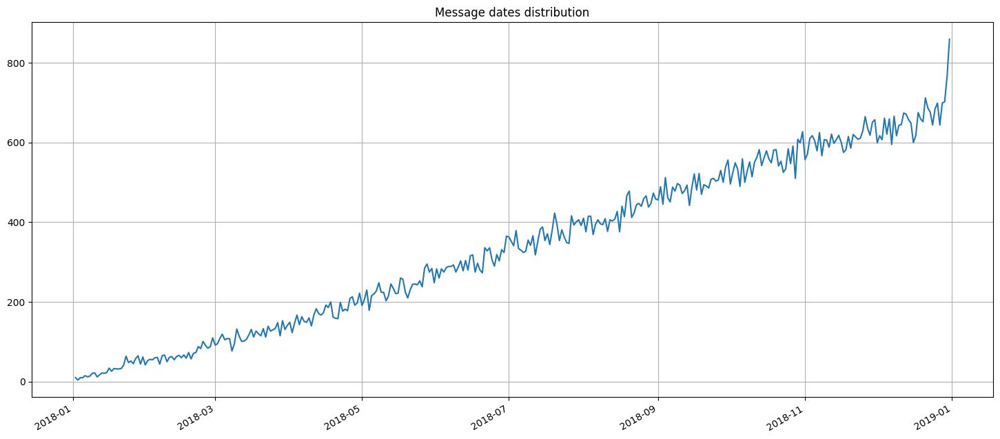
    


Довольно понятный график. Количество SMS за год так же росло равномерно (например, вслед за увеличением абонентской базы). Всплеск в конце года может быть связан с новогодними праздниками.

#### Столбец `'user_id'` — идентификатор пользователя, отправившего сообщение

По аналогии с предыдущим датасетом проверим активность пользователей по отправке сообщений:


```python
messages['user_id'].value_counts().describe()
```


    count     426.000000
    mean      288.816901
    std       267.607552
    min         1.000000
    25%        85.750000
    50%       215.500000
    75%       414.000000
    max      1463.000000
    Name: user_id, dtype: float64


75% пользователей отправили не меньше 85 сообщений за все время пользования тарифами. Причем нет ни одного пользователя, вообще не отправившего не одного сообщения (значение `min` не равно 0). Вероятно, некоторые соображения по поводу количества сообщений нам еще придется сделать, но пока остановимся на этом.

### Таблица `'internet'` (информация об интернет-сессиях)

Сначала разберемся с неизвестным столбцом `'Unnamed: 0'`, для которого отсутствует пояснение. Взглянем на данные:


```python
internet['Unnamed: 0'].describe()
```


    count    149396.000000
    mean      74697.500000
    std       43127.054745
    min           0.000000
    25%       37348.750000
    50%       74697.500000
    75%      112046.250000
    max      149395.000000
    Name: Unnamed: 0, dtype: float64


Этот столбец просто дублирует индекс, то есть является указателем порядковых номеров записей. Он возникает, когда данные сохраняют с указанием индекса: `pd.DataFrame().to_csv(..., index=column)` (это же значение действует по умолчанию). Если бы мы при чтении указали этот столбец - данные были бы прочитаны корректно: `pd.read_csv(..., index_col=0)`.

Столбец можно безболезненно удалить из датасета:


```python
internet = internet.drop(columns='Unnamed: 0')
```

#### Столбец `'id'` — уникальный номер сессии

Проводим проверку соответствий столбцу `'user_id'`:


```python
check_ids(internet)
```


    'Only matches are found!'


#### Столбец `'mb_used'` — объём потраченного за сессию интернет-трафика (в мегабайтах)


```python
quant_dist(internet, 'mb_used')
```

    Feature: mb_used
    count    149396.000000
    mean        370.192426
    std         278.300951
    min           0.000000
    25%         138.187500
    50%         348.015000
    75%         559.552500
    max        1724.830000
    Name: mb_used, dtype: float64


    
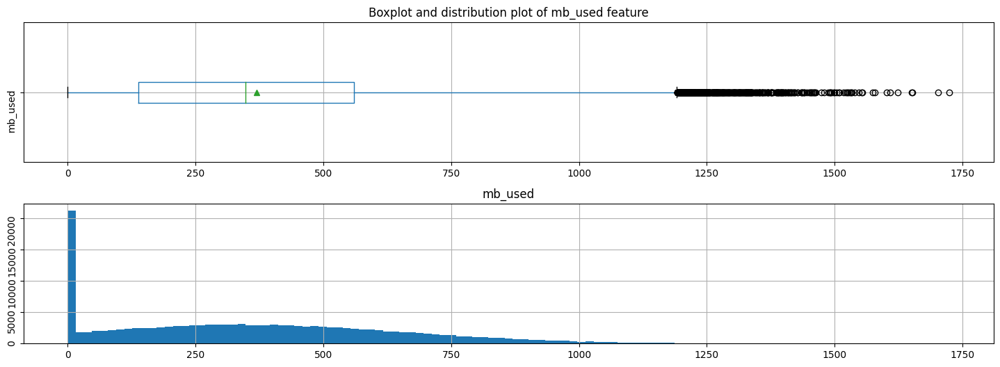
    


    


```python
internet['mb_used'].describe()
```


    count    149396.000000
    mean        370.192426
    std         278.300951
    min           0.000000
    25%         138.187500
    50%         348.015000
    75%         559.552500
    max        1724.830000
    Name: mb_used, dtype: float64


Ситуация очень похожа на длительнось звонков из датасета `'calls'`. Немалая часть абонентов за одну сессию использует от 0 до ~20 мб, что из-за округления дает такую "свечку" на графике.

#### Столбец `'session_date'` — дата интернет-сессии

Здесь требуется изменение типа данных. После - создадим график количества сессий в течение этого года. Вероятно, он также будет демонстрировать равномерное увеличение количества сессий вследствие воздействия третьего фактора (роста абонентской базы, как было предположено раньше):


```python
internet.loc[:, 'session_date'] = pd.to_datetime(internet.loc[:, 'session_date'], format='%Y-%m-%d')
```


```python
plt.figure(figsize=(18,8))
internet['session_date'].value_counts().plot(style='-', grid=True)
plt.title('Session distribution')
plt.show()
```


    
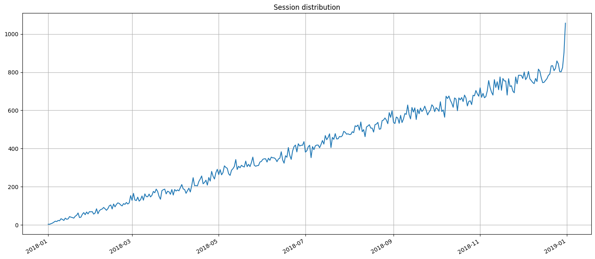
    


Эта гипотеза подтверждается. Количесто сессий (не объем трафика!) действительно равномерно росло за 2018 г. Количество трафика в конце года может быть связано с новогодним шквалом поздравлений и всем, что сопутствует новогодним праздникам.

#### Столбец `'user_id'` — идентификатор пользователя

По аналогии с двумя предыдущими датасетами проверим объемы использования абонентами мобильного интернета:


```python
internet['user_id'].value_counts().describe()
```


    count    497.000000
    mean     300.595573
    std      183.692830
    min        8.000000
    25%      155.000000
    50%      284.000000
    75%      424.000000
    max      834.000000
    Name: user_id, dtype: float64


Среднее количество сессий - 300 (медиана также близка к этому значению); правда, разброс данных довольно велик, на что указывает значение стандартного отклонения. Опять же, нет ни одного пользователя, вообще ни разу не воспользовавшегося мобильным интернетом (значение `min` равно 8).

### Таблица `'tariffs'` (информация о тарифах)

В этой таблице всего 2 записи:


```python
tariffs
```


<div>
<table border="1" class="dataframe">
  <thead>
    <tr style="text-align: right;">
      <th></th>
      <th>messages_included</th>
      <th>mb_per_month_included</th>
      <th>minutes_included</th>
      <th>rub_monthly_fee</th>
      <th>rub_per_gb</th>
      <th>rub_per_message</th>
      <th>rub_per_minute</th>
      <th>tariff_name</th>
    </tr>
  </thead>
  <tbody>
    <tr>
      <th>0</th>
      <td>50</td>
      <td>15360</td>
      <td>500</td>
      <td>550</td>
      <td>200</td>
      <td>3</td>
      <td>3</td>
      <td>smart</td>
    </tr>
    <tr>
      <th>1</th>
      <td>1000</td>
      <td>30720</td>
      <td>3000</td>
      <td>1950</td>
      <td>150</td>
      <td>1</td>
      <td>1</td>
      <td>ultra</td>
    </tr>
  </tbody>
</table>
</div>


### Вывод по предобработке данных

Проверены все столбцы. Ошибок в данных не обнаружено. В некоторых датасетах и признаках тип данных изменен на "дата-время". Было обнаружено, что количество и звонков, и сообщений, и сессий передачи данных равномерно увеличивалось в течение всего периода наблюдения. С учетом того, что количество зарегистрированных пользователей распределено по периоду наблюдений также достаточно равномерно, можно предположить, что увеличение объемов пользования разными услугами сотовой связи было связано с простым ростом абонентской базы в течение периода наблюдения.

## Расчеты и добавление данных

Создадим ряд синтетических признаков:
1. Количество сделанных звонков и израсходованных минут разговора по месяцам.
2. Количество отправленных сообщений по месяцам.
3. Объем израсходованного интернет-трафика по месяцам.
4. Помесячную выручку с каждого пользователя.

Перечень абонентов содержится в датафрейме `'users'`. Однако вносить в него дополнительные сведения (тем более - разбивку каждого типа данных по месяцам) - означает "перегрузить" его сведениями, напрямую к нему не относящимися. Поэтому проведем отдельные расчеты в соответствии с заданием, а позже, при необходимости, сделаем новый датасет, который будет содержать результаты расчетов на основе данных других датасетов. Для этого сначала в каждом датасете создадим столбец `'month'`, который будет содержать порядковый номер месяца даты из столбца `'xxxx_date'` этого датасета: 


```python
calls.loc[:, 'month'] = pd.DatetimeIndex(calls['call_date']).month
messages.loc[:, 'month'] = pd.DatetimeIndex(messages['message_date']).month
internet.loc[:, 'month'] = pd.DatetimeIndex(internet['session_date']).month
```

Для дальнейшей обработки нам необходимо округлить значения длительности звонков "вверх", до большего целого значения. Сделаем это в отдельном столбце:


```python
calls.loc[:, 'duration_rounded'] = np.ceil(calls.loc[:, 'duration'])
```

Сформируем три промежуточных датасета, а затем объединим их в один. Иначе есть риск потери некоторых значений.


```python
users_monthly_stats_calls = calls.pivot_table(index = [
    'user_id', 'month'], values = 'duration_rounded', aggfunc = (
        'count', 'sum')).reset_index()
users_monthly_stats_calls = users_monthly_stats_calls.rename(
    columns={'user_id': 'user_id', 'month': 'month',
             'count': 'calls', 'sum': 'minutes'})

users_monthly_stats_calls.head()
```


<div>
<table border="1" class="dataframe">
  <thead>
    <tr style="text-align: right;">
      <th></th>
      <th>user_id</th>
      <th>month</th>
      <th>calls</th>
      <th>minutes</th>
    </tr>
  </thead>
  <tbody>
    <tr>
      <th>0</th>
      <td>1000</td>
      <td>5</td>
      <td>22</td>
      <td>159.0</td>
    </tr>
    <tr>
      <th>1</th>
      <td>1000</td>
      <td>6</td>
      <td>43</td>
      <td>172.0</td>
    </tr>
    <tr>
      <th>2</th>
      <td>1000</td>
      <td>7</td>
      <td>47</td>
      <td>340.0</td>
    </tr>
    <tr>
      <th>3</th>
      <td>1000</td>
      <td>8</td>
      <td>52</td>
      <td>408.0</td>
    </tr>
    <tr>
      <th>4</th>
      <td>1000</td>
      <td>9</td>
      <td>58</td>
      <td>466.0</td>
    </tr>
  </tbody>
</table>
</div>


```python
users_monthly_stats_messages = messages.pivot_table(index = [
    'user_id', 'month'], values = 'id', aggfunc = ('count')).reset_index()
users_monthly_stats_messages = users_monthly_stats_messages.rename(
    columns={'user_id': 'user_id', 'month': 'month', 'id': 'messages'})
users_monthly_stats_messages.head()
```


<div>
<table border="1" class="dataframe">
  <thead>
    <tr style="text-align: right;">
      <th></th>
      <th>user_id</th>
      <th>month</th>
      <th>messages</th>
    </tr>
  </thead>
  <tbody>
    <tr>
      <th>0</th>
      <td>1000</td>
      <td>5</td>
      <td>22</td>
    </tr>
    <tr>
      <th>1</th>
      <td>1000</td>
      <td>6</td>
      <td>60</td>
    </tr>
    <tr>
      <th>2</th>
      <td>1000</td>
      <td>7</td>
      <td>75</td>
    </tr>
    <tr>
      <th>3</th>
      <td>1000</td>
      <td>8</td>
      <td>81</td>
    </tr>
    <tr>
      <th>4</th>
      <td>1000</td>
      <td>9</td>
      <td>57</td>
    </tr>
  </tbody>
</table>
</div>


```python
users_monthly_stats_mb = internet.pivot_table(index = [
    'user_id', 'month'], values = 'mb_used', aggfunc = ('sum')).reset_index()
users_monthly_stats_mb = users_monthly_stats_mb.rename(
    columns={'user_id': 'user_id', 'month': 'month', 'mb_used': 'mb'})
users_monthly_stats_mb.head()
```


<div>
<style scoped>
    .dataframe tbody tr th:only-of-type {
        vertical-align: middle;
    }

    .dataframe tbody tr th {
        vertical-align: top;
    }

    .dataframe thead th {
        text-align: right;
    }
</style>
<table border="1" class="dataframe">
  <thead>
    <tr style="text-align: right;">
      <th></th>
      <th>user_id</th>
      <th>month</th>
      <th>mb</th>
    </tr>
  </thead>
  <tbody>
    <tr>
      <th>0</th>
      <td>1000</td>
      <td>5</td>
      <td>2253.49</td>
    </tr>
    <tr>
      <th>1</th>
      <td>1000</td>
      <td>6</td>
      <td>23233.77</td>
    </tr>
    <tr>
      <th>2</th>
      <td>1000</td>
      <td>7</td>
      <td>14003.64</td>
    </tr>
    <tr>
      <th>3</th>
      <td>1000</td>
      <td>8</td>
      <td>14055.93</td>
    </tr>
    <tr>
      <th>4</th>
      <td>1000</td>
      <td>9</td>
      <td>14568.91</td>
    </tr>
  </tbody>
</table>
</div>


Получены три датасета разной длины. Теперь необходимо объединить их и датасет `'users'` в один датафрейм, а затем удалить ненужные нам в дальнейших вычислениях столбцы:


```python
users_monthly_stats = users_monthly_stats_calls.merge(
    users_monthly_stats_messages, on=['user_id', 'month'], how='outer'
)
users_monthly_stats = users_monthly_stats.merge(
    users_monthly_stats_mb, on=['user_id', 'month'], how='outer'
)
users_monthly_stats = users_monthly_stats.merge(
    users, on='user_id', how='left')
users_monthly_stats = users_monthly_stats.drop([
    'age', 'churn_date', 'first_name', 'last_name',
    'reg_date'], axis=1)

users_monthly_stats.info()
```

    <class 'pandas.core.frame.DataFrame'>
    Int64Index: 3214 entries, 0 to 3213
    Data columns (total 8 columns):
     #   Column    Non-Null Count  Dtype  
    ---  ------    --------------  -----  
     0   user_id   3214 non-null   int64  
     1   month     3214 non-null   int64  
     2   calls     3174 non-null   float64
     3   minutes   3174 non-null   float64
     4   messages  2717 non-null   float64
     5   mb        3203 non-null   float64
     6   city      3214 non-null   object 
     7   tariff    3214 non-null   object 
    dtypes: float64(4), int64(2), object(2)
    memory usage: 226.0+ KB


```python
del users_monthly_stats_calls, users_monthly_stats_messages, users_monthly_stats_mb
```

Тип данных object вполне объясним - во многих столбцах присутствуют пустые значения NaN. Однако они помешают нам далее при расчетах, поэтому необходимо заполнить все отсутствующие значения нулями:


```python
users_monthly_stats = users_monthly_stats.fillna(0)
```

Вычислим помесячную выручку с каждого пользователя. Для этого создадим копию датасета, в которой будем проводить все вычисления, но без изменения структуры. Вычтем из нынешних значений "квоты" тарифов:


```python
aux_stats = users_monthly_stats.copy()

aux_stats.loc[aux_stats['tariff'] == 'smart', 'minutes'] -= 500
aux_stats.loc[aux_stats['tariff'] == 'smart', 'messages'] -= 50
aux_stats.loc[aux_stats['tariff'] == 'smart', 'mb'] -= 15360
aux_stats.loc[aux_stats['tariff'] == 'ultra', 'minutes'] -= 3000
aux_stats.loc[aux_stats['tariff'] == 'ultra', 'messages'] -= 1000
aux_stats.loc[aux_stats['tariff'] == 'ultra', 'mb'] -= 30720
```

Если в результаты вычитания получается отрицательное значение - квота тарифа по этом показателю не превышена.
В дальнейших расчетах показатели, находящиеся в квот, можно просто не учитывать. Для этого присвоим им новое значение - ноль. Если значение равно нулю - с ним ничего больше делать не нужно:


```python
for column in ['minutes', 'messages', 'mb']:
    aux_stats.loc[aux_stats[column] < 0, column] = 0
```

Обработаем значения трафика, превышающего квоту. Потому что в "Мегалайне" трафик сверх квоты учитывается довольно затейливо:


```python
# converting Mb to Gb:
aux_stats.loc[:, 'mb'] /= 1024

# If traffic exceeds quota, the value will be non-zero
aux_stats.loc[:, 'mb'] = np.ceil(aux_stats.loc[:, 'mb'])
```

Теперь обработаем все значения, превышающие тарифные квоты. Переведем минуты, сообщения и гигабайты "сверх квоты" в рубли:


```python
# Tariff "Smart":
aux_stats.loc[(aux_stats['tariff'] == 'smart') & (aux_stats['minutes'] != 0) , 'minutes'] *= 3
aux_stats.loc[(aux_stats['tariff'] == 'smart') & (aux_stats['messages'] != 0) , 'messages'] *= 3
aux_stats.loc[(aux_stats['tariff'] == 'smart') & (aux_stats['mb'] != 0) , 'mb'] *= 200

# Tariff "Ultra": 
aux_stats.loc[(aux_stats['tariff'] == 'ultra') & (aux_stats['mb'] != 0) , 'mb'] *= 150
```

Проведем финальные расчеты и занесем их в соответствующий столбец в датасете `user_monthly_stats`: 


```python
aux_stats.loc[aux_stats['tariff'] == 'smart', 'month_revenue'] = 550 + aux_stats.loc[
    aux_stats['tariff'] == 'smart', 'minutes'] + aux_stats.loc[
    aux_stats['tariff'] == 'smart', 'messages'] + aux_stats.loc[
    aux_stats['tariff'] == 'smart', 'mb']

aux_stats.loc[aux_stats['tariff'] == 'ultra', 'month_revenue'] = 1950 + aux_stats.loc[
    aux_stats['tariff'] == 'ultra', 'minutes'] + aux_stats.loc[
    aux_stats['tariff'] == 'ultra', 'messages'] + aux_stats.loc[
    aux_stats['tariff'] == 'ultra', 'mb']

users_monthly_stats.loc[:, 'month_revenue'] = aux_stats.loc[:, 'month_revenue']
del aux_stats
```


```python
users_monthly_stats.head(10)
```


<div>
<table border="1" class="dataframe">
  <thead>
    <tr style="text-align: right;">
      <th></th>
      <th>user_id</th>
      <th>month</th>
      <th>calls</th>
      <th>minutes</th>
      <th>messages</th>
      <th>mb</th>
      <th>city</th>
      <th>tariff</th>
      <th>month_revenue</th>
    </tr>
  </thead>
  <tbody>
    <tr>
      <th>0</th>
      <td>1000</td>
      <td>5</td>
      <td>22.0</td>
      <td>159.0</td>
      <td>22.0</td>
      <td>2253.49</td>
      <td>Краснодар</td>
      <td>ultra</td>
      <td>1950.0</td>
    </tr>
    <tr>
      <th>1</th>
      <td>1000</td>
      <td>6</td>
      <td>43.0</td>
      <td>172.0</td>
      <td>60.0</td>
      <td>23233.77</td>
      <td>Краснодар</td>
      <td>ultra</td>
      <td>1950.0</td>
    </tr>
    <tr>
      <th>2</th>
      <td>1000</td>
      <td>7</td>
      <td>47.0</td>
      <td>340.0</td>
      <td>75.0</td>
      <td>14003.64</td>
      <td>Краснодар</td>
      <td>ultra</td>
      <td>1950.0</td>
    </tr>
    <tr>
      <th>3</th>
      <td>1000</td>
      <td>8</td>
      <td>52.0</td>
      <td>408.0</td>
      <td>81.0</td>
      <td>14055.93</td>
      <td>Краснодар</td>
      <td>ultra</td>
      <td>1950.0</td>
    </tr>
    <tr>
      <th>4</th>
      <td>1000</td>
      <td>9</td>
      <td>58.0</td>
      <td>466.0</td>
      <td>57.0</td>
      <td>14568.91</td>
      <td>Краснодар</td>
      <td>ultra</td>
      <td>1950.0</td>
    </tr>
    <tr>
      <th>5</th>
      <td>1000</td>
      <td>10</td>
      <td>57.0</td>
      <td>350.0</td>
      <td>73.0</td>
      <td>14702.49</td>
      <td>Краснодар</td>
      <td>ultra</td>
      <td>1950.0</td>
    </tr>
    <tr>
      <th>6</th>
      <td>1000</td>
      <td>11</td>
      <td>43.0</td>
      <td>338.0</td>
      <td>58.0</td>
      <td>14756.47</td>
      <td>Краснодар</td>
      <td>ultra</td>
      <td>1950.0</td>
    </tr>
    <tr>
      <th>7</th>
      <td>1000</td>
      <td>12</td>
      <td>46.0</td>
      <td>333.0</td>
      <td>70.0</td>
      <td>9817.61</td>
      <td>Краснодар</td>
      <td>ultra</td>
      <td>1950.0</td>
    </tr>
    <tr>
      <th>8</th>
      <td>1001</td>
      <td>11</td>
      <td>59.0</td>
      <td>430.0</td>
      <td>0.0</td>
      <td>18429.34</td>
      <td>Москва</td>
      <td>smart</td>
      <td>1150.0</td>
    </tr>
    <tr>
      <th>9</th>
      <td>1001</td>
      <td>12</td>
      <td>63.0</td>
      <td>414.0</td>
      <td>0.0</td>
      <td>14036.66</td>
      <td>Москва</td>
      <td>smart</td>
      <td>550.0</td>
    </tr>
  </tbody>
</table>
</div>


Мы рассчитали помесячную выручку с каждого пользователя. Полюбопытствуем, как она распределена:


```python
quant_dist(users_monthly_stats, 'month_revenue')
```

    Feature: month_revenue
    count    3214.000000
    mean     1529.076229
    std       798.251091
    min       550.000000
    25%       750.000000
    50%      1653.500000
    75%      1950.000000
    max      6770.000000
    Name: month_revenue, dtype: float64


    
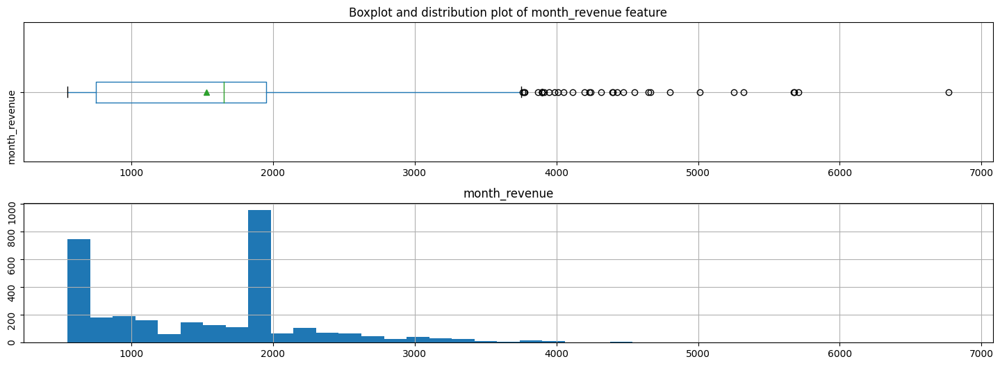
    


    


```python
users_monthly_stats['month_revenue'].describe()
```


    count    3214.000000
    mean     1529.076229
    std       798.251091
    min       550.000000
    25%       750.000000
    50%      1653.500000
    75%      1950.000000
    max      6770.000000
    Name: month_revenue, dtype: float64


Ожидаемо, минимальное значение прибыли находится на уровне абонентской платы по самому "дешевому" тарифу. При этом среднее и медианное значения разнятся не очень сильно (что свидетельствует о примерной близости математического и геометрического распределений), однако значения стандартного отклонения и границ квартилей указывают на весьма большой разброс данных.

На следующем шаге необходимо проанализировать потребительское поведение абонентов в разрезе каждого тарифа.

## Исследовательский анализ данных

### Расчеты и графики

Сначала быстро взглянем на средние значения каждого параметра для каждого тарифа:


```python
users_monthly_stats.groupby('tariff').mean()
```


<div>
<table border="1" class="dataframe">
  <thead>
    <tr style="text-align: right;">
      <th></th>
      <th>user_id</th>
      <th>month</th>
      <th>calls</th>
      <th>minutes</th>
      <th>messages</th>
      <th>mb</th>
      <th>month_revenue</th>
    </tr>
    <tr>
      <th>tariff</th>
      <th></th>
      <th></th>
      <th></th>
      <th></th>
      <th></th>
      <th></th>
      <th></th>
    </tr>
  </thead>
  <tbody>
    <tr>
      <th>smart</th>
      <td>1246.506505</td>
      <td>8.346792</td>
      <td>58.463437</td>
      <td>417.934948</td>
      <td>33.384029</td>
      <td>16208.386990</td>
      <td>1289.973531</td>
    </tr>
    <tr>
      <th>ultra</th>
      <td>1263.094416</td>
      <td>8.250761</td>
      <td>73.392893</td>
      <td>526.623350</td>
      <td>49.363452</td>
      <td>19468.805208</td>
      <td>2070.152284</td>
    </tr>
  </tbody>
</table>
</div>


Конечно, далеко не все приведенные здесь значения требуют внимания. Средние арифметические индекса, а также столбца `'user_id'` не несут никакого содержательного смысла; единственное, что можно сказать по относительной близости пар этих значений: для обоих тарифов они распределены по нашему "расчетному" датасету `'users_monthly_stats'` сравнительно равномерно. Косвенный вывод, который мы можем сделать из близости значений средних арифметических столбца `'month'` - абонентские базы обоих тарифов также наполнялись примерно равномерно, в одном "темпе".

Другие значения более содержательны. Кажется, абоненты тарифа "Ультра" в среднем совершают больше звонков, "проговаривают" больше минут (возможно - благодаря тому, что звонят чаще), посыляют больше сообщений, используют больше трафика и затрачивают больше средств на обслуживание тарифа. Однако все эти средние значения требуют уточнения. Проведем сравнительный анализ поведения абонентов обоих тарифов по ключевым параметрам. Заодно проверим распределение данных по этим параметрам на соответствие нормальному распределению критерием Шапиро-Уилка. Критерий проверяет нулевую гипотезу о том, что данные в выборке распределены нормально. [Документация уточняет](https://scipy.github.io/devdocs/reference/generated/scipy.stats.shapiro.html#scipy.stats.shapiro), что данную реализацию критерия можно применить на выборке нашего объема (n < 5000).

Сначала - посмотрим на соотношение значений в табличном виде:


```python
users_monthly_stats.pivot_table(index = 'tariff', values = ['minutes', 'mb', 'messages'],
                        aggfunc = ['var', 'std', 'mean'])
```


<div>
<table border="1" class="dataframe">
  <thead>
    <tr>
      <th></th>
      <th colspan="3" halign="left">var</th>
      <th colspan="3" halign="left">std</th>
      <th colspan="3" halign="left">mean</th>
    </tr>
    <tr>
      <th></th>
      <th>mb</th>
      <th>messages</th>
      <th>minutes</th>
      <th>mb</th>
      <th>messages</th>
      <th>minutes</th>
      <th>mb</th>
      <th>messages</th>
      <th>minutes</th>
    </tr>
    <tr>
      <th>tariff</th>
      <th></th>
      <th></th>
      <th></th>
      <th></th>
      <th></th>
      <th></th>
      <th></th>
      <th></th>
      <th></th>
    </tr>
  </thead>
  <tbody>
    <tr>
      <th>smart</th>
      <td>3.446250e+07</td>
      <td>796.812958</td>
      <td>36219.315784</td>
      <td>5870.476681</td>
      <td>28.227876</td>
      <td>190.313730</td>
      <td>16208.386990</td>
      <td>33.384029</td>
      <td>417.934948</td>
    </tr>
    <tr>
      <th>ultra</th>
      <td>1.017510e+08</td>
      <td>2285.266143</td>
      <td>100873.633397</td>
      <td>10087.170752</td>
      <td>47.804457</td>
      <td>317.606098</td>
      <td>19468.805208</td>
      <td>49.363452</td>
      <td>526.623350</td>
    </tr>
  </tbody>
</table>
</div>


```python
sample_ultra = users_monthly_stats.query('tariff == "ultra"')
sample_smart = users_monthly_stats.query('tariff == "smart"')
```

Теперь - визуализация распределения значений:


```python
aux_columns = ['calls', 'minutes', 'messages', 'mb', 'month_revenue']
aux_tariffs = ['smart', 'ultra']
for column in aux_columns:
    plt.figure(figsize=(18,4))
    plt.hist(sample_smart[column], bins='fd', histtype='step', label='smart')
    plt.hist(sample_ultra[column], bins='fd', histtype='step', label='ultra')
    plt.legend(loc='upper right')
    plt.title(column + ' quantity')
    plt.show()
    print()
```


    
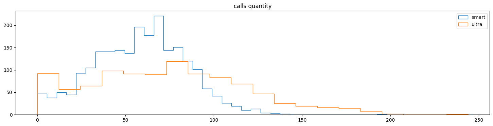
    


    


    
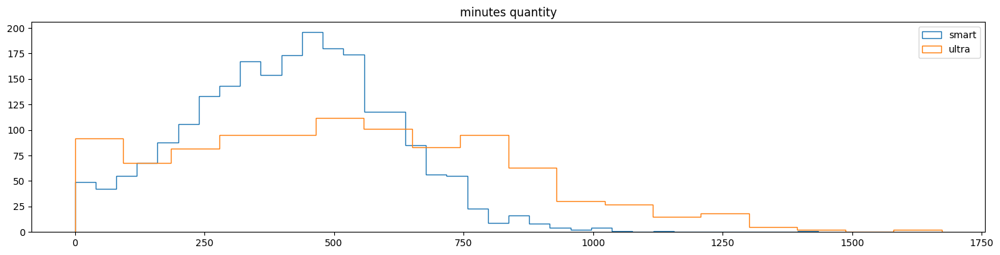
    


    


    

    


    


    
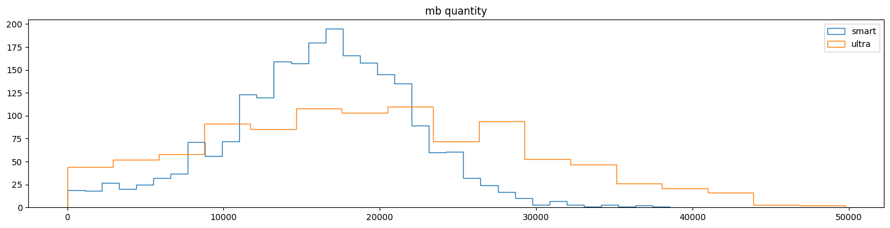
    


    


    
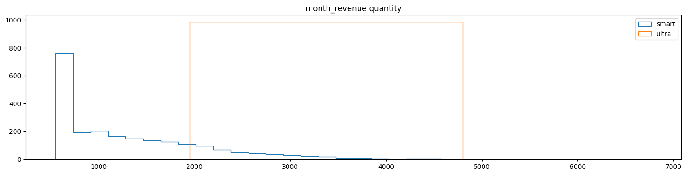
    


    


На каждом графике приведено распределение каждого значимого параметра для пользователей обоих тарифов.

Гистограмы распределения количества звонков (`'calls'`) демонстрируют для тарифа "Смарт" распределение, геометрически похожее на нормальное. Однако, забегая вперед, для всех параметров по всем тарифам есть основания отвергнуть нулевую гиотезу о нормальном распределении таких данных в генеральной совокупности на основе значений p-value критерия Шапиро-Уилка.
В целом видно, что при большем общем количестве звонков (в выборке больше абонентов именно этого тарифа), среднее количество звонков действительно несколько ниже при меньшем размахе и отсутствии выбросов.

Примерно та же картина для количества минут (`'minutes'`), используемых абонентами этого тарифа. Оба тарифа имеют небольшой выборос в районе нуля (задание подсказывает нам, что это могут быть пропущенные вызовы). Распределение для тарифа "Ультра" здесь также равномерное при несколько большем размахе.

Похожая закономерность наблюдается для сообщений (`'messages'`), хотя в этом столбце для обоих тарифов как нигде заметен выброс в районе нуля. Абоненты редко отправляют сообщения? Вполне правдоподобно, особенно во времена расцвета мобильного интернета. Опять же, тариф "Ультра" демонстрирует больший размах.

Гистограмма трафика (`'mb'`), кажется, отражает не только различия в использовании мобильного интернета, но и разное количесто абонентов каждого тарифа в выборке.

Главные различия кроются в ежемесячных тратах на мобильную связь (`'month_revenue'`). Очень хорошо заметно, что пользователи тарифа "Ультра" ежемесячно тратят на сотовую связь больше, чем пользователи конкурирующего тарифа. При этом показатели размаха отличаются не так уж и сильно, в отличие от рассмотренных ранее параметров. Однако не стоит торопиться с выводами ни о значимости различий, ни о их возможных причинах.


```python
del calls, tariffs, internet, messages, users, aux_columns, aux_tariffs, column
```

### Предварительные выводы

При меньшем объеме подвыборки абоненты тарифа "Ультра" в среднем несколько чаще и дольше звонят, отправляют больше сообщений, используют больше мобильного трафика, но - при большем размахе. Иначе говоря, они являются более разнородной подвыборкой. Единственный показатель, по которому они демонстрируют сравнимую с пользователями другого тарифа однородность - среднемесячные расходы на связь, которые на тарифе "Ультра" также выше.

## Проверка гипотез

Проверим гипотезы о равенстве средних значений в каждом из двух наборов подвыборок:
- подвыборок абонентов а) тарифа "Смарт" и б) тарифа "Ультра";
- подвыборок абонентов из а) Москвы и б) других регионов.

Исследовательская гипотеза №1: "средняя выручка пользователей тарифов «Ультра» и «Смарт» различается".

H0: отсутствуют статистически значимые различия между средними значениями выручки абонентов двух тарифов.

H1: существуют статистически значимые различия между средними значениями выручки абонентов двух тарифов. Иная формулировка с тем же смыслом: различия между средними значениями выручки абонентов двух тарифов статистически значимы.

Теперь опишем подвыборки. Хотя в нашем дизайне исследования они взяты из выборки, принадлежащей одной генеральной совокупности (абоненты оператора мобильной связи "Мегалайн"), их можно рассматривать как независимые выборки из генеральных совокупностей "абоненты тарифа "Смарт" и "абоненты тарифа "Ультра". При этом нам известно, что дисперсии этих выборок (далее будем называть их именно так) различаются, что дает основания предполагать, что будут отличаться и дисперсии двух генеральных совокупностей.

Строго говоря, использование t-критерия Стьюдента для задачи сравнения средних требует их нормального распределения. Мы же выяснили, что распределение в выборках отличается от нормального (см. значения уровня значимости критерия Шапиро-Уилка для исследуемого параметра `'month_revenue'`). Одновременно замечания относительно применения альтернативных непараметрических критериев (Манна-Уитни, Краскелла-Уоллиса) "в один голос" говорят, что для выборок объемом больше 25-30 наблюдений значения тестовых статистик этих критериев все более апроксимируют нормальное распределение. Ну а поскольку мы считаем не вручную, - не вижу, почему благородным дон(н)ам не опробовать все три варианта (t-критерий Стьюдента, U-критерий манна-Уитни, H-критерий Краскелла-Уоллиса) и сравнить результаты. 


```python
print('t-test p-value:', st.ttest_ind(
    sample_ultra['month_revenue'],
    sample_smart['month_revenue'],
    equal_var=False).pvalue)
print('Mann-Whitney p-value:', st.mannwhitneyu(
    sample_ultra['month_revenue'],
    sample_smart['month_revenue']).pvalue)
print('Kruskal-Wallis p-value:', st.kruskal(
    sample_ultra['month_revenue'],
    sample_smart['month_revenue']).pvalue)
```

    t-test p-value: 4.2606313931076085e-250
    Mann-Whitney p-value: 1.9803845594554806e-187
    Kruskal-Wallis p-value: 1.979174415744257e-187


Даже нет необходимости выбирать пороговое значение уровня значимости. Вне зависимости от используемого критерия у нас есть основания отвергнуть нулевую гипотезу. То есть - принять альтернативную гипотезу для этих выборок о наличии статистически значимых различий между соответствующими генеральными совокупностями.

Перейдем к следующему исследовательскому вопросу.

Исследовательская гипотеза №2: "средняя выручка пользователей из Москвы и пользователей из других регионов различается".

H0: отсутствуют статистически значимые различия между средними значениями выручки абонентов из Москвы и других регионов.

H1: существуют статистически значимые различия между средними значениями выручки абонентов из Москвы и других регионов. Иначе: различия между средними значениями выручки абонентов из Москвы и других регионов статистически значимы.


```python
sample_moscow = users_monthly_stats.query('city == "Москва"')
sample_outside = users_monthly_stats.query('city != "Москва"')

print('t-test p-value:', st.ttest_ind(
    sample_moscow['month_revenue'],
    sample_outside['month_revenue'],
    equal_var=False).pvalue)
print('Mann-Whitney p-value:', st.mannwhitneyu(
    sample_moscow['month_revenue'],
    sample_outside['month_revenue']).pvalue)
print('Kruskal-Wallis p-value:', st.kruskal(
    sample_moscow['month_revenue'],
    sample_outside['month_revenue']).pvalue)
```

    t-test p-value: 0.5257376663729298
    Mann-Whitney p-value: 0.37423394910366004
    Kruskal-Wallis p-value: 0.37422074100016123


Если в качестве порогового уровня значимости alpha выбрать "конвенциональное" значение .05, то p-value всех критерие дают основания для отвержения нулевой гипотезы в пользу альтернативной о наличии статистически значимых различий между соответствующими генеральными совокупности.

Если в качестве порогового значения выбрать более строгое alpha = .005 (в академическом мире такая строгость обсуждается уже не первый год, см., например, [здесь](https://jamanetwork.com/journals/jama/article-abstract/2676503) или [здесь](https://www.nature.com/articles/s41562-017-0189-z)), значения p-value в t-тесте Стьюдента уже недостаточно для принятия решения об отвержении нулевой гипотезы. Однако помня, что данные генеральных совокупностей, судя по всему, принадлежат какому-то иному распределению, чем нормальное, мы имеем основания больше полагаться на значения двух других, непараметрических критериев. А они достаточно твердо свидетельствуют в пользу отвержения нулевой гипотезы и принятия альтернативной.  


```python
del sample_ultra, sample_smart, sample_moscow, sample_outside
```

## Финальные расчеты

Для формулирования итогового вывода проекта вновь вспомним, как был сформулирован запрос на исследование: "*Нужно проанализировать поведение клиентов и сделать вывод —* ***какой тариф лучше***."

Ответ на подобный вопрос аналитик дать не может. "Лучше/хуже" - это категории, которыми может оперировать собственник бизнеса. Именно поэтому цель исследования была определена так: "*...определить среди тарифов "Смарт" и "Ультра" компании "Мегалайн" приносящий наибольшую выручку.*"

Подсчитаем на основе данных выборки общую выручку каждого тарифа и среднюю выручку с пользователя для каждого тарифа. Если выборка была сформирована случайным образом, эти данные можно довольно точно экстраполировать на всю генеральную совокупность:


```python
total_revenue_ultra = users_monthly_stats.query('tariff == "ultra"')['month_revenue'].sum()
total_revenue_smart = users_monthly_stats.query('tariff == "smart"')['month_revenue'].sum()
average_revenue_ultra = total_revenue_ultra / overall_tariffs.loc['ultra']
average_revenue_smart = total_revenue_smart / overall_tariffs.loc['smart']
print('Общая выручка тарифа "Ультра":', total_revenue_ultra)
print('Общая выручка тарифа "Смарт":', total_revenue_smart)
print('Средняя выручка тарифа "Ультра" в расчете на пользователя:', average_revenue_ultra)
print('Средняя выручка тарифа "Смарт" в расчете на пользователя:', average_revenue_smart)
```

    Общая выручка тарифа "Ультра": 2039100.0
    Общая выручка тарифа "Смарт": 2875351.0
    Средняя выручка тарифа "Ультра" в расчете на пользователя: 13685.23489932886
    Средняя выручка тарифа "Смарт" в расчете на пользователя: 8191.883190883191


```python
del users_monthly_stats, total_revenue_ultra, total_revenue_smart
del average_revenue_ultra, average_revenue_smart, overall_tariffs
```

## Итоговый вывод

Финальные расчеты свидетельствуют: абоненты тарифа "Ультра" в среднем:
- ежемесячно совершают больше звонков;
- тратят на разговор больше минут в месяц;
- отправляют ежемесячно больше сообщений;
- тратят больше мегабайт мобильного трафика.

В пересчете на одного пользователя абоненты этого тарифа генерируют **больше выручки**. Значит ли это, что они более выгодны, как и тариф "Ультра"? Статистически - да.

Но! "Статистически" не равнозначно "экономически". Единственный параметр, по которому нижняя граница размаха для обоих тарифов **НЕ** совпадает - это ежемесячная выручка с абонента. И это легко объяснимо: у тарифов почти в четыре раза отличается абонентская плата. Однако во всех остальных параметрах показатели абонентов обоих тарифов имеют одинаковую нижнюю границу при большем размахе для тарифа "Ультра". Это значит: пользовательское поведение по крайней мере заметной части абонентов тарифа "Ультра" мало чем отличается от "типичного" поведения абонентов тарифа "Смарт". Столь высокие показатели по всем параметрам, включая общую выручку от тарифа и среднуюю выручку на абонента, для тарифа "Ультра" достигаются благодаря сравнительно небольшой доле "суперпользователей". Эти пользователи, скорее всего, совершенно рационально выбрали более дорогой (на первый взгляд) тариф. Другой тариф с учетом объемов потребляемых ими услуг вышел бы им еще дороже. Другим же абонентам этого тарифа (**НЕ** "суперпользователям") другой тариф в некоторых случаях мог быть даже выгоднее с точки зрения ежемесячных расходов. Но, - они пользуются "Ультрой" (по крайней мере, пользовались в 2018 году, если не отказались от него), и это статистический факт.

То есть привлекать новых пользователей на тариф "Ультра" для "Мегалайна" финансово может быть весьма выгодно. Однако вряд ли это значит, что "Мегалайну" следует отказаться от "Смарта". Не все пользователи готовы платить за "Ультру", и если "Мегалайн" не предложит им альтернатив - они просто уйдут к другому оператору. "Смарт" же пока является такой альтернативой. И если доходы от него перевешивают издержки на его содержание - он или его аналог также нужен.

## Заключение 

**Цель проекта** проекта была сформулирована так: определить среди тарифов "Смарт" и "Ультра" компании "Мегалайн" приносящий наибольшую выручку.

Были проделаны следующие работы:
1. Проведен предварительный анализ данных.
2. Проведена предобработка данных:
    - обнаружены осутствующие значения;
    - предположены возможные причины пропуска данных;
    - заполнены пропуски там, где это необходимо;
    - вычислен ряд параметров, описывающих поведение абонентов мобильной связи.
3. Проведен анализ данных, в том числе графическими методами.
4. Проверены статистические гипотезы, связанные с целью проекта:
    - проверена гипотеза о наличии разницы в средней выручке от тарифов "Смарт" и "Ультра";
    - проверена гипотеза о наличии разницы в средней выручке от абонентов из Москвы с одной стороны, и абонентов из других регионов - с другой.
5. Сформулированы выводы относительно исследовательских вопросов.

Определено, что статистически большую выручку для мегалайна приносит тариф "Ультра". Однако портреты пользователей двух тарифов достаточно разнятся, чтобы рекомендовать заказчику не отказываться от тарифа "Смарт" в пользу тарифа "Ультра"
