# Проект "Компьютерные игры: связь их характеристик и объемов продаж"

<h1>Содержание<span class="tocSkip"></span></h1>
<div class="toc"><ul class="toc-item"><li><span><a href="#Проект-"Компьютерные-игры:-связь-их-характеристик-и-объемов-продаж"" data-toc-modified-id="#Проект-"Компьютерные-игры:-связь-их-характеристик-и-объемов-продаж""><span class="toc-item-num">1&nbsp;&nbsp;</span>Проект "Компьютерные игры: связь их характеристик и объемов продаж"</a></span><ul class="toc-item"><li><span><a href="#Данные:-первый-взгляд" data-toc-modified-id="Данные:-первый-взгляд-1.1"><span class="toc-item-num">1.1&nbsp;&nbsp;</span>Данные: первый взгляд</a></span><ul class="toc-item"><li><span><a href="#Загрузка-данных-" data-toc-modified-id="Загрузка-данных--1.1.1"><span class="toc-item-num">1.1.1&nbsp;&nbsp;</span>Загрузка данных <a></a></a></span></li><li><span><a href="#Структура-данных" data-toc-modified-id="Структура-данных-1.1.2"><span class="toc-item-num">1.1.2&nbsp;&nbsp;</span>Структура данных</a></span></li><li><span><a href="#Предварительный-вывод-о-данных" data-toc-modified-id="Предварительный-вывод-о-данных-1.1.3"><span class="toc-item-num">1.1.3&nbsp;&nbsp;</span>Предварительный вывод о данных</a></span></li></ul></li><li><span><a href="#Предобработка-и-элементы-исследовательского-анализа-данных" data-toc-modified-id="Предобработка-и-элементы-исследовательского-анализа-данных-1.2"><span class="toc-item-num">1.2&nbsp;&nbsp;</span>Предобработка и элементы исследовательского анализа данных</a></span><ul class="toc-item"><li><span><a href="#Определение-аналитических-функций" data-toc-modified-id="Определение-аналитических-функций-1.2.1"><span class="toc-item-num">1.2.1&nbsp;&nbsp;</span>Определение аналитических функций</a></span></li><li><span><a href="#Столбец-'name'-—-название-игры" data-toc-modified-id="Столбец-'name'-—-название-игры-1.2.2"><span class="toc-item-num">1.2.2&nbsp;&nbsp;</span>Столбец <code>'name'</code> — название игры</a></span></li><li><span><a href="#Столбец-'platform'-—-платформа-" data-toc-modified-id="Столбец-'platform'-—-платформа--1.2.3"><span class="toc-item-num">1.2.3&nbsp;&nbsp;</span>Столбец <code>'platform'</code> — платформа <a id="platform"></a></a></span></li><li><span><a href="#Столбец-'year_of_release'-—-год-выпуска-" data-toc-modified-id="Столбец-'year_of_release'-—-год-выпуска--1.2.4"><span class="toc-item-num">1.2.4&nbsp;&nbsp;</span>Столбец <code>'year_of_release'</code> — год выпуска <a id="year_of_release"></a></a></span></li><li><span><a href="#Столбец-'genre'-—-жанр-игры" data-toc-modified-id="Столбец-'genre'-—-жанр-игры-1.2.5"><span class="toc-item-num">1.2.5&nbsp;&nbsp;</span>Столбец <code>'genre'</code> — жанр игры</a></span></li><li><span><a href="#Столбцы-'na_sales',-'eu_sales',-'jp_sales',-'other_sales'--—-продажи-в-Северной-Америке,-Европе,-Японии,-других-странах-соотвественно-(миллионы-проданных-копий)" data-toc-modified-id="Столбцы-'na_sales',-'eu_sales',-'jp_sales',-'other_sales'--—-продажи-в-Северной-Америке,-Европе,-Японии,-других-странах-соотвественно-(миллионы-проданных-копий)-1.2.6"><span class="toc-item-num">1.2.6&nbsp;&nbsp;</span>Столбцы <code>'na_sales'</code>, <code>'eu_sales'</code>, <code>'jp_sales'</code>, <code>'other_sales'</code>  — продажи в Северной Америке, Европе, Японии, других странах соотвественно (миллионы проданных копий)</a></span></li><li><span><a href="#Столбец-'critic_score'-—-оценка-критиков-(максимум-100)" data-toc-modified-id="Столбец-'critic_score'-—-оценка-критиков-(максимум-100)-1.2.7"><span class="toc-item-num">1.2.7&nbsp;&nbsp;</span>Столбец <code>'critic_score'</code> — оценка критиков (максимум 100)</a></span></li><li><span><a href="#Столбец-'user_score'-—-оценка-пользователей-(максимум-10)" data-toc-modified-id="Столбец-'user_score'-—-оценка-пользователей-(максимум-10)-1.2.8"><span class="toc-item-num">1.2.8&nbsp;&nbsp;</span>Столбец <code>'user_score'</code> — оценка пользователей (максимум 10)</a></span></li><li><span><a href="#Столбец-'rating'-—-рейтинг-от-организации-ESRB" data-toc-modified-id="Столбец-'rating'-—-рейтинг-от-организации-ESRB-1.2.9"><span class="toc-item-num">1.2.9&nbsp;&nbsp;</span>Столбец <code>'rating'</code> — рейтинг от организации ESRB</a></span></li><li><span><a href="#Вывод-по-предобработке-данных" data-toc-modified-id="Вывод-по-предобработке-данных-1.2.10"><span class="toc-item-num">1.2.10&nbsp;&nbsp;</span>Вывод по предобработке данных</a></span></li></ul></li><li><span><a href="#Создание-синтетического-признака" data-toc-modified-id="Создание-синтетического-признака-1.3"><span class="toc-item-num">1.3&nbsp;&nbsp;</span>Создание синтетического признака</a></span></li><li><span><a href="#Исследовательский-анализ-данных" data-toc-modified-id="Исследовательский-анализ-данных-1.4"><span class="toc-item-num">1.4&nbsp;&nbsp;</span>Исследовательский анализ данных</a></span><ul class="toc-item"><li><span><a href="#Выпуск-игр-по-годам-и-определение-актуального-периода" data-toc-modified-id="Выпуск-игр-по-годам-и-определение-актуального-периода-1.4.1"><span class="toc-item-num">1.4.1&nbsp;&nbsp;</span>Выпуск игр по годам и определение актуального периода</a></span></li><li><span><a href="#Динамика-продаж-по-платформам" data-toc-modified-id="Динамика-продаж-по-платформам-1.4.2"><span class="toc-item-num">1.4.2&nbsp;&nbsp;</span>Динамика продаж по платформам</a></span></li><li><span><a href="#Платформы-лидеры-по-продажам" data-toc-modified-id="Платформы-лидеры-по-продажам-1.4.3"><span class="toc-item-num">1.4.3&nbsp;&nbsp;</span>Платформы-лидеры по продажам</a></span></li><li><span><a href="#Глобальные-продажи-игр-в-разбивке-по-платформам" data-toc-modified-id="Глобальные-продажи-игр-в-разбивке-по-платформам-1.4.4"><span class="toc-item-num">1.4.4&nbsp;&nbsp;</span>Глобальные продажи игр в разбивке по платформам</a></span></li><li><span><a href="#Связь-отзывов-пользователей-и-критиков-с-продажами-внутри-одной-популярной-платформы-" data-toc-modified-id="Связь-отзывов-пользователей-и-критиков-с-продажами-внутри-одной-популярной-платформы--1.4.5"><span class="toc-item-num">1.4.5&nbsp;&nbsp;</span>Связь отзывов пользователей и критиков с продажами внутри одной популярной платформы <a></a></a></span></li><li><span><a href="#Соотнесение-выводов-с-продажами-игр-на-других-платформах" data-toc-modified-id="Соотнесение-выводов-с-продажами-игр-на-других-платформах-1.4.6"><span class="toc-item-num">1.4.6&nbsp;&nbsp;</span>Соотнесение выводов с продажами игр на других платформах</a></span></li><li><span><a href="#Анализ-общего-распределения-игр-по-жанрам" data-toc-modified-id="Анализ-общего-распределения-игр-по-жанрам-1.4.7"><span class="toc-item-num">1.4.7&nbsp;&nbsp;</span>Анализ общего распределения игр по жанрам</a></span></li></ul></li><li><span><a href="#Портрет-пользователя-каждого-региона-(NA,-EU,-JP)" data-toc-modified-id="Портрет-пользователя-каждого-региона-(NA,-EU,-JP)-1.5"><span class="toc-item-num">1.5&nbsp;&nbsp;</span>Портрет пользователя каждого региона (NA, EU, JP)</a></span><ul class="toc-item"><li><span><a href="#Платформы,-наиболее-популярные-в-каждом-регионе" data-toc-modified-id="Платформы,-наиболее-популярные-в-каждом-регионе-1.5.1"><span class="toc-item-num">1.5.1&nbsp;&nbsp;</span>Платформы, наиболее популярные в каждом регионе</a></span></li><li><span><a href="#Жанры,-наиболее-популярные-в-каждом-регионе" data-toc-modified-id="Жанры,-наиболее-популярные-в-каждом-регионе-1.5.2"><span class="toc-item-num">1.5.2&nbsp;&nbsp;</span>Жанры, наиболее популярные в каждом регионе</a></span></li><li><span><a href="#Влияние-рейтингов-ESRB-на-продажи-в-каждом-регионе" data-toc-modified-id="Влияние-рейтингов-ESRB-на-продажи-в-каждом-регионе-1.5.3"><span class="toc-item-num">1.5.3&nbsp;&nbsp;</span>Влияние рейтингов ESRB на продажи в каждом регионе</a></span></li><li><span><a href="#Портрет-пользователя" data-toc-modified-id="Портрет-пользователя-1.5.4"><span class="toc-item-num">1.5.4&nbsp;&nbsp;</span>Портрет пользователя</a></span></li></ul></li><li><span><a href="#Проверка-гипотез" data-toc-modified-id="Проверка-гипотез-1.6"><span class="toc-item-num">1.6&nbsp;&nbsp;</span>Проверка гипотез</a></span><ul class="toc-item"><li><span><a href="#Исследовательская-гипотеза-№1:-&quot;Средние-пользовательские-рейтинги-платформ-Xbox-One-и-PC-одинаковы&quot;." data-toc-modified-id="Исследовательская-гипотеза-№1:-&quot;Средние-пользовательские-рейтинги-платформ-Xbox-One-и-PC-одинаковы&quot;.-1.6.1"><span class="toc-item-num">1.6.1&nbsp;&nbsp;</span>Исследовательская гипотеза №1: "Средние пользовательские рейтинги платформ Xbox One и PC одинаковы".</a></span></li><li><span><a href="#Исследовательская-гипотеза-№2:-&quot;Средние-пользовательские-рейтинги-жанров-Action-и-Sports-различаются&quot;." data-toc-modified-id="Исследовательская-гипотеза-№2:-&quot;Средние-пользовательские-рейтинги-жанров-Action-и-Sports-различаются&quot;.-1.6.2"><span class="toc-item-num">1.6.2&nbsp;&nbsp;</span>Исследовательская гипотеза №2: "Средние пользовательские рейтинги жанров Action и Sports различаются".</a></span></li><li><span><a href="#Выводы-по-результатам-проверки-гипотез" data-toc-modified-id="Выводы-по-результатам-проверки-гипотез-1.6.3"><span class="toc-item-num">1.6.3&nbsp;&nbsp;</span>Выводы по результатам проверки гипотез</a></span></li></ul></li><li><span><a href="#Общий-вывод" data-toc-modified-id="Общий-вывод-1.7"><span class="toc-item-num">1.7&nbsp;&nbsp;</span>Общий вывод</a></span></li></ul></li></ul></div>

Интернет-магазин «Стримчик» продаёт по всему миру компьютерные игры. Из открытых источников добыты исторические данные о продажах игр, оценки пользователей и экспертов, жанры и платформы (например, Xbox или PlayStation). Менеджмент магазина хочет ориентироваться в предложении на потенциально популярный продукт и планировать рекламные кампании соответственно, и ставит задачу: выявить определяющие успешность игры закономерности и создать прототип.

Для создания прототипа доступны данные до 2016 года. Придется представить, что сейчас декабрь 2016 г., и мы планируем кампанию на 2017-й, чтобы отработать принцип работы с данными. Понимая этот принцип, будет неважно, прогнозируем ли мы продажи на 2017 год по данным 2016-го или же 2027-й — по данным 2026 года.

Аббревиатура ESRB (Entertainment Software Rating Board) в наборе данных — это ассоциация, определяющая возрастной рейтинг компьютерных игр. ESRB оценивает игровой контент и присваивает ему подходящую возрастную категорию, например, «Для взрослых», «Для детей младшего возраста» или «Для подростков».

---

Сначала отнесемся к формулировке поставленной задачи: _"...выявить определяющие успешность игры закономерности"_. "Успешность" - довольно абстрактная категория, которая требует уточнения. В описании данных есть два типа показателей, прямо или косвенно связанных с "успехом". Объемы продаж в трех регионах описывают финансовый успех, тогда как оценки (критиков и пользователей) - то, что в кино- и гейминдустрии называют "культовостью" (сейчас могут еще назвать "меметичностью"). Однако поскольку ожидаются результаты, которые позволят _"...сделать ставку на потенциально популярный продукт и спланировать рекламные кампании"_, это намекает, что заказчика в первую очередь интересуют коммерческие перспективы использования игр (и вряд ли заказчика можно в этом упрекнуть). Соответственно,

**Цель проекта** сформулируем так: определить степень связи параметров игр с объемами продаж.

Определим план работ:
1. Провести предварительный анализ данных.
2. Провести предобработку данных:
    - обнаружить и исправить ошибки в данных;
    - изменить тип данных там, где это необходимо;
    - проверить данные на пропуски и заполнить их, если необходимо;
    - вычислить суммарный объем продаж в регионах.
3. Провести исследовательский анализ данных, в том числе графическими методами.
4. Составить "портрет пользователя каждого региона", включающий:
    - наиболее популярные платформы;
    - наиболее популярные жанры;
    - соображения о влиянии рейтинга ESRB на продажи в регионе.
5. Проверить статистические гипотезы, связанные с целью проекта:
    - о равенстве средних пользовательских рейтингов для двух платформ;
    - о равенстве средних пользовательских рейтингов для жанров.
6. Сформулировать выводы относительно исследовательских вопросов.


Предварительное описание данных:

- `'Name'` — название игры
- `'Platform'` — платформа
- `'Year_of_Release'` — год выпуска
- `'Genre'` — жанр игры
- `'NA_sales'` — продажи в Северной Америке (миллионы проданных копий)
- `'EU_sales'` — продажи в Европе (миллионы проданных копий)
- `'JP_sales'` — продажи в Японии (миллионы проданных копий)
- `'Other_sales'` — продажи в других странах (миллионы проданных копий)
- `'Critic_Score'` — оценка критиков (максимум 100)
- `'User_Score'` — оценка пользователей (максимум 10)
- `'Rating'` — рейтинг от организации ESRB

## Данные: первый взгляд

### Загрузка данных <a link = 'data_structure'></a>

Установим и импортируем необходимые библиотеки, модули и классы:


```python
!pip install -q skimpy
!pip install -q minepy
```


```python
import pandas as pd
import matplotlib.pyplot as plt
import statsmodels.api as sm

from numpy import nan, round

from seaborn import color_palette

from skimpy import skim, clean_columns

from minepy import MINE
```

Для упрощения сохраним все возможные пути для загрузки и сохранения файлов:


```python
path1 = '/datasets/'
path2 = '/Users/idrv/Yandex.Disk.localized/2022-Ya.Practicum/datasets/'
path3 = '/content/drive/MyDrive/Colab Notebooks/datasets/'
dataset_name = 'games.csv'
```

Загрузим датасет в датафрейм:


```python
try:
    games = pd.read_csv(path1 + dataset_name)
except FileNotFoundError:
    try:
        games = pd.read_csv(path2 + dataset_name)
    except FileNotFoundError:
        try:
            from google.colab import drive
            drive.mount('/content/drive')
            games = pd.read_csv(path3 + dataset_name)
        except FileNotFoundError:
            print('File not found. Please, check the path!')
```


```python
del path1, path2, path3, dataset_name
```

### Структура данных

Изучим структуру датасета и проверим столбцы датасета на пропуски:


```python
games.head()
```


<div>
<table border="1" class="dataframe">
  <thead>
    <tr style="text-align: right;">
      <th></th>
      <th>Name</th>
      <th>Platform</th>
      <th>Year_of_Release</th>
      <th>Genre</th>
      <th>NA_sales</th>
      <th>EU_sales</th>
      <th>JP_sales</th>
      <th>Other_sales</th>
      <th>Critic_Score</th>
      <th>User_Score</th>
      <th>Rating</th>
    </tr>
  </thead>
  <tbody>
    <tr>
      <th>0</th>
      <td>Wii Sports</td>
      <td>Wii</td>
      <td>2006.0</td>
      <td>Sports</td>
      <td>41.36</td>
      <td>28.96</td>
      <td>3.77</td>
      <td>8.45</td>
      <td>76.0</td>
      <td>8</td>
      <td>E</td>
    </tr>
    <tr>
      <th>1</th>
      <td>Super Mario Bros.</td>
      <td>NES</td>
      <td>1985.0</td>
      <td>Platform</td>
      <td>29.08</td>
      <td>3.58</td>
      <td>6.81</td>
      <td>0.77</td>
      <td>NaN</td>
      <td>NaN</td>
      <td>NaN</td>
    </tr>
    <tr>
      <th>2</th>
      <td>Mario Kart Wii</td>
      <td>Wii</td>
      <td>2008.0</td>
      <td>Racing</td>
      <td>15.68</td>
      <td>12.76</td>
      <td>3.79</td>
      <td>3.29</td>
      <td>82.0</td>
      <td>8.3</td>
      <td>E</td>
    </tr>
    <tr>
      <th>3</th>
      <td>Wii Sports Resort</td>
      <td>Wii</td>
      <td>2009.0</td>
      <td>Sports</td>
      <td>15.61</td>
      <td>10.93</td>
      <td>3.28</td>
      <td>2.95</td>
      <td>80.0</td>
      <td>8</td>
      <td>E</td>
    </tr>
    <tr>
      <th>4</th>
      <td>Pokemon Red/Pokemon Blue</td>
      <td>GB</td>
      <td>1996.0</td>
      <td>Role-Playing</td>
      <td>11.27</td>
      <td>8.89</td>
      <td>10.22</td>
      <td>1.00</td>
      <td>NaN</td>
      <td>NaN</td>
      <td>NaN</td>
    </tr>
  </tbody>
</table>
</div>


```python
skim(games)
```


<pre style="white-space:pre;overflow-x:auto;line-height:normal;font-family:Menlo,'DejaVu Sans Mono',consolas,'Courier New',monospace">╭──────────────────────────────────────────────── skimpy summary ─────────────────────────────────────────────────╮
│ <span style="font-style: italic">         Data Summary         </span> <span style="font-style: italic">      Data Types       </span>                                                          │
│ ┏━━━━━━━━━━━━━━━━━━━┳━━━━━━━━┓ ┏━━━━━━━━━━━━━┳━━━━━━━┓                                                          │
│ ┃<span style="color: #008080; text-decoration-color: #008080; font-weight: bold"> dataframe         </span>┃<span style="color: #008080; text-decoration-color: #008080; font-weight: bold"> Values </span>┃ ┃<span style="color: #008080; text-decoration-color: #008080; font-weight: bold"> Column Type </span>┃<span style="color: #008080; text-decoration-color: #008080; font-weight: bold"> Count </span>┃                                                          │
│ ┡━━━━━━━━━━━━━━━━━━━╇━━━━━━━━┩ ┡━━━━━━━━━━━━━╇━━━━━━━┩                                                          │
│ │ Number of rows    │ 16715  │ │ float64     │ 6     │                                                          │
│ │ Number of columns │ 11     │ │ string      │ 5     │                                                          │
│ └───────────────────┴────────┘ └─────────────┴───────┘                                                          │
│ <span style="font-style: italic">                                                    number                                                    </span>  │
│ ┏━━━━━━━━━━━━━━━━━━━━━━━┳━━━━━━━━┳━━━━━━━━┳━━━━━━━━━━┳━━━━━━━━┳━━━━━━━━┳━━━━━━━━┳━━━━━━━━┳━━━━━━━━┳━━━━━━━━━━┓  │
│ ┃<span style="font-weight: bold"> column_name           </span>┃<span style="font-weight: bold"> NA     </span>┃<span style="font-weight: bold"> NA %   </span>┃<span style="font-weight: bold"> mean     </span>┃<span style="font-weight: bold"> sd     </span>┃<span style="font-weight: bold"> p0     </span>┃<span style="font-weight: bold"> p25    </span>┃<span style="font-weight: bold"> p75    </span>┃<span style="font-weight: bold"> p100   </span>┃<span style="font-weight: bold"> hist     </span>┃  │
│ ┡━━━━━━━━━━━━━━━━━━━━━━━╇━━━━━━━━╇━━━━━━━━╇━━━━━━━━━━╇━━━━━━━━╇━━━━━━━━╇━━━━━━━━╇━━━━━━━━╇━━━━━━━━╇━━━━━━━━━━┩  │
│ │ <span style="color: #af87ff; text-decoration-color: #af87ff">Year_of_Release      </span> │ <span style="color: #008080; text-decoration-color: #008080">   270</span> │ <span style="color: #008080; text-decoration-color: #008080">   1.6</span> │ <span style="color: #008080; text-decoration-color: #008080">    2000</span> │ <span style="color: #008080; text-decoration-color: #008080">   5.9</span> │ <span style="color: #008080; text-decoration-color: #008080">  2000</span> │ <span style="color: #008080; text-decoration-color: #008080">  2000</span> │ <span style="color: #008080; text-decoration-color: #008080">  2000</span> │ <span style="color: #008080; text-decoration-color: #008080">  2000</span> │ <span style="color: #008000; text-decoration-color: #008000">   ▁▄█▆ </span> │  │
│ │ <span style="color: #af87ff; text-decoration-color: #af87ff">NA_sales             </span> │ <span style="color: #008080; text-decoration-color: #008080">     0</span> │ <span style="color: #008080; text-decoration-color: #008080">     0</span> │ <span style="color: #008080; text-decoration-color: #008080">    0.26</span> │ <span style="color: #008080; text-decoration-color: #008080">  0.81</span> │ <span style="color: #008080; text-decoration-color: #008080">     0</span> │ <span style="color: #008080; text-decoration-color: #008080">     0</span> │ <span style="color: #008080; text-decoration-color: #008080">  0.24</span> │ <span style="color: #008080; text-decoration-color: #008080">    41</span> │ <span style="color: #008000; text-decoration-color: #008000">   █    </span> │  │
│ │ <span style="color: #af87ff; text-decoration-color: #af87ff">EU_sales             </span> │ <span style="color: #008080; text-decoration-color: #008080">     0</span> │ <span style="color: #008080; text-decoration-color: #008080">     0</span> │ <span style="color: #008080; text-decoration-color: #008080">    0.15</span> │ <span style="color: #008080; text-decoration-color: #008080">   0.5</span> │ <span style="color: #008080; text-decoration-color: #008080">     0</span> │ <span style="color: #008080; text-decoration-color: #008080">     0</span> │ <span style="color: #008080; text-decoration-color: #008080">  0.11</span> │ <span style="color: #008080; text-decoration-color: #008080">    29</span> │ <span style="color: #008000; text-decoration-color: #008000">   █    </span> │  │
│ │ <span style="color: #af87ff; text-decoration-color: #af87ff">JP_sales             </span> │ <span style="color: #008080; text-decoration-color: #008080">     0</span> │ <span style="color: #008080; text-decoration-color: #008080">     0</span> │ <span style="color: #008080; text-decoration-color: #008080">   0.078</span> │ <span style="color: #008080; text-decoration-color: #008080">  0.31</span> │ <span style="color: #008080; text-decoration-color: #008080">     0</span> │ <span style="color: #008080; text-decoration-color: #008080">     0</span> │ <span style="color: #008080; text-decoration-color: #008080">  0.04</span> │ <span style="color: #008080; text-decoration-color: #008080">    10</span> │ <span style="color: #008000; text-decoration-color: #008000">   █    </span> │  │
│ │ <span style="color: #af87ff; text-decoration-color: #af87ff">Other_sales          </span> │ <span style="color: #008080; text-decoration-color: #008080">     0</span> │ <span style="color: #008080; text-decoration-color: #008080">     0</span> │ <span style="color: #008080; text-decoration-color: #008080">   0.047</span> │ <span style="color: #008080; text-decoration-color: #008080">  0.19</span> │ <span style="color: #008080; text-decoration-color: #008080">     0</span> │ <span style="color: #008080; text-decoration-color: #008080">     0</span> │ <span style="color: #008080; text-decoration-color: #008080">  0.03</span> │ <span style="color: #008080; text-decoration-color: #008080">    11</span> │ <span style="color: #008000; text-decoration-color: #008000">   █    </span> │  │
│ │ <span style="color: #af87ff; text-decoration-color: #af87ff">Critic_Score         </span> │ <span style="color: #008080; text-decoration-color: #008080">  8600</span> │ <span style="color: #008080; text-decoration-color: #008080">    51</span> │ <span style="color: #008080; text-decoration-color: #008080">      69</span> │ <span style="color: #008080; text-decoration-color: #008080">    14</span> │ <span style="color: #008080; text-decoration-color: #008080">    13</span> │ <span style="color: #008080; text-decoration-color: #008080">    60</span> │ <span style="color: #008080; text-decoration-color: #008080">    79</span> │ <span style="color: #008080; text-decoration-color: #008080">    98</span> │ <span style="color: #008000; text-decoration-color: #008000">  ▁▃▆█▃ </span> │  │
│ └───────────────────────┴────────┴────────┴──────────┴────────┴────────┴────────┴────────┴────────┴──────────┘  │
│ <span style="font-style: italic">                                                    string                                                    </span>  │
│ ┏━━━━━━━━━━━━━━━━━━━━━━━━━━┳━━━━━━━━━━━━┳━━━━━━━━━━━━━━┳━━━━━━━━━━━━━━━━━━━━━━━━━━━━┳━━━━━━━━━━━━━━━━━━━━━━━━┓  │
│ ┃<span style="font-weight: bold"> column_name              </span>┃<span style="font-weight: bold"> NA         </span>┃<span style="font-weight: bold"> NA %         </span>┃<span style="font-weight: bold"> words per row              </span>┃<span style="font-weight: bold"> total words            </span>┃  │
│ ┡━━━━━━━━━━━━━━━━━━━━━━━━━━╇━━━━━━━━━━━━╇━━━━━━━━━━━━━━╇━━━━━━━━━━━━━━━━━━━━━━━━━━━━╇━━━━━━━━━━━━━━━━━━━━━━━━┩  │
│ │ <span style="color: #af87ff; text-decoration-color: #af87ff">Name                    </span> │ <span style="color: #008080; text-decoration-color: #008080">         2</span> │ <span style="color: #008080; text-decoration-color: #008080">       0.012</span> │ <span style="color: #008080; text-decoration-color: #008080">                         4</span> │ <span style="color: #008080; text-decoration-color: #008080">                 66000</span> │  │
│ │ <span style="color: #af87ff; text-decoration-color: #af87ff">Platform                </span> │ <span style="color: #008080; text-decoration-color: #008080">         0</span> │ <span style="color: #008080; text-decoration-color: #008080">           0</span> │ <span style="color: #008080; text-decoration-color: #008080">                         4</span> │ <span style="color: #008080; text-decoration-color: #008080">                 66000</span> │  │
│ │ <span style="color: #af87ff; text-decoration-color: #af87ff">Genre                   </span> │ <span style="color: #008080; text-decoration-color: #008080">         2</span> │ <span style="color: #008080; text-decoration-color: #008080">       0.012</span> │ <span style="color: #008080; text-decoration-color: #008080">                         4</span> │ <span style="color: #008080; text-decoration-color: #008080">                 66000</span> │  │
│ │ <span style="color: #af87ff; text-decoration-color: #af87ff">User_Score              </span> │ <span style="color: #008080; text-decoration-color: #008080">      6700</span> │ <span style="color: #008080; text-decoration-color: #008080">          40</span> │ <span style="color: #008080; text-decoration-color: #008080">                         4</span> │ <span style="color: #008080; text-decoration-color: #008080">                 66000</span> │  │
│ │ <span style="color: #af87ff; text-decoration-color: #af87ff">Rating                  </span> │ <span style="color: #008080; text-decoration-color: #008080">      6800</span> │ <span style="color: #008080; text-decoration-color: #008080">          40</span> │ <span style="color: #008080; text-decoration-color: #008080">                         4</span> │ <span style="color: #008080; text-decoration-color: #008080">                 66000</span> │  │
│ └──────────────────────────┴────────────┴──────────────┴────────────────────────────┴────────────────────────┘  │
╰────────────────────────────────────────────────────── End ──────────────────────────────────────────────────────╯
</pre>


### Предварительный вывод о данных

В датасете 11 столбцов; максимальное количество наблюдений - 16715.

Имена всех столбцов требуют приведения к соответствию с рекомендациями PEP8. Ряд столбцов содержит пропуски, по поводу которых необходимо принять решение о том, заполнять их или нет.

Для некоторых столбцов может быть уместно изменение типа данных - как в интересах исследования, так и для оптимизации использования памяти.

## Предобработка и элементы исследовательского анализа данных

Сначала приведем все названия столбцов в соответствие с рекомендациями PEP8:


```python
games = clean_columns(games)
games.columns
```


<pre style="white-space:pre;overflow-x:auto;line-height:normal;font-family:Menlo,'DejaVu Sans Mono',consolas,'Courier New',monospace"><span style="color: #008080; text-decoration-color: #008080; font-weight: bold">11</span> column names have been cleaned
</pre>


    Index(['name', 'platform', 'year_of_release', 'genre', 'na_sales', 'eu_sales',
           'jp_sales', 'other_sales', 'critic_score', 'user_score', 'rating'],
          dtype='object')


### Определение аналитических функций

Для предобработки и EDА заранее определим аналитическую функцию, которая несколько облегчит нам предобработку и предварительный анализ данных. 


```python
def quant_dist(dataframe, column, plot_size=(16,6)):
    '''
    The function provides text and graphic means of distribution analysis
    for a dataframe column containing quantitative values.
    It takes three arguments:
    1. dataframe: dataframe name.
    2. column: column's name as a string (e.g. 'column').
    3. plot_size: plot size for both plots in inches (figsize from matplotlib).
       Default is 18 by 3 (width by heigt).
        
    The function prints pd.DataFrame.describe() method results and draws
    two plots: a boxplot and a distribution histogram.
    '''
    
    print('Feature:', column)
    print(dataframe[column].describe())
    fig = plt.figure(figsize=plot_size)
    ax1 = fig.add_subplot(2,1,1)
    ax2 = fig.add_subplot(2,1,2)
    ax1.set_title(f'Boxplot and distribution plot of {column} feature')
    dataframe.boxplot(column=column, vert=False, rot=90, ax=ax1, showmeans=True)
    dataframe.hist(column=column, bins='fd', yrot=90, ax=ax2)
    plt.show()
    print()
```


```python
def cat_dist(dataframe, column, title='Name your distibution!'):
    '''
    The function provides text and graphic means of distribution analysis
    for a dataframe column containing categorical values.
    It takes three arguments:
    1. dataframe: a dataframe name.
    2. column: a column's name as a string (e.g. 'column').
    3. title: a desired chart title as a string (e.g. 'title').
        
    The function prints ten pd.DataFrame.value_counts() results with largest values,
    and draws a pie chart with a customizable title. Only 50% of categories with the largest values
    are shown, the others are concatenated into a 'Others' category.
    '''
    
    data = dataframe[column].value_counts()
    print(data.head(10))
    print()
    
    # the initial Series object is split into halves, the second half is summed, the halves are concatenated  
    data_trimmed = pd.concat(objs=[data.head(int(round(len(data) * 0.5))),
                                   pd.Series(data.tail(int(round(len(data) * 0.5)) - 1).sum(),
                                             index=['Others'])
                                  ]
                            )
    
    fig = plt.figure(figsize=(6, 6))
    plt.pie(data_trimmed,
            labels=list(data_trimmed.index),
            colors=color_palette('pastel'),
            autopct='%.0f%%',
            pctdistance=0.8)
    plt.title(title)
    
    plt.show()
```

### Столбец `'name'` — название игры

Это должен быть столбец с названиями игр в строковом формате. В нем есть две отсутствующие записи. Посмотрим их:


```python
games[games['name'].isna() == True]
```


<div>
<table border="1" class="dataframe">
  <thead>
    <tr style="text-align: right;">
      <th></th>
      <th>name</th>
      <th>platform</th>
      <th>year_of_release</th>
      <th>genre</th>
      <th>na_sales</th>
      <th>eu_sales</th>
      <th>jp_sales</th>
      <th>other_sales</th>
      <th>critic_score</th>
      <th>user_score</th>
      <th>rating</th>
    </tr>
  </thead>
  <tbody>
    <tr>
      <th>659</th>
      <td>&lt;NA&gt;</td>
      <td>GEN</td>
      <td>1993.0</td>
      <td>&lt;NA&gt;</td>
      <td>1.78</td>
      <td>0.53</td>
      <td>0.00</td>
      <td>0.08</td>
      <td>NaN</td>
      <td>&lt;NA&gt;</td>
      <td>&lt;NA&gt;</td>
    </tr>
    <tr>
      <th>14244</th>
      <td>&lt;NA&gt;</td>
      <td>GEN</td>
      <td>1993.0</td>
      <td>&lt;NA&gt;</td>
      <td>0.00</td>
      <td>0.00</td>
      <td>0.03</td>
      <td>0.00</td>
      <td>NaN</td>
      <td>&lt;NA&gt;</td>
      <td>&lt;NA&gt;</td>
    </tr>
  </tbody>
</table>
</div>


У нас точно нет возможностей установить их названия, жанр, оценки и рейтинги. И их всего две. Кроме того, это те же две игры, которые стали бы для нас проблемой при рaссмотрении пропусков в столбце `'genre'`. Поэтому удалим их:


```python
print('Before:', games.shape)
games.drop(index=games[games['name'].isna() == True].index, inplace = True)
print('After :', games.shape)
```

    Before: (16715, 11)
    After : (16713, 11)


### Столбец `'platform'` — платформа <a id='platform'></a>

Также ожидаем строковый формат, без отсутствующих записей. Проверим уникальные значения:


```python
cat_dist(games, 'platform', 'Platforms distribution')
```

    PS2     2161
    DS      2151
    PS3     1331
    Wii     1320
    X360    1262
    PSP     1209
    PS      1197
    PC       974
    XB       824
    GBA      822
    Name: platform, dtype: Int64
    


    
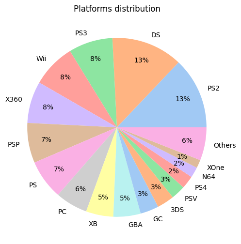
    


В репозитории доступен блокнот с интерактивным графиком, сделанным с помощью plotly.

Дубликатов нет, распределение игр по платформам довольно очевидно. Также очевидно, что датасет неполный: хотя бы для 3DO вышло [**гораздо больше**](https://ru.wikipedia.org/wiki/%D0%A1%D0%BF%D0%B8%D1%81%D0%BE%D0%BA_%D0%B8%D0%B3%D1%80_%D0%BD%D0%B0_3DO) игр. Но с неполнотой датасета мы вряд ли что-то можем сделать. Будем работать с тем, что есть.

### Столбец `'year_of_release'` — год выпуска <a id='year_of_release'></a>

Этот столбец содержит годы релиза игр, и у нас есть две опции изменения формата: а) на "дата-время", и б) на integer. Несмотря на соблазн использования временного формата для удобства графического анализа, изменим формат на int, потому что при корреляционном анализе он придется как нельзя кстати. Для этого сначала нужно удалить все пропуски. Проверим, не грозит ли нам чем-нибудь это решение:


```python
games[games['year_of_release'].isna() == True]
```


<div>
<table border="1" class="dataframe">
  <thead>
    <tr style="text-align: right;">
      <th></th>
      <th>name</th>
      <th>platform</th>
      <th>year_of_release</th>
      <th>genre</th>
      <th>na_sales</th>
      <th>eu_sales</th>
      <th>jp_sales</th>
      <th>other_sales</th>
      <th>critic_score</th>
      <th>user_score</th>
      <th>rating</th>
    </tr>
  </thead>
  <tbody>
    <tr>
      <th>183</th>
      <td>Madden NFL 2004</td>
      <td>PS2</td>
      <td>NaN</td>
      <td>Sports</td>
      <td>4.26</td>
      <td>0.26</td>
      <td>0.01</td>
      <td>0.71</td>
      <td>94.0</td>
      <td>8.5</td>
      <td>E</td>
    </tr>
    <tr>
      <th>377</th>
      <td>FIFA Soccer 2004</td>
      <td>PS2</td>
      <td>NaN</td>
      <td>Sports</td>
      <td>0.59</td>
      <td>2.36</td>
      <td>0.04</td>
      <td>0.51</td>
      <td>84.0</td>
      <td>6.4</td>
      <td>E</td>
    </tr>
    <tr>
      <th>456</th>
      <td>LEGO Batman: The Videogame</td>
      <td>Wii</td>
      <td>NaN</td>
      <td>Action</td>
      <td>1.80</td>
      <td>0.97</td>
      <td>0.00</td>
      <td>0.29</td>
      <td>74.0</td>
      <td>7.9</td>
      <td>E10+</td>
    </tr>
    <tr>
      <th>475</th>
      <td>wwe Smackdown vs. Raw 2006</td>
      <td>PS2</td>
      <td>NaN</td>
      <td>Fighting</td>
      <td>1.57</td>
      <td>1.02</td>
      <td>0.00</td>
      <td>0.41</td>
      <td>NaN</td>
      <td>&lt;NA&gt;</td>
      <td>&lt;NA&gt;</td>
    </tr>
    <tr>
      <th>609</th>
      <td>Space Invaders</td>
      <td>2600</td>
      <td>NaN</td>
      <td>Shooter</td>
      <td>2.36</td>
      <td>0.14</td>
      <td>0.00</td>
      <td>0.03</td>
      <td>NaN</td>
      <td>&lt;NA&gt;</td>
      <td>&lt;NA&gt;</td>
    </tr>
    <tr>
      <th>...</th>
      <td>...</td>
      <td>...</td>
      <td>...</td>
      <td>...</td>
      <td>...</td>
      <td>...</td>
      <td>...</td>
      <td>...</td>
      <td>...</td>
      <td>...</td>
      <td>...</td>
    </tr>
    <tr>
      <th>16373</th>
      <td>PDC World Championship Darts 2008</td>
      <td>PSP</td>
      <td>NaN</td>
      <td>Sports</td>
      <td>0.01</td>
      <td>0.00</td>
      <td>0.00</td>
      <td>0.00</td>
      <td>43.0</td>
      <td>tbd</td>
      <td>E10+</td>
    </tr>
    <tr>
      <th>16405</th>
      <td>Freaky Flyers</td>
      <td>GC</td>
      <td>NaN</td>
      <td>Racing</td>
      <td>0.01</td>
      <td>0.00</td>
      <td>0.00</td>
      <td>0.00</td>
      <td>69.0</td>
      <td>6.5</td>
      <td>T</td>
    </tr>
    <tr>
      <th>16448</th>
      <td>Inversion</td>
      <td>PC</td>
      <td>NaN</td>
      <td>Shooter</td>
      <td>0.01</td>
      <td>0.00</td>
      <td>0.00</td>
      <td>0.00</td>
      <td>59.0</td>
      <td>6.7</td>
      <td>M</td>
    </tr>
    <tr>
      <th>16458</th>
      <td>Hakuouki: Shinsengumi Kitan</td>
      <td>PS3</td>
      <td>NaN</td>
      <td>Adventure</td>
      <td>0.01</td>
      <td>0.00</td>
      <td>0.00</td>
      <td>0.00</td>
      <td>NaN</td>
      <td>&lt;NA&gt;</td>
      <td>&lt;NA&gt;</td>
    </tr>
    <tr>
      <th>16522</th>
      <td>Virtua Quest</td>
      <td>GC</td>
      <td>NaN</td>
      <td>Role-Playing</td>
      <td>0.01</td>
      <td>0.00</td>
      <td>0.00</td>
      <td>0.00</td>
      <td>55.0</td>
      <td>5.5</td>
      <td>T</td>
    </tr>
  </tbody>
</table>
<p>269 rows × 11 columns</p>
</div>


Судя по всему, пропуски относятся к самым разным платформам и жанрам. Кроме того, они могут содержать и не содержать важную информацию. Удаление таких пропусков может быть "болезненным", если в них обсуждаются игры, выпускавшиеся, в периоде, который мы далее будем рассматривать как **актуальный**. Некоторые намеки на год выпуска игр можно было бы получить на основе платформы, указанной для каждой игры. Год запуска этих платформ мы можем установить по открытым источникам, что позволит определить по крайней мере самый ранний возможный год её выпуска. Посмотрим на распределение пропусков по платформам.


```python
games[games['year_of_release'].isna() == True]['platform'].value_counts()
```


    PS2     34
    Wii     34
    X360    30
    DS      30
    PS3     25
    XB      21
    2600    17
    PC      17
    PSP     16
    GC      14
    GBA     11
    3DS      8
    PS       7
    N64      3
    GB       1
    PSV      1
    Name: platform, dtype: Int64


Здесь представлены либо сравнительно "старые" консоли (самая "молодая" - PlayStation 3, представлена в 2006-2007 году в зависимости от страны), выпущенные до двух резких изменений линий трендов, описанных выше, либо платформа PC, для которой год выпуска игры можно установить только "ручным" поиском. То есть оснований для принятия решения о заполнении пропусков у нас нет. А для удоства дальнейшей работы избавиться от них нужно. Поэтому удалим эти пропуски и конвертируем данные в тип int:


```python
print('Before:', games.shape)
games.drop(index=games[games['year_of_release'].isna() == True].index, inplace=True)
print('After :', games.shape)
```

    Before: (16713, 11)
    After : (16444, 11)


```python
print(f"Min value: {games['year_of_release'].min()}, Max value: {games['year_of_release'].max()}")
```

    Min value: 1980.0, Max value: 2016.0


Int16 будет достаточно для хранения данных и экономии памяти:


```python
games['year_of_release'] = games['year_of_release'].astype('int16')
games['year_of_release'].dtype
```


    dtype('int16')


Посмотрим на распределение имеющихся значений:


```python
print(games['year_of_release'].value_counts().describe())

plt.figure(figsize=(18,4))
games['year_of_release'].value_counts().sort_index().plot(style='-', grid=True)
plt.title('Game releases by year of release')
plt.show()
```

    count      37.000000
    mean      444.432432
    std       451.604334
    min         9.000000
    25%        36.000000
    50%       338.000000
    75%       762.000000
    max      1427.000000
    Name: year_of_release, dtype: float64


    
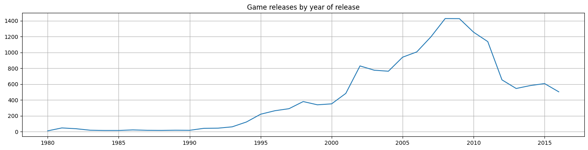
    


Обратим внимание на тренд: начиная с 2009 года количество ежегодно выпускаемых игр падает. Однако утверждение "количество ежегодно выпускаемых игр уменьшается" не равнозначно утверждению "объемы продаж игр уменьшаются" (что вело бы к уменьшению годовой прибыли). Поэтому просто запомним факт изменения тренда после 2009-го и выравнивание линии тренда после 2012-2013 гг.

### Столбец `'genre'` — жанр игры

Применим тот же подход, что и к столбцу `'platform'`.


```python
cat_dist(games, 'genre', 'Game genres distibution')
```

    Action          3307
    Sports          2306
    Misc            1721
    Role-Playing    1481
    Shooter         1296
    Adventure       1293
    Racing          1226
    Platform         878
    Simulation       857
    Fighting         837
    Name: genre, dtype: Int64
    


    
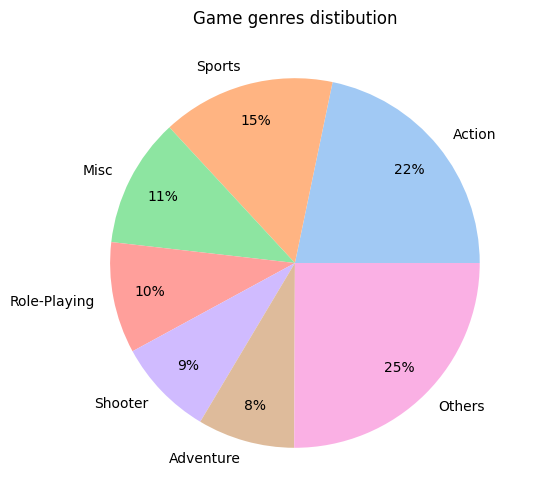
    


Вывод будет тем же. Дубликатов нет, распределение игр по платформам довольно очевидно.

### Столбцы `'na_sales'`, `'eu_sales'`, `'jp_sales'`, `'other_sales'`  — продажи в Северной Америке, Европе, Японии, других странах соотвественно (миллионы проданных копий)

Пропусков в столбце нет. Детальный анализ этих данных будет проведён позже, а пока просто оценим динамику объемов продаж во всех макрорегионах за все годы:


```python
sales_regions = ['na_sales', 'eu_sales', 'jp_sales', 'other_sales']

fig = plt.figure(figsize=(18,4))
ax = plt.subplot()
games.groupby('year_of_release')[sales_regions].sum().plot(style='-', grid=True, ax=ax)
plt.title('Sales in regions by year of release')
plt.show()
```


    
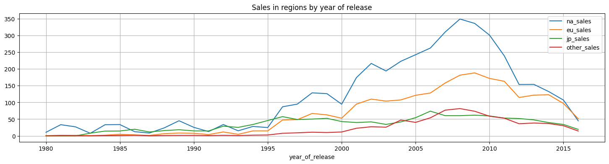
    


Разница в объемах продаж между разными макрорегионами (связанная с объемами ранка потребителей) очевидна. Однако общий тренд также просматривается:
- постепенный рост объемов продаж с 1995 по 1999 гг.;
- некоторое падение в 2000 г. (проблема Y2K?)
- новый подъём до 2008 г.;
- резкое падение до 2013 г. (последствия мирового кризиса?);
- выравнивание продаж с 2013 по 2014 гг.;
- плавное падение с 2013 по 2016 гг. (последствия кризиса, вызванного событиями 2014 г.?)

Одновременно обращает на себя внимание некоторое несовпадение американских, европейских и других трендов продаж с одной стороны, и японских с другой. В Японии в отношении игр и платформ - своя атмосфера ⛩.

### Столбец `'critic_score'` — оценка критиков (максимум 100)

Нам известно, что оценки критиков имеются **далеко** не для всех записей. Однако это не мешает нам посмотреть на их распределение:


```python
quant_dist(games, 'critic_score')
```

    Feature: critic_score
    count    7983.000000
    mean       68.994363
    std        13.920060
    min        13.000000
    25%        60.000000
    50%        71.000000
    75%        79.000000
    max        98.000000
    Name: critic_score, dtype: float64


    
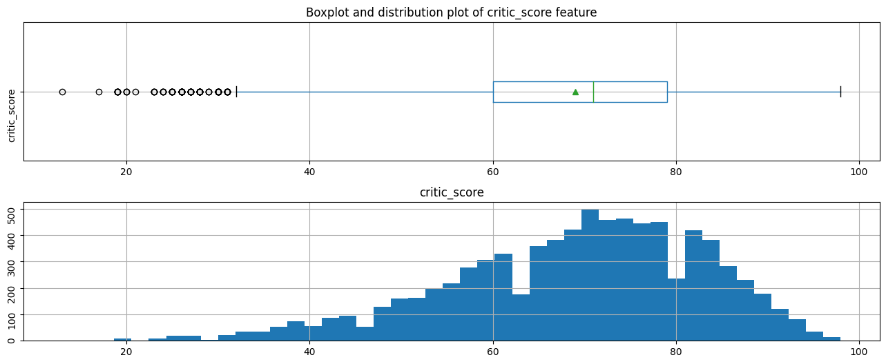
    


    


Откровенно плохих игр, заслуживших очень низкие оценки (ниже 50 баллов из 100) довольно мало. В целом данные демонстрируют довольно равномерное распределение, даже слегка напоминающее нормальное. Проверим его на нормальность. Наиболее мощный статистический инструмент проверки распределения на соответствие нормальному распределению, критерий Шапиро-Уилка, в данном случае не применим: объем выборки выходит за пределы рекомендуемого. Поэтому проведем графический анализ квантилей распределения, тем более, что именно этот способ является первым рекомендуемым для формулирования вывода о принадлежности к тому или иному типу распределения; статистические критерии предлагается использовать как вспомогательные методы из-за их ограничений.


```python
fig, ax = plt.subplots(figsize=(6, 6))
sm.qqplot(games['critic_score'].dropna(), line='45', ax=ax)
plt.show()
```


    
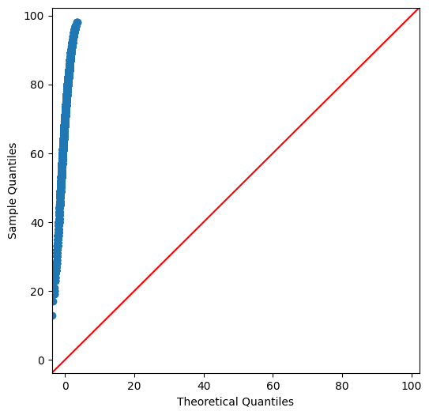
    


Налицо отклонения графика квантилей распределения от центральной диагонали, что свидетельствует об отличии распределения данных от нормального.


```python
fig = plt.figure(figsize=(18,4))
ax = plt.subplot()
games.groupby('critic_score')[sales_regions].sum().plot(style='-', grid=True, ax=ax)
plt.title('Critic score by regions')
plt.show()
```


    
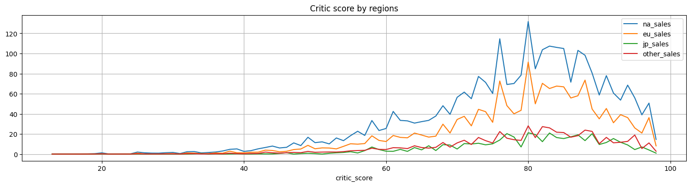
    


Как видим, графически невозможно выявить различия между динамикой объемов продаж игр в разных макрорегионах и оценками критиков. Что является косвенным подтверждением одного простого соображения: покупатели из разных регионов демонстрируют похожее поведение в отношении игр, высоко оцененных критиками.

### Столбец `'user_score'` — оценка пользователей (максимум 10)

Для начала необходимо сменить тип данных со строкового на более подходящий. Чтобы для нас не было сюрпризов, посмотрим, какие значения присутствуют в столбце:


```python
games['user_score'].value_counts()
```


    tbd    2376
    7.8     322
    8       285
    8.2     276
    8.3     252
           ... 
    0.9       2
    1         2
    0.5       2
    0         1
    9.7       1
    Name: user_score, Length: 96, dtype: Int64


Привлекает внимание аббревиатура `tbd`. Она может означать 'to be discussed', 'to be done' и так далее. В любом случае это значение равносильно отсутствию значения, а для преобразования значений столбца в числовой тип от неё необходимо избавиться. Предложение по этому поводу простое: заменить строку с таким значением на значение NaN:


```python
games.loc[list(games[games['user_score'] == 'tbd'].index), 'user_score'] = nan
```

Теперь изменим тип данных столбца на float:


```python
games['user_score'] = games['user_score'].astype('float')
```

Проверим распределение значений:


```python
quant_dist(games, 'user_score')
```

    Feature: user_score
    count    7463.000000
    mean        7.126330
    std         1.499447
    min         0.000000
    25%         6.400000
    50%         7.500000
    75%         8.200000
    max         9.700000
    Name: user_score, dtype: float64


    
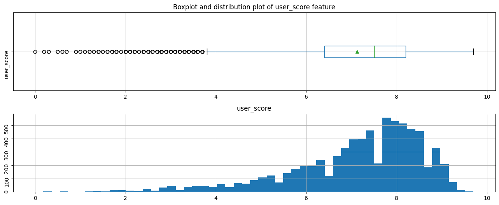
    


    


Теперь проверим распределение оценок пользователей по регионам:


```python
fig = plt.figure(figsize=(18,4))
ax = plt.subplot()
games.groupby('user_score')[sales_regions].sum().plot(style='-', grid=True, ax=ax)
plt.title('User score by regions')
plt.show()
```


    
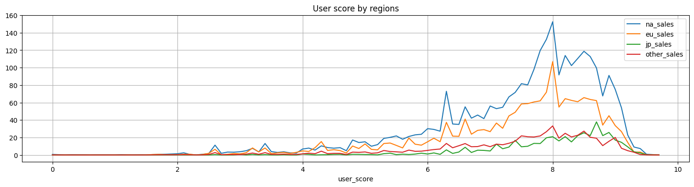
    


Вывод похож на предмет на предыдущий. Пользователи из разных макрорегионов оценивают приобретённые игры примерно одинаково. Небольшие отличия в тенденциях демонстрирует Япония, что неудивительно. Разумно ожидать, что некоторые игры в Японии будут встречены гораздо теплее, чем в других макрорегионах: например, термин JRPG (то есть Japanese RPG) появился не просто так.


```python
del sales_regions
```

### Столбец `'rating'` — рейтинг от организации ESRB

Заменим все пропуски рейтинга на "заглушку" - значение "Not rated", которое позволит нам далее учесть не получившие рейтинга игры в распределении продаж:


```python
games['rating'] = games['rating'].fillna('Not rated')
```

Теперь посмотрим на распределение значений:


```python
cat_dist(games, 'rating', 'ESRB ratings distibution')
```

    Not rated    6676
    E            3921
    T            2905
    M            1536
    E10+         1393
    EC              8
    K-A             3
    AO              1
    RP              1
    Name: rating, dtype: Int64
    


    
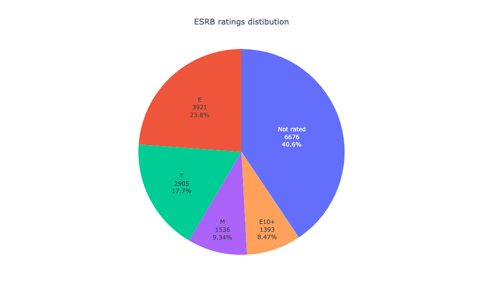
    


Предлагаем ознакомиться с интерактивным графиком plotly в [отдельном ноутбуке](https://github.com/idrv/portfolio-rus/tree/main/ComputerGamesFeaturesSalesConnection/ComputerGamesFeaturesSalesConnection_plotly.ipynb) с этим же проектом.

Распределение рейтингов не демонстрирует каких-либо сюрпризов. Обращает на себя внимание отсутствие рейтинга для многих игр, что ожидаемо - ESRB рейтингует только игры, предназначающиеся для продажи на северамериканском рынке.

Наконец, проверим все строки датасета на полные дубликаты:


```python
games.duplicated().sum()
```


    0


К счастью, таковых нет.

Теперь еще раз проверим состояние датасета после предобработки данных:


```python
skim(games)
```


<pre style="white-space:pre;overflow-x:auto;line-height:normal;font-family:Menlo,'DejaVu Sans Mono',consolas,'Courier New',monospace">╭──────────────────────────────────────────────── skimpy summary ─────────────────────────────────────────────────╮
│ <span style="font-style: italic">         Data Summary         </span> <span style="font-style: italic">      Data Types       </span>                                                          │
│ ┏━━━━━━━━━━━━━━━━━━━┳━━━━━━━━┓ ┏━━━━━━━━━━━━━┳━━━━━━━┓                                                          │
│ ┃<span style="color: #008080; text-decoration-color: #008080; font-weight: bold"> dataframe         </span>┃<span style="color: #008080; text-decoration-color: #008080; font-weight: bold"> Values </span>┃ ┃<span style="color: #008080; text-decoration-color: #008080; font-weight: bold"> Column Type </span>┃<span style="color: #008080; text-decoration-color: #008080; font-weight: bold"> Count </span>┃                                                          │
│ ┡━━━━━━━━━━━━━━━━━━━╇━━━━━━━━┩ ┡━━━━━━━━━━━━━╇━━━━━━━┩                                                          │
│ │ Number of rows    │ 16444  │ │ float64     │ 6     │                                                          │
│ │ Number of columns │ 11     │ │ string      │ 4     │                                                          │
│ └───────────────────┴────────┘ │ int64       │ 1     │                                                          │
│                                └─────────────┴───────┘                                                          │
│ <span style="font-style: italic">                                                    number                                                    </span>  │
│ ┏━━━━━━━━━━━━━━━━━━━━━━━┳━━━━━━━━┳━━━━━━━━┳━━━━━━━━━━┳━━━━━━━━┳━━━━━━━━┳━━━━━━━━┳━━━━━━━━┳━━━━━━━━┳━━━━━━━━━━┓  │
│ ┃<span style="font-weight: bold"> column_name           </span>┃<span style="font-weight: bold"> NA     </span>┃<span style="font-weight: bold"> NA %   </span>┃<span style="font-weight: bold"> mean     </span>┃<span style="font-weight: bold"> sd     </span>┃<span style="font-weight: bold"> p0     </span>┃<span style="font-weight: bold"> p25    </span>┃<span style="font-weight: bold"> p75    </span>┃<span style="font-weight: bold"> p100   </span>┃<span style="font-weight: bold"> hist     </span>┃  │
│ ┡━━━━━━━━━━━━━━━━━━━━━━━╇━━━━━━━━╇━━━━━━━━╇━━━━━━━━━━╇━━━━━━━━╇━━━━━━━━╇━━━━━━━━╇━━━━━━━━╇━━━━━━━━╇━━━━━━━━━━┩  │
│ │ <span style="color: #af87ff; text-decoration-color: #af87ff">year_of_release      </span> │ <span style="color: #008080; text-decoration-color: #008080">     0</span> │ <span style="color: #008080; text-decoration-color: #008080">     0</span> │ <span style="color: #008080; text-decoration-color: #008080">    2000</span> │ <span style="color: #008080; text-decoration-color: #008080">   5.9</span> │ <span style="color: #008080; text-decoration-color: #008080">  2000</span> │ <span style="color: #008080; text-decoration-color: #008080">  2000</span> │ <span style="color: #008080; text-decoration-color: #008080">  2000</span> │ <span style="color: #008080; text-decoration-color: #008080">  2000</span> │ <span style="color: #008000; text-decoration-color: #008000">   ▁▄█▆ </span> │  │
│ │ <span style="color: #af87ff; text-decoration-color: #af87ff">na_sales             </span> │ <span style="color: #008080; text-decoration-color: #008080">     0</span> │ <span style="color: #008080; text-decoration-color: #008080">     0</span> │ <span style="color: #008080; text-decoration-color: #008080">    0.26</span> │ <span style="color: #008080; text-decoration-color: #008080">  0.82</span> │ <span style="color: #008080; text-decoration-color: #008080">     0</span> │ <span style="color: #008080; text-decoration-color: #008080">     0</span> │ <span style="color: #008080; text-decoration-color: #008080">  0.24</span> │ <span style="color: #008080; text-decoration-color: #008080">    41</span> │ <span style="color: #008000; text-decoration-color: #008000">   █    </span> │  │
│ │ <span style="color: #af87ff; text-decoration-color: #af87ff">eu_sales             </span> │ <span style="color: #008080; text-decoration-color: #008080">     0</span> │ <span style="color: #008080; text-decoration-color: #008080">     0</span> │ <span style="color: #008080; text-decoration-color: #008080">    0.15</span> │ <span style="color: #008080; text-decoration-color: #008080">  0.51</span> │ <span style="color: #008080; text-decoration-color: #008080">     0</span> │ <span style="color: #008080; text-decoration-color: #008080">     0</span> │ <span style="color: #008080; text-decoration-color: #008080">  0.11</span> │ <span style="color: #008080; text-decoration-color: #008080">    29</span> │ <span style="color: #008000; text-decoration-color: #008000">   █    </span> │  │
│ │ <span style="color: #af87ff; text-decoration-color: #af87ff">jp_sales             </span> │ <span style="color: #008080; text-decoration-color: #008080">     0</span> │ <span style="color: #008080; text-decoration-color: #008080">     0</span> │ <span style="color: #008080; text-decoration-color: #008080">   0.078</span> │ <span style="color: #008080; text-decoration-color: #008080">  0.31</span> │ <span style="color: #008080; text-decoration-color: #008080">     0</span> │ <span style="color: #008080; text-decoration-color: #008080">     0</span> │ <span style="color: #008080; text-decoration-color: #008080">  0.04</span> │ <span style="color: #008080; text-decoration-color: #008080">    10</span> │ <span style="color: #008000; text-decoration-color: #008000">   █    </span> │  │
│ │ <span style="color: #af87ff; text-decoration-color: #af87ff">other_sales          </span> │ <span style="color: #008080; text-decoration-color: #008080">     0</span> │ <span style="color: #008080; text-decoration-color: #008080">     0</span> │ <span style="color: #008080; text-decoration-color: #008080">   0.048</span> │ <span style="color: #008080; text-decoration-color: #008080">  0.19</span> │ <span style="color: #008080; text-decoration-color: #008080">     0</span> │ <span style="color: #008080; text-decoration-color: #008080">     0</span> │ <span style="color: #008080; text-decoration-color: #008080">  0.03</span> │ <span style="color: #008080; text-decoration-color: #008080">    11</span> │ <span style="color: #008000; text-decoration-color: #008000">   █    </span> │  │
│ │ <span style="color: #af87ff; text-decoration-color: #af87ff">critic_score         </span> │ <span style="color: #008080; text-decoration-color: #008080">  8500</span> │ <span style="color: #008080; text-decoration-color: #008080">    51</span> │ <span style="color: #008080; text-decoration-color: #008080">      69</span> │ <span style="color: #008080; text-decoration-color: #008080">    14</span> │ <span style="color: #008080; text-decoration-color: #008080">    13</span> │ <span style="color: #008080; text-decoration-color: #008080">    60</span> │ <span style="color: #008080; text-decoration-color: #008080">    79</span> │ <span style="color: #008080; text-decoration-color: #008080">    98</span> │ <span style="color: #008000; text-decoration-color: #008000">  ▁▃▆█▃ </span> │  │
│ │ <span style="color: #af87ff; text-decoration-color: #af87ff">user_score           </span> │ <span style="color: #008080; text-decoration-color: #008080">  9000</span> │ <span style="color: #008080; text-decoration-color: #008080">    55</span> │ <span style="color: #008080; text-decoration-color: #008080">     7.1</span> │ <span style="color: #008080; text-decoration-color: #008080">   1.5</span> │ <span style="color: #008080; text-decoration-color: #008080">     0</span> │ <span style="color: #008080; text-decoration-color: #008080">   6.4</span> │ <span style="color: #008080; text-decoration-color: #008080">   8.2</span> │ <span style="color: #008080; text-decoration-color: #008080">   9.7</span> │ <span style="color: #008000; text-decoration-color: #008000">   ▁▃█▆ </span> │  │
│ └───────────────────────┴────────┴────────┴──────────┴────────┴────────┴────────┴────────┴────────┴──────────┘  │
│ <span style="font-style: italic">                                                    string                                                    </span>  │
│ ┏━━━━━━━━━━━━━━━━━━━━━━━━━━━┳━━━━━━━━━┳━━━━━━━━━━━━┳━━━━━━━━━━━━━━━━━━━━━━━━━━━━━━┳━━━━━━━━━━━━━━━━━━━━━━━━━━┓  │
│ ┃<span style="font-weight: bold"> column_name               </span>┃<span style="font-weight: bold"> NA      </span>┃<span style="font-weight: bold"> NA %       </span>┃<span style="font-weight: bold"> words per row                </span>┃<span style="font-weight: bold"> total words              </span>┃  │
│ ┡━━━━━━━━━━━━━━━━━━━━━━━━━━━╇━━━━━━━━━╇━━━━━━━━━━━━╇━━━━━━━━━━━━━━━━━━━━━━━━━━━━━━╇━━━━━━━━━━━━━━━━━━━━━━━━━━┩  │
│ │ <span style="color: #af87ff; text-decoration-color: #af87ff">name                     </span> │ <span style="color: #008080; text-decoration-color: #008080">      0</span> │ <span style="color: #008080; text-decoration-color: #008080">         0</span> │ <span style="color: #008080; text-decoration-color: #008080">                           4</span> │ <span style="color: #008080; text-decoration-color: #008080">                   65000</span> │  │
│ │ <span style="color: #af87ff; text-decoration-color: #af87ff">platform                 </span> │ <span style="color: #008080; text-decoration-color: #008080">      0</span> │ <span style="color: #008080; text-decoration-color: #008080">         0</span> │ <span style="color: #008080; text-decoration-color: #008080">                           4</span> │ <span style="color: #008080; text-decoration-color: #008080">                   65000</span> │  │
│ │ <span style="color: #af87ff; text-decoration-color: #af87ff">genre                    </span> │ <span style="color: #008080; text-decoration-color: #008080">      0</span> │ <span style="color: #008080; text-decoration-color: #008080">         0</span> │ <span style="color: #008080; text-decoration-color: #008080">                           4</span> │ <span style="color: #008080; text-decoration-color: #008080">                   65000</span> │  │
│ │ <span style="color: #af87ff; text-decoration-color: #af87ff">rating                   </span> │ <span style="color: #008080; text-decoration-color: #008080">      0</span> │ <span style="color: #008080; text-decoration-color: #008080">         0</span> │ <span style="color: #008080; text-decoration-color: #008080">                           4</span> │ <span style="color: #008080; text-decoration-color: #008080">                   65000</span> │  │
│ └───────────────────────────┴─────────┴────────────┴──────────────────────────────┴──────────────────────────┘  │
╰────────────────────────────────────────────────────── End ──────────────────────────────────────────────────────╯
</pre>


### Вывод по предобработке данных

Проверены все столбцы. В данных не обнаружено прямых ошибок, однако внесены некоторые исправления. В некоторых столбцах изменен тип данных на более уместный. Удален ряд записей с пропусками в годах выпуска игр. Было обнаружено, что когда речь идет об объемах продаж, между группами "Северная Америка", "Европа" и "Другие страны" наблюдается довольно большое сходство в динамике; объемы продаж в Японии стоят несколько особняком. Этот вывод мы проверим чуть позже.

## Создание синтетического признака

Рассчитаем суммарные продажи во всех регионах и запишем их в отдельный столбец:


```python
games.loc[:, 'total_sales'] = games.loc[:, ['na_sales','eu_sales','jp_sales', 'other_sales']].sum(axis = 1)
```

Теперь посмотрим на общую картину динамики мировых продаж видеоигр: 


```python
fig = plt.figure(figsize=(18,4))
ax = plt.subplot()
games.groupby('year_of_release')['total_sales'].sum().plot(style='-', grid=True, ax=ax)
plt.title('Total sales by year of release')
plt.show()
```


    
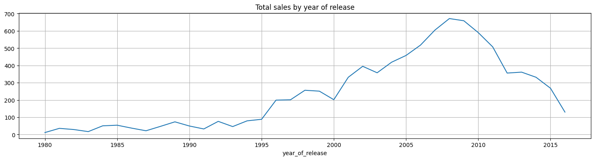
    


В общем и целом она мало чем отличается и от динамики продаж по макрорегионам, и от динамики выпуска игр по годам.

## Исследовательский анализ данных

### Выпуск игр по годам и определение актуального периода

Необходимо принять решение о том, какой период мы будем считать актуальным и использовать его данные в дальнейшем анализе. Для этого определим ближайшую точку изменения тренда и в количестве выпущенных игр, и в динамике продаж. Таковой точкой является 2012 год. Несмотря на тенденцию дальнейшего уменьшения и количества выпущенных ежегодно игр, и ежегодных продаж игр, это последняя заметная точка изменения тендеции. Соответсвенно, далее в качестве модельных будем рассматривать данные за 2012-2016 гг. При этом необходимо помнить, что мы будем рассматривать ситуацию на неизвестную точку декабря 2016 г. Это значит, что в этих данных могут частично или полностью отсутствовать данные о продажах за один из самых прибыльных (благодаря традиции рождественских и новогодних подарков) периодов финансового года - сам декабрь. Поэтому предлагается осторожно относиться к данным об объемах продаж за 2016 г. и не рассматривать их как главное направление тренда.

### Динамика продаж по платформам

Распределение игр по платформам мы [уже проверили](#platform). Теперь посмотрим на распределение продаж по платформам:


```python
sales_by_platform = games.groupby('platform')['total_sales'].sum().sort_values(ascending=False)
sales_by_platform.head()
```


    platform
    PS2     1233.56
    X360     961.24
    PS3      931.34
    Wii      891.18
    DS       802.78
    Name: total_sales, dtype: float64


Преобразуем распределение для более опрятного графика:


```python
# Same magic: the initial Series object is split into halves, the second half is summed, the halves are concatenated  
trimmed_sales_by_platform = pd.concat(
    objs=[sales_by_platform.head(int(round(len(sales_by_platform) * 0.5))),
          pd.Series(sales_by_platform.tail(int(round(len(sales_by_platform) * 0.5)) - 1).sum(),
                    index=['Others'])
         ]
)
```


```python
fig = plt.figure(figsize=(6, 6))
plt.pie(trimmed_sales_by_platform,
        labels=list(trimmed_sales_by_platform.index),
        colors=color_palette('pastel'),
        autopct='%.0f%%',
        pctdistance=0.8)
plt.title('Global sales by platforms')
plt.show()
```


    
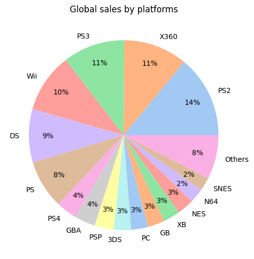
    


Распределение продлаж примерно повторяет распределение игр. Более красивый график plotly можно найти в [отдельном ноутбуке](https://github.com/idrv/portfolio-rus/tree/main/ComputerGamesFeaturesSalesConnection/ComputerGamesFeaturesSalesConnection_plotly.ipynb) в репозитории.

Необходимо принять волевое решение о том, где будет проходить граница между платформами с самыми большими суммарными продажами игр и всеми остальными платформами. Принято следующее решение: PlayStation – "последняя" платформа, объемы продаж игр для которой мы принимаем во внимание. Консоли (все платформы относятся именно к этому условному типу) с продажами игр, равными или большими, чем  PlayStation, занимают почти 2/3 от всех суммарных продаж датасета. Кроме того, разрыв между PlayStation и следующей по объемам продаж игр консолью существенно выше, чем соответствующие разрывы в объемах между консолями до PlayStation (не считая PlayStation 2, конечно).

Теперь построим для всех консолей распределение продаж по годам:


```python
platforms_lifespan = pd.pivot_table(data=games,
                                    values='total_sales',
                                    index='year_of_release',
                                    columns='platform',
                                    aggfunc='sum')
platforms_lifespan.head()
```


<div>
<table border="1" class="dataframe">
  <thead>
    <tr style="text-align: right;">
      <th>platform</th>
      <th>2600</th>
      <th>3DO</th>
      <th>3DS</th>
      <th>DC</th>
      <th>DS</th>
      <th>GB</th>
      <th>GBA</th>
      <th>GC</th>
      <th>GEN</th>
      <th>GG</th>
      <th>...</th>
      <th>SAT</th>
      <th>SCD</th>
      <th>SNES</th>
      <th>TG16</th>
      <th>WS</th>
      <th>Wii</th>
      <th>WiiU</th>
      <th>X360</th>
      <th>XB</th>
      <th>XOne</th>
    </tr>
    <tr>
      <th>year_of_release</th>
      <th></th>
      <th></th>
      <th></th>
      <th></th>
      <th></th>
      <th></th>
      <th></th>
      <th></th>
      <th></th>
      <th></th>
      <th></th>
      <th></th>
      <th></th>
      <th></th>
      <th></th>
      <th></th>
      <th></th>
      <th></th>
      <th></th>
      <th></th>
      <th></th>
    </tr>
  </thead>
  <tbody>
    <tr>
      <th>1980</th>
      <td>11.38</td>
      <td>NaN</td>
      <td>NaN</td>
      <td>NaN</td>
      <td>NaN</td>
      <td>NaN</td>
      <td>NaN</td>
      <td>NaN</td>
      <td>NaN</td>
      <td>NaN</td>
      <td>...</td>
      <td>NaN</td>
      <td>NaN</td>
      <td>NaN</td>
      <td>NaN</td>
      <td>NaN</td>
      <td>NaN</td>
      <td>NaN</td>
      <td>NaN</td>
      <td>NaN</td>
      <td>NaN</td>
    </tr>
    <tr>
      <th>1981</th>
      <td>35.68</td>
      <td>NaN</td>
      <td>NaN</td>
      <td>NaN</td>
      <td>NaN</td>
      <td>NaN</td>
      <td>NaN</td>
      <td>NaN</td>
      <td>NaN</td>
      <td>NaN</td>
      <td>...</td>
      <td>NaN</td>
      <td>NaN</td>
      <td>NaN</td>
      <td>NaN</td>
      <td>NaN</td>
      <td>NaN</td>
      <td>NaN</td>
      <td>NaN</td>
      <td>NaN</td>
      <td>NaN</td>
    </tr>
    <tr>
      <th>1982</th>
      <td>28.88</td>
      <td>NaN</td>
      <td>NaN</td>
      <td>NaN</td>
      <td>NaN</td>
      <td>NaN</td>
      <td>NaN</td>
      <td>NaN</td>
      <td>NaN</td>
      <td>NaN</td>
      <td>...</td>
      <td>NaN</td>
      <td>NaN</td>
      <td>NaN</td>
      <td>NaN</td>
      <td>NaN</td>
      <td>NaN</td>
      <td>NaN</td>
      <td>NaN</td>
      <td>NaN</td>
      <td>NaN</td>
    </tr>
    <tr>
      <th>1983</th>
      <td>5.84</td>
      <td>NaN</td>
      <td>NaN</td>
      <td>NaN</td>
      <td>NaN</td>
      <td>NaN</td>
      <td>NaN</td>
      <td>NaN</td>
      <td>NaN</td>
      <td>NaN</td>
      <td>...</td>
      <td>NaN</td>
      <td>NaN</td>
      <td>NaN</td>
      <td>NaN</td>
      <td>NaN</td>
      <td>NaN</td>
      <td>NaN</td>
      <td>NaN</td>
      <td>NaN</td>
      <td>NaN</td>
    </tr>
    <tr>
      <th>1984</th>
      <td>0.27</td>
      <td>NaN</td>
      <td>NaN</td>
      <td>NaN</td>
      <td>NaN</td>
      <td>NaN</td>
      <td>NaN</td>
      <td>NaN</td>
      <td>NaN</td>
      <td>NaN</td>
      <td>...</td>
      <td>NaN</td>
      <td>NaN</td>
      <td>NaN</td>
      <td>NaN</td>
      <td>NaN</td>
      <td>NaN</td>
      <td>NaN</td>
      <td>NaN</td>
      <td>NaN</td>
      <td>NaN</td>
    </tr>
  </tbody>
</table>
<p>5 rows × 31 columns</p>
</div>


Визуализируем распределение на графике:


```python
fig = plt.figure(figsize=(18, 6))
ax = fig.add_subplot()
ax.set_ylabel('Total sales (millions of copies)')

platforms_lifespan.plot(style='-', grid=True, ax=ax)
plt.legend(loc='upper left', ncol=6)
plt.title('Total sales by year of release')
plt.show()
```


    
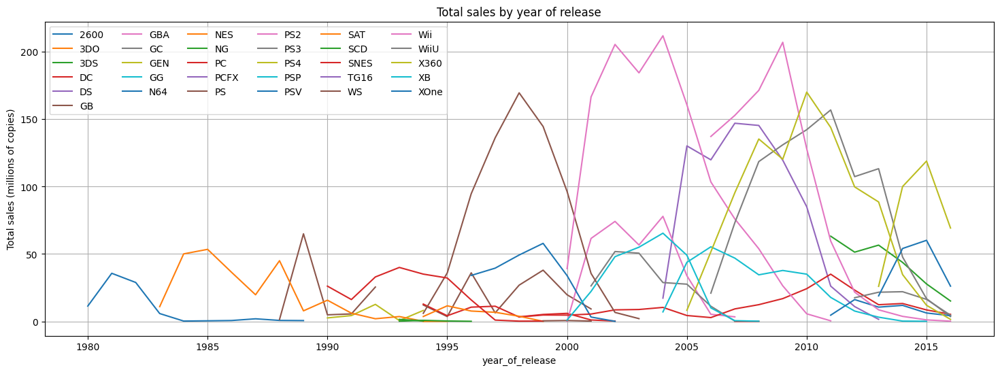
    


Несмотря на некоторую перегруженность графика, она дает некоторые соображения по поводу "ожидаемой продолжительности жизни" платформы. Не считая платформы PC, которая пока еще не собирается "на покой", платформа "живет" от 5 до 11 лет. Точнее, конечно, речь не о том, что после определенного "возраста" платформу больше не используют. Но вот новые игры для нее выпускать прекращают, а значит - интерес пользователей к ней падает.

Посмотрим на распределение и описательные статистики для "длительности" количества игр для разных платформ:


```python
plt.figure(figsize=(16,6))
platforms_lifespan.notna().sum().sort_values(ascending=False).plot(kind='bar')
plt.title('Total released games by platforms')
plt.show
```


    <function matplotlib.pyplot.show(close=None, block=None)>


    
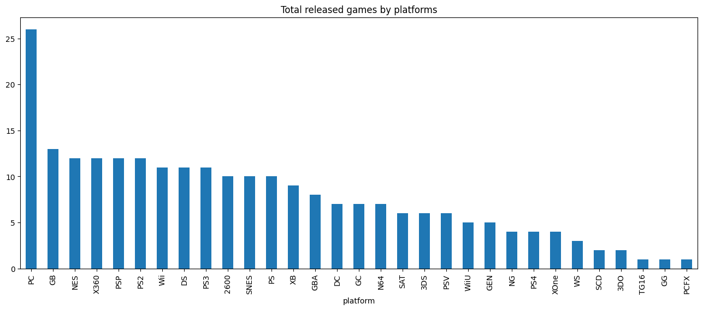
    


```python
platforms_lifespan.notna().sum().sort_values(ascending=False).describe()
```


    count    31.000000
    mean      7.677419
    std       5.081910
    min       1.000000
    25%       4.000000
    50%       7.000000
    75%      11.000000
    max      26.000000
    dtype: float64


PC удерживал на 2016 год лидерство и в общем количестве выпущенных игр, причем с большим отрывом.

Средний и медианный срок выпуска игр для консоли довольно близки, причем показатели размаха (стандартное отклонения и границы квартилей) тоже не очень отличаются друг от друга. Можно расчитывать, что игровая платформа является привлекательной для разработчиков и издателей игр в течение в среднем 7-7,5 лет (если это не PC).


```python
del trimmed_sales_by_platform
```

### Платформы-лидеры по продажам

Прежде, чем ответить на вопрос о платформе-"лидере" продаж, нужно понять, какие платформы еще "живы". Самый простой критерий - наличие проданных игр для платформы на принятую дату анализа (2016 г.):


```python
platforms_alive = platforms_lifespan.loc[2016][platforms_lifespan.loc[2016].notna() == True]
platforms_alive.sort_values(ascending=False)
```


    platform
    PS4     69.25
    XOne    26.15
    3DS     15.14
    PC       5.25
    WiiU     4.60
    PSV      4.25
    PS3      3.60
    X360     1.52
    Wii      0.18
    Name: 2016, dtype: float64


Посмотрим на динамику продаж этих платформ за актуальный период:


```python
fig = plt.figure(figsize=(18, 6))
ax = fig.add_subplot()
ax.set_ylabel('Total sales (millions of copies)')

platforms_alive_actual = platforms_lifespan.loc['2012-01-01': '2016-01-01', list(platforms_alive.index)]
platforms_alive_actual.plot(style='-', grid=True, ax=ax)
plt.title('Sales dynamics by platforms')
plt.show()
```


    
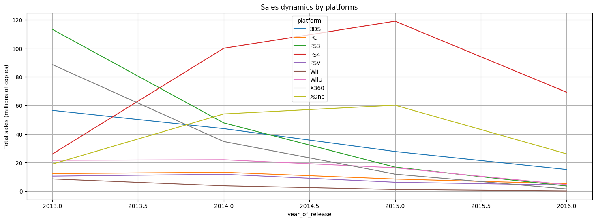
    


Исходя из данных об объемах продаж за актуальный период, наиболее многообещающими платформами являются PlayStation 4 и Xbox One. Кроме того, "признаки жизни" подает платформа 3DS. Её можно считать наиболее перспективный вариантом среди мобильных (portable) платформ (или **можно было** считать в конце 2016 г., пока Nintendo не анонсировала в 2017 г.  Nintendo Switch). Остальные платформы демонстрируют одновременно и более низкие результаты, и отрицательную динамику продаж, но снижение продаж происходит довольно плавно.

### Глобальные продажи игр в разбивке по платформам

Посмотрим, насколько разнятся глобальные продажи игр для каждой из этих платформ за актуальный промежуток:


```python
games_actual = games[games['year_of_release'].isin(platforms_alive_actual.index) == True]
```

Определим значение, которое мы зададим для диаграмм размаха как верхний предел:


```python
games_actual['total_sales'].max()
```


    21.05


```python
print('Total sales by platforms (millions of copies)')
for platform in list(games_actual['platform'].unique()):
    fig = plt.figure(figsize=(18,1))
    ax = plt.axes()
    ax.set_xlim([0, 22])
# a Series object is to set an null object name and to get rid of 'total_sales' on every diagram
    sales_platforms = pd.Series(games_actual[games_actual['platform'] == platform]['total_sales'], name='')
    sales_platforms.plot(kind='box', vert=False, ax=ax, showmeans=True)
    ax.set_ylabel(platform)
    plt.show()
```

    Total sales by platforms (millions of copies)


    
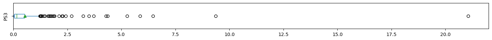
    


    
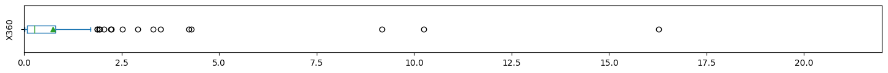
    


    
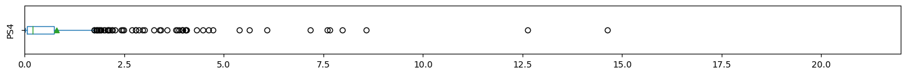
    


    
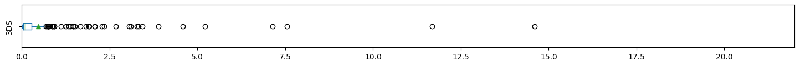
    


    
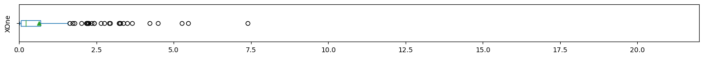
    


    
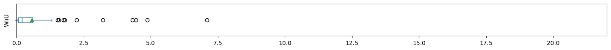
    


    
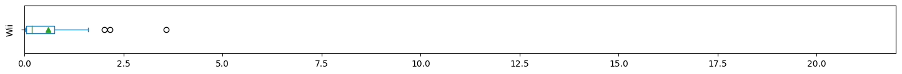
    


    
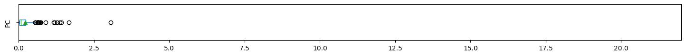
    


    
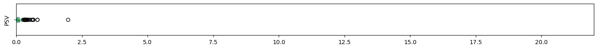
    


    
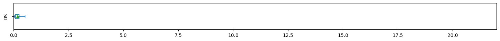
    


    

    


Слишком большой масштаб. Для отсечения выбросов и масштабирования всех диаграмм в качестве верхней границы установим значение 2 млн. проданных копий:


```python
print('Total sales by platforms, 2M copies limit')
for platform in list(games_actual['platform'].unique()):
    fig = plt.figure(figsize=(18,1))
    ax = plt.axes()
    ax.set_xlim([0, 2])
    sales_platforms = pd.Series(games_actual[games_actual['platform'] == platform]['total_sales'], name='')
    sales_platforms.plot(kind='box', vert=False, ax=ax, showmeans=True)
    ax.set_ylabel(platform)
    plt.show()
```

    Total sales by platforms, 2M copies limit


    
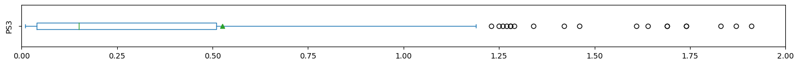
    


    
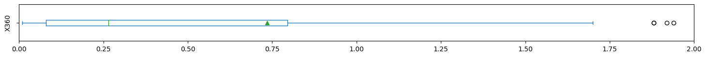
    


    
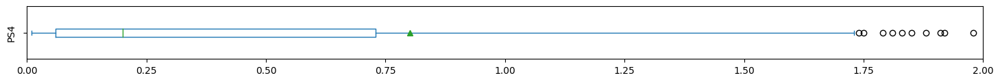
    


    
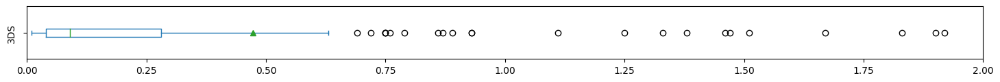
    


    
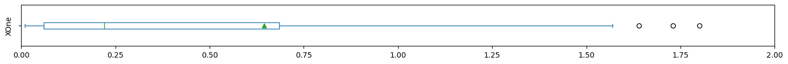
    


    
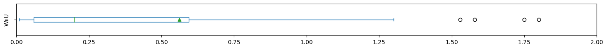
    


    
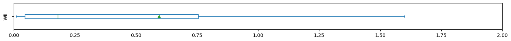
    


    
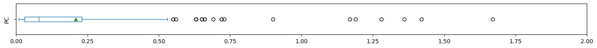
    


    
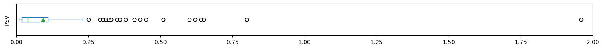
    


    
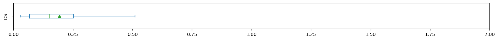
    


    
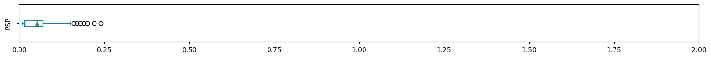
    


С точки зрения прибыльности продаж игр наиболее выигрышно выглядят Xbox 360, PlayStation 4, Xbox One и Nintendo Wii. Однако для принятия окончательного решения о наиболее прибыльных "в пересчете на игру" платформах также необходимо помнить о "продолжительности жизни" платформы, которую мы обсуждали чуть ранее.


```python
del sales_platforms
```

### Связь отзывов пользователей и критиков с продажами внутри одной популярной платформы <a link = 'influence'></a>

В качестве объекта анализа выберем "рекордсмена" – PlayStation 4. Данные возьмем за актуальный период 2012-2017 гг.:


```python
# to make it simple we'll do it in two steps

games_ps4 = games_actual[['platform', 'total_sales', 'critic_score', 'user_score']]
games_ps4 = games_ps4[games_ps4['platform'] == 'PS4'][['total_sales', 'critic_score', 'user_score']]
```


```python
fig = plt.figure(figsize=(16, 7))
ax1 = fig.add_subplot(1, 2, 1)
ax2 = fig.add_subplot(1, 2, 2)
ax1.set(title = 'Оценка критиков')
ax2.set(title = 'Оценка пользователей') 
games_ps4.plot(kind='scatter', x='total_sales', y='critic_score', color='Red', ax=ax1)
games_ps4.plot(kind='scatter', x='total_sales', y='user_score', color='Blue', ax=ax2)
plt.show()
```


    
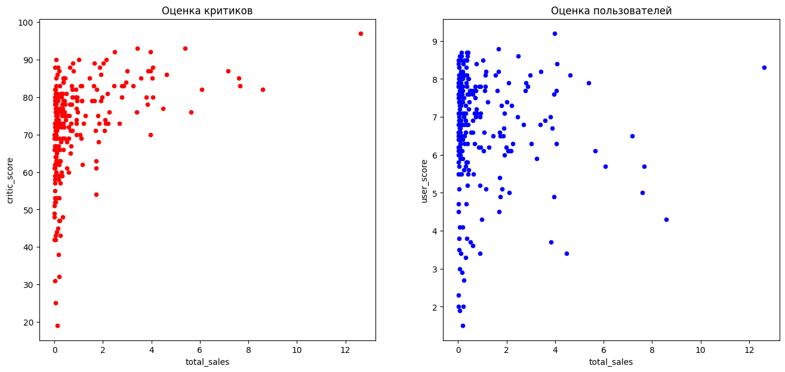
    


По этим графикам сложно сделать вывод о связи между **высокими** оценками критиков и пользователей и **высокими** продажами игр. Однако возможен обратный вывод (что не удивительно, это две разные практические гипотезы): **низким** оценкам критиков сопутствует **низкие** продажи игры. Ни одна игра, получившая менее 50 баллов из ста, не была продана общим тиражом более хотя бы миллиона копий.

Отметим, что между оценками пользователей и объемами продаж подобная связь сопутствия выражена слабее: игры с продажами более миллиона копий не наблюдаются только ниже порога оценок пользователей в 3,4.

Теперь вычислим коэффициент линейной корреляции Пирсона. Строго говоря, ни оценки критиков, ни оценки пользователей не являются непрерывными величинами, а значит – априори не могут быть распределены нормально. Кроме того, оба вида оценок можно рассматривать как данные, лежащие в/на порядковой (ранговой) шкале: сложение оценок двух игр не имеет содержательного смысла, единственный тип отношений, которые эти оценки позволяют установить - отношения порядка (что больше, а что - меньше). Это, в свою очередь, означает, что для проведения корреляционного анализа нам необходимы непараметрические инструменты. Однако поскольку и тот и другой вид оценок может ограничено "вести себя" как непрерывная величина, применим и параметрический и непараметрический инструменты и сравним их результаты. Однако прежде нам нужно избавиться от отсутствующих значений, потому что некоторые инструменты библиотеки Scipy не могут их обрабатывать:


```python
ps4_correlation = games_ps4.dropna()
```

Теперь проверим гипотезу о наличии связи сопутствия между глобальными продажами игр для PlayStation 4 и оценками а) критиков и б) пользователей. Сформулируем нулевую и альтернативную гипотезы:

H0: Корреляционная связь между переменными отсутствует (коэффициент корреляции равен нулю).

H1: Корреляционная связь между переменными присутствует (коэффициент корреляции **НЕ** равен нулю).


```python
from scipy import stats as st

print('Linear correlation between global sales of PS4 games and:')
print(
    'critic scores:',
    st.pearsonr(ps4_correlation['total_sales'], ps4_correlation['critic_score'])
    )
print(
    'user scores:',
    st.pearsonr(ps4_correlation['total_sales'], ps4_correlation['user_score'])
    )
print()
print('Kendall tau rank correlation between global sales of PS4 games and:')
print(
    'critic scores:',
    st.kendalltau(ps4_correlation['total_sales'], ps4_correlation['critic_score'])
    )
print(
    'user scores:',
    st.kendalltau(ps4_correlation['total_sales'], ps4_correlation['user_score'])
    )
```

    Linear correlation between global sales of PS4 games and:
    critic scores: (0.4058948014583664, 2.7077033851166212e-11)
    user scores: (-0.033624975965288795, 0.5974488511473406)
    
    Kendall tau rank correlation between global sales of PS4 games and:
    critic scores: KendalltauResult(correlation=0.36070592060818923, pvalue=8.085541665144433e-17)
    user scores: KendalltauResult(correlation=-0.02210777399484055, pvalue=0.6092242605637507)


Значения p-value обоих статистических критериев не позволяют нам отвергнуть нулевую гипотезу для набора переменных "Глобальные продажи игр для PlayStation 4" и "оценки пользователей", поэтому значение коэффициента корреляции для этих пар не следует принимать во внимание.

Зато значения уровня значимости (в экспоненциальной записи) обоих статистических критериев позволяют отвергнуть нулевую гипотезу для набора переменных "Глобальные продажи игр для PlayStation 4" и "оценки критиков", - то есть дают основания для содержательной интерпретации значений коэффициентов корреляции.

Для выявления нелинейных корреляций воспольуемся семейством инструментов [maximal information-based nonparametric exploration (MINE)](https://www.science.org/doi/10.1126/science.1205438), в частности, и maximum information сoefficient (MIC):


```python
mine = MINE(alpha=0.6, c=15)

def print_stats(mine):
    print("MIC", mine.mic())
    print("MAS", mine.mas())
    print("MEV", mine.mev())
    print("MCN (eps=0)", mine.mcn(0))
    print("MCN (eps=1-MIC)", mine.mcn_general())
    print("GMIC", mine.gmic())

print('Global sales and critic scores:')
mine.compute_score(ps4_correlation['total_sales'], ps4_correlation['critic_score'])
print_stats(mine)
print()
print('Global sales and user scores:'),
mine.compute_score(ps4_correlation['total_sales'], ps4_correlation['user_score'])
print_stats(mine)
```

    Global sales and critic scores:
    MIC 0.3224161151824876
    MAS 0.08598997047917062
    MEV 0.3224161151824876
    MCN (eps=0) 4.700439718141093
    MCN (eps=1-MIC) 2.0
    GMIC 0.24521829004901957
    
    Global sales and user scores:
    MIC 0.14488668425384726
    MAS 0.029438103275229277
    MEV 0.14488668425384726
    MCN (eps=0) 4.700439718141093
    MCN (eps=1-MIC) 2.0
    GMIC 0.0851390259081116


Какие тут представлены метрики?
- Коэффициент максимальной (взаимной) информации  - Maximum Information Coefficient: _MIC is a novel measure of dependence that captures linear and non-linear associations between pair of variables_ ([источник 1](https://www.ncbi.nlm.nih.gov/pmc/articles/PMC3561932/)). Коэффициент принимает значения в интервале [0; 1]. Интерпретация значения коэффициента схожа с оной для коэффициентов корреляции: 0 означает статистически независимые данные, 1 - вероятность незашумлённых функциональных отношений между данными ([источник 2](https://rdrr.io/cran/minerva/man/mine.html))
- Показатель максимальной асимметрии - Maximum Asymmetry Score: _MAS is a measure of non-monotonicity_ (источник 1). Низкие значения показателя показывают более дифференцированное, постоянное, качественно установленное соотношение данных (адаптировано из источника 1).
- Максимальное значение грани - Maximum Edge Value: _MEV is defined as a closeness to being a function and measures the degree to which the dataset appears to be sampled from a continuous function_ (там же). Значение изменяется в интервале [0; 1], _...such that the large values of MEV indicate well behaved functions_ (источник 1).
- Минимальное количество клеток - Minimum Cell Number: _MCN is known as complexity measure..._ (источник 1). Хорошо определенные и монотонные функции требуют меньшего количества клеток, немонотонные и плохо определенные параметрически функции требуют большего количества клеток для вычисления MIC (адаптировано из источника 1). Eps - параметр, задающий робастность (устойчивость к помехам) показателя. Значение Eps=0 позволяет проверить тестовую стастистику в ситуации отсутствия помех (шума). То есть чем меньше разница между MCN (eps=0) и MCN (eps=1-MIC), тем большее количество "шума" присутствует среди анализируемых значений, и тем больше "допущений" делает аппроксимирующая функция.
- Коэффициент обобщенной средней информации - The Generalized Mean Information Coefficient: _a generalization of MIC which incorporates a tuning parameter that can be used to modify the complexity of the association favored by the measure_ ([источник 3](https://doi.org/10.48550/arXiv.1308.5712)). Инструмент направлен на преодоление ограничений MIC на конечных выборках (к которой относится и наша). Принимает те же значения и интерпретируется так же, как и MIC.


Наконец, сделаем два важных предупреждения:
1. Инструменты семейства MINE не дают представления о типе функции, описывающей взаимозависимость данных!
2. Для линейных типов зависимости соответствующие коэффициенты линейной и ранговой корреляции обладают гораздо большей мощностью.

В общем и целом результаты MINE-анализа не противоречат данным, полученным с помощью более привычных инструментов. Однако на основе умеренно-низких и низких значений MEV мы можем сделать вывод об отсутствии функциональной зависимости между данными не только линейного, но и иного (полиномиального, логарифмического, синусоидального и т.п.) типа.

Итог раздела:

**Статистический вывод:** значения коэффициентов корреляции и иных инструментов говорят нам о наличии лишь умеренно-слабой либо слабой прямой связи между объемами глобальных продаж и оценками критиков. По описанным ранее причинам большего внимания заслуживает значение коэффициента ранговой корреляции тау Кендалла. Другие непараметрические показатели связи не противоречат этому выводу.

**Практический вывод:** невозможно сделать прямой вывод о связи между высокими продажами игр и высокими отзывами критиков либо пользователей. Однако на основе комбинированных данных статистического и графического анализа можно сделать такой вывод: низким продажам игр для PlayStation 4 сопутствуют низкие оценки критиков. Иными словами: если игра для "четвертой плойки" не получила высоких оценок критиков, можно **не** надеяться на её высокие продажи.


```python
del games_ps4, ps4_correlation
```

### Соотнесение выводов с продажами игр на других платформах

В целом нет оснований предполагать, что другие платформы покажут иную динамику. Однако, чтобы не быть голословными, проведем графический анализ распределения глобальных продаж и а) оценок критиков и б) оценок пользователей сначала по платформам XOne, 3DS, PC, WiiU, PSV, а затем - по всем платформам вообще (из числа "живых" в актуальном периоде).

Для каждой платформы сформулируем нулевую и альтернативную гипотезы:

H0: Корреляционная связь между переменными отсутствует (коэффициент корреляции равен нулю).

H1: Корреляционная связь между переменными присутствует (коэффициент корреляции **НЕ** равен нулю).

Выведем диаграммы рассеяний и значения коэффициентов линейной корреляции Пирсона и тау Кендалла: 


```python
for platform in list(platforms_alive.sort_values(ascending=False).index)[1:6]:

    games_platform = games[games['year_of_release'].isin(
        platforms_alive_actual.index) == True][['platform', 'total_sales', 'critic_score', 'user_score']]

    games_platform = games_platform[games_platform['platform'] == platform][
        ['total_sales', 'critic_score', 'user_score']]
    
    fig = plt.figure(figsize=(16, 7))

    fig.suptitle(platform, fontsize=16)
    ax1 = fig.add_subplot(1, 2, 1)
    ax2 = fig.add_subplot(1, 2, 2)
    ax1.set(title = 'Critic score')
    ax2.set(title = 'User score') 

    games_platform.plot(kind='scatter', x='total_sales', y='critic_score', color='Red', ax=ax1)
    games_platform.plot(kind='scatter', x='total_sales', y='user_score', color='Blue', ax=ax2)
    plt.show()
    
    games_correlation = games_platform.dropna()
    print(f'Linear correlation between global sales of {platform} games and:')
    print(
        'critic scores:',
        st.pearsonr(games_correlation['total_sales'], games_correlation['critic_score'])
        )
    print(
        'user scores:  ',
        st.pearsonr(games_correlation['total_sales'], games_correlation['user_score'])
        )
    print()
    print(f'Kendall tau rank correlation between global sales of {platform} games and:')
    print(
        'critic scores:',
        st.kendalltau(games_correlation['total_sales'], games_correlation['critic_score'])
        )
    print(
        'user scores:  ',
        st.kendalltau(games_correlation['total_sales'], games_correlation['user_score'])
        )
    print('-'*100)
    print()
```


    
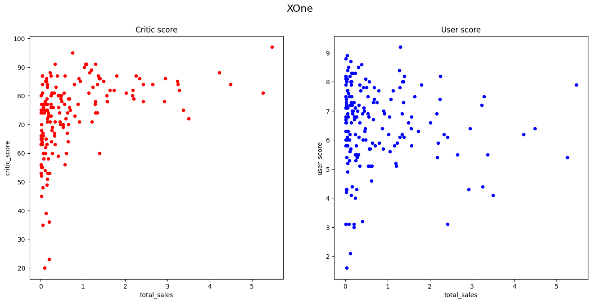
    


    Linear correlation between global sales of XOne games and:
    critic scores: (0.410422035612964, 4.3738158698172785e-08)
    user scores:   (-0.09400318326920858, 0.22976114469547787)
    
    Kendall tau rank correlation between global sales of XOne games and:
    critic scores: KendalltauResult(correlation=0.3551529946820283, pvalue=2.7145563040245512e-11)
    user scores:   KendalltauResult(correlation=-0.08461010053702987, pvalue=0.11170657204979378)
    ----------------------------------------------------------------------------------------------------
    


    
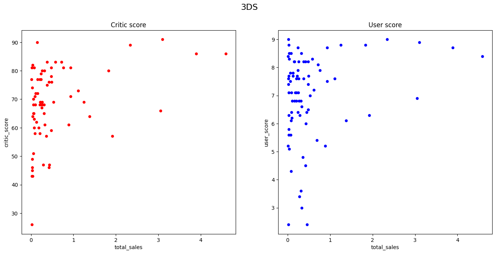
    


    Linear correlation between global sales of 3DS games and:
    critic scores: (0.3392349287853149, 0.004980440423044042)
    user scores:   (0.2729904366942444, 0.025410063508414984)
    
    Kendall tau rank correlation between global sales of 3DS games and:
    critic scores: KendalltauResult(correlation=0.2184979407540113, pvalue=0.01004205016609771)
    user scores:   KendalltauResult(correlation=0.1612603602310748, pvalue=0.05780204014733735)
    ----------------------------------------------------------------------------------------------------
    


    
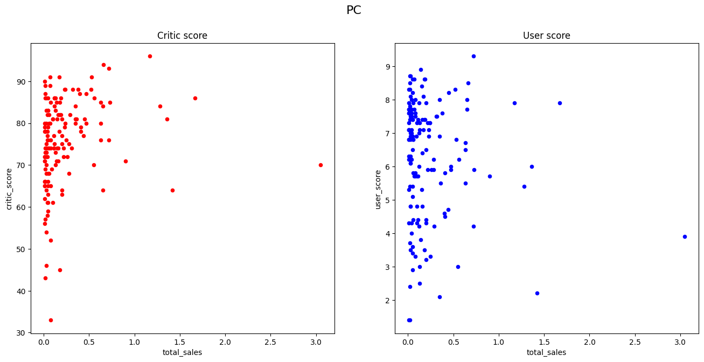
    


    Linear correlation between global sales of PC games and:
    critic scores: (0.19412407903472959, 0.018072346792683727)
    user scores:   (-0.10923502736171771, 0.18630398224594005)
    
    Kendall tau rank correlation between global sales of PC games and:
    critic scores: KendalltauResult(correlation=0.25373389979073424, pvalue=8.710075982102859e-06)
    user scores:   KendalltauResult(correlation=-0.07548763476755031, pvalue=0.18388643018188822)
    ----------------------------------------------------------------------------------------------------
    


    
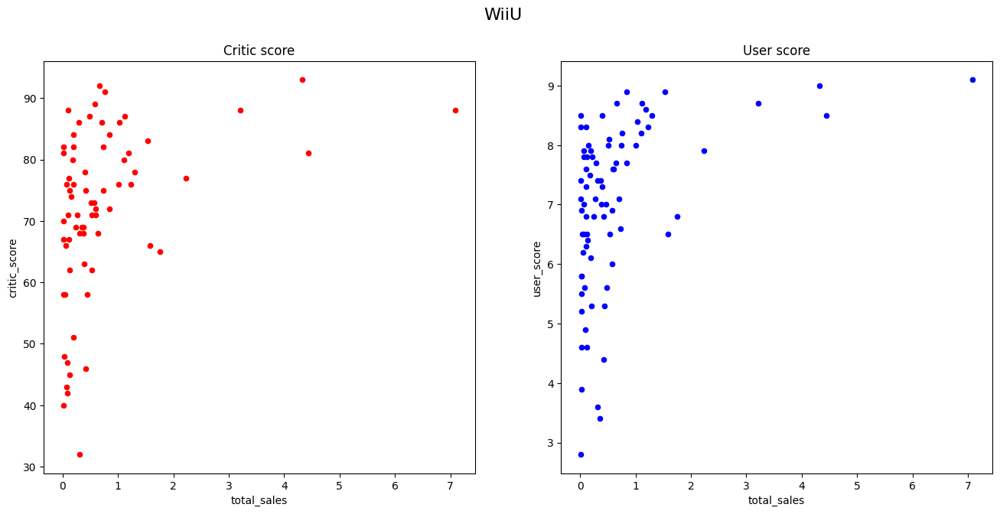
    


    Linear correlation between global sales of WiiU games and:
    critic scores: (0.37950449899784156, 0.0012997477531325797)
    user scores:   (0.408691743849265, 0.0004895555757857738)
    
    Kendall tau rank correlation between global sales of WiiU games and:
    critic scores: KendalltauResult(correlation=0.33564119496027606, pvalue=5.500005118111143e-05)
    user scores:   KendalltauResult(correlation=0.33766934633296686, pvalue=5.1248069916226306e-05)
    ----------------------------------------------------------------------------------------------------
    


    
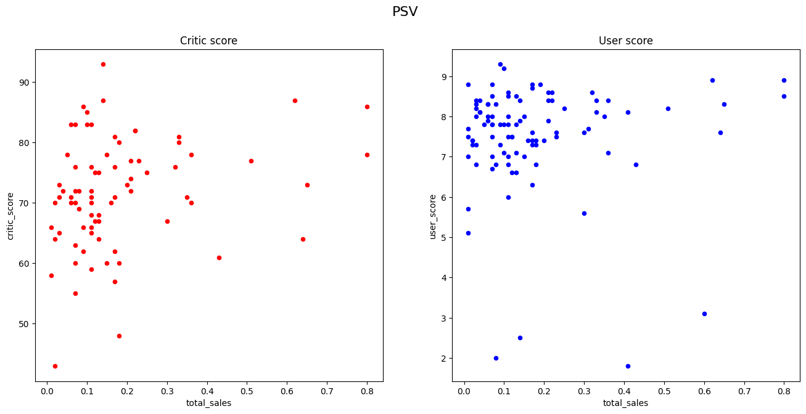
    


    Linear correlation between global sales of PSV games and:
    critic scores: (0.2540997021864077, 0.026762229361390933)
    user scores:   (0.2654782720509425, 0.020460904024005362)
    
    Kendall tau rank correlation between global sales of PSV games and:
    critic scores: KendalltauResult(correlation=0.18948137865868273, pvalue=0.01804677571206113)
    user scores:   KendalltauResult(correlation=0.13558467577363642, pvalue=0.09245369849097355)
    ----------------------------------------------------------------------------------------------------
    


Наши выводы в целом справедливы и для других пяти платформ, для которых в актуальном периоде выпускались игры. Ни для одной игры ни на одной платформе низкие оценки критиков не сопутствуют высоким продажами игр. Однако есть и некоторые различия. Например, для платформ Xbox One и Nintendo Wii коэффициент корреляции между оценками критиков и объемами продаж несколько выше. Правда, он все еще может быть проинтерпертирован как умеренно слабый. То есть использовать это наблюдение в прогностических целях невозможно.

Наконец, посмотрим на связь между глобальными продажами всех игр и оценками а) критиков, и б) игроков:


```python
fig = plt.figure(figsize=(16, 7))

ax1 = fig.add_subplot(1, 2, 1)
ax2 = fig.add_subplot(1, 2, 2)
ax1.set(title = 'Critic scores')
ax2.set(title = 'User scores') 

games_actual.plot(kind='scatter', x='total_sales', y='critic_score', color='Red', ax=ax1)
games_actual.plot(kind='scatter', x='total_sales', y='user_score', color='Blue', ax=ax2)
plt.show()
```


    
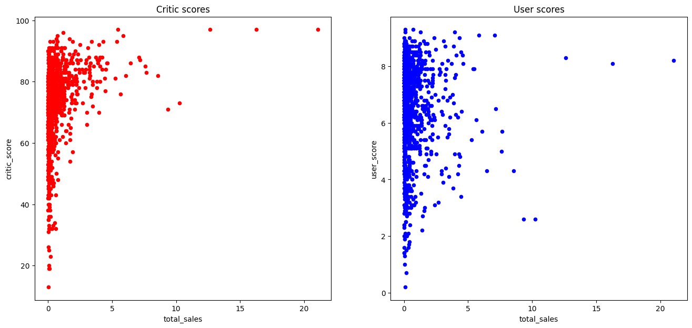
    


Если принять во внимание отдельные выбросы, благодаря которым масштаб графика по оси абсцисс уменьшился, картина остается примерно той же. Более того, благодаря этим выбросам должны, просто обязаны уменьшиться значения коэффициентов корреляции. Проверим! - гипотезу о наличии связи сопутствия между глобальными продажами игр для всех платформ 4 и оценками а) критиков и б) пользователей. Сформулируем нулевую и альтернативную гипотезы:

H0: Корреляционная связь между переменными отсутствует (коэффициент корреляции равен нулю).

H1: Корреляционная связь между переменными присутствует (коэффициент корреляции **НЕ** равен нулю).


```python
games_correlation = games_actual.dropna()
```


```python
print(f'Linear correlation between global game sales for all platforms and:')
print(
    'critic scores:',
    st.pearsonr(games_correlation['total_sales'], games_correlation['critic_score'])
    )
print(
    'user scores:  ',
    st.pearsonr(games_correlation['total_sales'], games_correlation['user_score'])
    )
print()
print(f'Kendall tau rank correlation between global game sales for all platforms and:')
print(
    'critic scores:',
    st.kendalltau(games_correlation['total_sales'], games_correlation['critic_score'])
    )
print(
    'user scores:  ',
    st.kendalltau(games_correlation['total_sales'], games_correlation['user_score'])
    )
```

    Linear correlation between global game sales for all platforms and:
    critic scores: (0.3116921831260647, 1.968374511573176e-23)
    user scores:   (-0.004063660293396351, 0.8991061039049489)
    
    Kendall tau rank correlation between global game sales for all platforms and:
    critic scores: KendalltauResult(correlation=0.2935304367276257, pvalue=1.7865070086613468e-41)
    user scores:   KendalltauResult(correlation=0.009073415631988926, pvalue=0.6762048418180856)


Во всех случаях (в том числе - для оценок пользователей) есть основания отвергнуть нулевую гипотезу об априорном отсутствии связи. То есть мы можем "доверять" значениям коэффициентов корреляции. Однако эти значения интепретируются однозначно: связь настолько слаба, что не имеет никакой объяснительной и прогностической силы.

Можно предположить, что виной всему влияние выбросов. Однако даже если убрать их - значения коэффициентов все еще не превышают 0.324 при уровне значимости с 19-м порядком в экспоненциальной записи (было проверено "за рамками" проекта).

Проводить MINE-анализ не будем, потому что оснований полагать, что он продемонстрирует наличие какой-то функциональной зависимости, еще меньше - что с выбросами, что без них.


```python
del games, platforms_alive, platforms_alive_actual, games_platform, games_correlation, platform
```

### Анализ общего распределения игр по жанрам

Повторим данные об этом распределении игр:


```python
# Series objects are needed to set a null name and get rid of it on the charts below
games_genre = pd.Series(games_actual['genre'].value_counts(), name='')
games_genre
```


    Action          766
    Role-Playing    292
    Adventure       245
    Sports          214
    Shooter         187
    Misc            155
    Racing           85
    Fighting         80
    Platform         74
    Simulation       62
    Strategy         56
    Puzzle           17
    Name: , dtype: Int64


Числа говорят сами за себя. А теперь проверим прибыльность соответствующих жанров:


```python
sales_genre = pd.Series(games_actual.groupby('genre')['total_sales'].sum().sort_values(ascending=False), name='')
sales_genre
```


    genre
    Action          321.87
    Shooter         232.98
    Sports          150.65
    Role-Playing    145.89
    Misc             62.82
    Platform         42.63
    Racing           39.89
    Fighting         35.31
    Adventure        23.64
    Simulation       21.76
    Strategy         10.08
    Puzzle            3.17
    Name: , dtype: float64


Представим распределения обоих наборов графически:


```python
fig = plt.figure(figsize=(16, 7))

ax1 = fig.add_subplot(1, 2, 1)
ax2 = fig.add_subplot(1, 2, 2)

ax1.set(title = 'Released games by genre')
ax2.set(title = 'Game sales by genre') 

games_genre.plot(kind='pie', ax=ax1)
sales_genre.plot(kind='pie', ax=ax2)
plt.show()
```


    
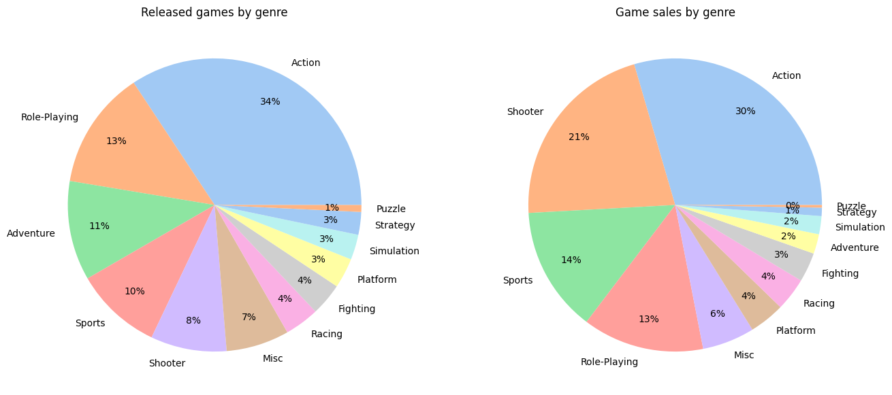
    


Интерактивные графики plotly доступны в [отдельном ноутбуке](https://github.com/idrv/portfolio-rus/tree/main/ComputerGamesFeaturesSalesConnection/ComputerGamesFeaturesSalesConnection_plotly.ipynb) в этом же репозитории.

За некоторыми исключениями жанровое распределение игр по прибыльности повторяет распределение игр по количеству выпущенных "тайтлов". Что вполне логично: чем больше спрос на тот или иной жанр, тем более производители стремятся его удовлетворить, что влечет за собой повышение вероятности появления в жанре "хитов" и, как следствие - высокие суммарные и средние продажи. При этом тройка наиболее прибыльных жанров - Action, Shooter и RPG, а тройка наименее прибыльных - Adventure, Strategy и Puzzle (все игры в каждой тройке перечислены в порядке убывания количества продаж).

Наконец, сделаем ещё один шаг и рассчитаем средний объем продаж одной игры в каждом жанре:


```python
genre_sales = pd.DataFrame(columns=['total_sales', 'quantity'])
genre_sales['total_sales'] = games_actual.groupby('genre')['total_sales'].sum()
genre_sales['quantity'] = games_actual.groupby('genre')['genre'].count()
genre_sales['ratio'] = genre_sales['total_sales'] / genre_sales['quantity']
genre_sales['ratio'].sort_values(ascending=False)
```


    genre
    Shooter         1.245882
    Sports          0.703972
    Platform        0.576081
    Role-Playing    0.499623
    Racing          0.469294
    Fighting        0.441375
    Action          0.420196
    Misc            0.405290
    Simulation      0.350968
    Puzzle          0.186471
    Strategy        0.180000
    Adventure       0.096490
    Name: ratio, dtype: float64


Отразим соотношение долей графически:


```python
plt.figure(figsize=(16,4))
genre_sales['ratio'].sort_values(ascending=False).plot(kind='bar')
plt.title('Game sales to released games quantity ratio')
plt.show
```


    <function matplotlib.pyplot.show(close=None, block=None)>


    
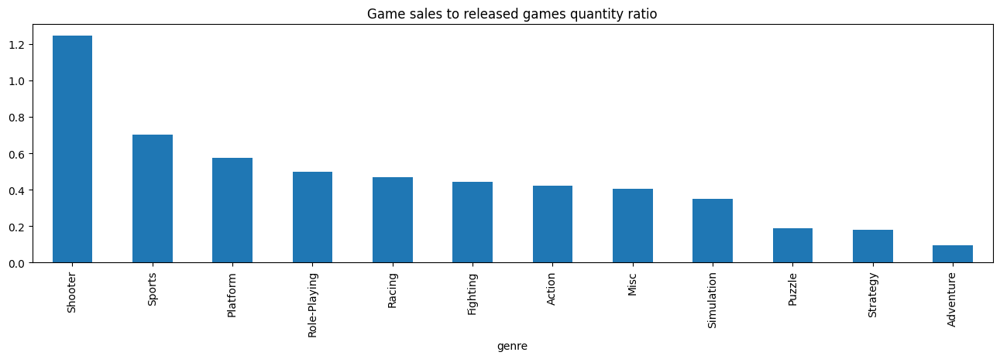
    


Очевидно, наибольшей "удельной прибыльностью" обладают игры в жанре Shooter, вслед за ними идут далее спортивные игры, так называемые "платформеры", затем - RPG. Наконец, замыкают пятёрку лидеров т.н."гонки".


```python
for genre in list(games_actual['genre'].unique()):
    fig = plt.figure(figsize=(16,1))
    ax = plt.axes()
    ax.set_xlim([0, 23])

    games_genre = pd.Series(games_actual[games_actual['genre'] == genre]['total_sales'], name='')
    games_genre.plot(kind='box', vert=False, ax=ax, showmeans=True)
    ax.set_ylabel(genre)
    plt.show()
```


    
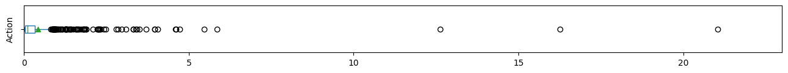
    


    
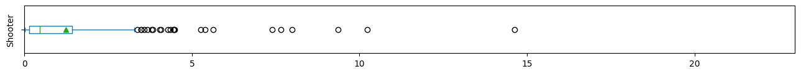
    


    
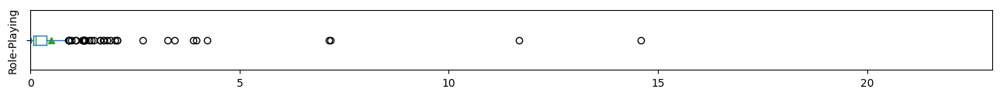
    


    
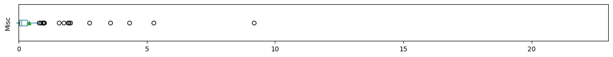
    


    
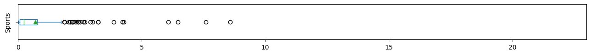
    


    
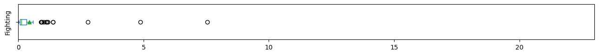
    


    
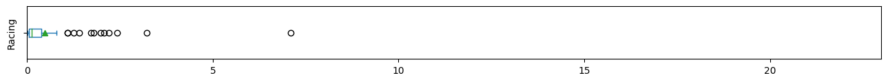
    


    
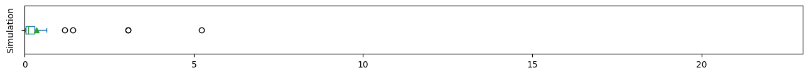
    


    
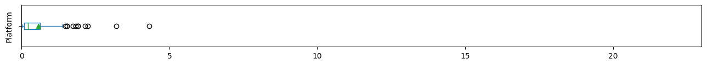
    


    
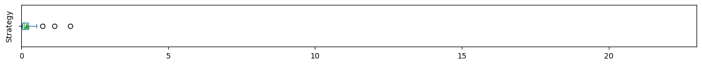
    


    
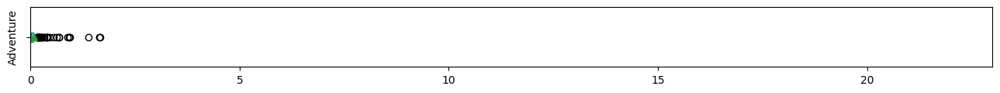
    


    
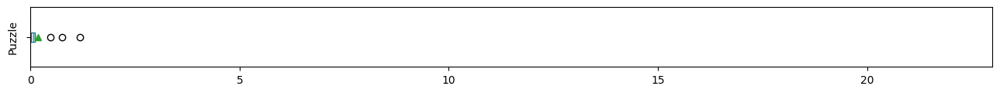
    


Построим тот же самый набор с "обрезанными" выбросами. Граница в 3,5 млн проданных копий подобрана так, чтобы полностью вместить диаграмму размаха жанра-лидера, но исключить все его выбросы:


```python
for genre in list(games_actual['genre'].unique()):
    fig = plt.figure(figsize=(16,1))
    ax = plt.axes()
    ax.set_xlim([0, 3.5])
    games_genre = pd.Series(games_actual[games_actual['genre'] == genre]['total_sales'], name='')
    games_genre.plot(kind='box', vert=False, ax=ax, showmeans=True)
    ax.set_ylabel(genre)
    plt.show()
```


    
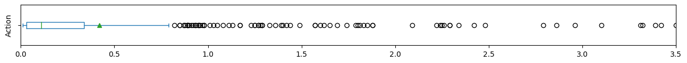
    


    
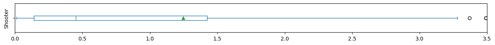
    


    
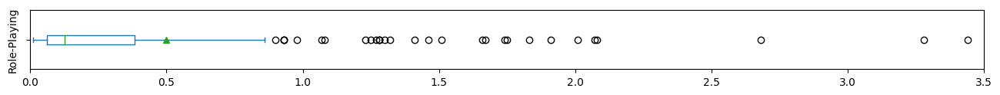
    


    
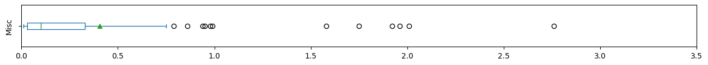
    


    
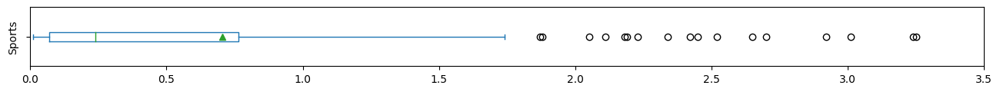
    


    
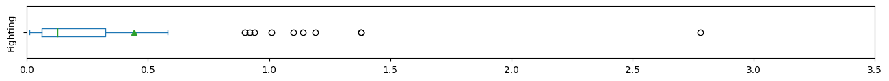
    


    
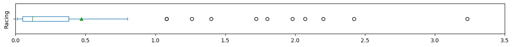
    


    
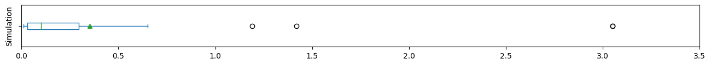
    


    
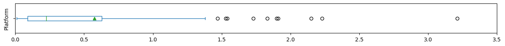
    


    
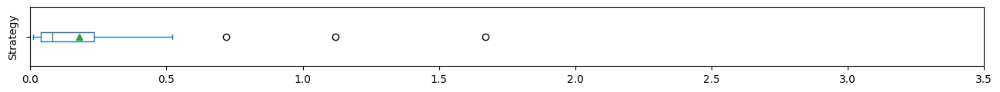
    


    
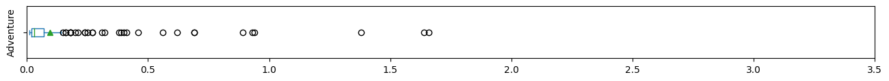
    


    
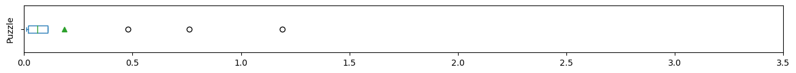
    


Несмотря на то, что из-за отдельных выбросов суммарные продажи выше у игр жанра Action, прибыльность игр жанра Shooter имеет больший размах, - то есть большее количество в целом имееть большие продажи. А значит, вероятность игры этого жанра иметь большие продажи выше, чем у игр иного жанра.


```python
del sales_by_platform, platforms_lifespan, games_genre, sales_genre, genre_sales, genre, ax1, ax2
```

## Портрет пользователя каждого региона (NA, EU, JP)

Сравним продажи в макрорегионах для тех платформ, жанров и рейтингов ESRB, игры для которых продавались в актуальном периоде наблюдения (2012-2016 году):

Определим аналитическую функцию, которой далее придется воспользоваться трижды:


```python
regions = {'North America': 'na_sales', 'Europe': 'eu_sales', 'Japan': 'jp_sales'}
```


```python
def user_profile(parameter, chart_title="Define the chart title!"):
    '''
    The function sums game sales by a user-defined parameter for every region.
    It takes two arguments:
    1. parameter: column's name as a string (e.g. 'column').
    2. chart_title: a user-defined chart title as a string.
    The function returns three pie charts, one for each region.
    '''
    pivot = games_actual.pivot_table(values=['na_sales', 'eu_sales', 'jp_sales'], index=parameter, aggfunc='sum')

    fig = plt.figure(figsize = (18,6))
    n=1
    for region, sales in regions.items():
        pivot_sales = pd.Series(pivot[sales], name='').sort_values(ascending=False)
        # saving first 5 rows to a new Series object
        pivot_sales_proc = pivot_sales[:5]
        # finding a sum of the rest of the rows and saving it to the 6th row of the Series
        pivot_sales_proc.loc[5] = pivot_sales[5:].sum()
        # changing the 6th row's index to 'Others'
        pivot_sales_proc = pivot_sales_proc.rename(index={5:'Others'})
        ax = fig.add_subplot(1, 3, n)
        ax.set(title=region)
        pivot_sales_proc.plot(kind='pie', ax=ax)
        n += 1
    plt.show()
```

### Платформы, наиболее популярные в каждом регионе

Определим список из пяти самых популярных платформ в каждом регионе по объемам продаж:


```python
user_profile('platform', 'Game sales by platforms')
```


    
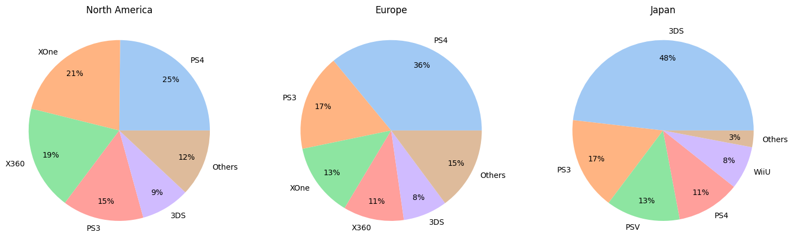
    


Цифры намекают, что в североамериканском макрорегионе продается несколько больше игр, чем в Европе, а продажи в Японии уступают каждому из двух ранее упомянутых регионов. Однако разрыв между первой и второй платформами по объемам продаж в Северной Америке не так велик, как в Европе. Одновременно тройка платформ-лидеров по продажам в Северной Америке и Европе одинакова по составу (но не по рангам!). С Японией она совпадает только по PlayStation 3. Там в тройке лидеров всего одна "полноформатная" консоль (всё та же PlayStation 3), а более половины продаж в актальном периоде 2012-2016 гг. суммарно занимали игры для портативных приставок Nintendo 3DS и PlayStation Vita. И хотя в Америке и Европе Nintendo 3DS также присутствует в пятерке лидеров по продажам, доли и её, и других портативных консоли довольно малы.

### Жанры, наиболее популярные в каждом регионе


```python
user_profile('genre', 'Game sales by genre')
```


    
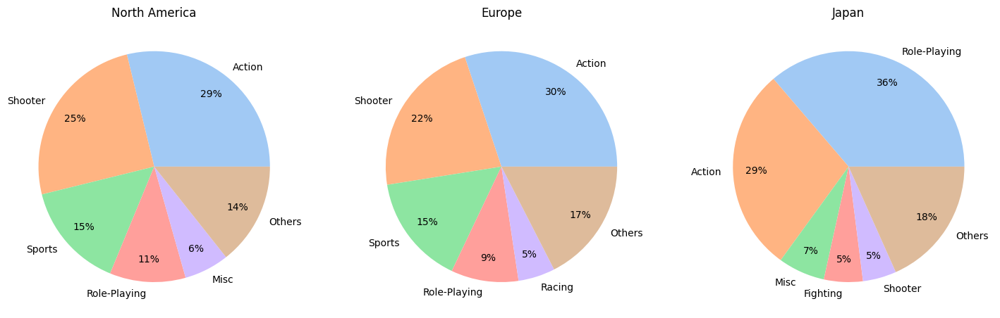
    


Распределение наиболее популярных жанров в Северной Америке и Европе довольно похоже. В четверке лидеров одни и те же жанры: Shooter, спортивные игры, Action, RPG. Первое и четвертое "места" совпадают, несколько меняются лишь доли и пропорции. Эта картина несколько отличается для Японии. Лидер тот же – игры жанра Action. Однако второй по популярности жанр – RPG. Эти два лидера вместе удерживают две трети от общего объема продаж. Вновь повторим: термин JRPG появился не просто так, он демонстрирует высокую популярность жанра в Японии и его некоторую локальную специфику.

### Влияние рейтингов ESRB на продажи в каждом регионе


```python
user_profile('rating', 'Game sales by ESRB ratings')
```


    
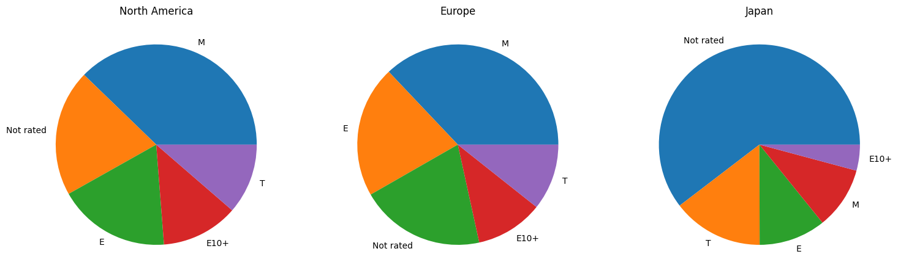
    


Прежде всего, отметим разные доли игр, не получивших рейтинга ESRB. Строго говоря, процедура получения рейтинга является добровольной: разработчики и издатели игр не обязаны обращаться в ESRB. Де-факто требование иметь рейтинг ESRB выдвигают многие крупные издатели и сбытовые сети (они таким образом предупреждают собственные юридические риски). Если разработчик/издатель распространяет игру через собственные каналы, либо если игра изначально не предназначалсь для северамериканского рынка - она может не иметь рейтинга.

Именно этот нюанс отражается в значительной доле нерейтингованных (Not Rated) игр. И именно поэтому в Японии эта доля столь велика: многие японские игры (особенно для мобильных платформ) предназначаются только для внутреннего рынка и часто даже не имеют официальных языковых локализаций.

В целом для Северной Америки и Европы распределение объемов продаж игр по рейтингам очень похоже. В Японии атмосфера несколько иная. Во-первых, ЗНАЧИТЕЛЬНО больше доля нерейтингованных игр в продажах. Среди рейтингованных игр распределение долей также значительно отличается, - игр с рейтингом M продано даже несколько меньше, чем игр с другими рейтингами. Это не значит, что японцы не играют в такие игры (доля таких игр среди нерейтингованных может быть весьма значительной). Это лишь значит, что у нас нет информации о японском рынке, и любые прогнозы относительно него менее обоснованы.


```python
del regions
```

### Портрет пользователя

Итак, пользователь из Северной Америки в начале 2017 г., скорее всего, играет в Xbox 360 либо PlayStation (4 либо 3) в игры жанра Action, Shooter или Sports с рейтингом M либо E (все данные - в порядке убывания вероятности).

Пользователь из Европы в начале 2017 г., вероятнее всего, играет PlayStation (4 либо 3) либо Xbox 360 в игры жанра Action, Shooter или Sports с рейтингом M либо E (все данные - в порядке убывания вероятности).

Наконец, пользователь из Японии в начале 2017 г. вероятнее отдает предпочтение портативным консолям 3DS или PlayStation 3 (менее вероятно - консоли PlayStation Vita), на которых он играет в игры жанра RPG, Action, либо собирательному жанру Misc, причем игры, вероятнее всего, не имеют рейтинга ESRB.

## Проверка гипотез

Проверим гипотезы о равенстве средних значений в каждом из двух наборов выборок:
- выборок игр для платформ а) Xbox One и б) PC;
- выборок игр жанров а) Action и б) Sports.

В обоих случаях минимальным объектом каждой выборки является одна игра. Именно такой объект обладает параметрами "пользовательский рейтинг" и "жанр".


### Исследовательская гипотеза №1: "Средние пользовательские рейтинги платформ Xbox One и PC одинаковы".

H0: отсутствуют статистически значимые различия между средними значениями пользовательских рейтингов двух платформ.

H1: существуют статистически значимые различия между средними значениями пользовательских рейтингов двух платформ. Иная формулировка с тем же смыслом: различия между средними значениями пользовательских рейтингов двух платформ статистически значимы.

Строго говоря, использование t-критерия Стьюдента для задачи сравнения средних требует их нормального распределения. Проведем графический анализ квантилей распределения обеих выборок. Для этого (и анализа различий средних) необходимо сначала удалить отсутсвующие значения:


```python
xbox_score = games_actual[games_actual['platform'] == 'XOne']['user_score'].dropna()
pc_score = games_actual[games_actual['platform'] == 'PC']['user_score'].dropna()
```


```python
fig, ax = plt.subplots(figsize=(6, 6))
sm.qqplot(xbox_score, line='45', ax=ax)
sm.qqplot(pc_score, line='45', ax=ax)
plt.show()
```


    
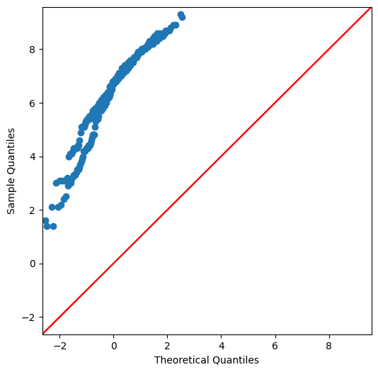
    


Нет необходимости даже различать две диаграммы рассеивания между собой. Они настолько далеки от центральной диагонали, что вывод о типе распределения обоих рядов данных однозначен: это не нормальное распределение.

Однако замечания относительно применения альтернативных непараметрических критериев (Манна-Уитни, Краскелла-Уоллиса) "в один голос" говорят, что для выборок объемом больше 25-30 наблюдений значения тестовых статистик этих критериев все более апроксимируют нормальное распределение. Ну а поскольку мы считаем не вручную, - не вижу, почему благородным дон(н)ам не опробовать все три варианта (t-критерий Стьюдента, U-критерий манна-Уитни, H-критерий Краскелла-Уоллиса) и сравнить результаты:


```python
score_mean_comparison = st.ttest_ind(xbox_score, pc_score, equal_var=False)
print('t-test p-value              :', score_mean_comparison.pvalue)
score_mean_comparison = st.mannwhitneyu(xbox_score, pc_score)
print('Mann-Whitney test p-value   :', score_mean_comparison.pvalue)
score_mean_comparison = st.kruskal(xbox_score, pc_score)
print('Kruskal-Wallis test p-value :', score_mean_comparison.pvalue)
```

    t-test p-value              : 0.14759594013430463
    Mann-Whitney test p-value   : 0.5011006734622374
    Kruskal-Wallis test p-value : 0.5007437159532551


Полученные значения уровня значимости заведомо больше и широко принятых .05 и .01, и более строгого .005. Вне зависимости от используемого критерия мы не можем отвергнуть нулевую гипотезу. Значит - есть основания полагать, что статистически значимые различия между средними значениями двух выборок - отсутствуют.

Пойдем на один шаг дальше и проверим еще одно предположение: о равенстве диперсий этих выборок.

В случае нормальности распределения для этого можно было бы использовать F-тест Фишера, однако он считается **очень** чувствительным к нормальности распределения данных (что не является нашим случаем). Поэтому используем два непараметрических критерия: критерий Ансари-Брэдли и критерий Колмогорова-Смирнова для двух выборок.

Исследовательская гипотеза №1а: "Диперсии пользовательских рейтингов платформ Xbox One и PC одинаковы".

H0: отсутствуют статистически значимые различия между дисперсиями значений пользовательских рейтингов двух платформ.

H1: существуют статистически значимые различия между дисперсиями значений пользовательских рейтингов двух платформ. Иная формулировка с тем же смыслом: различия между дисперсиями значений пользовательских рейтингов двух платформ статистически значимы.


```python
score_dispersion_comparison = st.ansari(xbox_score, pc_score)
print('Ansari-Bradley test p-value     :', score_mean_comparison.pvalue)
score_dispersion_comparison = st.ks_2samp(xbox_score, pc_score)
print('Kolmogorov-Smirnov test p-value :', score_mean_comparison.pvalue)
```

    Ansari-Bradley test p-value     : 0.5007437159532551
    Kolmogorov-Smirnov test p-value : 0.5007437159532551


Вновь полученные значения уровня значимости заведомо больше и широко принятых .05 и .01, и более строгого .005. Вне зависимости от используемого критерия мы не можем отвергнуть нулевую гипотезу об отсутствии статистически значимых различий между дисперсиями двух выборок.

Итог: исследовательская гипотеза подтверждена.


```python
del xbox_score, pc_score
```

### Исследовательская гипотеза №2: "Средние пользовательские рейтинги жанров Action и Sports различаются".

Проделаем все те же шаги:
1. Проверим нормальность распределения соответствующих данных.
2. Сравним выборочные средние.
3. Сравним выборочные дисперсии.

H0: отсутствуют статистически значимые различия между средними значениями пользовательских рейтингов двух жанров.

H1: существуют статистически значимые различия между средними значениями пользовательских рейтингов двух жанров. Иная формулировка с тем же смыслом: различия между средними значениями пользовательских рейтингов двух жанров статистически значимы.

Исследовательская гипотеза №2а: "Дисперсии пользовательских рейтингов жанров Action и Sports различаются".

H0: отсутствуют статистически значимые различия между дисперсиями значений пользовательских рейтингов двух жанров.

H1: существуют статистически значимые различия между дисперсиями значений пользовательских рейтингов двух жанров. Иная формулировка с тем же смыслом: различия между дисперсиями значений пользовательских рейтингов двух жанров статистически значимы.


```python
action_score = games_actual[games_actual['genre'] == 'Action']['user_score'].dropna()
sports_score = games_actual[games_actual['genre'] == 'Sports']['user_score'].dropna()
```


```python
fig, ax = plt.subplots(figsize=(6, 6))
sm.qqplot(action_score, line='45', ax=ax)
sm.qqplot(sports_score, line='45', ax=ax)
plt.show()
```


    
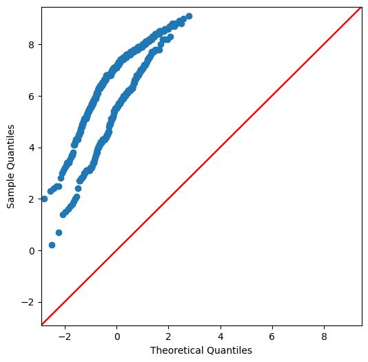
    


Распределение обоих наборов данных значимо отличается от нормального.


```python
score_mean_comparison = st.ttest_ind(action_score, sports_score, equal_var=False)
print('t-test p-value              :', score_mean_comparison.pvalue)
score_mean_comparison = st.mannwhitneyu(action_score, sports_score)
print('Mann-Whitney test p-value   :', score_mean_comparison.pvalue)
score_mean_comparison = st.kruskal(action_score, sports_score)
print('Kruskal-Wallis test p-value :', score_mean_comparison.pvalue)
```

    t-test p-value              : 1.4460039700704315e-20
    Mann-Whitney test p-value   : 1.5189170584819927e-23
    Kruskal-Wallis test p-value : 1.5143813972935495e-23


```python
score_dispersion_comparison = st.ansari(action_score, sports_score)
print('Ansari-Bradley test p-value     :', score_mean_comparison.pvalue)
score_dispersion_comparison = st.ks_2samp(action_score, sports_score)
print('Kolmogorov-Smirnov test p-value :', score_mean_comparison.pvalue)
```

    Ansari-Bradley test p-value     : 1.5143813972935495e-23
    Kolmogorov-Smirnov test p-value : 1.5143813972935495e-23


А вот в этом случае у нас есть статистические доводы в пользу возможности отвергнуть нулевую гипотезу об отсутствии различий между двумя выборками и по выборочным средним, и по выборочной дисперсии, в пользу соответствующих альтернативных гипотез: полученные значения уровня значимости заведомо больше и широко принятых .05 и .01, и более строгого .005.

Иными словами, есть основания полагать, что в актуальном периоде 2012-2016 гг. сущетсвуют различия между и средними значениями пользовательских рейтингов жанров Action и Sports, и между дисперсиями этих выборок.

Исследовательская гипотеза подтверждена.


```python
del action_score, sports_score, score_mean_comparison, score_dispersion_comparison
```

### Выводы по результатам проверки гипотез

Обе исследовательские гипотезы подтверждены. Средние пользовательские рейтинги (и их дисперсии) для платформ Xbox One и PC не имеют статистически значимых различий. Средние пользовательские рейтинги для жанров Action и Sports статистически значимо различаются; также статистически значимо различаются выборочные дисперсии значений этих типов рейтингов.

Проиллюстрируем выводы, - и текстуально, и графически, с помощью диаграмм размаха: 


```python
for platform in ['XOne', 'PC']:
    fig = plt.figure(figsize=(16,1))
    ax = plt.axes()
    data = pd.Series(games_actual[games_actual['platform'] == platform]['user_score'], name='')
    data.plot(kind='box', vert=False, ax=ax, showmeans=True)
    ax.set_ylabel(platform)
    plt.show()
    print(f"Mean user score for {platform}         : {data.mean()}")
    print(f"User score st.deviation for {platform} : {data.std()}")
    print()
```


    
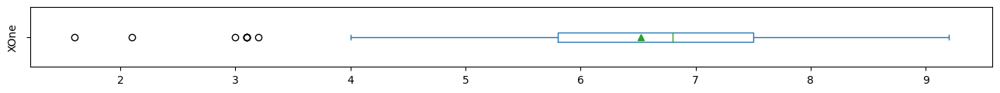
    


    Mean user score for XOne         : 6.521428571428572
    User score st.deviation for XOne : 1.380940564592144
    


    
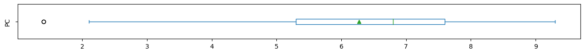
    


    Mean user score for PC         : 6.269677419354839
    User score st.deviation for PC : 1.7423813452883616
    


Как мы видим, значения среднего арифметического (особенно) и среднеквадратического отклонения для анализируемых платформ мало отличаются.

Хотя диаграмма размаха оперирует иными мерами центральной тенденции, - медианы и межквартильного размаха, общая картина также довольно наглядна. Медианы, границы квартилей и границы 1,5 межквартильного размаха, безусловно несколько отличаются, но не настолько, чтобы предполагать значительную разницу между платформами.


```python
for genre in ['Action', 'Sports']:
    fig = plt.figure(figsize=(16,1))
    ax = plt.axes()
    data = pd.Series(games_actual[games_actual['genre'] == genre]['user_score'], name='')
    data.plot(kind='box', vert=False, ax=ax, showmeans=True)
    ax.set_ylabel(genre)
    plt.show()
    print(f"Mean user score for {genre}         : {data.mean()}")
    print(f"User score st.deviation for {genre} : {data.std()}")
    print()
```


    
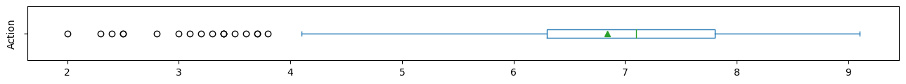
    


    Mean user score for Action         : 6.837532133676093
    User score st.deviation for Action : 1.3301732609883083
    


    
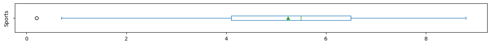
    


    Mean user score for Sports         : 5.238124999999999
    User score st.deviation for Sports : 1.7834272663793747
    


Отличия для двух жанров несколько заметнее. Значения среднего арифметического для анализируемых жанров сильно отличаются (различие значений среднеквадратического отклонения несколько меньше, однако статистические критерии указывают на их статистическую значимость).

На диаграммах размаха также заметна разница в значениях медиан и границ квартилей.


```python
del games_actual, platform, genre, data, fig, ax
```

## Общий вывод

**Исследовательские выводы**

В ходе исследования были определены наиболее перспективные с коммерческой точки зрения платформы. В краткосрочной перспективе таковыми на "последнюю дату" датасета являлись так называемые "консоли" – Xbox One и PlayStation 4. В долгосрочной перспективе и при низких издержках на портирование игр также имеет смысл учитывать платформу PC: несмотря на низкие относительно других платформ объемы продаж, это платформа имеет наибольшую продолжительность жизни и один из наиболее равномерных трендов глобальных продаж выпущенных игр.

Если использовать инвестиционную метафору, консоли – высокорисковый актив с ограниченным сроком жизни, обещающий высокие прибыли, если для инвестирования выбран удачный момент. PC – долгосрочный низкорисковый актив для консервативной инвестиционой стратегии, не сулящий высоких прибылей, однако остающийся "на плаву" на конец периода анализа уже 26 лет.

Второй важный компонент коммерческой привлекательности - "срок жизни" платформы, который по результатам анализа в среднем составляет 7-7,5 лет. 
Хорошей иллюстрацией важности этого компонента является кейс т.н. мобильных (portable) платформ. Если основываться только на результатах анализа объемов продаж, хорошим претендентом на выпуск игр для них была бы платформа Nintendo 3DS. Однако вскоре после окончания периода анализа, в феврале 2017 г., Nintendo представила свою следующую разработку, Nintendo Switch. На момент формирования датасета "длительность жизни" платформы Nintendo 3DS, анонсированной в 2011 г., как раз подходила к критическим значениям. Основываясь только на данных продаж и ориентируя разработку своих игр только на Nintendo 3DS, мы упустили бы нового "фаворита" рынка портативных консолей.

Оценки критиков и пользователей не являются надёжным индикатором для прогнозирования продаж, поскольку отсутствует прямая связь между высокими оценками и высокими продажами. Однако справедливо иное утверждение: низкие оценки критиков и пользователей сопутствует низким продажам игр. Поэтому если есть основания предполагать отсутствие высоких оценок (например, по результатам фокус-групп), эти основания стоит принимать во внимание.

Этот феномен связан с простым соображением о том, что "не все платформы одинаково полезны" с коммерческой точки зрения. Точнее, игры, выпущенные под разные платформы, могут получать разные пользовательские оценки пользователей и критиков. Причём это разница статистически значима. Вероятно это связано с наличием т.н. "эксклюзивов", – игр, выпускаемых исключительно для одной платформы. Этот маркетинговый ход направлен на увеличение продаж конкретной платформы. Необходимо понимать, что статус "эксклюзива" сам по себе не гарантирует высоких продаж даже при высоких оценках пользователей и критиков. Если репутационная выгода и косвенные доходы (например, от производителя платформы) превышают ожидаемую упущенную выгоду из-за выпадающих доходов от продаж, разработчику или издателю игр можно рекомендовать стремится получить статус игры-эксклюзива. В противном случае мультиплатформенность выглядит выгоднее с точки зения увеличения объемов продаж.

Наибольшие глобальные продажи демонстрируют три жанра: Action, Sports и Shooter. Однако при ориентации на эти жанры необходимо помнить, что в них очень велика конкуренция: они являются лидерами не только по объему продажи, но и по количеству выпущенных игр.

Если же разработчик или издатель игр хочет ориентироваться на теоретические перспективы прибыльности, необходимо обратить внимание и на "удельную прибыльность" игр в каждом жанре. Здесь распределение лидеров выглядит иначе. Поскольку фактор конкурентной борьбы становится менее значимым, наиболее привлекательными с точки зрения этой удельный прибыльности в глобальных продажах являются в порядке убывания жанры Shooter, "Платформер" (Platform), спортивные игры (Sports).

Наконец, уместно принимать во внимание конкретный рынок, на который может быть ориентирована игра. Это влияет в первую очередь на выбор платформы, на которую можно ориентироваться разработчикам и издателям игр. При ориентации на рынок Северной Америки перспективно выглядят игры для Xbox One либо PlayStation 4 жанров Shooter, Action или Sports. Для европейского рынка уместнее игры для PlayStation 4 либо Xbox One жанров Shooter, Sports или Action. Пользователи из Японии вероятнее отдадут предпочтение играм для портативных платформ жанров Action, RPG либо Adventure.

---
**Коммерческие рекомендации**

В актуальный период с 2012 по 2016 гг. наибольшие продажи демонстрировал северамериканский регион. Лидером по продажам была платформа Xbox 360, однако она подходит к верхней границе своего "жизненного цикла". Следующими по объемам продаж идут платформы Xbox One и PlayStation 4, их "жизненный цикл" еще не исчерпан.

С точки зрения "удельной прибыльности" выпущенных игр наиболее многообещающе выглядит жанр Shooter. В отношении рейтинга игры можно не беспокоиться - если игра достаточно "брутальна", чтобы иметь рейтинг M, это не обязано сказаться на её продажах. Игры именно этого рейтинга имеют самые высокие продажи в североамериканском макрорегионе.
