# Проект "Исследование объявлений о продаже квартир"

У нас есть доступ к данным сервиса Яндекс.Недвижимость — архиву объявлений о продаже квартир в Санкт-Петербурге и соседних населённых пунктах за несколько лет. Ключевая бизнес-задача - научиться определять рыночную стоимость объектов недвижимости. На основе этих изысканий в будущем возможно построить автоматизированную систему, которая будет позволять отслеживать аномалии и мошенническую деятельность.
По каждой квартире на продажу доступны два вида данных. Первые вписаны пользователем, вторые — получены автоматически на основе картографических данных. Например, расстояние до центра, аэропорта, ближайшего парка и водоёма.

**Цель проекта** сформулируем так: установить состояние ключевых параметров, определяющих рыночную стоимость жилья.

Определим план работ:
1. Провести предварительный анализ данных.
2. Провести предобработку данных:
    - обнаружить осутствующие значения;
    - предположить возможные причины пропуска данных;
    - заполнить пропуски там, где это необходимо;
    - определить столбцы, в которых требуется изменение типа данных;
    - выявить в данных выбросы и редкие значения; 
    - вычислить ряд параметров, описывающих недвижимость;
3. Провести корреляционный анализ данных, графический анализ тенденций.
4. Сформулировать выводы относительно исследовательских вопросов.

Предварительное описание данных:

- `'airports_nearest'` — расстояние до ближайшего аэропорта в метрах (м)
- `'balcony'` — число балконов
- `'ceiling_height'` — высота потолков (м)
- `'cityCenters_nearest'` — расстояние до центра города (м)
- `'days_exposition'` — сколько дней было размещено объявление (от публикации до снятия)
- `'first_day_exposition'` — дата публикации
- `'floor'` — этаж
- `'floors_total'` — всего этажей в доме
- `'is_apartment'` — апартаменты (булев тип)
- `'kitchen_area'` — площадь кухни в квадратных метрах (м²)
- `'last_price'` — цена на момент снятия с публикации
- `'living_area'` — жилая площадь в квадратных метрах (м²)
- `'locality_name'` — название населённого пункта
- `'open_plan'` — свободная планировка (булев тип)
- `'parks_around3000'` — число парков в радиусе 3 км
- `'parks_nearest'` — расстояние до ближайшего парка (м)
- `'ponds_around3000'` — число водоёмов в радиусе 3 км
- `'ponds_nearest'` — расстояние до ближайшего водоёма (м)
- `'rooms'` — число комнат
- `'studio'` — квартира-студия (булев тип)
- `'total_area'` — площадь квартиры в квадратных метрах (м²)
- `'total_images'` — число фотографий квартиры в объявлении

## Данные: первый взгляд

### Загрузка данных

Установим и импортируем необходимые библиотеки и классы:


```python
!pip install -q phik
!pip install -q skimpy
!pip install -q pymystem3
```


```python
import pandas as pd
import matplotlib.pyplot as plt

import phik
from phik.report import plot_correlation_matrix
from phik import report

from seaborn import heatmap

from skimpy import clean_columns

from statsmodels.tsa.seasonal import seasonal_decompose

from pymystem3 import Mystem
```

Загрузим датасет. Предварительно взглянув на него, мы знаем, что в качестве разделителей в нем используется табуляция. Отсюда - такое значение параметра `sep`.

Для упрощения сохраним все возможные пути для загрузки и сохранения файлов:


```python
path1 = '/datasets/'
path2 = '/Users/idrv/Yandex.Disk.localized/2022-Ya.Practicum/datasets/'
path3 = '/content/drive/MyDrive/Colab Notebooks/datasets/'
dataset_name = 'real_estate_data.csv'
```

Загрузим датасет в датафрейм:


```python
try:
    realty = pd.read_csv(path1 + dataset_name, sep='\t')
except FileNotFoundError:
    try:
        realty = pd.read_csv(path2 + dataset_name, sep='\t')
    except FileNotFoundError:
        try:
            from google.colab import drive
            drive.mount('/content/drive')
            realty = pd.read_csv(path3 + dataset_name, sep='\t')
        except FileNotFoundError:
            print('File not found. Please, check the path!')
```


```python
del path1, path2, path3, dataset_name
```

### Структура данных

Изучим структуру датасета методом `info()` и выведем его первые пять строк:


```python
realty.info()
realty.head(5)
```

    <class 'pandas.core.frame.DataFrame'>
    RangeIndex: 23699 entries, 0 to 23698
    Data columns (total 22 columns):
     #   Column                Non-Null Count  Dtype  
    ---  ------                --------------  -----  
     0   total_images          23699 non-null  int64  
     1   last_price            23699 non-null  float64
     2   total_area            23699 non-null  float64
     3   first_day_exposition  23699 non-null  object 
     4   rooms                 23699 non-null  int64  
     5   ceiling_height        14504 non-null  float64
     6   floors_total          23613 non-null  float64
     7   living_area           21796 non-null  float64
     8   floor                 23699 non-null  int64  
     9   is_apartment          2775 non-null   object 
     10  studio                23699 non-null  bool   
     11  open_plan             23699 non-null  bool   
     12  kitchen_area          21421 non-null  float64
     13  balcony               12180 non-null  float64
     14  locality_name         23650 non-null  object 
     15  airports_nearest      18157 non-null  float64
     16  cityCenters_nearest   18180 non-null  float64
     17  parks_around3000      18181 non-null  float64
     18  parks_nearest         8079 non-null   float64
     19  ponds_around3000      18181 non-null  float64
     20  ponds_nearest         9110 non-null   float64
     21  days_exposition       20518 non-null  float64
    dtypes: bool(2), float64(14), int64(3), object(3)
    memory usage: 3.7+ MB


<div>
<table border="1" class="dataframe">
  <thead>
    <tr style="text-align: right;">
      <th></th>
      <th>total_images</th>
      <th>last_price</th>
      <th>total_area</th>
      <th>first_day_exposition</th>
      <th>rooms</th>
      <th>ceiling_height</th>
      <th>floors_total</th>
      <th>living_area</th>
      <th>floor</th>
      <th>is_apartment</th>
      <th>...</th>
      <th>kitchen_area</th>
      <th>balcony</th>
      <th>locality_name</th>
      <th>airports_nearest</th>
      <th>cityCenters_nearest</th>
      <th>parks_around3000</th>
      <th>parks_nearest</th>
      <th>ponds_around3000</th>
      <th>ponds_nearest</th>
      <th>days_exposition</th>
    </tr>
  </thead>
  <tbody>
    <tr>
      <th>0</th>
      <td>20</td>
      <td>13000000.0</td>
      <td>108.0</td>
      <td>2019-03-07T00:00:00</td>
      <td>3</td>
      <td>2.70</td>
      <td>16.0</td>
      <td>51.0</td>
      <td>8</td>
      <td>NaN</td>
      <td>...</td>
      <td>25.0</td>
      <td>NaN</td>
      <td>Санкт-Петербург</td>
      <td>18863.0</td>
      <td>16028.0</td>
      <td>1.0</td>
      <td>482.0</td>
      <td>2.0</td>
      <td>755.0</td>
      <td>NaN</td>
    </tr>
    <tr>
      <th>1</th>
      <td>7</td>
      <td>3350000.0</td>
      <td>40.4</td>
      <td>2018-12-04T00:00:00</td>
      <td>1</td>
      <td>NaN</td>
      <td>11.0</td>
      <td>18.6</td>
      <td>1</td>
      <td>NaN</td>
      <td>...</td>
      <td>11.0</td>
      <td>2.0</td>
      <td>посёлок Шушары</td>
      <td>12817.0</td>
      <td>18603.0</td>
      <td>0.0</td>
      <td>NaN</td>
      <td>0.0</td>
      <td>NaN</td>
      <td>81.0</td>
    </tr>
    <tr>
      <th>2</th>
      <td>10</td>
      <td>5196000.0</td>
      <td>56.0</td>
      <td>2015-08-20T00:00:00</td>
      <td>2</td>
      <td>NaN</td>
      <td>5.0</td>
      <td>34.3</td>
      <td>4</td>
      <td>NaN</td>
      <td>...</td>
      <td>8.3</td>
      <td>0.0</td>
      <td>Санкт-Петербург</td>
      <td>21741.0</td>
      <td>13933.0</td>
      <td>1.0</td>
      <td>90.0</td>
      <td>2.0</td>
      <td>574.0</td>
      <td>558.0</td>
    </tr>
    <tr>
      <th>3</th>
      <td>0</td>
      <td>64900000.0</td>
      <td>159.0</td>
      <td>2015-07-24T00:00:00</td>
      <td>3</td>
      <td>NaN</td>
      <td>14.0</td>
      <td>NaN</td>
      <td>9</td>
      <td>NaN</td>
      <td>...</td>
      <td>NaN</td>
      <td>0.0</td>
      <td>Санкт-Петербург</td>
      <td>28098.0</td>
      <td>6800.0</td>
      <td>2.0</td>
      <td>84.0</td>
      <td>3.0</td>
      <td>234.0</td>
      <td>424.0</td>
    </tr>
    <tr>
      <th>4</th>
      <td>2</td>
      <td>10000000.0</td>
      <td>100.0</td>
      <td>2018-06-19T00:00:00</td>
      <td>2</td>
      <td>3.03</td>
      <td>14.0</td>
      <td>32.0</td>
      <td>13</td>
      <td>NaN</td>
      <td>...</td>
      <td>41.0</td>
      <td>NaN</td>
      <td>Санкт-Петербург</td>
      <td>31856.0</td>
      <td>8098.0</td>
      <td>2.0</td>
      <td>112.0</td>
      <td>1.0</td>
      <td>48.0</td>
      <td>121.0</td>
    </tr>
  </tbody>
</table>
<p>5 rows × 22 columns</p>
</div>


Проверим датасет на явные дубликаты:


```python
realty.duplicated().sum()
```


    0


### Предварительный вывод о данных

Датасет состоит из 23699 записей, организованных в 22 столбца. Ряд столбцов явно содержит пропущенные данные, поскольку количество значений в них отличается от от 23699. Пока в качестве способов обозначения пропущенных значений мы наблюдаем только `NaN`.

Имена столбцов в основном в порядке и соответствуют реконмедациям PEP8. Исключений три: `'cityCenters_nearest'`, `'parks_around3000'` и	`'parks_nearest	ponds_around3000'`. Их мы исправим далее первым же делом.

В остальном данные (пока) не вызывают серьезных волнений. Некоторым столбцам потребуется преобразование типа данных: например, вряд ли необходимо хранить данные о цене недвижимости в типе `float` с одним знаком после запятой: даже если владелец принципиально добавляет к цене в рублях несколько десятков копеек, для аналитика при работе с исследовательскими вопросами эта точность и принципиальность не важна.

Явных строк-дубликатов не обнаружено. 

Проработки потребуют отсутствующие значения. Например, сразу можно предположить, что некоторые пропуски для каждой записи необходимо будет заполнять в зависимости от того, какие значения принимают другие параметры этой записи. В некоторых столбцах количество пропусков очень велико. Это столбцы `'is_apartment'`, `'parks_nearest'` и `'ponds_nearest'`. Вероятно, эти пропуски являются результатом незаполнения полей в случае, если недвижимость не является аппартаментами либо поблизости нет парков или прудов. Для двух последних нужно будет проверить, если связь между их значениями и значениями столбцов, соответствующих количеству парков и прудов в радиусе 3 километров. 

Сначала приведем имена трех столбцов в соответствие с PEP8, а затем рассмотрим каждый столбец данных подробнее.

## Предобработка и элементы исследовательского анализа данных

### Определение аналитических функций

Определим для удобства работы несколько функций:


```python
def quant_dist(dataframe, column, plot_size=(18,6)):
    '''
    The function provides text and graphic means of distribution analysis
    for a dataframe column containing quantitative values.
    It takes three arguments:
    1. dataframe: dataframe name.
    2. column: column's name as a string (e.g. 'column').
    3. plot_size: plot size for both plots in inches (figsize from matplotlib).
       Default is 18 by 3 (width by heigt).
        
    The function prints pd.DataFrame.describe() method results and draws
    two plots: a boxplot and a distribution histogram.
    '''
    
    print('Feature:', column)
    print(dataframe[column].describe())
    fig = plt.figure(figsize=plot_size)
    ax1 = fig.add_subplot(2,1,1)
    ax2 = fig.add_subplot(2,1,2)
    ax1.set_title(f'Boxplot and distribution plot of {column} feature')
    dataframe.boxplot(column=column, vert=False, rot=90, ax=ax1, showmeans=True)
    dataframe.hist(column=column, bins='fd', yrot=90, ax=ax2)
    plt.show()
    print()
```


```python
def sample_criterion(column, value):
    '''
    The function displays dataframe rows satisfying a user-defined criterion: 
    a user-specified column contains a certain value. The function can be used
    to identify observations containing outliers and unexpected values.
    It takes two arguments:
    1. column: a dataframe column as a Series object (e.g. dataframe['column']).
    2. value: a value being searched in the specified dataframe column.
    
    The function returns a random sample with 5 dataframe rows satysfying
    the criterion. If less then 5 rows were found, an error is raised.
    '''
    sample = realty.query('@column == @value')
    try:
        return sample.sample(n=5)
    except:
        print('Less then 5 rows were found, make a direct slice!')
```


```python
def details(column, upper_limit):
    '''
    The function provides details on value distribution in a dataset column,
    if outliers are suspected. It takes two arguments:
    1. column: a dataframe column as a Series object (e.g. dataframe['column']).;
    2. upper_range: the upper value limit 
    
    The function draws a distribution histogram and prints pandas.describe() output.
    '''
    plt.figure(figsize=(8,4))
    column.hist(bins=100, range=(0, upper_limit))
    plt.title(f'{column.name} value distribution ranged from 0 to {upper_limit}')
    plt.show()
    return column.describe()
```

### Переименование столбцов


```python
realty = clean_columns(realty)
realty.columns
```


<pre style="white-space:pre;overflow-x:auto;line-height:normal;font-family:Menlo,'DejaVu Sans Mono',consolas,'Courier New',monospace"><span style="color: #008080; text-decoration-color: #008080; font-weight: bold">3</span> column names have been cleaned
</pre>


    Index(['total_images', 'last_price', 'total_area', 'first_day_exposition',
           'rooms', 'ceiling_height', 'floors_total', 'living_area', 'floor',
           'is_apartment', 'studio', 'open_plan', 'kitchen_area', 'balcony',
           'locality_name', 'airports_nearest', 'city_centers_nearest',
           'parks_around_3000', 'parks_nearest', 'ponds_around_3000',
           'ponds_nearest', 'days_exposition'],
          dtype='object')


Названия всех столбцов приведены к удобному виду для дальнейшей работы.

### Столбец `'total_images'` - число фотографий квартиры в объявлении

По описанию данных это должен быть столбец с дискретными неотрицательными значениями. Проверим размах диапазона и распределение в нем значений с помощью диаграмм размаха и гистограмм.


```python
quant_dist(realty, 'total_images')
```

    Feature: total_images
    count    23699.000000
    mean         9.858475
    std          5.682529
    min          0.000000
    25%          6.000000
    50%          9.000000
    75%         14.000000
    max         50.000000
    Name: total_images, dtype: float64


    
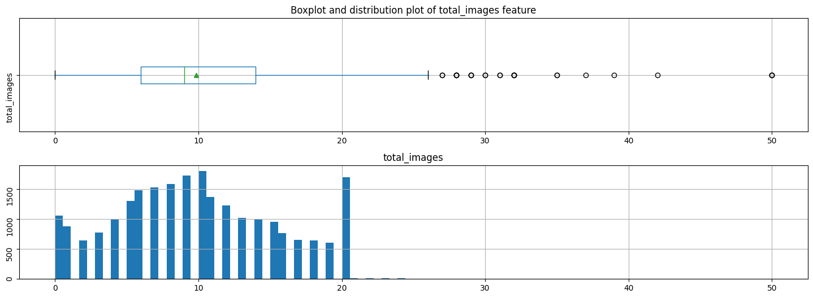
    


    


Основная часть наблюдений соответствует распределению Пуассона, за исключением крайних значений: объявлений, в которых фотографий совсем нет, или в которых фотографий ровно 20.

Нет ли чего-нибудь странного в таких наблюдениях? Проверим:

Проверим случайные 5 объявлений, в которых нет фотографий:


```python
sample_criterion(realty['total_images'], 0)
```


<div>
<table border="1" class="dataframe">
  <thead>
    <tr style="text-align: right;">
      <th></th>
      <th>total_images</th>
      <th>last_price</th>
      <th>total_area</th>
      <th>first_day_exposition</th>
      <th>rooms</th>
      <th>ceiling_height</th>
      <th>floors_total</th>
      <th>living_area</th>
      <th>floor</th>
      <th>is_apartment</th>
      <th>...</th>
      <th>kitchen_area</th>
      <th>balcony</th>
      <th>locality_name</th>
      <th>airports_nearest</th>
      <th>city_centers_nearest</th>
      <th>parks_around_3000</th>
      <th>parks_nearest</th>
      <th>ponds_around_3000</th>
      <th>ponds_nearest</th>
      <th>days_exposition</th>
    </tr>
  </thead>
  <tbody>
    <tr>
      <th>11250</th>
      <td>0</td>
      <td>2900000.0</td>
      <td>57.0</td>
      <td>2017-09-27T00:00:00</td>
      <td>3</td>
      <td>NaN</td>
      <td>5.0</td>
      <td>43.0</td>
      <td>1</td>
      <td>NaN</td>
      <td>...</td>
      <td>5.0</td>
      <td>NaN</td>
      <td>Гатчина</td>
      <td>NaN</td>
      <td>NaN</td>
      <td>NaN</td>
      <td>NaN</td>
      <td>NaN</td>
      <td>NaN</td>
      <td>213.0</td>
    </tr>
    <tr>
      <th>341</th>
      <td>0</td>
      <td>2950000.0</td>
      <td>30.0</td>
      <td>2017-11-21T00:00:00</td>
      <td>1</td>
      <td>2.50</td>
      <td>9.0</td>
      <td>16.0</td>
      <td>5</td>
      <td>NaN</td>
      <td>...</td>
      <td>7.0</td>
      <td>NaN</td>
      <td>Санкт-Петербург</td>
      <td>14442.0</td>
      <td>11734.0</td>
      <td>1.0</td>
      <td>641.0</td>
      <td>1.0</td>
      <td>84.0</td>
      <td>168.0</td>
    </tr>
    <tr>
      <th>5576</th>
      <td>0</td>
      <td>6680000.0</td>
      <td>47.0</td>
      <td>2017-12-11T00:00:00</td>
      <td>1</td>
      <td>2.80</td>
      <td>25.0</td>
      <td>29.0</td>
      <td>3</td>
      <td>NaN</td>
      <td>...</td>
      <td>10.0</td>
      <td>1.0</td>
      <td>Санкт-Петербург</td>
      <td>36421.0</td>
      <td>9176.0</td>
      <td>1.0</td>
      <td>805.0</td>
      <td>0.0</td>
      <td>NaN</td>
      <td>199.0</td>
    </tr>
    <tr>
      <th>1477</th>
      <td>0</td>
      <td>3900000.0</td>
      <td>56.8</td>
      <td>2018-01-05T00:00:00</td>
      <td>2</td>
      <td>NaN</td>
      <td>18.0</td>
      <td>NaN</td>
      <td>7</td>
      <td>NaN</td>
      <td>...</td>
      <td>NaN</td>
      <td>NaN</td>
      <td>посёлок Мурино</td>
      <td>NaN</td>
      <td>NaN</td>
      <td>NaN</td>
      <td>NaN</td>
      <td>NaN</td>
      <td>NaN</td>
      <td>45.0</td>
    </tr>
    <tr>
      <th>2089</th>
      <td>0</td>
      <td>6080000.0</td>
      <td>55.0</td>
      <td>2017-08-15T00:00:00</td>
      <td>2</td>
      <td>2.65</td>
      <td>12.0</td>
      <td>32.7</td>
      <td>8</td>
      <td>NaN</td>
      <td>...</td>
      <td>9.9</td>
      <td>2.0</td>
      <td>Санкт-Петербург</td>
      <td>34270.0</td>
      <td>11884.0</td>
      <td>0.0</td>
      <td>NaN</td>
      <td>0.0</td>
      <td>NaN</td>
      <td>195.0</td>
    </tr>
  </tbody>
</table>
<p>5 rows × 22 columns</p>
</div>


Вроде бы ничего особенного. А как насчет записей с 20 фотографиями?


```python
sample_criterion(realty['total_images'], 20)
```


<div>
<table border="1" class="dataframe">
  <thead>
    <tr style="text-align: right;">
      <th></th>
      <th>total_images</th>
      <th>last_price</th>
      <th>total_area</th>
      <th>first_day_exposition</th>
      <th>rooms</th>
      <th>ceiling_height</th>
      <th>floors_total</th>
      <th>living_area</th>
      <th>floor</th>
      <th>is_apartment</th>
      <th>...</th>
      <th>kitchen_area</th>
      <th>balcony</th>
      <th>locality_name</th>
      <th>airports_nearest</th>
      <th>city_centers_nearest</th>
      <th>parks_around_3000</th>
      <th>parks_nearest</th>
      <th>ponds_around_3000</th>
      <th>ponds_nearest</th>
      <th>days_exposition</th>
    </tr>
  </thead>
  <tbody>
    <tr>
      <th>14220</th>
      <td>20</td>
      <td>8000000.0</td>
      <td>38.7</td>
      <td>2018-10-02T00:00:00</td>
      <td>1</td>
      <td>2.75</td>
      <td>10.0</td>
      <td>14.40</td>
      <td>4</td>
      <td>NaN</td>
      <td>...</td>
      <td>10.7</td>
      <td>NaN</td>
      <td>Санкт-Петербург</td>
      <td>24281.0</td>
      <td>5908.0</td>
      <td>1.0</td>
      <td>1270.0</td>
      <td>2.0</td>
      <td>474.0</td>
      <td>42.0</td>
    </tr>
    <tr>
      <th>125</th>
      <td>20</td>
      <td>4800000.0</td>
      <td>65.9</td>
      <td>2018-02-25T00:00:00</td>
      <td>3</td>
      <td>2.55</td>
      <td>9.0</td>
      <td>48.50</td>
      <td>8</td>
      <td>NaN</td>
      <td>...</td>
      <td>6.3</td>
      <td>NaN</td>
      <td>Санкт-Петербург</td>
      <td>44855.0</td>
      <td>17093.0</td>
      <td>0.0</td>
      <td>NaN</td>
      <td>0.0</td>
      <td>NaN</td>
      <td>239.0</td>
    </tr>
    <tr>
      <th>13124</th>
      <td>20</td>
      <td>1700000.0</td>
      <td>33.5</td>
      <td>2018-10-04T00:00:00</td>
      <td>1</td>
      <td>NaN</td>
      <td>4.0</td>
      <td>16.10</td>
      <td>3</td>
      <td>NaN</td>
      <td>...</td>
      <td>8.7</td>
      <td>NaN</td>
      <td>Волосово</td>
      <td>NaN</td>
      <td>NaN</td>
      <td>NaN</td>
      <td>NaN</td>
      <td>NaN</td>
      <td>NaN</td>
      <td>57.0</td>
    </tr>
    <tr>
      <th>10789</th>
      <td>20</td>
      <td>38900000.0</td>
      <td>151.6</td>
      <td>2018-03-06T00:00:00</td>
      <td>4</td>
      <td>NaN</td>
      <td>9.0</td>
      <td>63.31</td>
      <td>5</td>
      <td>NaN</td>
      <td>...</td>
      <td>56.0</td>
      <td>NaN</td>
      <td>Санкт-Петербург</td>
      <td>26055.0</td>
      <td>4800.0</td>
      <td>1.0</td>
      <td>648.0</td>
      <td>1.0</td>
      <td>779.0</td>
      <td>106.0</td>
    </tr>
    <tr>
      <th>4469</th>
      <td>20</td>
      <td>13975000.0</td>
      <td>112.3</td>
      <td>2018-10-29T00:00:00</td>
      <td>3</td>
      <td>2.80</td>
      <td>21.0</td>
      <td>67.00</td>
      <td>6</td>
      <td>NaN</td>
      <td>...</td>
      <td>14.0</td>
      <td>2.0</td>
      <td>Санкт-Петербург</td>
      <td>27543.0</td>
      <td>9432.0</td>
      <td>0.0</td>
      <td>NaN</td>
      <td>2.0</td>
      <td>376.0</td>
      <td>155.0</td>
    </tr>
  </tbody>
</table>
<p>5 rows × 22 columns</p>
</div>


Тоже все в порядке. А объявления, в которых 50 фотографий?


```python
sample_criterion(realty['total_images'], 50)
```

    Less then 5 rows were found, make a direct slice!


```python
realty.query('total_images == 50')
```


<div>
<table border="1" class="dataframe">
  <thead>
    <tr style="text-align: right;">
      <th></th>
      <th>total_images</th>
      <th>last_price</th>
      <th>total_area</th>
      <th>first_day_exposition</th>
      <th>rooms</th>
      <th>ceiling_height</th>
      <th>floors_total</th>
      <th>living_area</th>
      <th>floor</th>
      <th>is_apartment</th>
      <th>...</th>
      <th>kitchen_area</th>
      <th>balcony</th>
      <th>locality_name</th>
      <th>airports_nearest</th>
      <th>city_centers_nearest</th>
      <th>parks_around_3000</th>
      <th>parks_nearest</th>
      <th>ponds_around_3000</th>
      <th>ponds_nearest</th>
      <th>days_exposition</th>
    </tr>
  </thead>
  <tbody>
    <tr>
      <th>9778</th>
      <td>50</td>
      <td>11000000.0</td>
      <td>87.0</td>
      <td>2017-10-25T00:00:00</td>
      <td>2</td>
      <td>NaN</td>
      <td>25.0</td>
      <td>32.5</td>
      <td>11</td>
      <td>NaN</td>
      <td>...</td>
      <td>31.0</td>
      <td>5.0</td>
      <td>Санкт-Петербург</td>
      <td>9586.0</td>
      <td>11649.0</td>
      <td>0.0</td>
      <td>NaN</td>
      <td>0.0</td>
      <td>NaN</td>
      <td>3.0</td>
    </tr>
    <tr>
      <th>12667</th>
      <td>50</td>
      <td>20500000.0</td>
      <td>76.0</td>
      <td>2017-12-10T00:00:00</td>
      <td>3</td>
      <td>NaN</td>
      <td>20.0</td>
      <td>47.0</td>
      <td>16</td>
      <td>NaN</td>
      <td>...</td>
      <td>29.0</td>
      <td>NaN</td>
      <td>Санкт-Петербург</td>
      <td>50812.0</td>
      <td>16141.0</td>
      <td>0.0</td>
      <td>NaN</td>
      <td>0.0</td>
      <td>NaN</td>
      <td>5.0</td>
    </tr>
    <tr>
      <th>17396</th>
      <td>50</td>
      <td>14500000.0</td>
      <td>119.7</td>
      <td>2017-12-02T00:00:00</td>
      <td>4</td>
      <td>4.0</td>
      <td>4.0</td>
      <td>87.5</td>
      <td>3</td>
      <td>NaN</td>
      <td>...</td>
      <td>13.5</td>
      <td>NaN</td>
      <td>Санкт-Петербург</td>
      <td>24375.0</td>
      <td>2410.0</td>
      <td>1.0</td>
      <td>551.0</td>
      <td>2.0</td>
      <td>617.0</td>
      <td>106.0</td>
    </tr>
  </tbody>
</table>
<p>3 rows × 22 columns</p>
</div>


Тоже ничего особенного. То есть это нормальные объявления, в которые, тем не менее, было добавлено 50 фото. Личный опыт работы с сервисами, позволяющими загружать фотографии, дает основания для такого предположения: в сервисе "Яндекс.недвижимость" есть ограничение на количество фотографий. Это объясняло бы всплеск в районе 20 фото. Редко кто отбирает "20 лучших фото". Кидают всё что есть, а скрипт загрузки сам отсекает лишнее. Однако скрипты могут давать сбои. Вот эти сбои и породили записи с количеством фотографий большим, чем 20.

Поскольку никакого исследовательского вопроса этот параметр не касается, предлагается ничего не делать с этими значениями, оставив их как есть.
Для оптимизации использования памяти изменим тип данных на `int8`:


```python
realty['total_images'] = realty['total_images'].astype('int8')
```

Сформулируем дополнительную цель проекта: выявить, насколько изменение типов данных в датасете помогает экономит память. Для этого будем изменять тип данных где это возможно/уместно либо на более подходящий ("дата-время"), либо на тип меньшей разрядности. После предобработки сделаем вывод: есть ли смысл в такой оптимизации?

### Столбец `'last_price'` — цена на момент снятия с публикации <a id='last_price'></a>


```python
quant_dist(realty, 'last_price')
```

    Feature: last_price
    count    2.369900e+04
    mean     6.541549e+06
    std      1.088701e+07
    min      1.219000e+04
    25%      3.400000e+06
    50%      4.650000e+06
    75%      6.800000e+06
    max      7.630000e+08
    Name: last_price, dtype: float64


    
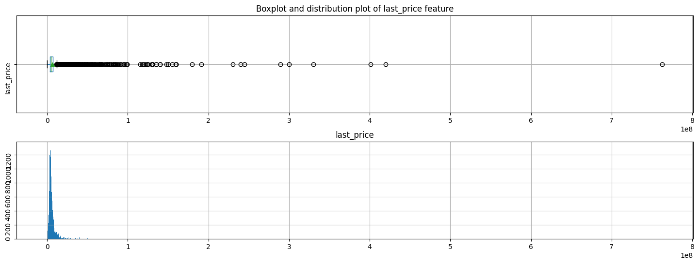
    


    


Наблюдаем серьезные выбросы, искажающие общую картину. Попробуем посмотреть на "Топ-10" самой дорогой недвижимости в датасете:


```python
realty.sort_values('last_price', ascending=False).head(10)
```


<div>
<table border="1" class="dataframe">
  <thead>
    <tr style="text-align: right;">
      <th></th>
      <th>total_images</th>
      <th>last_price</th>
      <th>total_area</th>
      <th>first_day_exposition</th>
      <th>rooms</th>
      <th>ceiling_height</th>
      <th>floors_total</th>
      <th>living_area</th>
      <th>floor</th>
      <th>is_apartment</th>
      <th>...</th>
      <th>kitchen_area</th>
      <th>balcony</th>
      <th>locality_name</th>
      <th>airports_nearest</th>
      <th>city_centers_nearest</th>
      <th>parks_around_3000</th>
      <th>parks_nearest</th>
      <th>ponds_around_3000</th>
      <th>ponds_nearest</th>
      <th>days_exposition</th>
    </tr>
  </thead>
  <tbody>
    <tr>
      <th>12971</th>
      <td>19</td>
      <td>763000000.0</td>
      <td>400.0</td>
      <td>2017-09-30T00:00:00</td>
      <td>7</td>
      <td>NaN</td>
      <td>10.0</td>
      <td>250.0</td>
      <td>10</td>
      <td>NaN</td>
      <td>...</td>
      <td>NaN</td>
      <td>2.0</td>
      <td>Санкт-Петербург</td>
      <td>25108.0</td>
      <td>3956.0</td>
      <td>1.0</td>
      <td>530.0</td>
      <td>3.0</td>
      <td>756.0</td>
      <td>33.0</td>
    </tr>
    <tr>
      <th>19540</th>
      <td>8</td>
      <td>420000000.0</td>
      <td>900.0</td>
      <td>2017-12-06T00:00:00</td>
      <td>12</td>
      <td>2.80</td>
      <td>25.0</td>
      <td>409.7</td>
      <td>25</td>
      <td>NaN</td>
      <td>...</td>
      <td>112.0</td>
      <td>NaN</td>
      <td>Санкт-Петербург</td>
      <td>30706.0</td>
      <td>7877.0</td>
      <td>0.0</td>
      <td>NaN</td>
      <td>2.0</td>
      <td>318.0</td>
      <td>106.0</td>
    </tr>
    <tr>
      <th>14706</th>
      <td>15</td>
      <td>401300000.0</td>
      <td>401.0</td>
      <td>2016-02-20T00:00:00</td>
      <td>5</td>
      <td>NaN</td>
      <td>9.0</td>
      <td>204.0</td>
      <td>9</td>
      <td>False</td>
      <td>...</td>
      <td>24.0</td>
      <td>3.0</td>
      <td>Санкт-Петербург</td>
      <td>21912.0</td>
      <td>2389.0</td>
      <td>1.0</td>
      <td>545.0</td>
      <td>1.0</td>
      <td>478.0</td>
      <td>393.0</td>
    </tr>
    <tr>
      <th>1436</th>
      <td>19</td>
      <td>330000000.0</td>
      <td>190.0</td>
      <td>2018-04-04T00:00:00</td>
      <td>3</td>
      <td>3.50</td>
      <td>7.0</td>
      <td>95.0</td>
      <td>5</td>
      <td>NaN</td>
      <td>...</td>
      <td>40.0</td>
      <td>NaN</td>
      <td>Санкт-Петербург</td>
      <td>23011.0</td>
      <td>1197.0</td>
      <td>3.0</td>
      <td>519.0</td>
      <td>3.0</td>
      <td>285.0</td>
      <td>233.0</td>
    </tr>
    <tr>
      <th>15651</th>
      <td>20</td>
      <td>300000000.0</td>
      <td>618.0</td>
      <td>2017-12-18T00:00:00</td>
      <td>7</td>
      <td>3.40</td>
      <td>7.0</td>
      <td>258.0</td>
      <td>5</td>
      <td>NaN</td>
      <td>...</td>
      <td>70.0</td>
      <td>NaN</td>
      <td>Санкт-Петербург</td>
      <td>32440.0</td>
      <td>5297.0</td>
      <td>0.0</td>
      <td>NaN</td>
      <td>2.0</td>
      <td>198.0</td>
      <td>111.0</td>
    </tr>
    <tr>
      <th>22831</th>
      <td>18</td>
      <td>289238400.0</td>
      <td>187.5</td>
      <td>2019-03-19T00:00:00</td>
      <td>2</td>
      <td>3.37</td>
      <td>6.0</td>
      <td>63.7</td>
      <td>6</td>
      <td>NaN</td>
      <td>...</td>
      <td>30.2</td>
      <td>NaN</td>
      <td>Санкт-Петербург</td>
      <td>22494.0</td>
      <td>1073.0</td>
      <td>3.0</td>
      <td>386.0</td>
      <td>3.0</td>
      <td>188.0</td>
      <td>NaN</td>
    </tr>
    <tr>
      <th>16461</th>
      <td>17</td>
      <td>245000000.0</td>
      <td>285.7</td>
      <td>2017-04-10T00:00:00</td>
      <td>6</td>
      <td>3.35</td>
      <td>7.0</td>
      <td>182.8</td>
      <td>4</td>
      <td>NaN</td>
      <td>...</td>
      <td>29.8</td>
      <td>NaN</td>
      <td>Санкт-Петербург</td>
      <td>33143.0</td>
      <td>6235.0</td>
      <td>3.0</td>
      <td>400.0</td>
      <td>3.0</td>
      <td>140.0</td>
      <td>249.0</td>
    </tr>
    <tr>
      <th>13749</th>
      <td>7</td>
      <td>240000000.0</td>
      <td>410.0</td>
      <td>2017-04-01T00:00:00</td>
      <td>6</td>
      <td>3.40</td>
      <td>7.0</td>
      <td>218.0</td>
      <td>7</td>
      <td>NaN</td>
      <td>...</td>
      <td>40.0</td>
      <td>0.0</td>
      <td>Санкт-Петербург</td>
      <td>32440.0</td>
      <td>5297.0</td>
      <td>0.0</td>
      <td>NaN</td>
      <td>2.0</td>
      <td>198.0</td>
      <td>199.0</td>
    </tr>
    <tr>
      <th>5893</th>
      <td>3</td>
      <td>230000000.0</td>
      <td>500.0</td>
      <td>2017-05-31T00:00:00</td>
      <td>6</td>
      <td>NaN</td>
      <td>7.0</td>
      <td>NaN</td>
      <td>7</td>
      <td>NaN</td>
      <td>...</td>
      <td>40.0</td>
      <td>0.0</td>
      <td>Санкт-Петербург</td>
      <td>32440.0</td>
      <td>5297.0</td>
      <td>0.0</td>
      <td>NaN</td>
      <td>2.0</td>
      <td>198.0</td>
      <td>50.0</td>
    </tr>
    <tr>
      <th>8900</th>
      <td>13</td>
      <td>190870000.0</td>
      <td>268.0</td>
      <td>2016-03-25T00:00:00</td>
      <td>3</td>
      <td>NaN</td>
      <td>8.0</td>
      <td>132.0</td>
      <td>7</td>
      <td>NaN</td>
      <td>...</td>
      <td>40.0</td>
      <td>NaN</td>
      <td>Санкт-Петербург</td>
      <td>32440.0</td>
      <td>5297.0</td>
      <td>0.0</td>
      <td>NaN</td>
      <td>2.0</td>
      <td>198.0</td>
      <td>901.0</td>
    </tr>
  </tbody>
</table>
<p>10 rows × 22 columns</p>
</div>


Цены на недвижимость в сотни миллионов рублей - совсем не сказка. И хотя лидер по заоблачности цен опережает другие с явным отрывом на 340 миллионов, даже эта цена кажется относительно реалистичной: такая недвижимость может существовать. А вот тип данных стоит изменить на `integer`:


```python
realty['last_price'] = realty['last_price'].astype('int32')
```

Любопытно посмореть, как распределены цены на недвижимость в "не заоблачном" сегменте. Поставим в качестве "верхнего" ограничения по оси абсцисс 20 млн. руб.:


```python
realty['last_price'].hist(bins=100, range=(0, 20000000))
plt.show()
```


    
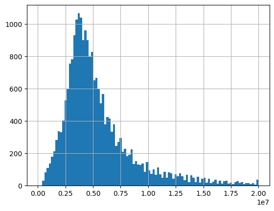
    


"Пик" в районе примерно 3,5 млн. руб. делит наблюдения на две неравные (судя по гистограмме) группы. Уточним эти параметры:


```python
realty['last_price'].describe()
```


    count    2.369900e+04
    mean     6.541549e+06
    std      1.088701e+07
    min      1.219000e+04
    25%      3.400000e+06
    50%      4.650000e+06
    75%      6.800000e+06
    max      7.630000e+08
    Name: last_price, dtype: float64


Получается, что "пик", то есть цена недвижимости, характерная для самого большого количества наблюдений, находится где-то в районе нижней границы второго квартиля, а 75% всех значений находятся в диапазоне до 6,8 млн.руб.
Естественно, в датасете присутствует и более дорогая недвижимость, включая экстремально дорогую. Что довольно ожидаемо для Санкт-Петербурга - города c населением в почти 5 млн. человек.

Проверим, нет ли у нас ошибочно низких значений:


```python
details(realty['last_price'], 400000)
```


    
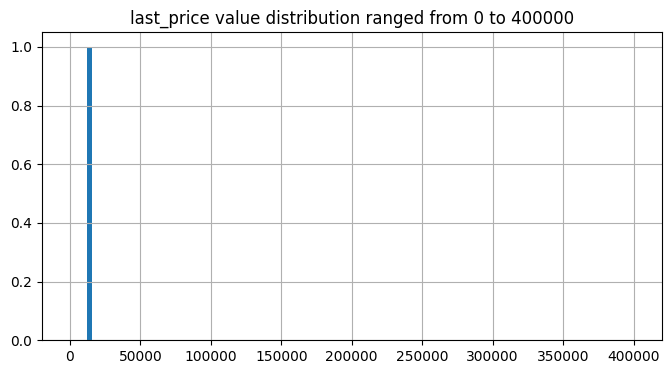
    


    count    2.369900e+04
    mean     6.541549e+06
    std      1.088701e+07
    min      1.219000e+04
    25%      3.400000e+06
    50%      4.650000e+06
    75%      6.800000e+06
    max      7.630000e+08
    Name: last_price, dtype: float64


Всего одно значение дешевле 400 тыс.руб. Полюбопытствуем:


```python
realty[realty['last_price'] < 400000]
```


<div>
<table border="1" class="dataframe">
  <thead>
    <tr style="text-align: right;">
      <th></th>
      <th>total_images</th>
      <th>last_price</th>
      <th>total_area</th>
      <th>first_day_exposition</th>
      <th>rooms</th>
      <th>ceiling_height</th>
      <th>floors_total</th>
      <th>living_area</th>
      <th>floor</th>
      <th>is_apartment</th>
      <th>...</th>
      <th>kitchen_area</th>
      <th>balcony</th>
      <th>locality_name</th>
      <th>airports_nearest</th>
      <th>city_centers_nearest</th>
      <th>parks_around_3000</th>
      <th>parks_nearest</th>
      <th>ponds_around_3000</th>
      <th>ponds_nearest</th>
      <th>days_exposition</th>
    </tr>
  </thead>
  <tbody>
    <tr>
      <th>8793</th>
      <td>7</td>
      <td>12190</td>
      <td>109.0</td>
      <td>2019-03-20T00:00:00</td>
      <td>2</td>
      <td>2.75</td>
      <td>25.0</td>
      <td>32.0</td>
      <td>25</td>
      <td>NaN</td>
      <td>...</td>
      <td>40.5</td>
      <td>NaN</td>
      <td>Санкт-Петербург</td>
      <td>36421.0</td>
      <td>9176.0</td>
      <td>1.0</td>
      <td>805.0</td>
      <td>0.0</td>
      <td>NaN</td>
      <td>8.0</td>
    </tr>
  </tbody>
</table>
<p>1 rows × 22 columns</p>
</div>


12190 (прописью: двенадцать тысяч сто девяность рублей) за двухкомнатную квартиру площадью 109 м² на 25 этаже дома в Санкт-Петербурге - это не сказка, это ошибка. Не нужно быть Вангой, чтобы догадаться: пользователь ввел сумму в тыс.рублей вместо суммы в рублях. Исправим его ошибку:


```python
realty.loc[8793, 'last_price'] *= 1000
```

### Столбец `'total_area'` — площадь квартиры в квадратных метрах (м²) <a id='total_area'></a>


```python
quant_dist(realty, 'total_area')
```

    Feature: total_area
    count    23699.000000
    mean        60.348651
    std         35.654083
    min         12.000000
    25%         40.000000
    50%         52.000000
    75%         69.900000
    max        900.000000
    Name: total_area, dtype: float64


    
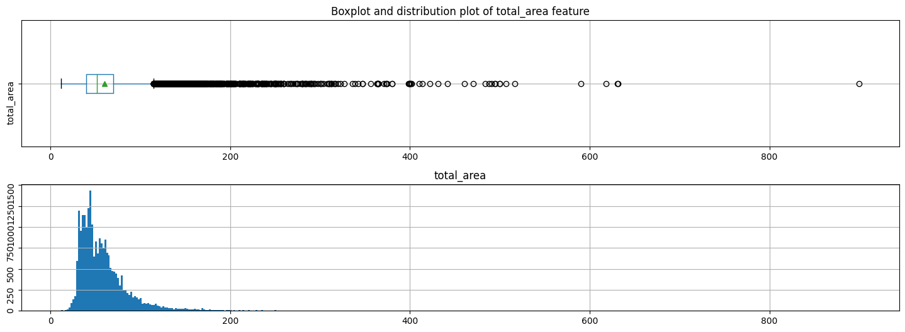
    


    


Вновь наблюдаем довольно ожидаему картину присутствия в датасете **разной** недвижимости, включая имеющую большую площадь. Проделаем тоже действия: ограничим площадь недвижимости значением 200 м² и выведем на экран распределение соответствующих наблюдений в виде гистограммы.


```python
details(realty['total_area'], 200)
```


    
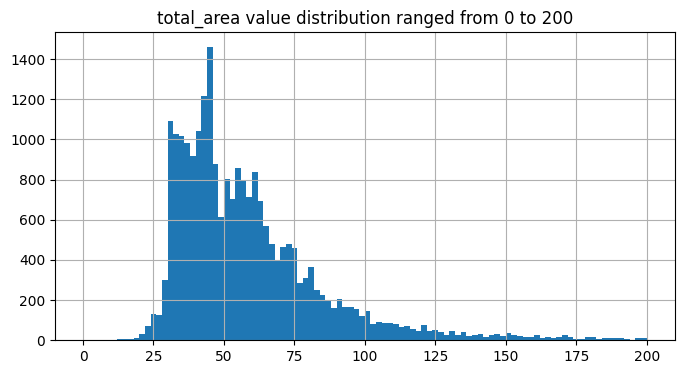
    


    count    23699.000000
    mean        60.348651
    std         35.654083
    min         12.000000
    25%         40.000000
    50%         52.000000
    75%         69.900000
    max        900.000000
    Name: total_area, dtype: float64


75% всех наблюдений приходится на недвижимость с площадью до 70 м². Оставшиеся 25% распределены почти полностью на промежутке от 70 до 200 м². Остальные наблюдения находятся далеко за пределами даже границы выборосов.

### Столбец `'first_day_exposition'` — дата публикации

Очевидно, столбец требует изменения формата данных на формат "Дата-время". Пропусков в нем нет, одноако проверить его на хотя бы временной диапазон (чтобы исключить вероятность ошибочных данных) необходимо. 


```python
realty['first_day_exposition'] = pd.to_datetime(realty['first_day_exposition'], format='%Y-%m-%dT%H:%M:%S')
```


```python
plt.figure(figsize=(12,8))
realty['first_day_exposition'].value_counts().plot(kind='line')
plt.title('Date distribution')
plt.show()
```


    
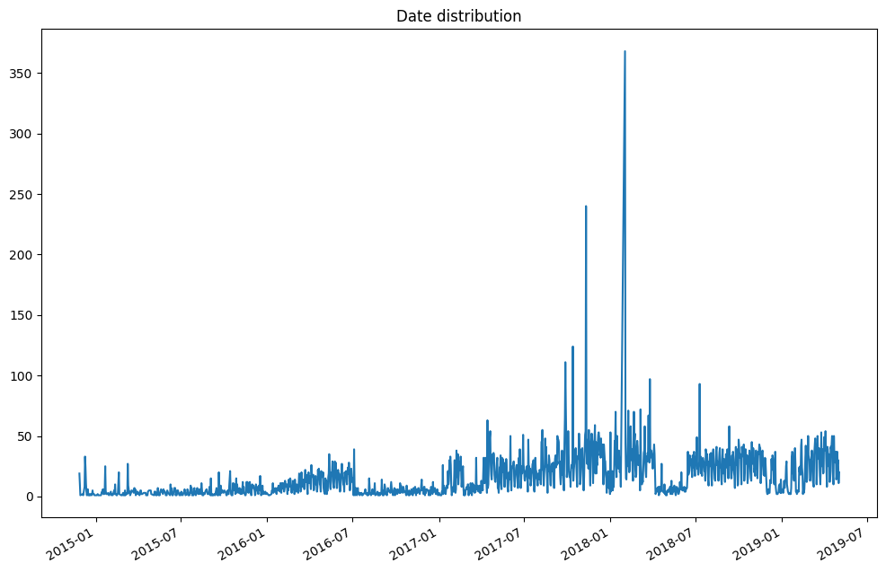
    


Вполне приличная картина. Первые объявления начали появляться в сервисе в конце 2014 года (видимо, тогда он был запущен). После роста в первом полугодии 2016-года сервис показал падение популярности, что может быть отражением ситуации на рынке недвижимости. C 2017 года рынок недвижимость вновь демонстировал рост предложения с несколькими пиками и новым обвалом на границе первого и второго полугодий 2018 года. Верхняя граница наблюдений лежит примерно в апреле 2019 года.

### Столбец `'rooms'` — число комнат <a id='rooms'></a>

В этом столбце нет пропусков. Однако нужно проверить его на наблюдения, в которых указано "0 комнат" (если таковые есть), что может быть справедливо для коммерческой недвижимости (например, - холодного склада-ангара), но подозрительно для жилой недвижимости.


```python
quant_dist(realty, 'rooms')
```

    Feature: rooms
    count    23699.000000
    mean         2.070636
    std          1.078405
    min          0.000000
    25%          1.000000
    50%          2.000000
    75%          3.000000
    max         19.000000
    Name: rooms, dtype: float64


    
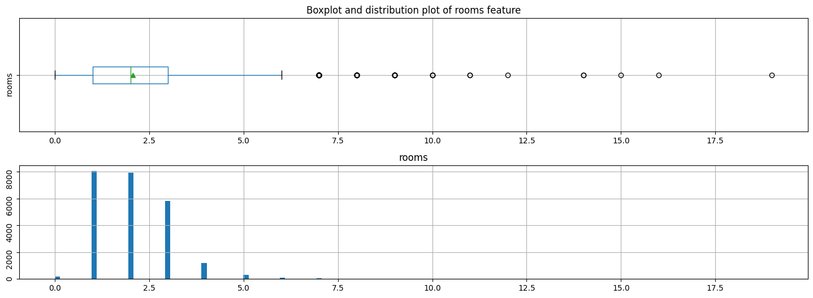
    


    


```python
details(realty['rooms'], 7)
```


    
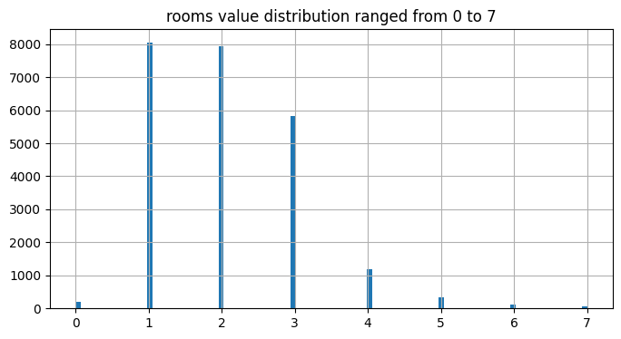
    


    count    23699.000000
    mean         2.070636
    std          1.078405
    min          0.000000
    25%          1.000000
    50%          2.000000
    75%          3.000000
    max         19.000000
    Name: rooms, dtype: float64


Однокомнатных и двухкомнатных квартир - подавляющие большинство. Трехкомнатных - меньше, но тоже не так уж и мало. Общий принцип распределения прост и понятен: предложений с большим количеством комнат меньше, тем с малым.

Посмотрим пристальнее на объявления, в которых указано нулевое количество комнат:


```python
realty.query('rooms == 0').plot(y='total_area', grid=True, kind='hist',bins=100)
```


    
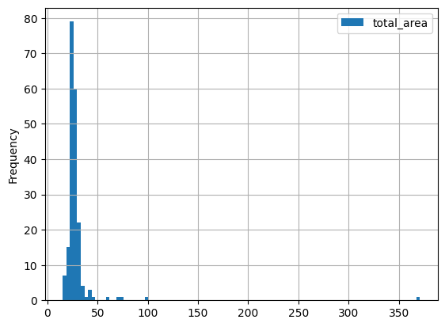
    


```python
sample_criterion(realty['rooms'], 0)
```


<div>
<table border="1" class="dataframe">
  <thead>
    <tr style="text-align: right;">
      <th></th>
      <th>total_images</th>
      <th>last_price</th>
      <th>total_area</th>
      <th>first_day_exposition</th>
      <th>rooms</th>
      <th>ceiling_height</th>
      <th>floors_total</th>
      <th>living_area</th>
      <th>floor</th>
      <th>is_apartment</th>
      <th>...</th>
      <th>kitchen_area</th>
      <th>balcony</th>
      <th>locality_name</th>
      <th>airports_nearest</th>
      <th>city_centers_nearest</th>
      <th>parks_around_3000</th>
      <th>parks_nearest</th>
      <th>ponds_around_3000</th>
      <th>ponds_nearest</th>
      <th>days_exposition</th>
    </tr>
  </thead>
  <tbody>
    <tr>
      <th>11051</th>
      <td>2</td>
      <td>2200000</td>
      <td>26.00</td>
      <td>2017-10-24</td>
      <td>0</td>
      <td>NaN</td>
      <td>21.0</td>
      <td>12.00</td>
      <td>21</td>
      <td>NaN</td>
      <td>...</td>
      <td>NaN</td>
      <td>2.0</td>
      <td>деревня Кудрово</td>
      <td>NaN</td>
      <td>NaN</td>
      <td>NaN</td>
      <td>NaN</td>
      <td>NaN</td>
      <td>NaN</td>
      <td>35.0</td>
    </tr>
    <tr>
      <th>839</th>
      <td>14</td>
      <td>1900000</td>
      <td>35.00</td>
      <td>2017-04-14</td>
      <td>0</td>
      <td>2.7</td>
      <td>5.0</td>
      <td>15.00</td>
      <td>3</td>
      <td>False</td>
      <td>...</td>
      <td>NaN</td>
      <td>1.0</td>
      <td>поселок Новый Свет</td>
      <td>NaN</td>
      <td>NaN</td>
      <td>NaN</td>
      <td>NaN</td>
      <td>NaN</td>
      <td>NaN</td>
      <td>7.0</td>
    </tr>
    <tr>
      <th>6364</th>
      <td>5</td>
      <td>2820000</td>
      <td>27.81</td>
      <td>2018-08-09</td>
      <td>0</td>
      <td>2.7</td>
      <td>25.0</td>
      <td>17.85</td>
      <td>5</td>
      <td>NaN</td>
      <td>...</td>
      <td>NaN</td>
      <td>NaN</td>
      <td>Кудрово</td>
      <td>NaN</td>
      <td>NaN</td>
      <td>NaN</td>
      <td>NaN</td>
      <td>NaN</td>
      <td>NaN</td>
      <td>131.0</td>
    </tr>
    <tr>
      <th>946</th>
      <td>5</td>
      <td>2200000</td>
      <td>23.00</td>
      <td>2016-09-27</td>
      <td>0</td>
      <td>NaN</td>
      <td>27.0</td>
      <td>18.00</td>
      <td>7</td>
      <td>NaN</td>
      <td>...</td>
      <td>NaN</td>
      <td>2.0</td>
      <td>посёлок Мурино</td>
      <td>NaN</td>
      <td>NaN</td>
      <td>NaN</td>
      <td>NaN</td>
      <td>NaN</td>
      <td>NaN</td>
      <td>483.0</td>
    </tr>
    <tr>
      <th>608</th>
      <td>2</td>
      <td>1850000</td>
      <td>25.00</td>
      <td>2019-02-20</td>
      <td>0</td>
      <td>NaN</td>
      <td>10.0</td>
      <td>NaN</td>
      <td>7</td>
      <td>NaN</td>
      <td>...</td>
      <td>NaN</td>
      <td>NaN</td>
      <td>посёлок Шушары</td>
      <td>NaN</td>
      <td>NaN</td>
      <td>NaN</td>
      <td>NaN</td>
      <td>NaN</td>
      <td>NaN</td>
      <td>29.0</td>
    </tr>
  </tbody>
</table>
<p>5 rows × 22 columns</p>
</div>


Итак, в датасете есть и объявления о недвижимости относительно небольших площадей (до 50 м²), и о недвижимости большей площади. Посмотрим сначала на последние:


```python
realty.query('(rooms == 0) and (total_area > 50)').sort_values('total_area', ascending=False)
```


<div>
<table border="1" class="dataframe">
  <thead>
    <tr style="text-align: right;">
      <th></th>
      <th>total_images</th>
      <th>last_price</th>
      <th>total_area</th>
      <th>first_day_exposition</th>
      <th>rooms</th>
      <th>ceiling_height</th>
      <th>floors_total</th>
      <th>living_area</th>
      <th>floor</th>
      <th>is_apartment</th>
      <th>...</th>
      <th>kitchen_area</th>
      <th>balcony</th>
      <th>locality_name</th>
      <th>airports_nearest</th>
      <th>city_centers_nearest</th>
      <th>parks_around_3000</th>
      <th>parks_nearest</th>
      <th>ponds_around_3000</th>
      <th>ponds_nearest</th>
      <th>days_exposition</th>
    </tr>
  </thead>
  <tbody>
    <tr>
      <th>19392</th>
      <td>5</td>
      <td>71000000</td>
      <td>371.0</td>
      <td>2018-07-26</td>
      <td>0</td>
      <td>3.57</td>
      <td>7.0</td>
      <td>NaN</td>
      <td>6</td>
      <td>NaN</td>
      <td>...</td>
      <td>NaN</td>
      <td>NaN</td>
      <td>Санкт-Петербург</td>
      <td>25257.0</td>
      <td>6060.0</td>
      <td>1.0</td>
      <td>761.0</td>
      <td>1.0</td>
      <td>584.0</td>
      <td>90.0</td>
    </tr>
    <tr>
      <th>20082</th>
      <td>10</td>
      <td>16300000</td>
      <td>98.4</td>
      <td>2017-11-08</td>
      <td>0</td>
      <td>3.10</td>
      <td>5.0</td>
      <td>60.5</td>
      <td>2</td>
      <td>NaN</td>
      <td>...</td>
      <td>NaN</td>
      <td>NaN</td>
      <td>Санкт-Петербург</td>
      <td>26972.0</td>
      <td>5819.0</td>
      <td>0.0</td>
      <td>NaN</td>
      <td>1.0</td>
      <td>674.0</td>
      <td>537.0</td>
    </tr>
    <tr>
      <th>3458</th>
      <td>6</td>
      <td>7400000</td>
      <td>73.6</td>
      <td>2017-05-18</td>
      <td>0</td>
      <td>NaN</td>
      <td>3.0</td>
      <td>50.0</td>
      <td>1</td>
      <td>NaN</td>
      <td>...</td>
      <td>NaN</td>
      <td>0.0</td>
      <td>Санкт-Петербург</td>
      <td>26581.0</td>
      <td>6085.0</td>
      <td>0.0</td>
      <td>NaN</td>
      <td>1.0</td>
      <td>348.0</td>
      <td>60.0</td>
    </tr>
    <tr>
      <th>21227</th>
      <td>0</td>
      <td>8200000</td>
      <td>71.0</td>
      <td>2017-07-21</td>
      <td>0</td>
      <td>5.80</td>
      <td>5.0</td>
      <td>68.0</td>
      <td>5</td>
      <td>NaN</td>
      <td>...</td>
      <td>NaN</td>
      <td>0.0</td>
      <td>Санкт-Петербург</td>
      <td>20170.0</td>
      <td>1261.0</td>
      <td>2.0</td>
      <td>295.0</td>
      <td>3.0</td>
      <td>366.0</td>
      <td>30.0</td>
    </tr>
    <tr>
      <th>13613</th>
      <td>16</td>
      <td>8100000</td>
      <td>58.4</td>
      <td>2019-04-26</td>
      <td>0</td>
      <td>3.30</td>
      <td>7.0</td>
      <td>33.0</td>
      <td>6</td>
      <td>NaN</td>
      <td>...</td>
      <td>NaN</td>
      <td>NaN</td>
      <td>Санкт-Петербург</td>
      <td>14509.0</td>
      <td>8288.0</td>
      <td>0.0</td>
      <td>NaN</td>
      <td>0.0</td>
      <td>NaN</td>
      <td>NaN</td>
    </tr>
  </tbody>
</table>
<p>5 rows × 22 columns</p>
</div>


Помещение с самой большой квадратурой не имеет *жилой* площади при большой **общей** площади и свободной планировке, из чего можно сделать вывод - вероятно, это коммерческая недвижимость, в которой действительно может не быть комнат. Остальные записи в этой подвыборке - студии.

Выдвинем предположение: некоторые пользователи при заполнении формы объявления путаются, сколько в студии комнат. Проверим:


```python
realty.query('studio == True').pivot_table(
    index='rooms', values='total_area', aggfunc=('count'))
```


<div>
<table border="1" class="dataframe">
  <thead>
    <tr style="text-align: right;">
      <th></th>
      <th>total_area</th>
    </tr>
    <tr>
      <th>rooms</th>
      <th></th>
    </tr>
  </thead>
  <tbody>
    <tr>
      <th>0</th>
      <td>138</td>
    </tr>
    <tr>
      <th>1</th>
      <td>11</td>
    </tr>
  </tbody>
</table>
</div>


Итак, у продающих студии действительно есть разные мнения по поводу количества комнат в них. Как быть?

Внимание в датасете привлекает столбец `'open_plan'`, обозначающий свободную планировку. Проверим, как связаны нулевое количество комнат с указанием статуса студии и свободной планировки. Возможны четыре сочетания:


```python
for studio in (True, False):
    for open_plan in (True, False):
        query = realty.query('(rooms == 0) and (studio == @studio) and (open_plan == @open_plan)')['rooms'].count()
        print(f'Studio = {studio}, Open plan = {open_plan}:', query)
```

    Studio = True, Open plan = True: 0
    Studio = True, Open plan = False: 138
    Studio = False, Open plan = True: 59
    Studio = False, Open plan = False: 0


То есть в датасете нет ни объявлений о студиях с нулем комнат и свободной планировкой, ни о недвижимости с нулем комнат, которая НЕ является студией и одновременно НЕ имеет свободной планировки.

Зато есть объекты, которые **пока** не имеют комнат, но и не являются студиями, потому что в их планировку можно вносить изменения.

И есть объекты, в описании которых есть путаница (те самые, которые были описаны в предположении выше): это студии, для которых было указано количество в `0` комнат. Такие значения нужно заменить на `1`, а затем оптимизировать тип данных:


```python
realty['rooms'] = realty['rooms'].mask(
    (realty['rooms'] == 0) & (realty['studio'] == True) & (realty['open_plan'] == False), other=1)

realty['rooms'] = realty['rooms'].astype('int8')
```


```python
del studio, open_plan
```

### Столбец `'ceiling_height'` — высота потолков (м) <a id='ceiling_height'></a>


```python
quant_dist(realty, 'ceiling_height')
```

    Feature: ceiling_height
    count    14504.000000
    mean         2.771499
    std          1.261056
    min          1.000000
    25%          2.520000
    50%          2.650000
    75%          2.800000
    max        100.000000
    Name: ceiling_height, dtype: float64


    
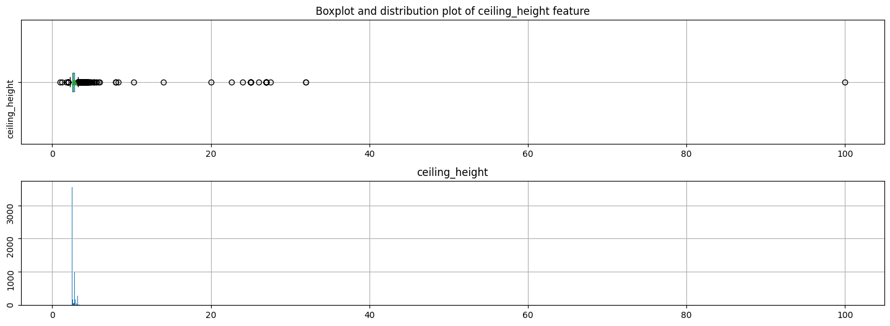
    


    


Кажется, мы имеем дело с ошибками. Высота потолков более 10 метров? Это возможно в единичных случаях для коммерческих объектов типа торговых центров, спортзалов, цехов, складов и т.п., но довольно маловероятно для других типов недвижимости. Поставим в качестве ограничения 5 метров:


```python
realty.query('ceiling_height > 5').head().sort_values('last_price', ascending=False)
```


<div>
<table border="1" class="dataframe">
  <thead>
    <tr style="text-align: right;">
      <th></th>
      <th>total_images</th>
      <th>last_price</th>
      <th>total_area</th>
      <th>first_day_exposition</th>
      <th>rooms</th>
      <th>ceiling_height</th>
      <th>floors_total</th>
      <th>living_area</th>
      <th>floor</th>
      <th>is_apartment</th>
      <th>...</th>
      <th>kitchen_area</th>
      <th>balcony</th>
      <th>locality_name</th>
      <th>airports_nearest</th>
      <th>city_centers_nearest</th>
      <th>parks_around_3000</th>
      <th>parks_nearest</th>
      <th>ponds_around_3000</th>
      <th>ponds_nearest</th>
      <th>days_exposition</th>
    </tr>
  </thead>
  <tbody>
    <tr>
      <th>1026</th>
      <td>20</td>
      <td>155000000</td>
      <td>310.0</td>
      <td>2018-10-12</td>
      <td>5</td>
      <td>5.3</td>
      <td>3.0</td>
      <td>190.0</td>
      <td>3</td>
      <td>NaN</td>
      <td>...</td>
      <td>63.0</td>
      <td>2.0</td>
      <td>Санкт-Петербург</td>
      <td>24899.0</td>
      <td>4785.0</td>
      <td>0.0</td>
      <td>NaN</td>
      <td>1.0</td>
      <td>603.0</td>
      <td>NaN</td>
    </tr>
    <tr>
      <th>464</th>
      <td>15</td>
      <td>66571000</td>
      <td>280.3</td>
      <td>2015-06-11</td>
      <td>6</td>
      <td>5.2</td>
      <td>8.0</td>
      <td>159.5</td>
      <td>7</td>
      <td>NaN</td>
      <td>...</td>
      <td>21.1</td>
      <td>0.0</td>
      <td>Санкт-Петербург</td>
      <td>26316.0</td>
      <td>6655.0</td>
      <td>3.0</td>
      <td>187.0</td>
      <td>1.0</td>
      <td>616.0</td>
      <td>578.0</td>
    </tr>
    <tr>
      <th>1388</th>
      <td>20</td>
      <td>59800000</td>
      <td>399.0</td>
      <td>2015-01-21</td>
      <td>5</td>
      <td>5.6</td>
      <td>6.0</td>
      <td>NaN</td>
      <td>6</td>
      <td>NaN</td>
      <td>...</td>
      <td>NaN</td>
      <td>0.0</td>
      <td>Санкт-Петербург</td>
      <td>26204.0</td>
      <td>6934.0</td>
      <td>2.0</td>
      <td>149.0</td>
      <td>2.0</td>
      <td>577.0</td>
      <td>719.0</td>
    </tr>
    <tr>
      <th>355</th>
      <td>17</td>
      <td>3600000</td>
      <td>55.2</td>
      <td>2018-07-12</td>
      <td>2</td>
      <td>25.0</td>
      <td>5.0</td>
      <td>32.0</td>
      <td>2</td>
      <td>False</td>
      <td>...</td>
      <td>NaN</td>
      <td>2.0</td>
      <td>Гатчина</td>
      <td>NaN</td>
      <td>NaN</td>
      <td>NaN</td>
      <td>NaN</td>
      <td>NaN</td>
      <td>NaN</td>
      <td>259.0</td>
    </tr>
    <tr>
      <th>3148</th>
      <td>14</td>
      <td>2900000</td>
      <td>75.0</td>
      <td>2018-11-12</td>
      <td>3</td>
      <td>32.0</td>
      <td>3.0</td>
      <td>53.0</td>
      <td>2</td>
      <td>NaN</td>
      <td>...</td>
      <td>8.0</td>
      <td>NaN</td>
      <td>Волхов</td>
      <td>NaN</td>
      <td>NaN</td>
      <td>NaN</td>
      <td>NaN</td>
      <td>NaN</td>
      <td>NaN</td>
      <td>NaN</td>
    </tr>
  </tbody>
</table>
<p>5 rows × 22 columns</p>
</div>


Судя по стоимости недвижимости, все объявления с высотой потолков до 6 метров включительно - это т.н. элитная недвижимость, для которой такая высота потолков вполне возможна. Всё, что выше 6 метров -  объявления о жилой недвижимости, довольно стандартные во всем, кроме высоты потолков. Напрашивается вывод: причина выбросов - банальная ошибка пользователей, поставивших десятичный разделитель не в том месте, либо написавших что-то не то.
Предложение по этим наблюдениям простое. Поскольку нет дополнительных данных,которые помогли бы предположить высоту потолков в каждом наблюдении - просто заполним их медианным значением высоты потолков по всему датасету.


```python
realty['ceiling_height'] = realty['ceiling_height'].mask(
    (realty['ceiling_height'] > 6), other=realty['ceiling_height'].median())
```

Этими же значениями заполним все остальные пропуски в этом столбце:


```python
realty['ceiling_height'] = realty['ceiling_height'].fillna(
    realty['ceiling_height'].median())

realty['ceiling_height'] = realty['ceiling_height'].astype('float32')
```

### Столбец `'floors_total'` — всего этажей в доме


```python
quant_dist(realty, 'floors_total')
```

    Feature: floors_total
    count    23613.000000
    mean        10.673824
    std          6.597173
    min          1.000000
    25%          5.000000
    50%          9.000000
    75%         16.000000
    max         60.000000
    Name: floors_total, dtype: float64


    
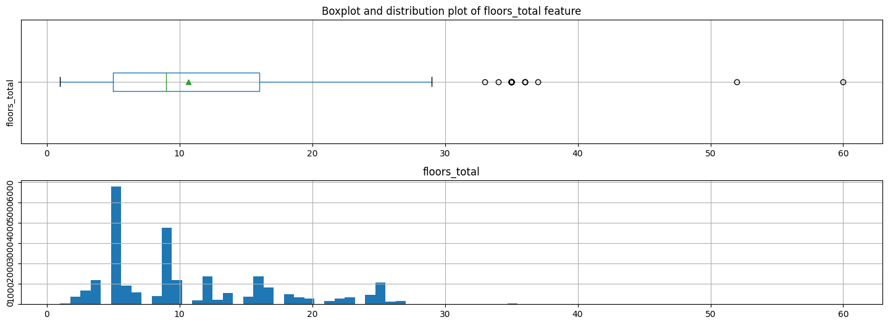
    


    


Вполне понятное распределение. Пики в районе 5 и 9 этажей тоже вполне ожидаемы, а равно "провалы" в районе 11 и 13 этажей. Взглянем пристальнее на все наблюдения выше 25 этажей:


```python
realty.query('floors_total > 25').sort_values('floors_total', ascending=False).head(10)
```


<div>
<table border="1" class="dataframe">
  <thead>
    <tr style="text-align: right;">
      <th></th>
      <th>total_images</th>
      <th>last_price</th>
      <th>total_area</th>
      <th>first_day_exposition</th>
      <th>rooms</th>
      <th>ceiling_height</th>
      <th>floors_total</th>
      <th>living_area</th>
      <th>floor</th>
      <th>is_apartment</th>
      <th>...</th>
      <th>kitchen_area</th>
      <th>balcony</th>
      <th>locality_name</th>
      <th>airports_nearest</th>
      <th>city_centers_nearest</th>
      <th>parks_around_3000</th>
      <th>parks_nearest</th>
      <th>ponds_around_3000</th>
      <th>ponds_nearest</th>
      <th>days_exposition</th>
    </tr>
  </thead>
  <tbody>
    <tr>
      <th>2253</th>
      <td>12</td>
      <td>3800000</td>
      <td>45.5</td>
      <td>2018-06-28</td>
      <td>2</td>
      <td>2.88</td>
      <td>60.0</td>
      <td>27.4</td>
      <td>4</td>
      <td>NaN</td>
      <td>...</td>
      <td>7.40</td>
      <td>NaN</td>
      <td>Кронштадт</td>
      <td>67763.0</td>
      <td>49488.0</td>
      <td>2.0</td>
      <td>342.0</td>
      <td>3.0</td>
      <td>614.0</td>
      <td>166.0</td>
    </tr>
    <tr>
      <th>16731</th>
      <td>9</td>
      <td>3978000</td>
      <td>40.0</td>
      <td>2018-09-24</td>
      <td>1</td>
      <td>2.65</td>
      <td>52.0</td>
      <td>10.5</td>
      <td>18</td>
      <td>NaN</td>
      <td>...</td>
      <td>14.00</td>
      <td>NaN</td>
      <td>Санкт-Петербург</td>
      <td>20728.0</td>
      <td>12978.0</td>
      <td>1.0</td>
      <td>793.0</td>
      <td>0.0</td>
      <td>NaN</td>
      <td>45.0</td>
    </tr>
    <tr>
      <th>16934</th>
      <td>5</td>
      <td>4100000</td>
      <td>40.0</td>
      <td>2017-10-17</td>
      <td>1</td>
      <td>1.75</td>
      <td>37.0</td>
      <td>17.4</td>
      <td>5</td>
      <td>NaN</td>
      <td>...</td>
      <td>8.34</td>
      <td>NaN</td>
      <td>Санкт-Петербург</td>
      <td>18732.0</td>
      <td>20444.0</td>
      <td>0.0</td>
      <td>NaN</td>
      <td>3.0</td>
      <td>80.0</td>
      <td>71.0</td>
    </tr>
    <tr>
      <th>5807</th>
      <td>17</td>
      <td>8150000</td>
      <td>80.0</td>
      <td>2019-01-09</td>
      <td>2</td>
      <td>2.65</td>
      <td>36.0</td>
      <td>41.0</td>
      <td>13</td>
      <td>NaN</td>
      <td>...</td>
      <td>12.00</td>
      <td>5.0</td>
      <td>Санкт-Петербург</td>
      <td>18732.0</td>
      <td>20444.0</td>
      <td>0.0</td>
      <td>NaN</td>
      <td>3.0</td>
      <td>80.0</td>
      <td>38.0</td>
    </tr>
    <tr>
      <th>397</th>
      <td>15</td>
      <td>5990000</td>
      <td>54.0</td>
      <td>2018-03-22</td>
      <td>2</td>
      <td>2.65</td>
      <td>36.0</td>
      <td>21.4</td>
      <td>28</td>
      <td>NaN</td>
      <td>...</td>
      <td>18.70</td>
      <td>1.0</td>
      <td>Санкт-Петербург</td>
      <td>18732.0</td>
      <td>20444.0</td>
      <td>0.0</td>
      <td>NaN</td>
      <td>3.0</td>
      <td>80.0</td>
      <td>11.0</td>
    </tr>
    <tr>
      <th>11079</th>
      <td>16</td>
      <td>9200000</td>
      <td>75.0</td>
      <td>2019-02-22</td>
      <td>2</td>
      <td>2.70</td>
      <td>36.0</td>
      <td>40.0</td>
      <td>29</td>
      <td>NaN</td>
      <td>...</td>
      <td>12.00</td>
      <td>2.0</td>
      <td>Санкт-Петербург</td>
      <td>18732.0</td>
      <td>20444.0</td>
      <td>0.0</td>
      <td>NaN</td>
      <td>3.0</td>
      <td>80.0</td>
      <td>NaN</td>
    </tr>
    <tr>
      <th>12888</th>
      <td>7</td>
      <td>7600000</td>
      <td>70.0</td>
      <td>2016-11-18</td>
      <td>3</td>
      <td>2.70</td>
      <td>35.0</td>
      <td>36.5</td>
      <td>27</td>
      <td>NaN</td>
      <td>...</td>
      <td>23.10</td>
      <td>2.0</td>
      <td>Санкт-Петербург</td>
      <td>18732.0</td>
      <td>20444.0</td>
      <td>0.0</td>
      <td>NaN</td>
      <td>3.0</td>
      <td>80.0</td>
      <td>413.0</td>
    </tr>
    <tr>
      <th>22946</th>
      <td>14</td>
      <td>7690000</td>
      <td>75.0</td>
      <td>2018-03-27</td>
      <td>2</td>
      <td>2.65</td>
      <td>35.0</td>
      <td>40.0</td>
      <td>8</td>
      <td>NaN</td>
      <td>...</td>
      <td>15.00</td>
      <td>NaN</td>
      <td>Санкт-Петербург</td>
      <td>18732.0</td>
      <td>20444.0</td>
      <td>0.0</td>
      <td>NaN</td>
      <td>3.0</td>
      <td>80.0</td>
      <td>NaN</td>
    </tr>
    <tr>
      <th>13975</th>
      <td>19</td>
      <td>6990000</td>
      <td>65.0</td>
      <td>2018-10-06</td>
      <td>2</td>
      <td>2.65</td>
      <td>35.0</td>
      <td>32.1</td>
      <td>23</td>
      <td>NaN</td>
      <td>...</td>
      <td>8.90</td>
      <td>NaN</td>
      <td>Санкт-Петербург</td>
      <td>18732.0</td>
      <td>20444.0</td>
      <td>0.0</td>
      <td>NaN</td>
      <td>3.0</td>
      <td>80.0</td>
      <td>89.0</td>
    </tr>
    <tr>
      <th>2966</th>
      <td>9</td>
      <td>4300000</td>
      <td>37.0</td>
      <td>2017-08-08</td>
      <td>1</td>
      <td>2.65</td>
      <td>35.0</td>
      <td>14.0</td>
      <td>15</td>
      <td>NaN</td>
      <td>...</td>
      <td>10.40</td>
      <td>0.0</td>
      <td>Санкт-Петербург</td>
      <td>18732.0</td>
      <td>20444.0</td>
      <td>0.0</td>
      <td>NaN</td>
      <td>3.0</td>
      <td>80.0</td>
      <td>50.0</td>
    </tr>
  </tbody>
</table>
<p>10 rows × 22 columns</p>
</div>


Первая запись вряд ли соответствует действительности: в Кронштадте нет зданий высотой в 60 этажей. Вероятно, речь о банальной опечатке: в объявлении было первоначально указано `60` этажей вместо `6`.

Те же сомнения вызвывает вторая запись. В Санкт-Петербурге нет зданий такой высотности, в которых даже на настоящий момент продавалась бы недвижимость, да и стоимость этого предложения находится совсем не в "высотном" сегменте. Здесь также вероятна опечатка: вместо `25` автор объявления напечатал `52`.

Объявления об объектах в зданиях высотой в 37, 36 и 35 этажей, судя по столбцам `'airports_nearest'`, `'city_centers_nearest'` и `'parks_nearest'`, касаются недвижимости в двух зданиях, расположенных рядом. Установить истинную этажность этих зданий сложно. Да и, наверное, не очень важно. Устраним два выброса, описанных выше:


```python
realty.loc[2253, 'floors_total'] = 6
realty.loc[16731, 'floors_total'] = 25
```

Теперь разберемся с отсутствующими значениями. Эта информация может быть нам важна, поэтому заполнить пропуски необходимо. Хочется заполнить их медианными значениями по всей выборке. Однако возможна ситуация, когда указанный в объявлении этаж объекта `'floor'` - больше медианного значения. Поэтому введем условие. Если значение этажа объекта больше медианы - присвоим параметру `'floors_total'` значение `'floor'` (допустив, что объект находится на последнем этаже), если меньше медианы - присвоим параметру `'floors_total'` медианное значение. Сделаем это с помощью специально обученной функции:


```python
def floors_total_fillna(row):
    '''
    The function fills missing values in the 'floors_total' column. It takes the only argument:
    1. row: dataframe row.

    The function checks if the row meets two conditions, and returns either
    a median value for the 'floors_total' column or a corresponding value
    from a 'floor' row. 
    '''
    floors_median = realty['floors_total'].median()
    if pd.isna(row['floors_total']) == True:
        if row['floor'] > floors_median:
            return row['floor']
        else:
            return floors_median
    else:
        return row['floors_total']
```


```python
print('Missing values before:', realty['floors_total'].isna().sum())
realty['floors_total'] = realty.apply(floors_total_fillna, axis=1)
print('Missing values after :', realty['floors_total'].isna().sum())
```

    Missing values before: 86
    Missing values after : 0


### Столбец `'living_area'` — жилая площадь в квадратных метрах (м²)


```python
quant_dist(realty, 'living_area')
```

    Feature: living_area
    count    21796.000000
    mean        34.457852
    std         22.030445
    min          2.000000
    25%         18.600000
    50%         30.000000
    75%         42.300000
    max        409.700000
    Name: living_area, dtype: float64


    
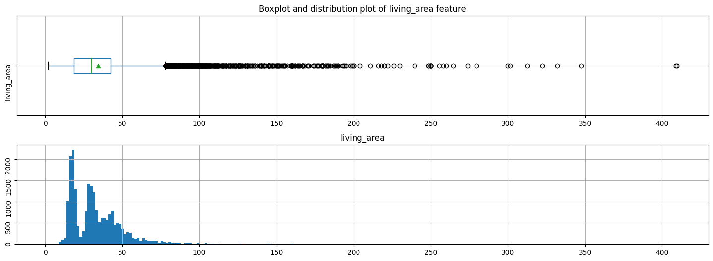
    


    


Вновь большое количество выборосов, требующих хотя бы проверки. Рассмотрим объявления с жилой площадью больше 200 м²: 


```python
realty.query('living_area > 200').sort_values('floors_total', ascending=False).head(10)
```


<div>
<table border="1" class="dataframe">
  <thead>
    <tr style="text-align: right;">
      <th></th>
      <th>total_images</th>
      <th>last_price</th>
      <th>total_area</th>
      <th>first_day_exposition</th>
      <th>rooms</th>
      <th>ceiling_height</th>
      <th>floors_total</th>
      <th>living_area</th>
      <th>floor</th>
      <th>is_apartment</th>
      <th>...</th>
      <th>kitchen_area</th>
      <th>balcony</th>
      <th>locality_name</th>
      <th>airports_nearest</th>
      <th>city_centers_nearest</th>
      <th>parks_around_3000</th>
      <th>parks_nearest</th>
      <th>ponds_around_3000</th>
      <th>ponds_nearest</th>
      <th>days_exposition</th>
    </tr>
  </thead>
  <tbody>
    <tr>
      <th>19540</th>
      <td>8</td>
      <td>420000000</td>
      <td>900.0</td>
      <td>2017-12-06</td>
      <td>12</td>
      <td>2.80</td>
      <td>25.0</td>
      <td>409.7</td>
      <td>25</td>
      <td>NaN</td>
      <td>...</td>
      <td>112.0</td>
      <td>NaN</td>
      <td>Санкт-Петербург</td>
      <td>30706.0</td>
      <td>7877.0</td>
      <td>0.0</td>
      <td>NaN</td>
      <td>2.0</td>
      <td>318.0</td>
      <td>106.0</td>
    </tr>
    <tr>
      <th>6621</th>
      <td>20</td>
      <td>99000000</td>
      <td>488.0</td>
      <td>2017-04-09</td>
      <td>5</td>
      <td>2.95</td>
      <td>20.0</td>
      <td>216.0</td>
      <td>17</td>
      <td>NaN</td>
      <td>...</td>
      <td>50.0</td>
      <td>NaN</td>
      <td>Санкт-Петербург</td>
      <td>27641.0</td>
      <td>4598.0</td>
      <td>1.0</td>
      <td>646.0</td>
      <td>1.0</td>
      <td>368.0</td>
      <td>351.0</td>
    </tr>
    <tr>
      <th>12971</th>
      <td>19</td>
      <td>763000000</td>
      <td>400.0</td>
      <td>2017-09-30</td>
      <td>7</td>
      <td>2.65</td>
      <td>10.0</td>
      <td>250.0</td>
      <td>10</td>
      <td>NaN</td>
      <td>...</td>
      <td>NaN</td>
      <td>2.0</td>
      <td>Санкт-Петербург</td>
      <td>25108.0</td>
      <td>3956.0</td>
      <td>1.0</td>
      <td>530.0</td>
      <td>3.0</td>
      <td>756.0</td>
      <td>33.0</td>
    </tr>
    <tr>
      <th>22494</th>
      <td>7</td>
      <td>91075000</td>
      <td>491.0</td>
      <td>2017-05-27</td>
      <td>5</td>
      <td>4.20</td>
      <td>9.0</td>
      <td>274.0</td>
      <td>9</td>
      <td>NaN</td>
      <td>...</td>
      <td>45.0</td>
      <td>0.0</td>
      <td>Санкт-Петербург</td>
      <td>25525.0</td>
      <td>5845.0</td>
      <td>2.0</td>
      <td>116.0</td>
      <td>0.0</td>
      <td>NaN</td>
      <td>115.0</td>
    </tr>
    <tr>
      <th>15701</th>
      <td>12</td>
      <td>83000000</td>
      <td>293.6</td>
      <td>2017-11-10</td>
      <td>4</td>
      <td>2.65</td>
      <td>9.0</td>
      <td>250.0</td>
      <td>7</td>
      <td>NaN</td>
      <td>...</td>
      <td>35.0</td>
      <td>NaN</td>
      <td>Санкт-Петербург</td>
      <td>25593.0</td>
      <td>5913.0</td>
      <td>2.0</td>
      <td>164.0</td>
      <td>0.0</td>
      <td>NaN</td>
      <td>NaN</td>
    </tr>
    <tr>
      <th>14706</th>
      <td>15</td>
      <td>401300000</td>
      <td>401.0</td>
      <td>2016-02-20</td>
      <td>5</td>
      <td>2.65</td>
      <td>9.0</td>
      <td>204.0</td>
      <td>9</td>
      <td>False</td>
      <td>...</td>
      <td>24.0</td>
      <td>3.0</td>
      <td>Санкт-Петербург</td>
      <td>21912.0</td>
      <td>2389.0</td>
      <td>1.0</td>
      <td>545.0</td>
      <td>1.0</td>
      <td>478.0</td>
      <td>393.0</td>
    </tr>
    <tr>
      <th>21955</th>
      <td>19</td>
      <td>130000000</td>
      <td>431.0</td>
      <td>2017-10-02</td>
      <td>7</td>
      <td>3.70</td>
      <td>8.0</td>
      <td>220.0</td>
      <td>5</td>
      <td>NaN</td>
      <td>...</td>
      <td>20.0</td>
      <td>5.0</td>
      <td>Санкт-Петербург</td>
      <td>NaN</td>
      <td>NaN</td>
      <td>NaN</td>
      <td>NaN</td>
      <td>NaN</td>
      <td>NaN</td>
      <td>161.0</td>
    </tr>
    <tr>
      <th>14088</th>
      <td>8</td>
      <td>51000000</td>
      <td>402.0</td>
      <td>2017-02-07</td>
      <td>6</td>
      <td>3.15</td>
      <td>8.0</td>
      <td>300.0</td>
      <td>6</td>
      <td>NaN</td>
      <td>...</td>
      <td>56.0</td>
      <td>2.0</td>
      <td>Санкт-Петербург</td>
      <td>24484.0</td>
      <td>5052.0</td>
      <td>1.0</td>
      <td>253.0</td>
      <td>0.0</td>
      <td>NaN</td>
      <td>32.0</td>
    </tr>
    <tr>
      <th>7857</th>
      <td>11</td>
      <td>150000000</td>
      <td>230.0</td>
      <td>2017-10-25</td>
      <td>8</td>
      <td>2.65</td>
      <td>8.0</td>
      <td>220.0</td>
      <td>8</td>
      <td>NaN</td>
      <td>...</td>
      <td>NaN</td>
      <td>NaN</td>
      <td>Санкт-Петербург</td>
      <td>25525.0</td>
      <td>5845.0</td>
      <td>2.0</td>
      <td>116.0</td>
      <td>0.0</td>
      <td>NaN</td>
      <td>135.0</td>
    </tr>
    <tr>
      <th>12401</th>
      <td>20</td>
      <td>91500000</td>
      <td>495.0</td>
      <td>2017-06-19</td>
      <td>7</td>
      <td>4.65</td>
      <td>7.0</td>
      <td>347.5</td>
      <td>7</td>
      <td>NaN</td>
      <td>...</td>
      <td>25.0</td>
      <td>0.0</td>
      <td>Санкт-Петербург</td>
      <td>NaN</td>
      <td>5735.0</td>
      <td>2.0</td>
      <td>110.0</td>
      <td>0.0</td>
      <td>NaN</td>
      <td>14.0</td>
    </tr>
  </tbody>
</table>
<p>10 rows × 22 columns</p>
</div>


Как будто ничего особенного. Выполним на всякий случай еще одну проверку: нет ли наблюдений, где значение `'living_area'` больше значения `'total_area'` (чего быть не может):


```python
realty.query('living_area > total_area')['living_area'].count()
```


    0


Отлично, таких наблюдений нет. Присмотримся к объявлениям с жилой площадью менее 100 м²: 


```python
details(realty['living_area'], 100)
```


    
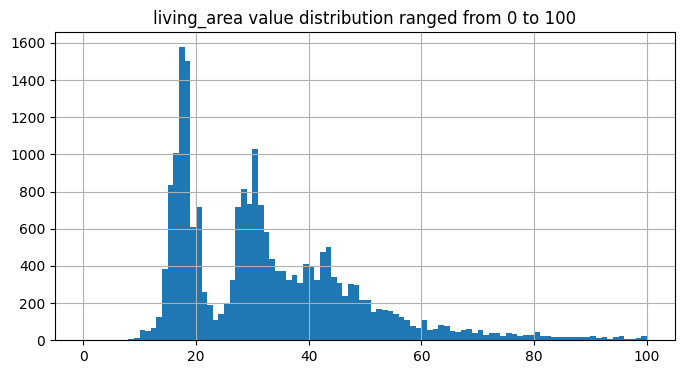
    


    count    21796.000000
    mean        34.457852
    std         22.030445
    min          2.000000
    25%         18.600000
    50%         30.000000
    75%         42.300000
    max        409.700000
    Name: living_area, dtype: float64


Довольно ожидаемое распределение. Наибольшее количество объектов недвижимости, представленных в наблюдениях, - малогабаритное жилье площадью до 20 м² и от 28 до 34 м².

Теперь посмотрим на пропуски в данных:


```python
realty[realty['living_area'].isna() == True].head()
```


<div>
<table border="1" class="dataframe">
  <thead>
    <tr style="text-align: right;">
      <th></th>
      <th>total_images</th>
      <th>last_price</th>
      <th>total_area</th>
      <th>first_day_exposition</th>
      <th>rooms</th>
      <th>ceiling_height</th>
      <th>floors_total</th>
      <th>living_area</th>
      <th>floor</th>
      <th>is_apartment</th>
      <th>...</th>
      <th>kitchen_area</th>
      <th>balcony</th>
      <th>locality_name</th>
      <th>airports_nearest</th>
      <th>city_centers_nearest</th>
      <th>parks_around_3000</th>
      <th>parks_nearest</th>
      <th>ponds_around_3000</th>
      <th>ponds_nearest</th>
      <th>days_exposition</th>
    </tr>
  </thead>
  <tbody>
    <tr>
      <th>3</th>
      <td>0</td>
      <td>64900000</td>
      <td>159.0</td>
      <td>2015-07-24</td>
      <td>3</td>
      <td>2.65</td>
      <td>14.0</td>
      <td>NaN</td>
      <td>9</td>
      <td>NaN</td>
      <td>...</td>
      <td>NaN</td>
      <td>0.0</td>
      <td>Санкт-Петербург</td>
      <td>28098.0</td>
      <td>6800.0</td>
      <td>2.0</td>
      <td>84.0</td>
      <td>3.0</td>
      <td>234.0</td>
      <td>424.0</td>
    </tr>
    <tr>
      <th>7</th>
      <td>5</td>
      <td>7915000</td>
      <td>71.6</td>
      <td>2019-04-18</td>
      <td>2</td>
      <td>2.65</td>
      <td>24.0</td>
      <td>NaN</td>
      <td>22</td>
      <td>NaN</td>
      <td>...</td>
      <td>18.9</td>
      <td>2.0</td>
      <td>Санкт-Петербург</td>
      <td>23982.0</td>
      <td>11634.0</td>
      <td>0.0</td>
      <td>NaN</td>
      <td>0.0</td>
      <td>NaN</td>
      <td>NaN</td>
    </tr>
    <tr>
      <th>30</th>
      <td>12</td>
      <td>2200000</td>
      <td>32.8</td>
      <td>2018-02-19</td>
      <td>1</td>
      <td>2.65</td>
      <td>9.0</td>
      <td>NaN</td>
      <td>2</td>
      <td>NaN</td>
      <td>...</td>
      <td>NaN</td>
      <td>NaN</td>
      <td>Коммунар</td>
      <td>NaN</td>
      <td>NaN</td>
      <td>NaN</td>
      <td>NaN</td>
      <td>NaN</td>
      <td>NaN</td>
      <td>63.0</td>
    </tr>
    <tr>
      <th>37</th>
      <td>10</td>
      <td>1990000</td>
      <td>45.8</td>
      <td>2017-10-28</td>
      <td>2</td>
      <td>2.50</td>
      <td>5.0</td>
      <td>NaN</td>
      <td>1</td>
      <td>NaN</td>
      <td>...</td>
      <td>NaN</td>
      <td>NaN</td>
      <td>поселок городского типа Красный Бор</td>
      <td>NaN</td>
      <td>NaN</td>
      <td>NaN</td>
      <td>NaN</td>
      <td>NaN</td>
      <td>NaN</td>
      <td>196.0</td>
    </tr>
    <tr>
      <th>44</th>
      <td>13</td>
      <td>5350000</td>
      <td>40.0</td>
      <td>2018-11-18</td>
      <td>1</td>
      <td>2.65</td>
      <td>22.0</td>
      <td>NaN</td>
      <td>3</td>
      <td>NaN</td>
      <td>...</td>
      <td>NaN</td>
      <td>1.0</td>
      <td>Санкт-Петербург</td>
      <td>30471.0</td>
      <td>11603.0</td>
      <td>1.0</td>
      <td>620.0</td>
      <td>1.0</td>
      <td>1152.0</td>
      <td>NaN</td>
    </tr>
  </tbody>
</table>
<p>5 rows × 22 columns</p>
</div>


В подвыборке - самые разные объекты, с разной площадью и количеством комнат. Просто медианой пропуски не заполнишь. Поэтому принято следующее решение: выделить в отдельный временный датасет столбцы `'living_area'`, `'total_area'`, `'kitchen_area'` и `'studio'` (последние два - "на будущее", в столбце `'kitchen_area'` тоже есть пропуски). Там же будет создан столбец для категориальных значений. Категоризация будет проводиться по общей площади, затем внутри каждой категории - будут рассчитаны медианные значения жилой площади, а пропуски - заполнены этими значениями в зависимости от категории объекта по общей площади.  


```python
area = realty[['total_area', 'living_area', 'kitchen_area', 'studio']].copy()
```


```python
def total_area_categories(total_area):
    '''
    The function catogorizes observations based on a 'total area' column value.
    It takes the only argument:
    1. total_area: total area value.

    The function returns one categorical value from this list:
    - '<20'
    - '20-35'
    - '35-45'
    - '45-60'
    - '60-80'
    - '80-100'
    - '100-200'
    - '>200'
    '''
    if total_area < 20:
        return '<20'
    if 20 <= total_area < 35:
        return '20-35'
    if 35 <= total_area < 45:
        return '35-45'
    if 45 <= total_area < 60:
        return '45-60'
    if 60 <= total_area < 80:
        return '60-80'
    if 80 <= total_area < 100:
        return '80-100'
    if 100 <= total_area < 200:
        return '100-200'
    if 200 <= total_area:
        return '>200'
```


```python
area.loc[:, 'total_area_category'] = area.loc[:, 'total_area'].apply(total_area_categories)
```

Рассчитаем медианные значения жилой площади для каждой категории:


```python
total_area_medians = area.groupby('total_area_category')['total_area'].median()
print(total_area_medians)
```

    total_area_category
    100-200    120.0
    20-35       31.4
    35-45       40.0
    45-60       52.0
    60-80       67.4
    80-100      87.3
    <20         17.6
    >200       250.0
    Name: total_area, dtype: float64


```python
def living_area_fillna(row):
    """
    The function performs a check, if a 'living_area' column value is missing.
    It takes the only argument:
    1. row: a dataframe row to check the value of the 'living_area' column.

    If the check returns True, the function returns a median value
    for a corresponding category from a 'total_area_category' column. 
    """
    if pd.isna(row['living_area']) == True:
        if row['total_area_category'] == '<20':
            return total_area_medians['<20']
        elif row['total_area_category'] == '20-35':
            return total_area_medians['20-35']
        elif row['total_area_category'] == '35-45':
            return total_area_medians['35-45']
        elif row['total_area_category'] == '45-60':
            return total_area_medians['45-60']
        elif row['total_area_category'] == '60-80':
            return total_area_medians['60-80']
        elif row['total_area_category'] == '80-100':
            return total_area_medians['80-100']
        elif row['total_area_category'] == '100-200':
            return total_area_medians['100-200']
        elif row['total_area_category'] == '>200':
            return total_area_medians['>200']
    return row['living_area']
```


```python
print('Missing values before:', area['living_area'].isna().sum())
area.loc[:, 'living_area'] = area.apply(living_area_fillna, axis=1)
print('Missing values after :', area['living_area'].isna().sum())
```

    Missing values before: 1903
    Missing values after : 0


Готово! Наиболее вероятная причина пропусков - пропуск этого поля при создании наблюдения.

Теперь надо бы "вернуть" все внесенные корректировки в исходный датасет. Однако нам вновь придется обращаться к вспомогательному датафрейму, когда мы будем анализировать площадь кухонь. Потому - немного подождем с этим переносом.


```python
del total_area_medians
```

### Столбец `'floor'` — этаж


```python
quant_dist(realty, 'floor')
```

    Feature: floor
    count    23699.000000
    mean         5.892358
    std          4.885249
    min          1.000000
    25%          2.000000
    50%          4.000000
    75%          8.000000
    max         33.000000
    Name: floor, dtype: float64


    
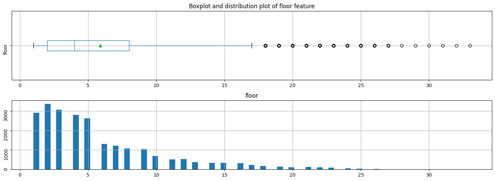
    


    


```python
details(realty['floor'], 25)
```


    
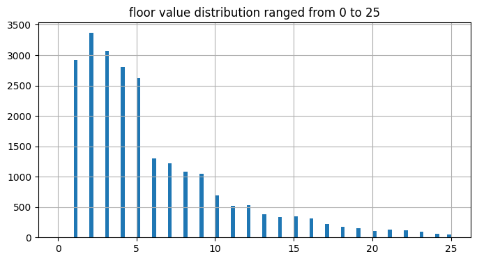
    


    count    23699.000000
    mean         5.892358
    std          4.885249
    min          1.000000
    25%          2.000000
    50%          4.000000
    75%          8.000000
    max         33.000000
    Name: floor, dtype: float64


Вроде бы ничего особенного. Наибольшее количество объявлений приходится на этажи с 1 по 5 - это единственное, что пока можно говорить с уверенностью.

### Столбец `'is_apartment'` — апартаменты (булев тип)

Про эти данные мы знаем, что они относятся к типу boolean. Посмотрим на распределение значений:


```python
realty['is_apartment'].value_counts()
```


    False    2725
    True       50
    Name: is_apartment, dtype: int64


Судя по всему, далеко не все авторы объявлений утруждали себя указанием "мой объект - не аппартаменты". Кажется, уместно будет заполнить все пропуски значением `'False'`. Кроме того, этот столбец хранит данные в виде строк, что вряд ли оптимально с точки зрения использования памяти:


```python
realty.loc[:, 'is_apartment'] = realty.loc[:, 'is_apartment'].fillna(False).astype('bool')
```


### Столбец `'studio'` — квартира-студия (булев тип)


```python
realty['studio'].value_counts()
```


    False    23550
    True       149
    Name: studio, dtype: int64


Вмешательства не требуется. Изменение типа переменных здесь только увеличивает использование памяти, поэтому не делаем этого.

### Столбец `'open_plan'` — свободная планировка (булев тип)


```python
realty['open_plan'].value_counts()
```


    False    23632
    True        67
    Name: open_plan, dtype: int64


Та же ситуация. Никаких отдельных действий не требуется.

### Столбец `'kitchen_area'` — площадь кухни в квадратных метрах (м²)


```python
quant_dist(realty, 'kitchen_area')
```

    Feature: kitchen_area
    count    21421.000000
    mean        10.569807
    std          5.905438
    min          1.300000
    25%          7.000000
    50%          9.100000
    75%         12.000000
    max        112.000000
    Name: kitchen_area, dtype: float64


    
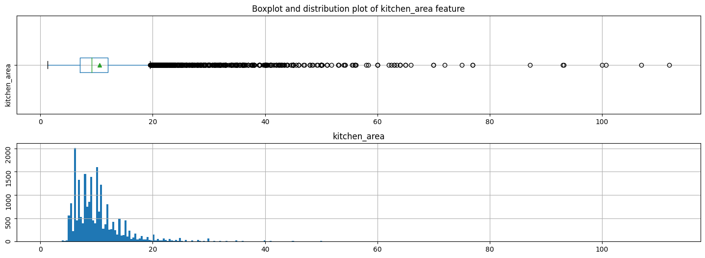
    


    


Какими большими бывают кухни! Это возможно (например, если речь идет о столовой с готовочной зоной), но всё равно требует более пристального взгляда:


```python
realty.query('kitchen_area > 40')
```


<div>
<table border="1" class="dataframe">
  <thead>
    <tr style="text-align: right;">
      <th></th>
      <th>total_images</th>
      <th>last_price</th>
      <th>total_area</th>
      <th>first_day_exposition</th>
      <th>rooms</th>
      <th>ceiling_height</th>
      <th>floors_total</th>
      <th>living_area</th>
      <th>floor</th>
      <th>is_apartment</th>
      <th>...</th>
      <th>kitchen_area</th>
      <th>balcony</th>
      <th>locality_name</th>
      <th>airports_nearest</th>
      <th>city_centers_nearest</th>
      <th>parks_around_3000</th>
      <th>parks_nearest</th>
      <th>ponds_around_3000</th>
      <th>ponds_nearest</th>
      <th>days_exposition</th>
    </tr>
  </thead>
  <tbody>
    <tr>
      <th>4</th>
      <td>2</td>
      <td>10000000</td>
      <td>100.0</td>
      <td>2018-06-19</td>
      <td>2</td>
      <td>3.03</td>
      <td>14.0</td>
      <td>32.0</td>
      <td>13</td>
      <td>False</td>
      <td>...</td>
      <td>41.0</td>
      <td>NaN</td>
      <td>Санкт-Петербург</td>
      <td>31856.0</td>
      <td>8098.0</td>
      <td>2.0</td>
      <td>112.0</td>
      <td>1.0</td>
      <td>48.0</td>
      <td>121.0</td>
    </tr>
    <tr>
      <th>51</th>
      <td>7</td>
      <td>45000000</td>
      <td>161.0</td>
      <td>2017-10-17</td>
      <td>3</td>
      <td>3.20</td>
      <td>8.0</td>
      <td>38.0</td>
      <td>4</td>
      <td>False</td>
      <td>...</td>
      <td>50.0</td>
      <td>NaN</td>
      <td>Санкт-Петербург</td>
      <td>32537.0</td>
      <td>6589.0</td>
      <td>0.0</td>
      <td>NaN</td>
      <td>3.0</td>
      <td>99.0</td>
      <td>541.0</td>
    </tr>
    <tr>
      <th>263</th>
      <td>12</td>
      <td>39900000</td>
      <td>140.6</td>
      <td>2016-11-19</td>
      <td>2</td>
      <td>3.50</td>
      <td>8.0</td>
      <td>39.8</td>
      <td>7</td>
      <td>False</td>
      <td>...</td>
      <td>49.2</td>
      <td>4.0</td>
      <td>Санкт-Петербург</td>
      <td>32537.0</td>
      <td>6589.0</td>
      <td>0.0</td>
      <td>NaN</td>
      <td>3.0</td>
      <td>99.0</td>
      <td>NaN</td>
    </tr>
    <tr>
      <th>492</th>
      <td>18</td>
      <td>95000000</td>
      <td>216.0</td>
      <td>2017-12-05</td>
      <td>4</td>
      <td>3.00</td>
      <td>5.0</td>
      <td>86.0</td>
      <td>4</td>
      <td>False</td>
      <td>...</td>
      <td>77.0</td>
      <td>NaN</td>
      <td>Санкт-Петербург</td>
      <td>21740.0</td>
      <td>436.0</td>
      <td>2.0</td>
      <td>138.0</td>
      <td>3.0</td>
      <td>620.0</td>
      <td>14.0</td>
    </tr>
    <tr>
      <th>511</th>
      <td>7</td>
      <td>5950000</td>
      <td>69.0</td>
      <td>2017-12-21</td>
      <td>1</td>
      <td>2.65</td>
      <td>16.0</td>
      <td>13.0</td>
      <td>12</td>
      <td>False</td>
      <td>...</td>
      <td>50.0</td>
      <td>1.0</td>
      <td>посёлок Мурино</td>
      <td>NaN</td>
      <td>NaN</td>
      <td>NaN</td>
      <td>NaN</td>
      <td>NaN</td>
      <td>NaN</td>
      <td>56.0</td>
    </tr>
    <tr>
      <th>...</th>
      <td>...</td>
      <td>...</td>
      <td>...</td>
      <td>...</td>
      <td>...</td>
      <td>...</td>
      <td>...</td>
      <td>...</td>
      <td>...</td>
      <td>...</td>
      <td>...</td>
      <td>...</td>
      <td>...</td>
      <td>...</td>
      <td>...</td>
      <td>...</td>
      <td>...</td>
      <td>...</td>
      <td>...</td>
      <td>...</td>
      <td>...</td>
    </tr>
    <tr>
      <th>21923</th>
      <td>10</td>
      <td>115490000</td>
      <td>235.0</td>
      <td>2017-04-09</td>
      <td>5</td>
      <td>4.90</td>
      <td>5.0</td>
      <td>140.0</td>
      <td>5</td>
      <td>False</td>
      <td>...</td>
      <td>50.0</td>
      <td>NaN</td>
      <td>Санкт-Петербург</td>
      <td>22777.0</td>
      <td>1328.0</td>
      <td>3.0</td>
      <td>652.0</td>
      <td>3.0</td>
      <td>253.0</td>
      <td>351.0</td>
    </tr>
    <tr>
      <th>22494</th>
      <td>7</td>
      <td>91075000</td>
      <td>491.0</td>
      <td>2017-05-27</td>
      <td>5</td>
      <td>4.20</td>
      <td>9.0</td>
      <td>274.0</td>
      <td>9</td>
      <td>False</td>
      <td>...</td>
      <td>45.0</td>
      <td>0.0</td>
      <td>Санкт-Петербург</td>
      <td>25525.0</td>
      <td>5845.0</td>
      <td>2.0</td>
      <td>116.0</td>
      <td>0.0</td>
      <td>NaN</td>
      <td>115.0</td>
    </tr>
    <tr>
      <th>22980</th>
      <td>19</td>
      <td>24500000</td>
      <td>155.4</td>
      <td>2017-10-10</td>
      <td>3</td>
      <td>3.00</td>
      <td>4.0</td>
      <td>72.0</td>
      <td>2</td>
      <td>False</td>
      <td>...</td>
      <td>65.0</td>
      <td>NaN</td>
      <td>Санкт-Петербург</td>
      <td>43758.0</td>
      <td>15461.0</td>
      <td>1.0</td>
      <td>756.0</td>
      <td>2.0</td>
      <td>278.0</td>
      <td>325.0</td>
    </tr>
    <tr>
      <th>23327</th>
      <td>19</td>
      <td>34400000</td>
      <td>215.0</td>
      <td>2019-03-15</td>
      <td>5</td>
      <td>2.75</td>
      <td>4.0</td>
      <td>82.4</td>
      <td>4</td>
      <td>False</td>
      <td>...</td>
      <td>40.1</td>
      <td>NaN</td>
      <td>Санкт-Петербург</td>
      <td>37268.0</td>
      <td>15419.0</td>
      <td>0.0</td>
      <td>NaN</td>
      <td>0.0</td>
      <td>NaN</td>
      <td>NaN</td>
    </tr>
    <tr>
      <th>23491</th>
      <td>20</td>
      <td>21800000</td>
      <td>250.0</td>
      <td>2017-09-16</td>
      <td>3</td>
      <td>2.65</td>
      <td>12.0</td>
      <td>104.0</td>
      <td>7</td>
      <td>False</td>
      <td>...</td>
      <td>45.0</td>
      <td>0.0</td>
      <td>Санкт-Петербург</td>
      <td>43558.0</td>
      <td>13138.0</td>
      <td>0.0</td>
      <td>NaN</td>
      <td>0.0</td>
      <td>NaN</td>
      <td>49.0</td>
    </tr>
  </tbody>
</table>
<p>131 rows × 22 columns</p>
</div>


Кажется, в некоторые данные все-таки вкрались ошибки. Сложно представить себе кухню площадью 50 м² в квартире площадью 69 м². В целом можно предположить, что есть связь между площадью квартиры и площадью кухни:


```python
realty[['total_area', 'kitchen_area']].corr()
```


<div>
<table border="1" class="dataframe">
  <thead>
    <tr style="text-align: right;">
      <th></th>
      <th>total_area</th>
      <th>kitchen_area</th>
    </tr>
  </thead>
  <tbody>
    <tr>
      <th>total_area</th>
      <td>1.000000</td>
      <td>0.609121</td>
    </tr>
    <tr>
      <th>kitchen_area</th>
      <td>0.609121</td>
      <td>1.000000</td>
    </tr>
  </tbody>
</table>
</div>


Связь есть, хотя и не столь сильная, как можно было надеяться. Попробуем найти среднее отношение площади кухни к общей площади недвижимости:


```python
area['kitchen_to_total_ratio'] = area['kitchen_area'] / area['total_area']
area['kitchen_to_total_ratio'].describe()
```


    count    21421.000000
    mean         0.187355
    std          0.072968
    min          0.025381
    25%          0.133333
    50%          0.172414
    75%          0.232416
    max          0.787879
    Name: kitchen_to_total_ratio, dtype: float64


Среднее и медианное значения этого отношения красноречиво свидетельствуют, что ситуация, описанная выше (50 м² кухни при 69 м² общей площади) - далека от типичной в выборке. Будем исходить из предположения: некоторые данные были введены некорректно и требуют корректировки.
Внимательный просмотр записей, в которых выведенное нами отношение превышает IQR, позволило выявить источник многих ошибок. В датасете немало записей, в которых площадь кухни превышает жилую площадь. Скорее всего авторы этих объявлений банально перепутали поля, вписав в жилую площадь площадь кухни и наоборот. Определим такие записи и "поменяем местами" в них значения жилой и кухонной площадей.


```python
area.query('kitchen_area > living_area')['kitchen_area'].count()
```


    355


```python
def living_swap(row):
    if row['kitchen_area'] > row['living_area']:
        living_area_swap = row['kitchen_area']
        return living_area_swap
    return row['living_area']

def kitchen_swap(row):
    if row['kitchen_area'] > row['living_area']:
        kitchen_area_swap = row['living_area']
        return kitchen_area_swap
    return row['kitchen_area']
```


```python
area['living_area'] = area.loc[:].apply(living_swap, axis=1)
area['kitchen_area'] = area.loc[:].apply(kitchen_swap, axis=1)
```


```python
area.query('kitchen_area > living_area')['kitchen_area'].count()
```


    0


Теперь заполним отсутствующие значения. Поскольку нам удалось рассчитать среднее отношение площади кухни к общей площади, вычислим примерную площадь кухни на основе этого среднего значения: 


```python
def kitchen_area_fillna(row):
    '''
    The function fills missing values in the 'kitchen_area' column.
    It takes the only argument:
    1. row: dataframe row.

    The function checks if a value is missing, and returns a new value based
    on kitchen area to total area ratio and a mean value of all kitchen areas.
    '''
    kitchen_mean = area['kitchen_to_total_ratio'].describe()['mean']
    if pd.isna(row['kitchen_area']) == True:
        kitchen_estimate = row['total_area'] * kitchen_mean
        return kitchen_estimate
    return row['kitchen_area']
```


```python
print('Missing values before:', area['kitchen_area'].isna().sum())
area.loc[:, 'kitchen_area'] = area.apply(kitchen_area_fillna, axis=1)
print('Missing values after :', area['kitchen_area'].isna().sum())
```

    Missing values before: 2278
    Missing values after : 0


Наконец, округлим значения площади кухни до одного знака после запятой и перенесем все значения столбцов `'living_area'` и `'kitchen_area'`, в которые мы вносили изменения, обратно из вспомогательного датафрейма в основной:


```python
area['kitchen_area'] = round(area['kitchen_area'], 1)

realty[['living_area', 'kitchen_area']] = area[['living_area', 'kitchen_area']]
```

Ну и раз уж мы взялись периодически пытаться оптимизировать память, надо бы удалить датафрейм `'area'`, поскольку методом `'.copy()'` мы создали прямо его копию, а не символическую ссылку. Однако он еще пригодится нам, поэтому сделаем это позже.

Последнее действие, которое необходимо выполнить - заполнить пропуски, которые присутствие `'NaN'` оставило в столбце `'kitchen_to_total_ratio'`. Просто еще раз повторим уже однажды проделанное действие, для удобства просмотра округлив значения до второго знака после запятой:


```python
area['kitchen_to_total_ratio'] = round((area['kitchen_area'] / area['total_area']), 2)
```

### Столбец `'balcony'` — число балконов


```python
quant_dist(realty, 'balcony')
```

    Feature: balcony
    count    12180.000000
    mean         1.150082
    std          1.071300
    min          0.000000
    25%          0.000000
    50%          1.000000
    75%          2.000000
    max          5.000000
    Name: balcony, dtype: float64


    
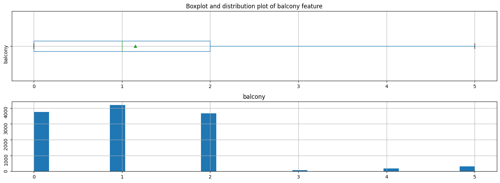
    


    


Полюбопытствуем, в каких квартирах больше двух балконов:


```python
sample_criterion(realty['balcony'], 3)
```


<div>
<table border="1" class="dataframe">
  <thead>
    <tr style="text-align: right;">
      <th></th>
      <th>total_images</th>
      <th>last_price</th>
      <th>total_area</th>
      <th>first_day_exposition</th>
      <th>rooms</th>
      <th>ceiling_height</th>
      <th>floors_total</th>
      <th>living_area</th>
      <th>floor</th>
      <th>is_apartment</th>
      <th>...</th>
      <th>kitchen_area</th>
      <th>balcony</th>
      <th>locality_name</th>
      <th>airports_nearest</th>
      <th>city_centers_nearest</th>
      <th>parks_around_3000</th>
      <th>parks_nearest</th>
      <th>ponds_around_3000</th>
      <th>ponds_nearest</th>
      <th>days_exposition</th>
    </tr>
  </thead>
  <tbody>
    <tr>
      <th>13242</th>
      <td>13</td>
      <td>4950000</td>
      <td>58.1</td>
      <td>2018-08-05</td>
      <td>3</td>
      <td>2.50</td>
      <td>9.0</td>
      <td>39.6</td>
      <td>5</td>
      <td>False</td>
      <td>...</td>
      <td>6.2</td>
      <td>3.0</td>
      <td>Санкт-Петербург</td>
      <td>51091.0</td>
      <td>16419.0</td>
      <td>0.0</td>
      <td>NaN</td>
      <td>0.0</td>
      <td>NaN</td>
      <td>60.0</td>
    </tr>
    <tr>
      <th>18712</th>
      <td>20</td>
      <td>9100000</td>
      <td>68.5</td>
      <td>2018-05-05</td>
      <td>2</td>
      <td>3.30</td>
      <td>6.0</td>
      <td>30.0</td>
      <td>6</td>
      <td>False</td>
      <td>...</td>
      <td>19.0</td>
      <td>3.0</td>
      <td>Пушкин</td>
      <td>18879.0</td>
      <td>31036.0</td>
      <td>0.0</td>
      <td>NaN</td>
      <td>1.0</td>
      <td>391.0</td>
      <td>NaN</td>
    </tr>
    <tr>
      <th>524</th>
      <td>10</td>
      <td>3800000</td>
      <td>74.4</td>
      <td>2017-05-18</td>
      <td>3</td>
      <td>2.65</td>
      <td>5.0</td>
      <td>44.4</td>
      <td>3</td>
      <td>False</td>
      <td>...</td>
      <td>8.9</td>
      <td>3.0</td>
      <td>Кингисепп</td>
      <td>NaN</td>
      <td>NaN</td>
      <td>NaN</td>
      <td>NaN</td>
      <td>NaN</td>
      <td>NaN</td>
      <td>45.0</td>
    </tr>
    <tr>
      <th>3103</th>
      <td>19</td>
      <td>5950000</td>
      <td>58.0</td>
      <td>2019-02-21</td>
      <td>3</td>
      <td>2.56</td>
      <td>9.0</td>
      <td>40.0</td>
      <td>4</td>
      <td>False</td>
      <td>...</td>
      <td>6.3</td>
      <td>3.0</td>
      <td>Санкт-Петербург</td>
      <td>31691.0</td>
      <td>12580.0</td>
      <td>0.0</td>
      <td>NaN</td>
      <td>0.0</td>
      <td>NaN</td>
      <td>NaN</td>
    </tr>
    <tr>
      <th>11784</th>
      <td>0</td>
      <td>5800000</td>
      <td>61.3</td>
      <td>2018-09-09</td>
      <td>3</td>
      <td>2.50</td>
      <td>14.0</td>
      <td>40.0</td>
      <td>12</td>
      <td>False</td>
      <td>...</td>
      <td>7.4</td>
      <td>3.0</td>
      <td>Санкт-Петербург</td>
      <td>31739.0</td>
      <td>8817.0</td>
      <td>3.0</td>
      <td>237.0</td>
      <td>1.0</td>
      <td>294.0</td>
      <td>60.0</td>
    </tr>
  </tbody>
</table>
<p>5 rows × 22 columns</p>
</div>


```python
sample_criterion(realty['balcony'], 4)
```


<div>
<table border="1" class="dataframe">
  <thead>
    <tr style="text-align: right;">
      <th></th>
      <th>total_images</th>
      <th>last_price</th>
      <th>total_area</th>
      <th>first_day_exposition</th>
      <th>rooms</th>
      <th>ceiling_height</th>
      <th>floors_total</th>
      <th>living_area</th>
      <th>floor</th>
      <th>is_apartment</th>
      <th>...</th>
      <th>kitchen_area</th>
      <th>balcony</th>
      <th>locality_name</th>
      <th>airports_nearest</th>
      <th>city_centers_nearest</th>
      <th>parks_around_3000</th>
      <th>parks_nearest</th>
      <th>ponds_around_3000</th>
      <th>ponds_nearest</th>
      <th>days_exposition</th>
    </tr>
  </thead>
  <tbody>
    <tr>
      <th>15637</th>
      <td>9</td>
      <td>13800000</td>
      <td>75.00</td>
      <td>2015-08-11</td>
      <td>2</td>
      <td>3.00</td>
      <td>11.0</td>
      <td>67.4</td>
      <td>11</td>
      <td>False</td>
      <td>...</td>
      <td>18.0</td>
      <td>4.0</td>
      <td>Санкт-Петербург</td>
      <td>37412.0</td>
      <td>8370.0</td>
      <td>1.0</td>
      <td>392.0</td>
      <td>2.0</td>
      <td>359.0</td>
      <td>1028.0</td>
    </tr>
    <tr>
      <th>435</th>
      <td>6</td>
      <td>6800000</td>
      <td>61.80</td>
      <td>2018-01-12</td>
      <td>2</td>
      <td>2.65</td>
      <td>19.0</td>
      <td>34.2</td>
      <td>3</td>
      <td>False</td>
      <td>...</td>
      <td>10.6</td>
      <td>4.0</td>
      <td>Санкт-Петербург</td>
      <td>30187.0</td>
      <td>11313.0</td>
      <td>1.0</td>
      <td>401.0</td>
      <td>1.0</td>
      <td>699.0</td>
      <td>11.0</td>
    </tr>
    <tr>
      <th>4784</th>
      <td>6</td>
      <td>2600000</td>
      <td>42.45</td>
      <td>2018-09-30</td>
      <td>1</td>
      <td>2.65</td>
      <td>12.0</td>
      <td>18.6</td>
      <td>6</td>
      <td>False</td>
      <td>...</td>
      <td>10.8</td>
      <td>4.0</td>
      <td>посёлок Шушары</td>
      <td>17766.0</td>
      <td>23553.0</td>
      <td>0.0</td>
      <td>NaN</td>
      <td>1.0</td>
      <td>95.0</td>
      <td>7.0</td>
    </tr>
    <tr>
      <th>15627</th>
      <td>9</td>
      <td>11500000</td>
      <td>110.00</td>
      <td>2015-03-19</td>
      <td>4</td>
      <td>3.00</td>
      <td>5.0</td>
      <td>57.0</td>
      <td>4</td>
      <td>False</td>
      <td>...</td>
      <td>10.0</td>
      <td>4.0</td>
      <td>Кронштадт</td>
      <td>68909.0</td>
      <td>50635.0</td>
      <td>3.0</td>
      <td>184.0</td>
      <td>2.0</td>
      <td>257.0</td>
      <td>504.0</td>
    </tr>
    <tr>
      <th>18541</th>
      <td>12</td>
      <td>5700000</td>
      <td>43.00</td>
      <td>2017-02-10</td>
      <td>1</td>
      <td>2.80</td>
      <td>24.0</td>
      <td>19.0</td>
      <td>17</td>
      <td>False</td>
      <td>...</td>
      <td>12.0</td>
      <td>4.0</td>
      <td>Санкт-Петербург</td>
      <td>40648.0</td>
      <td>9888.0</td>
      <td>1.0</td>
      <td>1248.0</td>
      <td>0.0</td>
      <td>NaN</td>
      <td>26.0</td>
    </tr>
  </tbody>
</table>
<p>5 rows × 22 columns</p>
</div>


```python
sample_criterion(realty['balcony'], 5)
```


<div>
<table border="1" class="dataframe">
  <thead>
    <tr style="text-align: right;">
      <th></th>
      <th>total_images</th>
      <th>last_price</th>
      <th>total_area</th>
      <th>first_day_exposition</th>
      <th>rooms</th>
      <th>ceiling_height</th>
      <th>floors_total</th>
      <th>living_area</th>
      <th>floor</th>
      <th>is_apartment</th>
      <th>...</th>
      <th>kitchen_area</th>
      <th>balcony</th>
      <th>locality_name</th>
      <th>airports_nearest</th>
      <th>city_centers_nearest</th>
      <th>parks_around_3000</th>
      <th>parks_nearest</th>
      <th>ponds_around_3000</th>
      <th>ponds_nearest</th>
      <th>days_exposition</th>
    </tr>
  </thead>
  <tbody>
    <tr>
      <th>8762</th>
      <td>14</td>
      <td>4750000</td>
      <td>50.1</td>
      <td>2018-07-28</td>
      <td>2</td>
      <td>2.60</td>
      <td>9.0</td>
      <td>31.0</td>
      <td>3</td>
      <td>False</td>
      <td>...</td>
      <td>9.3</td>
      <td>5.0</td>
      <td>Санкт-Петербург</td>
      <td>13404.0</td>
      <td>15995.0</td>
      <td>0.0</td>
      <td>NaN</td>
      <td>1.0</td>
      <td>789.0</td>
      <td>NaN</td>
    </tr>
    <tr>
      <th>5826</th>
      <td>10</td>
      <td>10150000</td>
      <td>100.0</td>
      <td>2017-02-16</td>
      <td>3</td>
      <td>2.65</td>
      <td>5.0</td>
      <td>60.0</td>
      <td>2</td>
      <td>False</td>
      <td>...</td>
      <td>16.0</td>
      <td>5.0</td>
      <td>Санкт-Петербург</td>
      <td>18321.0</td>
      <td>17465.0</td>
      <td>1.0</td>
      <td>1767.0</td>
      <td>3.0</td>
      <td>111.0</td>
      <td>224.0</td>
    </tr>
    <tr>
      <th>116</th>
      <td>18</td>
      <td>10999000</td>
      <td>97.2</td>
      <td>2017-11-13</td>
      <td>3</td>
      <td>2.50</td>
      <td>16.0</td>
      <td>87.3</td>
      <td>16</td>
      <td>False</td>
      <td>...</td>
      <td>18.3</td>
      <td>5.0</td>
      <td>Санкт-Петербург</td>
      <td>19426.0</td>
      <td>21138.0</td>
      <td>0.0</td>
      <td>NaN</td>
      <td>2.0</td>
      <td>390.0</td>
      <td>394.0</td>
    </tr>
    <tr>
      <th>21969</th>
      <td>3</td>
      <td>13500000</td>
      <td>95.1</td>
      <td>2017-11-10</td>
      <td>3</td>
      <td>2.65</td>
      <td>12.0</td>
      <td>56.2</td>
      <td>7</td>
      <td>False</td>
      <td>...</td>
      <td>18.8</td>
      <td>5.0</td>
      <td>Санкт-Петербург</td>
      <td>18065.0</td>
      <td>4232.0</td>
      <td>0.0</td>
      <td>NaN</td>
      <td>1.0</td>
      <td>295.0</td>
      <td>90.0</td>
    </tr>
    <tr>
      <th>15876</th>
      <td>17</td>
      <td>20500000</td>
      <td>165.2</td>
      <td>2018-09-03</td>
      <td>5</td>
      <td>2.91</td>
      <td>18.0</td>
      <td>112.2</td>
      <td>18</td>
      <td>False</td>
      <td>...</td>
      <td>16.5</td>
      <td>5.0</td>
      <td>Санкт-Петербург</td>
      <td>37310.0</td>
      <td>9782.0</td>
      <td>1.0</td>
      <td>497.0</td>
      <td>0.0</td>
      <td>NaN</td>
      <td>NaN</td>
    </tr>
  </tbody>
</table>
<p>5 rows × 22 columns</p>
</div>


Выводы делать сложно. Здесь есть вполне реалистичные варианты: вполне можно представить 4 балкона в четырехкомнатной квартире, или по крайней мере 4 раздельных выхода на соединенные балконы. Однако представить 5 балконов в однокомнатной квартире довольно сложно.
Поскольку выход на балкон на кухне - явление не редкое, сформулируем органичение: в объекте недвижимости может быть балконов не больше, чем "количество комнат +1". Сколько объявлений нарушает это ограничение?


```python
realty.query('balcony > (rooms + 1)')['balcony'].count()
```


    383


Таких объявлений больше одного. Что же, вновь примем волевое решение. Будем считать информацию о количестве балконов в таких объявлениях неверной (результатом намернной или ненамеренной ошибки пользователей) и исправим ее по формуле "количество балконов" = "количество комнат" + 1:


```python
for i in list(realty.query('balcony > (rooms + 1)').index):
    realty.loc[i, 'balcony'] = realty.loc[i, 'rooms'] + 1
```

Наконец, избавимся от пропусков. Здесь будем исходить из того, что пропуски - результат "лени" авторов объявлений заполнять это поле при отсутствии балкона. То есть пропуск равносилен значению `0`: 


```python
realty['balcony'] = realty['balcony'].fillna(0).astype('int32')
```


```python
del i
```

### Столбец `'locality_name'` — название населённого пункта

Прежде всего, необходимо посмотреть: как выглядят названия населенных пунктов?
Названия населенных пунктов можно посмотреть так: `realty['locality_name'].unique()`. Вывод метода не приводится из-за большого объема.

Названия в основном отформатированы так, чтобы отражать не только название, но и тип населенного пункта. Это очень затрудняет поиск повторов. Потому нам придется избавиться от типов населенных пунктов в названиях. Кроме того, нам помешают значения `'NaN'` в столбце, поэтому сначала заменим их на строковые значения `'unknown'`:


```python
realty.loc[:, 'locality_name'] = realty.loc[:, 'locality_name'].fillna('unknown')
```


```python
realty['locality_name'] = realty['locality_name'].str.lower()
locality_list = realty['locality_name'].unique()
```

Из-за большой длины вывода просто опишем, что было сделано далее, и приведем закомментированный код без вывода. Чтобы определить, какие типы населенных пунктов содержатся в столбце `'locality_name'`, необходимо прибегнуть к лемматацизации:


```python
m = Mystem()

locality_lemmas = []
for locality in locality_list:
    locality_lemmas.extend(m.lemmatize(locality))
print(locality_lemmas[:30]) # limiting the output, shaping it into one continious list of values, not "one value - one string"
```

    ['санкт-петербург', '\n', 'поселок', ' ', 'шушары', '\n', 'городской', ' ', 'поселок', ' ', 'янино', '-', '1', '\n', 'поселок', ' ', 'парголовый', '\n', 'поселок', ' ', 'муриный', '\n', 'ломоносов', '\n', 'сертолово', '\n', 'петергоф', '\n', 'пушкин', '\n']


Мы исходили из допущения, что слова, имеющие отношение к типу населенного пункта, будут встречаться в датасете очень часто. Далее было подсчитано их количество. На основе частоты появления слов был сформирован "эталонный список" с наиболее популярными словами, описывающими тип населенного пункта:


```python
locality_type = [
    'поселок ', 'городской ', 'тип ', 'деревня ',
    'садовый ', 'некоммерческий ', 'товарищество ', 'село ', 'станция ',
    'коттеджный ', 'при ', 'железнодорожный '
]
```

Затем была определена функция, обарбатывающая названия населенных пунктов. Их тоже необходимо было лемматизировать, но с другими целями:
* привести слова, обозначающие тип населенного пункта, в ту же словарную форму, что и в эталонном листе;
* убрать из них буквы ё 


```python
def locality_name(row):
    lemma = m.lemmatize(row) # the method always returns '\n' as the last element
    lemma.pop() # deleting '\n'
    row = ''.join(lemma) # rejoining substrings to one string
    return row
```

Проведем первоначальную обработку столбца `'locality_name'`:


```python
realty.loc[:, 'locality_name'] = realty.loc[:, 'locality_name'].apply(locality_name)
```

Теперь проверим каждый элемент столбца `'locality_name'` на присутствие в нем слов из эталонного списка типов населенного пункта. Каждое обнаруженное соответствие удаляется из целевого столбца.


```python
pat = '|'.join(locality_type)
realty['locality_name'] = realty.locality_name.str.lower().replace(pat,'', regex=True)
```

Успех! Вывод `'realty['locality_name'].unique()'` опять не приводится из-за его длины, но он был проверен. Во всех значениях столбца остались только имена собственные в одном (нижнем) регистре, что позволяет как минимум группировать их.

Мы прекрасно понимаю, что функция не будет работать стопроцентно точно. Например, из проб понятно, что название "Шушары" превращается в "шушар", и "Дружная Горка" - в "дружный горка". Но когда речь идет об анализе достаточно больших датасетов, - это самое меньшее из возможных зол. Главное - помнить об этих легких неточностях в обработанных данных.


```python
del m, locality_lemmas, locality_type, pat
```

### Столбец `'airports_nearest'` — расстояние до ближайшего аэропорта в метрах (м)


```python
quant_dist(realty, 'airports_nearest')
```

    Feature: airports_nearest
    count    18157.000000
    mean     28793.672193
    std      12630.880622
    min          0.000000
    25%      18585.000000
    50%      26726.000000
    75%      37273.000000
    max      84869.000000
    Name: airports_nearest, dtype: float64


    
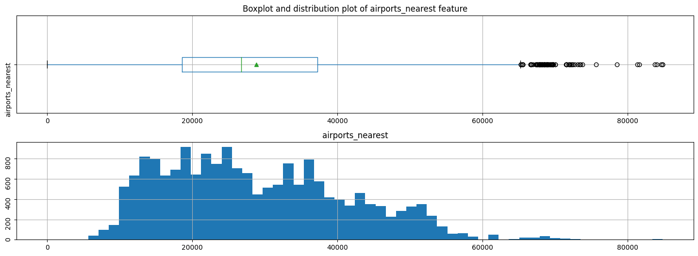
    


    


Как видим, расстояние варьируется от 8 до 90 км. Эти данные принципиальных подозрений не вызывают.

Сложность в другом: как заполнить пропуски? Один из путей таков: попробовать найти объявления из этого же населенного пункта, в которых расстояние до аэропорта указано. Если таковые есть - заполнить пропуски будет несложно.

Для поиска таких наблюдений напишем небольшой цикл. Он подсчитывает для каждого названия населенного пункта:
* количество записей, в которых есть значение расстояний до аэропрота;
* количество записей, в которых это значение пропущено.

Если эти количества отличаются друг от друга либо совпадают, но записей с расстоянием до аэропорта больше нуля - цикл выводит и название населенного пункта, и оба значения.


```python
for locality in locality_list:
    no_airport = realty[(realty['locality_name'] == locality) & (realty['airports_nearest'].isna() == True)]['airports_nearest'].count()
    has_airport = realty[(realty['locality_name'] == locality) & (realty['airports_nearest'].isna() == False)]['airports_nearest'].count()
    if no_airport != has_airport or has_airport != 0:
        print(f"Для {locality} записей без аэропорта - {no_airport}, с аэропортом - {has_airport}")

```

    Для санкт-петербург записей без аэропорта - 0, с аэропортом - 15636
    Для ломоносов записей без аэропорта - 0, с аэропортом - 132
    Для петергоф записей без аэропорта - 0, с аэропортом - 201
    Для пушкин записей без аэропорта - 0, с аэропортом - 369
    Для колпино записей без аэропорта - 0, с аэропортом - 337
    Для кронштадт записей без аэропорта - 0, с аэропортом - 95
    Для павловск записей без аэропорта - 0, с аэропортом - 38
    Для сестрорецк записей без аэропорта - 0, с аэропортом - 183
    Для зеленогорск записей без аэропорта - 0, с аэропортом - 24
    Для unknown записей без аэропорта - 0, с аэропортом - 41


Таких записей мы не нашли. Это означает, что у нас нет возможности на основании данных из датасета определить расстояние до аэропорта и заполнить им пропуски. Медианное или среднее значение, очевидно, не сработает для таких географических данных. Придется оставить пропуски в покое.


```python
del no_airport, has_airport
```

### Столбец `'city_centers_nearest'` — расстояние до центра города (м)


```python
quant_dist(realty, 'city_centers_nearest')
```

    Feature: city_centers_nearest
    count    18180.000000
    mean     14191.277833
    std       8608.386210
    min        181.000000
    25%       9238.000000
    50%      13098.500000
    75%      16293.000000
    max      65968.000000
    Name: city_centers_nearest, dtype: float64


    
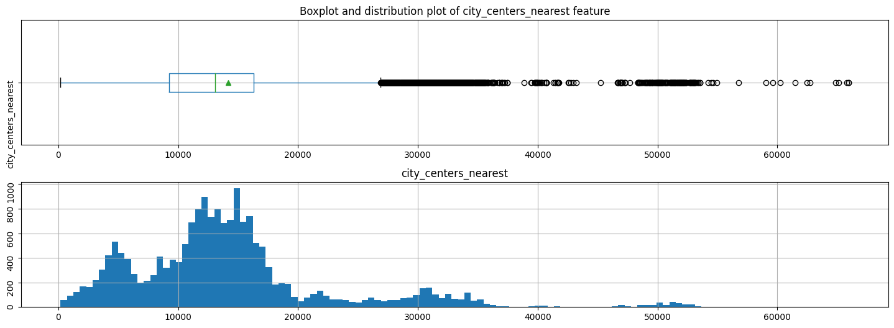
    


    


Пока в данных не заметно особых проблем. Отдельные "пики" на графиках могут соответствовать объявлениям об объектах недвижимости, объединненных населенным пунктом. При этом нам известно, что в данных есть пропуски. По аналогии с предыдущим пунктом можно предположить, что пропуски будут встречаться в данных, для которых по каким-либо причинам было сложно автоматически вычислить расстояние для центра города. Применим к ним ту же логику, что и к расстоянию до аэропорта: посмотрим, есть ли у нас возможность заполнить хотя бы некоторые пропуски на основе данных из других объявлений, относящихся к тому же населенному пункту с указанным расстоянием до центра Санкт-Петербурга:


```python
for locality in locality_list:
    no_city_center = realty[(realty['locality_name'] == locality) & (realty['city_centers_nearest'].isna() == True)]['city_centers_nearest'].count()
    has_city_center = realty[(realty['locality_name'] == locality) & (realty['city_centers_nearest'].isna() == False)]['city_centers_nearest'].count()
    if no_city_center != has_city_center or has_city_center != 0:
        print(f"Для {locality} записей без расстояния до центра - {no_city_center}, с расстоянием до центра - {has_city_center}")

```

    Для санкт-петербург записей без расстояния до центра - 0, с расстоянием до центра - 15660
    Для ломоносов записей без расстояния до центра - 0, с расстоянием до центра - 132
    Для петергоф записей без расстояния до центра - 0, с расстоянием до центра - 201
    Для пушкин записей без расстояния до центра - 0, с расстоянием до центра - 368
    Для колпино записей без расстояния до центра - 0, с расстоянием до центра - 337
    Для кронштадт записей без расстояния до центра - 0, с расстоянием до центра - 95
    Для павловск записей без расстояния до центра - 0, с расстоянием до центра - 38
    Для сестрорецк записей без расстояния до центра - 0, с расстоянием до центра - 183
    Для зеленогорск записей без расстояния до центра - 0, с расстоянием до центра - 24
    Для unknown записей без расстояния до центра - 0, с расстоянием до центра - 41


Тот же вывод, что и для аэропорта. К сожалению, у нас нет возможности на основании данных из датасета определить расстояние до центра и заполнить им пропуски. Медианное или среднее значение здесь неприемлемо. Оставим пропуски без изменений.


```python
del locality, locality_list, no_city_center, has_city_center
```

### Столбец `'parks_around_3000'` — число парков в радиусе 3 км


```python
quant_dist(realty, 'parks_around_3000')
```

    Feature: parks_around_3000
    count    18181.000000
    mean         0.611408
    std          0.802074
    min          0.000000
    25%          0.000000
    50%          0.000000
    75%          1.000000
    max          3.000000
    Name: parks_around_3000, dtype: float64


    
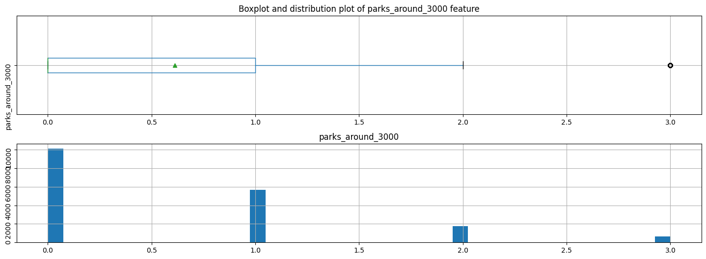
    


    


Довольно ожидаемое распределение. Далеко не каждый объект недвижимости может похвастаться парком, а то и несколькими в пределах пешей доступности. Тут же можно сделать предположение: отсутствие значения в этом столбце можно интерпретировать как 0 парков в пределах радиуса 3 км. Заполним пропуски этим значением: 


```python
realty.loc[:, 'parks_around_3000'] = realty.loc[:, 'parks_around_3000'].fillna(0).astype('int8')
```


### Столбец `'parks_nearest'` — расстояние до ближайшего парка (м)


```python
quant_dist(realty, 'parks_nearest')
```

    Feature: parks_nearest
    count    8079.000000
    mean      490.804555
    std       342.317995
    min         1.000000
    25%       288.000000
    50%       455.000000
    75%       612.000000
    max      3190.000000
    Name: parks_nearest, dtype: float64


    
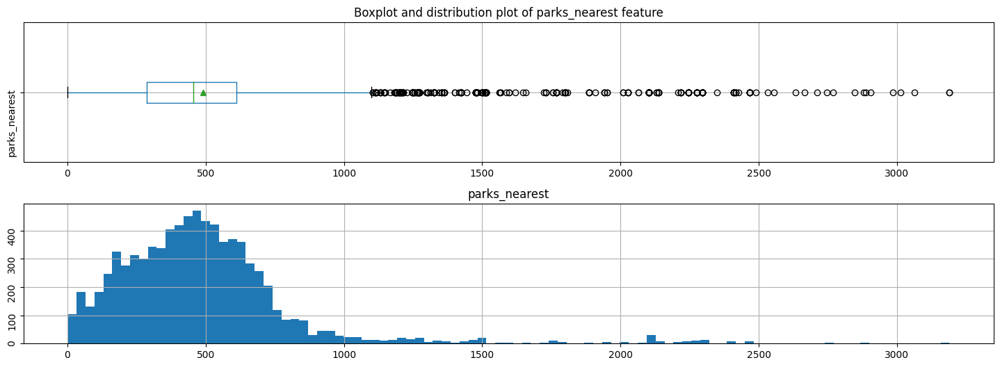
    


    


Как здорово иметь поблизости парк! Тем более здорово знать, что в большей части объявлений, упоминающих парк, он находится так близко. Позже посмотрим, влияет ли это на цену

### Столбец `'ponds_around_3000'` — число водоёмов в радиусе 3 км


```python
quant_dist(realty, 'ponds_around_3000')
```

    Feature: ponds_around_3000
    count    18181.000000
    mean         0.770255
    std          0.938346
    min          0.000000
    25%          0.000000
    50%          1.000000
    75%          1.000000
    max          3.000000
    Name: ponds_around_3000, dtype: float64


    
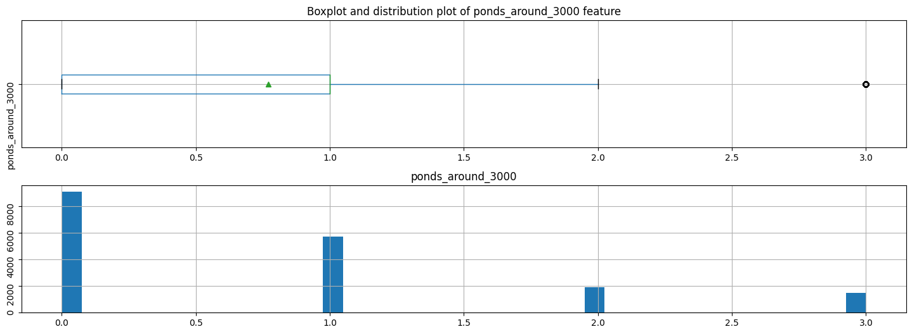
    


    


Тоже ничего необычного. К сожалению, прудов не так много, и не каждое объявление может похвастать прудом неподалеку. Так же, как и с парками, предположим, что пропуск означает отсутствие пруда поблизости (пользователи просто решили не заполнять это поле):


```python
realty.loc[:, 'ponds_around_3000'] = realty.loc[:, 'ponds_around_3000'].fillna(0).astype('int8')
```


### Столбец `'ponds_nearest'` — расстояние до ближайшего водоёма (м)


```python
quant_dist(realty, 'ponds_nearest')
```

    Feature: ponds_nearest
    count    9110.000000
    mean      517.980900
    std       277.720643
    min        13.000000
    25%       294.000000
    50%       502.000000
    75%       729.000000
    max      1344.000000
    Name: ponds_nearest, dtype: float64


    
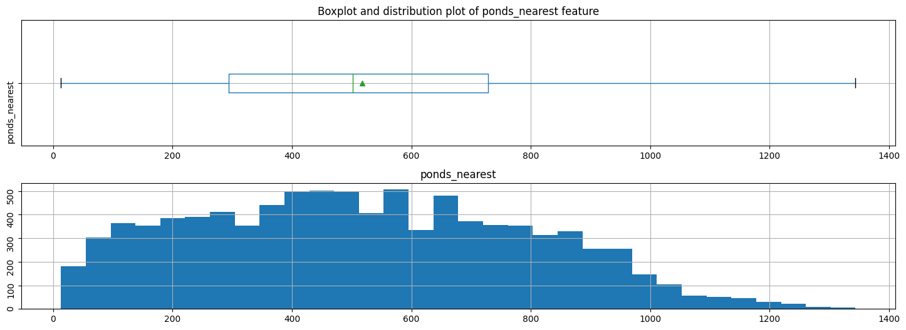
    


    


Опять же, отличное, очень равномерное распределение. Если уж довелось иметь пруд в радиусе 3 километров, - на самом деле он будет не дальше полутора километров, то есть примерно 20-минутной прогулки.

### Столбец `'days_exposition'` — сколько дней было размещено объявление (от публикации до снятия) <a id='days_expositiion'></a>


```python
quant_dist(realty, 'days_exposition')
```

    Feature: days_exposition
    count    20518.000000
    mean       180.888634
    std        219.727988
    min          1.000000
    25%         45.000000
    50%         95.000000
    75%        232.000000
    max       1580.000000
    Name: days_exposition, dtype: float64


    
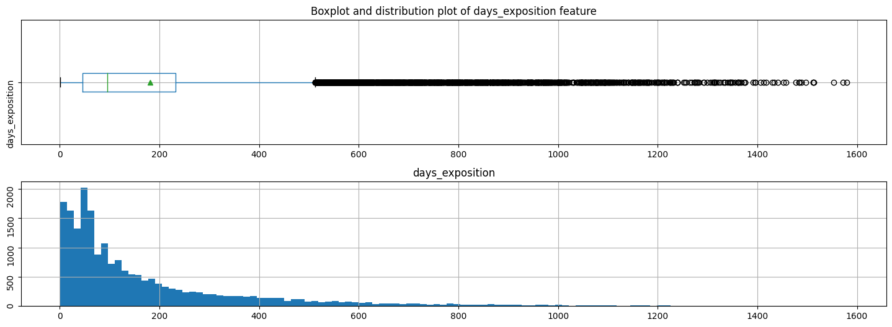
    


    


Плохие новости для пользователей, надеющихся, что Яндекс.Недвижимость позволит продать объект за пару недель. Хорошие новости для более реалистично настроенных пользователей в том, что половина всех объектов снимается с продажи (будем надеятся, по причине успешной сделки) за 3 месяца, а три четверти всех объектов - за 7-8 месяцев.

Судя по этим данным, "быстрая продажа квартиры" - это до полутора месяца (нижняя граница второго квартиля). Иными словами, если вы собарлись продавать квартиру в Санкт-Петербурге и окрестностях - запаситесь временем от квартала до полугода, у вас есть 2 шанса из трех продать её за это время.

И не забудем о продажах, которые занимают более года, особенно о рекордсменах от двух лет и выше, включая главного рекордсмена - объект, продававшийся почти 5 лет.

Кроме того, у нас есть несколько пропусков, которые предлагается заполнить медианными значениями:


```python
realty.loc[:, 'days_exposition'] = realty.loc[:, 'days_exposition'].fillna(
    realty['days_exposition'].describe()['50%']).astype('int16')
```


Посмотрим пристальнее на объявления длительностью до одного года:


```python
realty.query('days_exposition < 365')['days_exposition'].hist(bins=365)
```


    <AxesSubplot:>


    
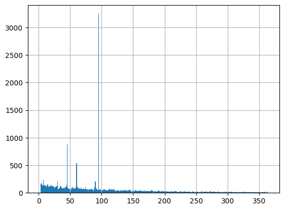
    


Бросаются в глаза высокие пики, явно выбивающиеся за пределы общего равномерного распределения. Обратим внимание на все значения количества дней размещения объявлений, которым соответствует более 500 объявлений:


```python
realty.query('days_exposition < 365')['days_exposition'].value_counts().head(10)
```


    95    3245
    45     880
    60     538
    7      234
    30     208
    90     204
    4      176
    3      158
    5      152
    14     148
    Name: days_exposition, dtype: int64


Основные пики количества объявлений соответствуют "круглым" значением в 45, 60 и 95 дней. Следующие за ними значения тоже "красивые" - 7, 30 и 90 дней. Такая склонность к округленным значениям точно не входит в число характеристик любого "естестенного" распределения. Можно предположить, что это - следы автоматического либо "ручного" округления значений (либо присвоения отсутствующих значений) на каком-либо этапе формирования датасета или автоматическое снятие объявлений с продления.

### Вывод по предобработке данных

Мы заполнили пропуски данных, где это было возможно, и изменили тип данных в ряде столбцов. Где-то мы делали это, потому что это давало возможность иначе работать с данными (например, для типа "дата-время"), а где-то - в порядек эксперимента, чтобы проверить, позволяет ли это оптимизировать как минимум использование памяти. Время проверить, насколько успешен наш эксперимент:


```python
realty.info()
```

    <class 'pandas.core.frame.DataFrame'>
    RangeIndex: 23699 entries, 0 to 23698
    Data columns (total 22 columns):
     #   Column                Non-Null Count  Dtype         
    ---  ------                --------------  -----         
     0   total_images          23699 non-null  int8          
     1   last_price            23699 non-null  int32         
     2   total_area            23699 non-null  float64       
     3   first_day_exposition  23699 non-null  datetime64[ns]
     4   rooms                 23699 non-null  int8          
     5   ceiling_height        23699 non-null  float32       
     6   floors_total          23699 non-null  float64       
     7   living_area           23699 non-null  float64       
     8   floor                 23699 non-null  int64         
     9   is_apartment          23699 non-null  bool          
     10  studio                23699 non-null  bool          
     11  open_plan             23699 non-null  bool          
     12  kitchen_area          23699 non-null  float64       
     13  balcony               23699 non-null  int32         
     14  locality_name         23699 non-null  object        
     15  airports_nearest      18157 non-null  float64       
     16  city_centers_nearest  18180 non-null  float64       
     17  parks_around_3000     23699 non-null  int8          
     18  parks_nearest         8079 non-null   float64       
     19  ponds_around_3000     23699 non-null  int8          
     20  ponds_nearest         9110 non-null   float64       
     21  days_exposition       23699 non-null  int16         
    dtypes: bool(3), datetime64[ns](1), float32(1), float64(8), int16(1), int32(2), int64(1), int8(4), object(1)
    memory usage: 2.5+ MB


"Экономия" составила примерно 1,1 мб, что может в абсолютных показателях показаться небольшим успехом, но в относительных - это почти 30%-ная оптимизация. В высоконагруженных системах с действительно большими объемами данных такая оптимизация может выражаться в гига- и терабайтах "сэкономленного" пространства памяти и часах машинного времени.

## Расчеты и добавление данных в таблицу

Нам необходимо добавить в таблицу столбцы, содержащие:

* цену квадратного метра;
* день недели, месяц и год публикации объявления;
* этаж квартиры; варианты — первый, последний, другой;
* соотношение жилой и общей площади, а также отношение площади кухни к общей.

### Цена квадратного метра


```python
realty['square_meters'] = round(realty['last_price'] / realty['total_area']).astype('int32')
quant_dist(realty, 'square_meters')
```

    Feature: square_meters
    count    2.369900e+04
    mean     9.942637e+04
    std      5.030273e+04
    min      7.963000e+03
    25%      7.659950e+04
    50%      9.500000e+04
    75%      1.142560e+05
    max      1.907500e+06
    Name: square_meters, dtype: float64


    
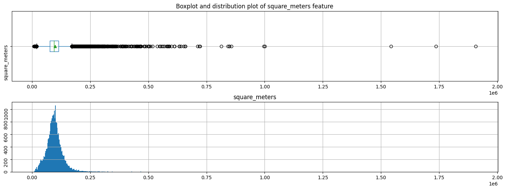
    


    


Из-за выбросов картина очень непонятна. Отфильтруем их, задав верхнюю границу стоимости в 250 тыс.руб за м²:


```python
details(realty['square_meters'], 250000)
```


    
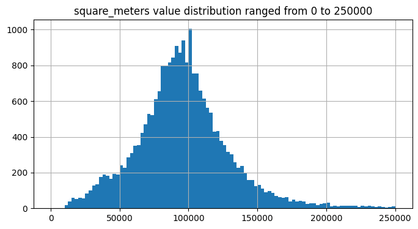
    


    count    2.369900e+04
    mean     9.942637e+04
    std      5.030273e+04
    min      7.963000e+03
    25%      7.659950e+04
    50%      9.500000e+04
    75%      1.142560e+05
    max      1.907500e+06
    Name: square_meters, dtype: float64


Что же, вполне понятное распределение стоимости. Особых вопросов оно не вызывает. А вот выбросы вроде более миллиона рублей за квадратный метр вызывают интерес:


```python
realty[realty['square_meters'] > 1000000]
```


<div>
<table border="1" class="dataframe">
  <thead>
    <tr style="text-align: right;">
      <th></th>
      <th>total_images</th>
      <th>last_price</th>
      <th>total_area</th>
      <th>first_day_exposition</th>
      <th>rooms</th>
      <th>ceiling_height</th>
      <th>floors_total</th>
      <th>living_area</th>
      <th>floor</th>
      <th>is_apartment</th>
      <th>...</th>
      <th>balcony</th>
      <th>locality_name</th>
      <th>airports_nearest</th>
      <th>city_centers_nearest</th>
      <th>parks_around_3000</th>
      <th>parks_nearest</th>
      <th>ponds_around_3000</th>
      <th>ponds_nearest</th>
      <th>days_exposition</th>
      <th>square_meters</th>
    </tr>
  </thead>
  <tbody>
    <tr>
      <th>1436</th>
      <td>19</td>
      <td>330000000</td>
      <td>190.0</td>
      <td>2018-04-04</td>
      <td>3</td>
      <td>3.50</td>
      <td>7.0</td>
      <td>95.0</td>
      <td>5</td>
      <td>False</td>
      <td>...</td>
      <td>0</td>
      <td>санкт-петербург</td>
      <td>23011.0</td>
      <td>1197.0</td>
      <td>3</td>
      <td>519.0</td>
      <td>3</td>
      <td>285.0</td>
      <td>233</td>
      <td>1736842</td>
    </tr>
    <tr>
      <th>12971</th>
      <td>19</td>
      <td>763000000</td>
      <td>400.0</td>
      <td>2017-09-30</td>
      <td>7</td>
      <td>2.65</td>
      <td>10.0</td>
      <td>250.0</td>
      <td>10</td>
      <td>False</td>
      <td>...</td>
      <td>2</td>
      <td>санкт-петербург</td>
      <td>25108.0</td>
      <td>3956.0</td>
      <td>1</td>
      <td>530.0</td>
      <td>3</td>
      <td>756.0</td>
      <td>33</td>
      <td>1907500</td>
    </tr>
    <tr>
      <th>14706</th>
      <td>15</td>
      <td>401300000</td>
      <td>401.0</td>
      <td>2016-02-20</td>
      <td>5</td>
      <td>2.65</td>
      <td>9.0</td>
      <td>204.0</td>
      <td>9</td>
      <td>False</td>
      <td>...</td>
      <td>3</td>
      <td>санкт-петербург</td>
      <td>21912.0</td>
      <td>2389.0</td>
      <td>1</td>
      <td>545.0</td>
      <td>1</td>
      <td>478.0</td>
      <td>393</td>
      <td>1000748</td>
    </tr>
    <tr>
      <th>22831</th>
      <td>18</td>
      <td>289238400</td>
      <td>187.5</td>
      <td>2019-03-19</td>
      <td>2</td>
      <td>3.37</td>
      <td>6.0</td>
      <td>63.7</td>
      <td>6</td>
      <td>False</td>
      <td>...</td>
      <td>0</td>
      <td>санкт-петербург</td>
      <td>22494.0</td>
      <td>1073.0</td>
      <td>3</td>
      <td>386.0</td>
      <td>3</td>
      <td>188.0</td>
      <td>95</td>
      <td>1542605</td>
    </tr>
  </tbody>
</table>
<p>4 rows × 23 columns</p>
</div>


Однако никаких особых сюрпризов здесь нет. Просто ЧУДОВИЩНО переоцененная недвижимость, - или ошибка на ноль-другой при заполнени объявления.

### День, месяц, год публикации объявления


```python
realty.loc[:, 'day_exposition'] = pd.DatetimeIndex(realty.loc[:, 'first_day_exposition']).weekday
realty.loc[:, 'month_exposition'] = pd.DatetimeIndex(realty.loc[:, 'first_day_exposition']).month
realty.loc[:, 'year_exposition'] = pd.DatetimeIndex(realty.loc[:, 'first_day_exposition']).year
```


```python
def exposition_day(column):
    '''
    The function processes a date and provides its details.
    It takes the only argument:
    1. column: a dataframe column containing dates in the following
       format: realty.loc[row, 'column']
    
    The function returns day of week as string.
    '''
    days = {0: '0 - Monday', 1: '1 - Tuesday', 2: '2 - Wednesday',
            3: '3 - Thursday', 4: '4 - Friday', 5: '5 - Saturday', 6: '6 - Sunday'}
    return days[column]
```


```python
def exposition_month(column):
    '''
    The function processes a date and provides its details.
    It takes the only argument:
    1. column: a dataframe column containing dates in the following
       format: realty.loc[row, 'column']
    
    The function returns month as string.
    '''
    months = {1: '00 - January', 2: '01 - February', 3: '02 - March', 4: '03 - April',
              5: '04 - May', 6: '05 - June', 7: '06 - July', 8: '07 - August', 
              9: '08 - September', 10: '09 - October', 11: '10 - November', 12: '11 - December'}
    return months[column]
```


```python
realty.loc[:, 'day_exposition'] = realty.loc[:, 'day_exposition'].apply(exposition_day)
realty.loc[:, 'month_exposition'] = realty.loc[:, 'month_exposition'].apply(exposition_month)
```

Проверим результат:


```python
print(realty['day_exposition'].value_counts())
print()
print(realty['month_exposition'].value_counts())
```

    3 - Thursday     4295
    1 - Tuesday      4183
    4 - Friday       4000
    2 - Wednesday    3974
    0 - Monday       3612
    5 - Saturday     1936
    6 - Sunday       1699
    Name: day_exposition, dtype: int64
    
    01 - February     2640
    02 - March        2587
    03 - April        2379
    10 - November     2371
    09 - October      2127
    08 - September    1981
    05 - June         1760
    07 - August       1744
    06 - July         1695
    11 - December     1641
    00 - January      1500
    04 - May          1274
    Name: month_exposition, dtype: int64


Номера в названиях дней и месяцев - для их выстраивания в графиках в том же порядке, в каком они следуют в неделе и в году.

### Этаж квартиры

Здесь потребуется категоризация:


```python
def floor_category(row):
    '''
    The function catogorizes observations based on a 'floor' column value.
    It takes the only argument:
    1. row: a dataframe row containing dates in the following
       format: realty.loc[row, 'column']

    The function returns one categorical value from the list:
    - 'Top floor'
    - 'Ground floor'
    - 'Other floor'
    '''
    if row['floor'] == row['floors_total']:
        return 'Top floor'
    elif row['floor'] == 1:
        return 'Ground floor'
    return 'Other floor'
```


```python
realty.loc[:, 'floor_category'] = realty.loc[:].apply(floor_category, axis=1)
realty['floor_category'].value_counts()
```


    Other floor     17404
    Top floor        3403
    Ground floor     2892
    Name: floor_category, dtype: int64


### Соотношение разных типов площади

Вернемся ко вспомогательному датафрейму `'area'`. Добавим в него еще один столбец, а затем перенесем оба столбца в основной датафрейм:


```python
area['living_to_total_ratio'] = round((area['living_area'] / area['total_area']), 2)
realty[['living_to_total_ratio', 'kitchen_to_total_ratio']] = area[['living_to_total_ratio', 'kitchen_to_total_ratio']]
```

Наконец, удалим вспомогательный датафрейм, который мы создавали раньше. Он славно нам послужил, и теперь его дозор окончен ⚔


```python
del area
```

## Исследовательский анализ данных

### Связи между переменными

Проверим, присутствуют ли линейные и нелинейные связи между категориальными и количественными переменными (автоматически приведенными к интервальному виду). Для этого сначала проверим типы данных датасета в его нынешнем виде:


```python
realty.dtypes
```


    total_images                        int8
    last_price                         int32
    total_area                       float64
    first_day_exposition      datetime64[ns]
    rooms                               int8
    ceiling_height                   float32
    floors_total                     float64
    living_area                      float64
    floor                              int64
    is_apartment                        bool
    studio                              bool
    open_plan                           bool
    kitchen_area                     float64
    balcony                            int32
    locality_name                     object
    airports_nearest                 float64
    city_centers_nearest             float64
    parks_around_3000                   int8
    parks_nearest                    float64
    ponds_around_3000                   int8
    ponds_nearest                    float64
    days_exposition                    int16
    square_meters                      int32
    day_exposition                    object
    month_exposition                  object
    year_exposition                    int64
    floor_category                    object
    living_to_total_ratio            float64
    kitchen_to_total_ratio           float64
    dtype: object


Используем расширенный тип данных pandas для категориальных переменных:


```python
for col in ['locality_name', 'day_exposition', 'month_exposition', 'floor_category']:
    realty[col] = pd.Categorical(realty[col])
```

Выведем корреляционную матрицу сразу в виде тепловой карты:


```python
collinearity = realty.phik_matrix(interval_cols=['total_images', 'last_price', 'total_area',
                                                 'rooms', 'ceiling_height', 'floors_total',
                                                 'living_area', 'floor', 'kitchen_area', 'balcony',
                                                 'airports_nearest', 'city_centers_nearest', 'parks_around_3000',
                                                 'parks_nearest', 'ponds_around_3000', 'ponds_nearest',
                                                 'days_exposition', 'square_meters', 'year_exposition',
                                                 'living_to_total_ratio', 'kitchen_to_total_ratio'])
plot_correlation_matrix(collinearity.values, 
                        x_labels=collinearity.columns, 
                        y_labels=collinearity.index, 
                        vmin=0, vmax=1, color_map="Greens", 
                        title=r"Correlation matrix $\phi_K$",
                        figsize=(16, 16))
plt.tight_layout()
```


    
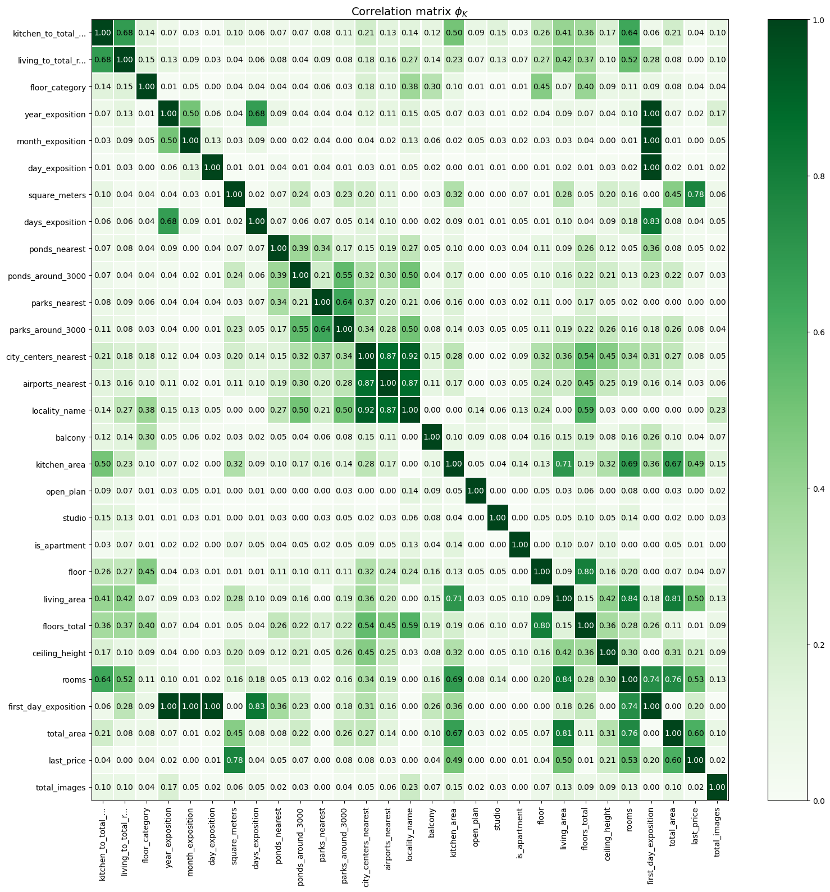
    


Из-за большого количества признаков в матрице остановимся только на признаках, демонстрирующих коэффициенты корреляции более 0.55 (среднее значение для "заметной" корреляции по шкале Чеддока).


```python
collinearity = realty[['kitchen_to_total_ratio', 'living_to_total_ratio', 'year_exposition',
                       'month_exposition', 'day_exposition', 'square_meters', 'days_exposition',
                       'parks_nearest', 'parks_around_3000', 'ponds_around_3000', 'ponds_nearest',
                       'city_centers_nearest', 'airports_nearest', 'kitchen_area', 'floor', 'living_area',
                       'floors_total', 'rooms', 'first_day_exposition', 'total_area', 'last_price']].phik_matrix(
                           interval_cols=['last_price', 'total_area', 'rooms', 'floors_total',
                                          'living_area', 'floor', 'kitchen_area', 'airports_nearest',
                                          'city_centers_nearest', 'parks_around_3000', 'parks_nearest',
                                          'ponds_around_3000', 'ponds_nearest', 'days_exposition',
                                          'square_meters', 'living_to_total_ratio', 'kitchen_to_total_ratio'])
```


```python
plot_correlation_matrix(collinearity.values, 
                        x_labels=collinearity.columns, 
                        y_labels=collinearity.index, 
                        vmin=0, vmax=1, color_map="Greens", 
                        title=r"Correlation matrix $\phi_K$",
                        figsize=(16, 16))
plt.tight_layout()
```


    
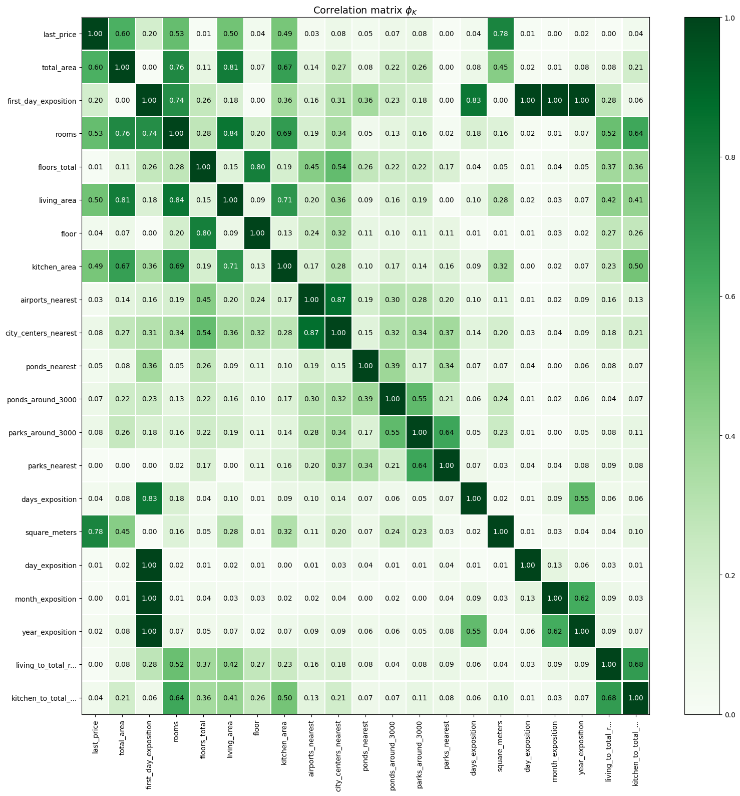
    


Ожидаема (и совсем неудивительна) довольно тесная связь отдельных параметров, так или иначе описывающих квадратуру объекта недвижимости: общей площади, количества комнат, площади жилых комнат, кухни, соотношения площадей кухни и жилых комнат к общей площади (последние два признака - синтетические, созданы ранее для устранения ошибок и пропусков в данных). Если бы мы разрабатывали прогнозную модель недвижимости, большую часть этих признаков не следовало бы в неё включать.

Кроме соотношения площадей, в датасете присутствуют еще несколько производных друг от друга признаков, чем объясняется высокий коэффициент корреляции между ними:
- Дата размещения объявления и длительность демонстрации объявления;
- Дата размещения объявления и год, месяц, день недели, когда объявление было размещено;
- Длительность демонстрации объявления и день недели, когда объявление было размещено;
- Год публикации объявления и месяц публикации объявления.

Обнаружена связь между признаками, не являющимися прямыми производными друг от друга:
- Количество парков поблизости и расстояние до ближайшего парка. Довольно ожидаемо - эти переменные немного по-разному описывают одно явление "рядом с объектом есть парк".
- Количество парков поблизости и количество прудов поблизости. Вероятность встретить пруд в парке гораздо выше вероятности встретить пруд за его пределами.
- расстояние до центра города и расстояние до аэропорта. Эта связь может быть обратной (коэффициент фита не дает сведений о направлении связи). Проверим с помощью коэффициента линейной корреляции:


```python
realty[['airports_nearest', 'city_centers_nearest']].corr()
```


<div>
<table border="1" class="dataframe">
  <thead>
    <tr style="text-align: right;">
      <th></th>
      <th>airports_nearest</th>
      <th>city_centers_nearest</th>
    </tr>
  </thead>
  <tbody>
    <tr>
      <th>airports_nearest</th>
      <td>1.000000</td>
      <td>0.272184</td>
    </tr>
    <tr>
      <th>city_centers_nearest</th>
      <td>0.272184</td>
      <td>1.000000</td>
    </tr>
  </tbody>
</table>
</div>


Линейная связь слабая. Видимо, эти переменные связаны нелинейно: чем ближе объект к центру Санкт-Петербурга, тем дальше он от аэропорта. Если же речь идет о малых населенных пунктах, то расстояния от объектов до центра, например, Пушкина, могут демонстрировать сильную обратную связь с расстоянием до аэропорта Пулково. Коэффициент фита способен выявлять такие сложные связи.

Наконец, ключевой вывод:
существует умеренно сильная связь между площадью квартиры и ее ценой. Конечно, на цену будут влиять и другие факторы (как минимум расположение, тип недвижимости, транспортная доступность и т.п.). Однако размеры жилплощади остаются тем основанием, на котором строится ценность квартиры, выраженная в денежном эквиваленте.

А вот близость к центру города таковым не является. И это вполне очевидно. Исторические центры городов (особенно - в Санкт-Петербурге) часто застроены объектами, которые не вполне отвечают современным стандартам комфорта, инфраструктурной и коммуникационной обеспеченности.  


```python
realty.pivot_table(index='floor_category', values='last_price', aggfunc=('mean', 'median')).plot()
```


    <AxesSubplot:xlabel='floor_category'>


    
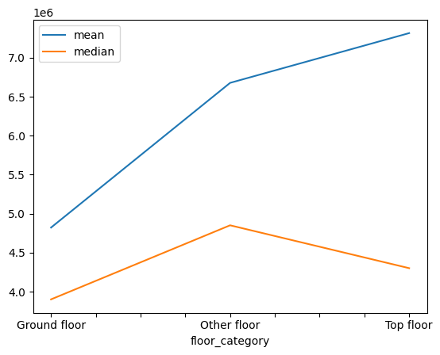
    


Можно точно сказать, что первый этаж лидером по стоимости недвижимости не является. И несмотря на то, что самое дорогой объект недвижимости расположен на последнем этаже, основная доля объектов "подороже" (судя по соотношению медианы и среднего) - в категории "другой этаж".

Наконец, посмотрим на динамику стоимости недвижимости в зависимости от даты размещения, месяца и дня недели.


```python
decomp_median = seasonal_decompose(
    realty.pivot_table(index='first_day_exposition',
                   values='last_price', aggfunc='median'),
    period=365)

decomp_count = seasonal_decompose(
    realty.pivot_table(index='first_day_exposition',
                   values='last_price', aggfunc='count'),
    period=365)

plt.figure(figsize=(18, 5))
plt.plot(decomp_median.trend)
plt.title('Median price: trend')
plt.show()

plt.figure(figsize=(18, 5))
plt.plot(decomp_count.trend)
plt.title('Amount of apartments being sold: trend')
plt.show()
```


    
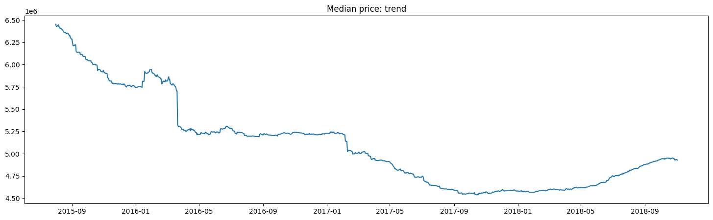
    


    
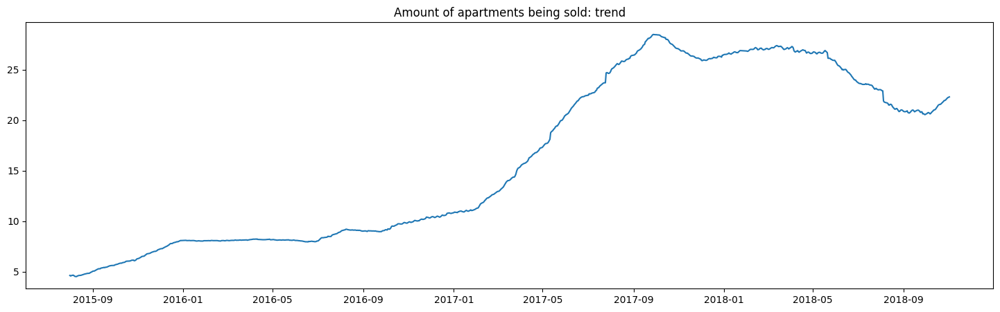
    


Наиболее "урожайными" на продажу недвижимости были 2017-2018 гг. В 2017-м же на продажу был выставлен наиболее дорогой объект. При этом медианное значение стоимости оставалось не слишком высоким, что дает основания полагать: наибольшее количество объявлений касалось жилья "среднего" (или даже "эконом"-) класса.

Графики трендов за весь период наблюдений демонстрируют действие закона спроса и предложения на рынке недвижимости: рост количества объявлений сопровождается снижением медианной цены на объекты недвижимости.


```python
plt.figure(figsize=(18, 5))
plt.plot(realty.pivot_table(index='month_exposition', values='last_price', aggfunc='median'))
plt.title('Median price by month')
plt.show()

plt.figure(figsize=(18, 5))
plt.plot(realty.pivot_table(index='month_exposition', values='last_price', aggfunc='count'))
plt.title('Amount of apartments being sold by month')
plt.show()
```


    
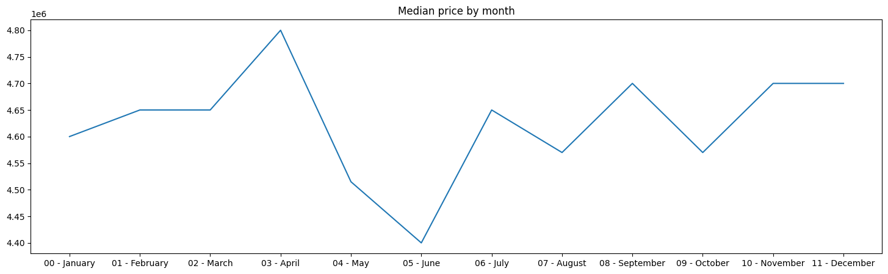
    


    
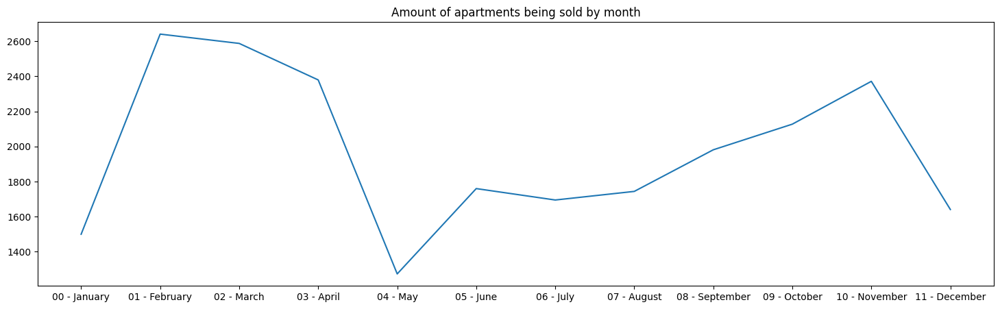
    


Медианная стоимость не слишком колеблется в зависимости от месяца, однако выше всего она в апреле, далее - в сентябре, ноябре и декабре, и далее по нисходящей. Жилье в Санкт-Петербурге точно лучше покупать летом.

Среди месяцев наиболее "популярными" для принятия решения о продаже недвижимости (косвенным признаком которого является размещение соответствующего объявления) являются конец зимы - начало весны (февраль, март, апрель) и ноябрь. В мае покупать недвижимость несколько сложнее: новых предложений на рынке будет мало. 


```python
plt.figure(figsize=(18, 5))
plt.plot(realty.pivot_table(index='day_exposition', values='last_price', aggfunc='median'))
plt.title('Median price by days of week')
plt.show()

plt.figure(figsize=(18, 5))
plt.plot(realty.pivot_table(index='day_exposition', values='last_price', aggfunc='count'))
plt.title('Amount of apartments being sold by days of week')
plt.show()
```


    
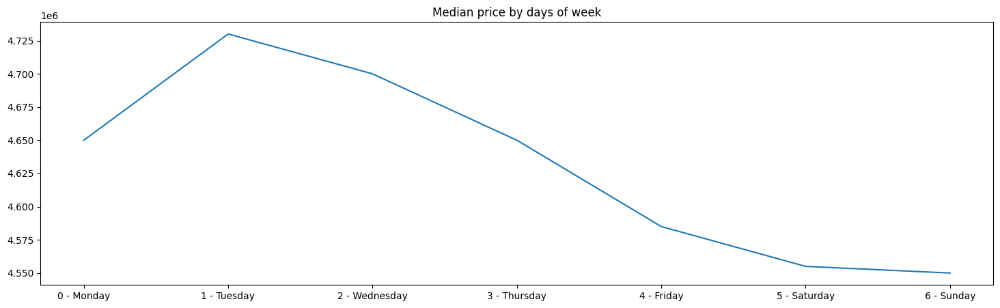
    


    
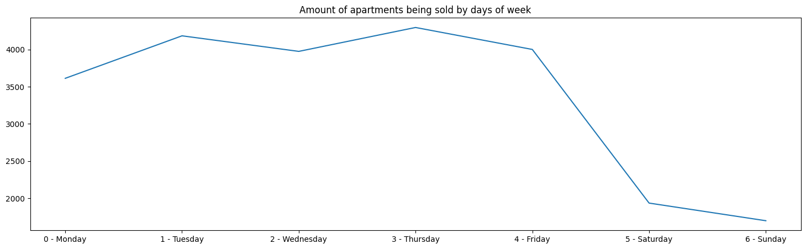
    


В разрезе дней объявления размещаются чаще в рабочие дни, и гораздо реже - на выходных. А вот медианная стоимость выше для вторников и сред. Первое наблюдение абсолютно ожидаемо, второе - просто забавный и вряд ли объяснимый казус.


```python
del col, collinearity, decomp_count, decomp_median
```

### Населенные пункты с самым большим количеством объявлений

Отсортируем наcеленные пункты по количеству объявлений о продаже недвижимости в них с выводом 10 пунктов с максимумом объявлений:


```python
locality_majority = realty.groupby('locality_name')['last_price'].count().sort_values(ascending=False).head(10)
locality_majority.index
```


    CategoricalIndex(['санкт-петербург', 'муриный', 'кудрово', 'шушары',
                      'всеволожск', 'пушкин', 'колпино', 'парголовый', 'гатчина',
                      'выборг'],
                     categories=['unknown', 'агалатово', 'александровский', 'алексеевка', ..., 'ялгино', 'яльгелевый', 'яма-тесовый', 'янино-1'], ordered=False, dtype='category', name='locality_name')


Очевидно (и ожидаемо): подавляющее большинство объявлений - о недвижимости в Санкт-Петербурге.

Вычислим среднюю стоимость квадратного метра жилья в этих населенных пунктах.


```python
for locality in locality_majority.index:
    print(locality, ':',
        round(
            realty.query('locality_name == @locality')['square_meters'].mean()
        )
    )
```

    санкт-петербург : 114856
    муриный : 86088
    кудрово : 95325
    шушары : 78677
    всеволожск : 68654
    пушкин : 103126
    колпино : 75425
    парголовый : 90176
    гатчина : 68746
    выборг : 58142


Очевидно, наибольшая средняя стоимость квадратного метра - в Санкт-Петербурге. Наименьшая же - в Выборге. Хотя от Санкт-Петербурга можно ожидать большого разброса цен в зависимости от района и удаленности от центра (чему будет посвящен следующий раздел анализа), а стоимость квадратного метра в Пушкине предполагает, что дело не в названии населенного пункта. Проверим, какую динамику имеет медианная стоимость квадратного метра:


```python
for locality in locality_majority.index:
    print(locality, ':',
        round(
            realty.query('locality_name == @locality')['square_meters'].median()
        )
    )
```

    санкт-петербург : 104770
    муриный : 86176
    кудрово : 95676
    шушары : 76876
    всеволожск : 65789
    пушкин : 100000
    колпино : 74724
    парголовый : 91643
    гатчина : 67797
    выборг : 58158


Медианная стоимость квадратного метра имеет ту же динамику, что означает низкий вклад выбросов (большего количества которых можно ожидать от Санкт-Петербурга) в эти показатели.


```python
del locality_majority, locality
```

### Что такое "центр", и как стоимость недвижимости зависит от его близости?

Рассмотрим расстояние от объектов недвижимости в Санкт-Петербурге до центра города:


```python
spb_realty = realty.query('locality_name == "санкт-петербург"').copy()
del realty
```


```python
details(spb_realty['city_centers_nearest'], 40000) # somewhat random limit
```


    
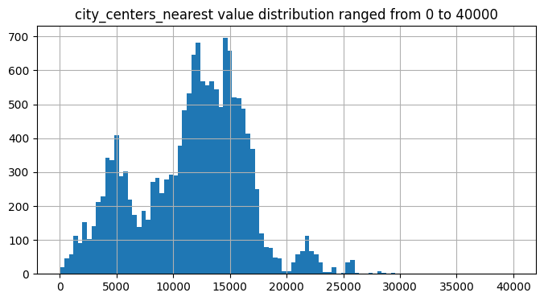
    


    count    15660.000000
    mean     11601.291571
    std       4842.035279
    min        181.000000
    25%       8327.000000
    50%      12244.500000
    75%      14943.000000
    max      29493.000000
    Name: city_centers_nearest, dtype: float64


На основе нескольких проверок было установлено, что значение в ~29,5 км до центра города - максимальное в подвыборке объявлений из Санкт-Петербурга. Значение count здесь немного меньше общего количества объявлений из этого города "благодаря" нескольким пропущенным значениям расстояния до центра.

Округлим значения расстояния в метрах до километров, выполним группировку, рассчитаем среднюю цену для каждого километра и построим линейный график средней цены в зависимости от расстояния до центра. 


```python
spb_realty.loc[:, 'city_centers_nearest'] = round(spb_realty.loc[:, 'city_centers_nearest'] / 1000)
```


```python
spb_realty.groupby(
    'city_centers_nearest')['last_price'].mean().plot(
        style='o-', grid=True, figsize=(12, 5))
```


    
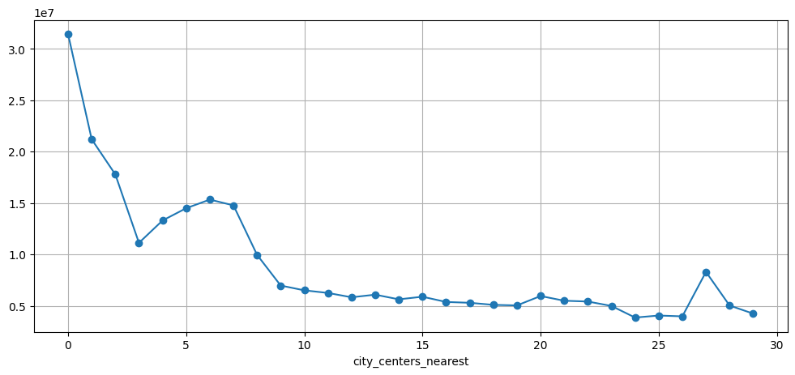
    


Средняя цена недвижимости довольно устойчиво снижается на расстоянии до 3 километров, а затем снова начинает повышаться. Можно предположить, что примерно трехкилометровый радиус и составляет исторический центр Санкт-Петербурга. Причина снижения цены внутри этого радиуса может заключаться в плотной исторической застройке, которая совершенно не обязана предполагать недвижимость высокого качества и комфорта. Напротив: только за пределами исторического центра, где возможна застройка, появляется возможность предложить потребителям жилье высокого стандарта, чем может объясняться плавный рост средней цены на промежутке от 3 до 7 километров от исторического центра. Вклад фактора близости к центру в формировании цены уступает место фактору высоких потребительских свойств жилья.

Рассмотрим поближе "сегмент квартир в центре". В качестве радиуса центра Санкт-Петербурга возьмем 5 километров.


```python
spb_realty_center = spb_realty.query('city_centers_nearest <= 5')
del spb_realty
```


```python
spb_realty_center['total_area'].plot(kind='hist', grid=True, bins=100, title='Area (square meters)')
plt.show()
spb_realty_center['total_area'].describe()
```


    
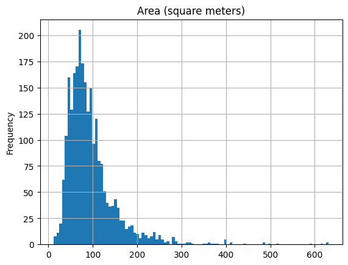
    


    count    2487.000000
    mean       95.637021
    std        59.040476
    min        12.000000
    25%        60.050000
    50%        82.000000
    75%       112.100000
    max       631.200000
    Name: total_area, dtype: float64


Итак, основная доля квартир приходится на диапазон примерно от 50 до 100 кадратных метров. При это разброс значений вокруг среднего значения (которое чуть больше медианного) довольно велик, что говорит о довольно большом разнообразии площадей и метражей.

Мы уже знаем, что разброс стоимости недвижимости весьма велик, поэтому сразу поставим "верхнее" ограничение в 20 млн. руб.:


```python
spb_realty_center['last_price'].plot(kind='hist', grid=True, bins=50,
                                     title='Realty prices', range=(0, 20000000))
plt.show()
spb_realty_center['last_price'].describe()
```


    
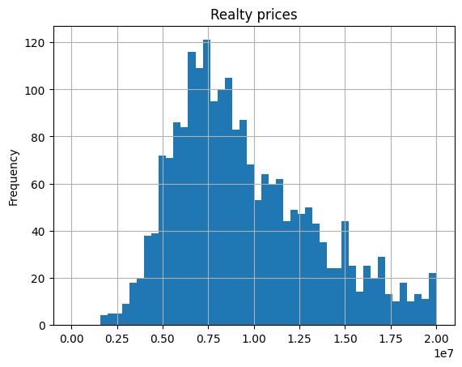
    


    count    2.487000e+03
    mean     1.480580e+07
    std      2.611717e+07
    min      1.600000e+06
    25%      6.950000e+06
    50%      9.500000e+06
    75%      1.425000e+07
    max      7.630000e+08
    Name: last_price, dtype: float64


Стоимость недвижимости находится в сравнительно широком диапазоне с большими колебаниями, где основная доля предложений приходится на промежуток от примерно 4 млн. до 15 млн. руб.


```python
spb_realty_center['rooms'].plot(kind='hist', grid=True, bins=30, title='Rooms')
plt.show()
spb_realty_center['rooms'].describe()
```


    
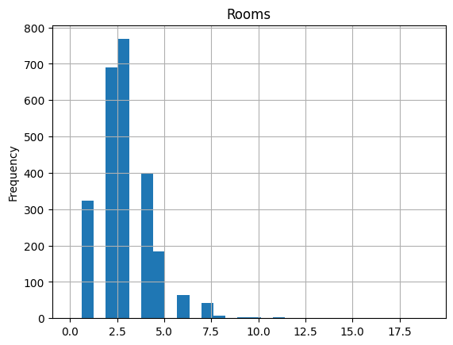
    


    count    2487.000000
    mean        2.970245
    std         1.499504
    min         0.000000
    25%         2.000000
    50%         3.000000
    75%         4.000000
    max        19.000000
    Name: rooms, dtype: float64


Большинство предложений - в диапазоне от 2 до 4 комнат, причем двух-/трехкомнатных объектов гораздо больше, чем любых других.

Высота потолков преподносит небольшую неожиданность:


```python
spb_realty_center['ceiling_height'].plot(kind='hist', grid=True, bins=50, title='Ceiling height')
plt.show()
spb_realty_center['ceiling_height'].describe()
```


    
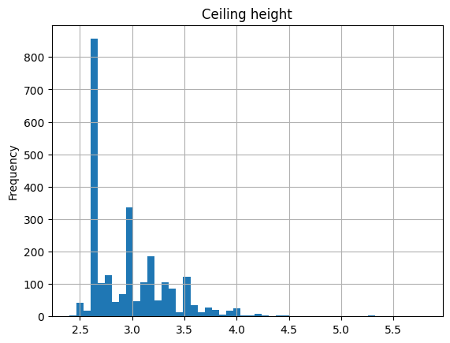
    


    count    2487.000000
    mean        2.977857
    std         0.377418
    min         2.400000
    25%         2.650000
    50%         2.900000
    75%         3.200000
    max         5.800000
    Name: ceiling_height, dtype: float64


Центр Санкт-Петербурга, если следовать стереотипам, - это старый жилой фонд с высокими потолками. И такого фонда наверняка немало. Более того, меры центральных тенденций говорят о том, что большинство объявлений - о недвижимости именно такого типа. Однако график показывает, что доля недвижимости со "средней" (до 2,7 м) высотой потолков как минимум очень заметна.

Теперь посмотрим, есть ли **связь между этими и некоторыми другими факторами и стоимостью недвижимости**.

Начнем с соотношения этажа, на котором находятся объекты недвижимости и её стоимости:


```python
plt.figure(figsize=(12,5))
plt.plot(spb_realty_center.pivot_table(index='floor', values='last_price', aggfunc='median'))
plt.title('Realty price by floor in Saint-Petersburg center')
plt.show()
```


    
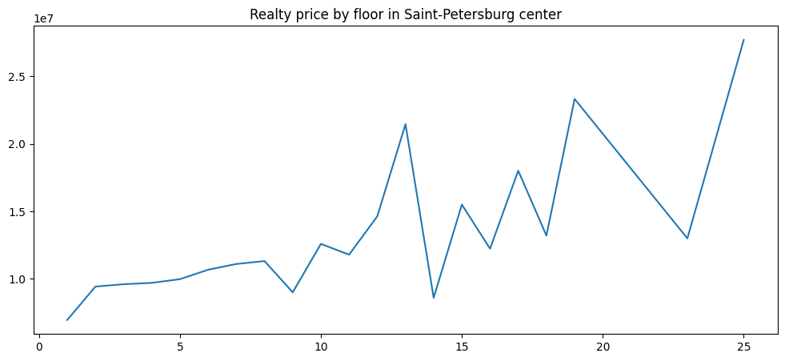
    


Распределение свидетельствует, что стоимость жилья повышается в зависимости от этажа, однако это повышение не выглядит очень значительно в пределах 1-6 этажа. В редких высоких зданиях центра Санкт-петербурга квартиры на высоких (7-10) этажах оцениваются выше, чем квартиры более низких этажей.

В общем можно сказать, что общий линейный тренд слегка намечается: медианная стоимость недвижимости растет с повышением этажности. Однако четко выраженного характера эта связь не имеет.


```python
plt.figure(figsize=(12,5))
plt.plot(spb_realty_center.pivot_table(index='city_centers_nearest', values='last_price', aggfunc=('median')))
plt.title('Realty price by distance from Saint-Petersburg center')
plt.show()
```


    
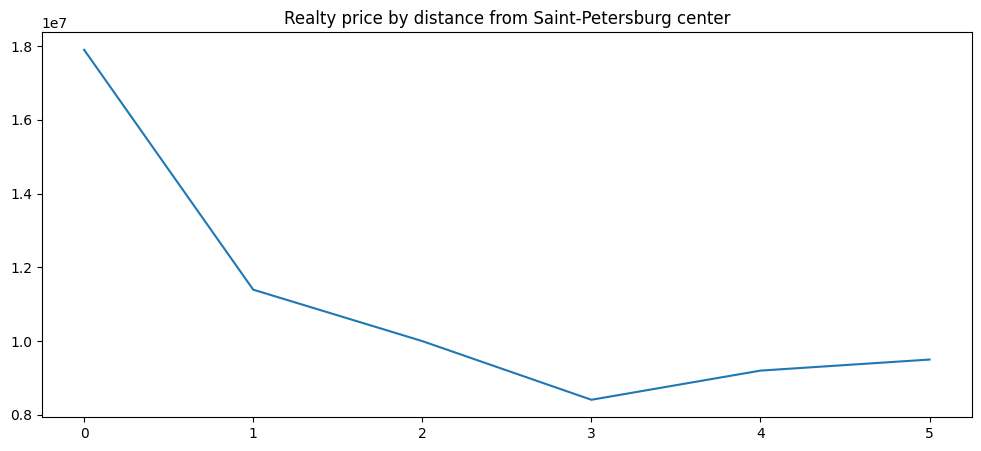
    


Медианная стоимость недвижимости заметно падает при удалении от центра, что вполне объяснимо - чем ближе к нему, тем выше престиж владения им, даже если его потребительские свойства не столь высоки. Дальше медианная стоимость начинает расти, поскольку увеличивается доля "новостроя" с более высокой привлекательностью для приобретения. Поэтому сложно говорить о линейной связи в пределах центра Санкт-Петербурга между удаленностью от центра и стоимостью жилья, несмотря на наличие видимого снижения на первых трех километрах.

Теперь взглянем на связь стоимости жилья и количества комнат:


```python
plt.figure(figsize=(12,5))
plt.plot(spb_realty_center.pivot_table(index='rooms', values='last_price', aggfunc=('median')))
plt.title('Realty price by rooms in Saint-Petersburg center')
plt.show()
```


    
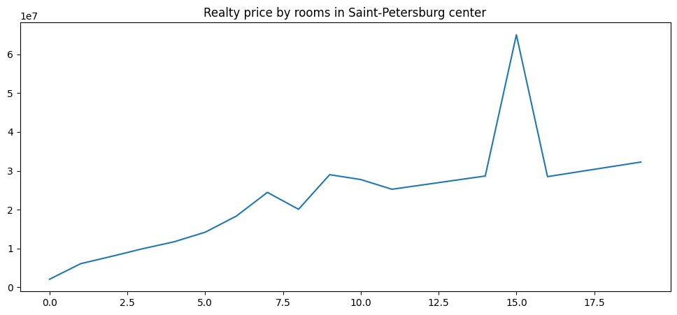
    


Здесь наличие тренда очевидно. Количество комнат прямо связано с увеличением стоимости жилья. Этот тренж заметен на всем диапазоне, даже с учетом выброса в районе объектов с 15-ю комнатами.

Наконец, посмотрим на изменение цены в зависимости от года размещения объявления:


```python
plt.figure(figsize=(12,5))
plt.plot(spb_realty_center.pivot_table(index='year_exposition', values='last_price', aggfunc=('median')))
plt.title('Realty price by year in Saint-Petersburg center')
plt.show()
```


    
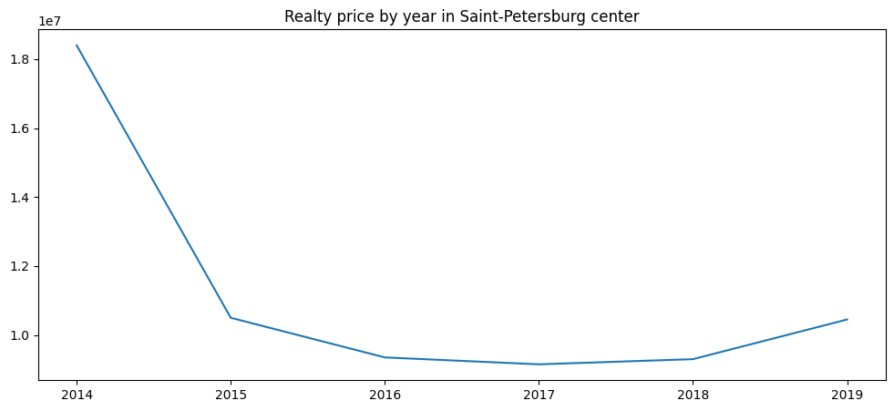
    


Стоимость недвижимости в центре соответствует общему тренду на резкое снижение до 2018 года с дальнейшим медленным повышением. мы уже наблюдали этот тренд для всех объявлений в массиве данных. Линейный же тренд здесь отсутствует.


```python
del spb_realty_center
```

## Общий вывод

В ходе проекта было установлено состояние ключевых параметров, определяющих рыночную стоимость жилья в Санкт-Петербурге и Ленинградской области. Выяснено распределение данных по стоимости, площади, количеству комнат, высоте потолков.

Подтверждена довольно разумная гипотеза о прямой связи стоимости объекта недвижимости и её площади (которая, в свою очередь, связана с количеством комнат). Для Санкт-Петербурга также подтверждена графическими методами гипотеза о прямой (не косвенной) связи между стоимостью недвижимости и количеством комнат в ней. При этом выявлено, что расстояние до центра, этаж и год размещения объявления не имеют четко и однозначно выраженной линейной связи со стоимостью недвижимости как минимум в центре Санкт-Петербурга. Однако прослеживается умеренная обратная связь расстояния до центра и стоимостьи недвижимости в пределах всего города.
Если принимать в расчет не только Санкт-Петербург, но и другие населенные пункты Ленинградской области, картина немного меняется. Можно выделить конкретный год (2014), когда медианная стоимость недвижимости была выше, чем в другие годы. Далее она снижалась вплоть до 2018 г., затем незначительно выросла в 2019-м. А вот количество объявлений было максимальным именно в 2017-2018 гг., что дает основания предположить причины снижения цены: банальный закон соотношения спроса и предложения. Стремясь сделать своё объявление более привлекательным, продавцы идут на незначительное снижение стоимости недвижимости - снова и снова.

Кроме того, распределение количеств объявлений по разных показателям дает основания для некоторых выводов о типичном "потребительском поведении" авторов объявлений о недвижимости:
- Объявления размещаются в основном в будние дни, что дает основания предположить, что пользователи занимаются этим важным делом в рабочие часы и, чего греха таить, с рабочего места. Однако это предположение для своего подтверждения требует отдельной специальной проверки (например, с помощью данных о времени размещения объявлений).
- Наиболее дорогие (по медианной стоимости) объекты выставляются по вторникам и средам.
- Наиболее "дорогой" месяц с точки зрения предложения недвижимости - апрель, самый дешевый - июнь.
- В целом период с февраля по апрель - самый активный по продаже недвижимости в выборке.
